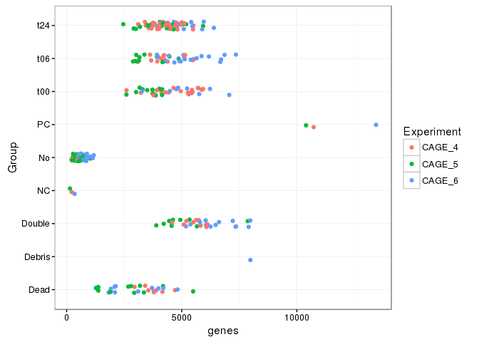
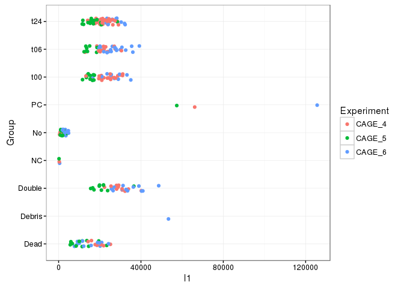
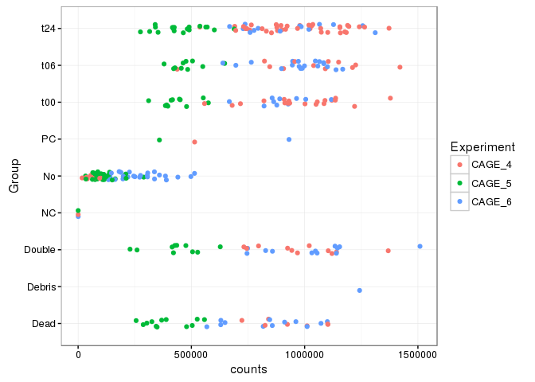
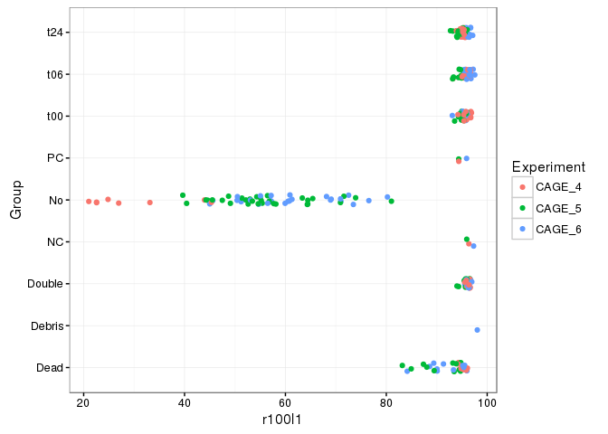
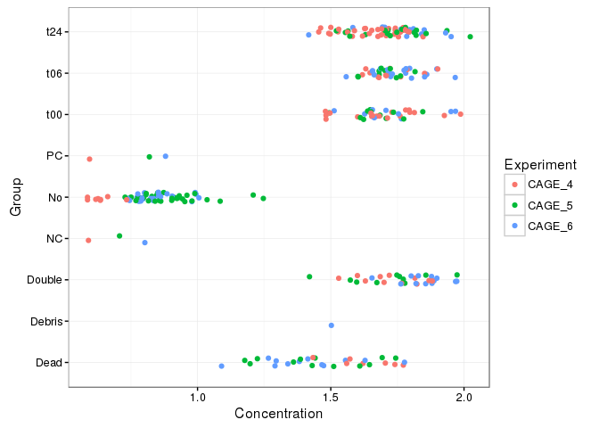
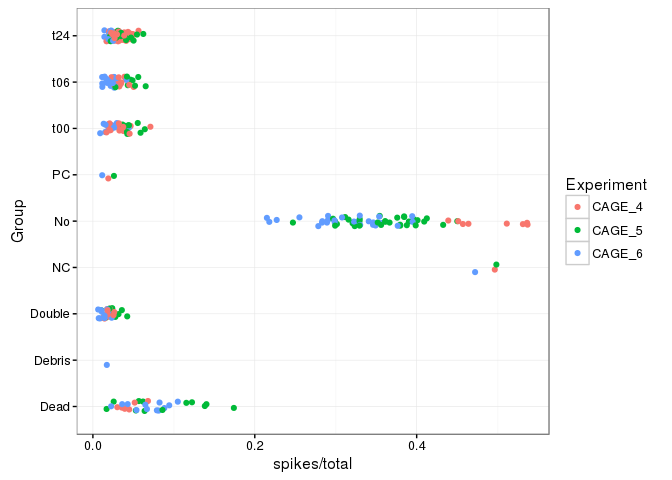
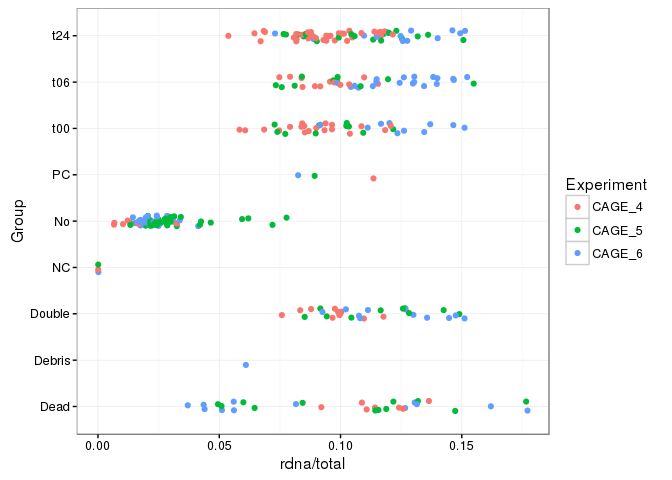
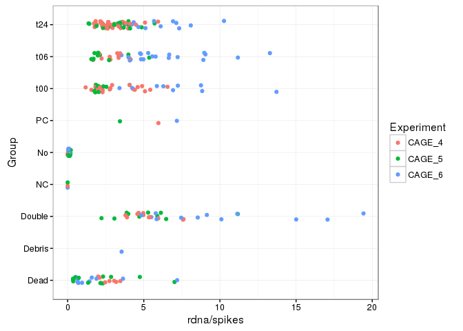
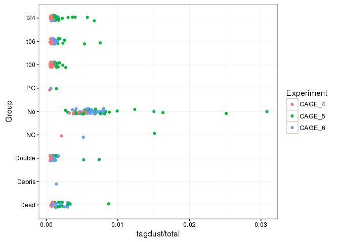

# Integration of the second batch of CAGE libraries.

# R commands to collect the numbers (you can skip reading it.)


```r
library(ggplot2)
library(dplyr)
```

```
## 
## Attaching package: 'dplyr'
```

```
## The following objects are masked from 'package:stats':
## 
##     filter, lag
```

```
## The following objects are masked from 'package:base':
## 
##     intersect, setdiff, setequal, union
```

```r
library(magrittr)
```


```r
samples   <- read.delim("../generated/samples.tsv", head = TRUE, sep = "\t")
libraries <- read.table('../source/libraries.tsv'
                       , header = TRUE
                       , stringsAsFactors = FALSE
                       , colClasses = c(Moirai_Stamp="character"))
```


```r
round2 <- libraries[grep("CAGE_[456]", libraries$Name), "C1_Run_ID"]
```


```r
# # This only works when the cached results are available.
# 
# cage4 <- new.env()
# local(rmarkdown::render("RNhi10538.Rmd"), cage4)
# 
# cage5 <- new.env()
# local(rmarkdown::render("RNhi10539.Rmd"), cage5)
# 
# cage6 <- new.env()
# local(rmarkdown::render("RNhi10540.Rmd"), cage6)
# 
# libs <- rbind(cage4$libs, cage5$libs, cage6$libs)
# libs$Rownames <- libs$samplename

libs <- rbind(
  read.table("RNhi10538.libs.tsv", sep="\t", head=TRUE),
  read.table("RNhi10539.libs.tsv", sep="\t", head=TRUE),
  read.table("RNhi10540.libs.tsv", sep="\t", head=TRUE)
)

libs$Rownames <- libs$samplename

samples %<>% left_join(libs[,c("Rownames", "l1", "r100l1", "genes", "geneSymbols")])
```

```
## Joining, by = "Rownames"
```

```
## Warning in left_join_impl(x, y, by$x, by$y, suffix$x, suffix$y): joining factors with different
## levels, coercing to character vector
```

```r
samples[samples$Run %in% round2, ] %>% summary
```

```
##    Rownames                   Run          Row          Col           Chamber     
##  Length:288         1772-123-072:96   A      :36   Min.   : 1.00   Min.   : 1.00  
##  Class :character   1772-123-073:96   B      :36   1st Qu.: 3.75   1st Qu.:24.75  
##  Mode  :character   1772-123-074:96   C      :36   Median : 6.50   Median :48.50  
##                     1772-064-108: 0   D      :36   Mean   : 6.50   Mean   :48.50  
##                     1772-064-109: 0   E      :36   3rd Qu.: 9.25   3rd Qu.:72.25  
##                     1772-115-303: 0   F      :36   Max.   :12.00   Max.   :96.00  
##                     (Other)     : 0   (Other):72                                  
##              Cell_ID         Error         Green          Red      Color_cutoff_50 Color_cutoff_100
##  1772-123-072_A01:  1   Dead    : 31   Min.   : NA   Min.   : NA   Green  :  0     Green  :  0     
##  1772-123-072_A02:  1   Debris  :  1   1st Qu.: NA   1st Qu.: NA   Red    :  0     Red    :  0     
##  1772-123-072_A03:  1   Empty   : 72   Median : NA   Median : NA   Yellow :  0     Yellow :  0     
##  1772-123-072_A04:  1   Fuzzy   :  0   Mean   :NaN   Mean   :NaN   unknown:  0     unknown:  0     
##  1772-123-072_A05:  1   Multi   : 33   3rd Qu.: NA   3rd Qu.: NA   NA's   :288     NA's   :288     
##  1772-123-072_A06:  1   No error:151   Max.   : NA   Max.   : NA                                   
##  (Other)         :282                  NA's   :288   NA's   :288                                   
##  Color_cutoff_150 Color_cutoff_200    Kouno       Joachim       Makis        Final   
##  Green  :  0      Green  :  0      Dead  : 6   No     :74   1      : 53   Dead  :31  
##  Red    :  0      Red    :  0      Double:26   R      :58   2      : 53   Debris: 1  
##  Yellow :  0      Yellow :  0      G     :51   G/R    :56   3      : 30   Double:33  
##  unknown:  0      unknown:  0      G/R   :69   G      :39          : 25   G/R   :57  
##  NA's   :288      NA's   :288      No    :74   Dead   :29   4      :  7   Green :37  
##                                    R     :61   Double :29   (Other): 15   No    :72  
##                                    Red   : 1   (Other): 3   NA's   :105   Red   :57  
##  Concentration      Phase_50     Phase_100     Phase_150     Phase_200   Timepoint  Control   
##  Min.   :0.587   t00    :  0   t00    :  0   t00    :  0   t00    :  0   t00 : 40   NC  :  3  
##  1st Qu.:1.192   t06    :  0   t06    :  0   t06    :  0   t06    :  0   t06 : 41   PC  :  3  
##  Median :1.651   t24    :  0   t24    :  0   t24    :  0   t24    :  0   t24 : 70   NA's:282  
##  Mean   :1.473   unknown:  0   unknown:  0   unknown:  0   unknown:  0   NA's:137             
##  3rd Qu.:1.762   NA's   :288   NA's   :288   NA's   :288   NA's   :288                        
##  Max.   :2.023                                                                                
##                                                                                               
##                            sampleid       total           extracted          cleaned       
##  1st_CAGE_A01_TAAGGCGA-CTCTCTAT:  1   Min.   : 462488   Min.   : 259331   Min.   :  91393  
##  1st_CAGE_A02_CGTACTAG-CTCTCTAT:  1   1st Qu.:1444990   1st Qu.: 846312   1st Qu.: 475172  
##  1st_CAGE_A03_AGGCAGAA-CTCTCTAT:  1   Median :2178895   Median :1299084   Median : 891606  
##  1st_CAGE_A04_TCCTGAGC-CTCTCTAT:  1   Mean   :2121603   Mean   :1277058   Mean   : 876335  
##  1st_CAGE_A05_GGACTCCT-CTCTCTAT:  1   3rd Qu.:2734041   3rd Qu.:1677226   3rd Qu.:1277652  
##  1st_CAGE_A06_TAGGCATG-CTCTCTAT:  1   Max.   :3778237   Max.   :2428085   Max.   :1978263  
##  (Other)                       :282                                                        
##     tagdust           rdna            spikes            mapped         properpairs     
##  Min.   :  508   Min.   :   219   Min.   :  10314   Min.   :    843   Min.   :    205  
##  1st Qu.: 1742   1st Qu.: 82548   1st Qu.:  49321   1st Qu.: 433229   1st Qu.: 369622  
##  Median : 2604   Median :181121   Median :  78758   Median : 848504   Median : 734935  
##  Mean   : 4842   Mean   :185540   Mean   : 210270   Mean   : 815567   Mean   : 704828  
##  3rd Qu.: 5832   3rd Qu.:275601   3rd Qu.: 241493   3rd Qu.:1219986   3rd Qu.:1057384  
##  Max.   :34688   Max.   :544877   Max.   :1740683   Max.   :1896631   Max.   :1632725  
##                                                                                        
##      counts           Keep               l1             r100l1          genes        geneSymbols   
##  Min.   :    205   Mode :logical   Min.   :   191   Min.   :21.02   Min.   :  145   Min.   :  154  
##  1st Qu.: 339431   FALSE:137       1st Qu.:  6486   1st Qu.:89.20   1st Qu.: 1376   1st Qu.: 1479  
##  Median : 690080   TRUE :151       Median : 19477   Median :95.16   Median : 4026   Median : 4244  
##  Mean   : 655079   NA's :0         Mean   : 17923   Mean   :85.94   Mean   : 3610   Mean   : 3788  
##  3rd Qu.: 983070                   3rd Qu.: 25090   3rd Qu.:95.93   3rd Qu.: 4975   3rd Qu.: 5220  
##  Max.   :1509202                   Max.   :125597   Max.   :98.04   Max.   :13438   Max.   :13591  
## 
```

```r
samples[samples$Run %in% round2, c("Run","Timepoint")] %>% gdata::drop.levels() %>% table
```

```
##               Timepoint
## Run            t00 t06 t24
##   1772-123-074  10  19  14
##   1772-123-073  11  10  19
##   1772-123-072  19  12  37
```

```r
samples[samples$Run %in% round2, c("Final","Keep")] %>% gdata::drop.levels() %>% table
```

```
##         Keep
## Final    FALSE TRUE
##   Dead      31    0
##   Debris     1    0
##   Double    33    0
##   G/R        0   57
##   Green      0   37
##   No        72    0
##   Red        0   57
```

```r
samples[                         , "Group"] <- samples$Final %>% as.character
samples[!is.na(samples$Timepoint), "Group"] <- samples[!is.na(samples$Timepoint), "Timepoint"] %>% as.character
samples[!is.na(samples$Control),   "Group"] <- samples[!is.na(samples$Control), "Control"] %>% as.character
samples$Group %<>% factor

samples$Experiment <- sub("_...$", "", samples$Rownames)
```

# Quick summaries


```r
myPlot <- function(X) {
  set.seed(1)
  X <- substitute(X)
  ggplot( samples[samples$Run %in% round2,] %>%
            gdata::drop.levels() %>%
            sample_frac) +
    coord_flip() +
    geom_jitter( width = 0.3
               , aes( color=Experiment
                    , Group
                    , eval(X))) +
    ylab(deparse(X))
}
```

## Indicators that scale with depth.

Values for CAGE_5 should be lower, since it had only one HiSeq lane.

### Number of genes detected.


```r
myPlot(genes)
```

<!-- -->

### Number of L1 TSS detected.


```r
myPlot(l1)
```

<!-- -->

### Number of molecules detected.


```r
myPlot(counts)
```

<!-- -->

## Indicators that should not vary with depth

### Richness (scale of 100)


```r
myPlot(r100l1)
```

<!-- -->

### cDNA concentration

CAGE_4 run looks cleaner.


```r
myPlot(Concentration)
```

<!-- -->

### Spikes

According to empty chambers, the amount of spikes varied between runs.
(`CAGE_4` > `CAGE_5` > `CAGE_6`).


```r
myPlot(spikes / total)
```

<!-- -->

### rRNA

Empty chambers indicate background values (environmental
contaminations ?).  Negative control shows that spike RNA
does not result in significant amounts of artificial rRNA
matches.

More rRNA is observed in `CAGE_6` when there is a cell, but
this can be just a consequence of having less spikes (see
above).


```r
myPlot(rdna / total)
```

<!-- -->

### rRNA / spikes ratio

Higher in case of the presence of a cell.


```r
myPlot(rdna / spikes)
```

<!-- -->

### Tag dust

The `CAGE_5` run is much nosier.


```r
myPlot(tagdust / total)
```

<!-- -->

