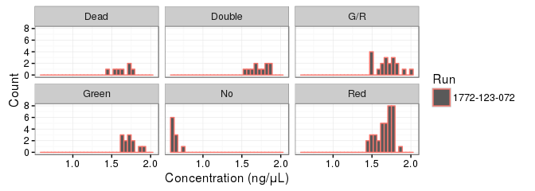

# RNhi10538


```r
LIBRARY      <- "RNhi10538" 
ZENBU_COLLAB <- "<Insert Zenbu collaboration ID>"
WORKFLOW     <- "OP-WORKFLOW-CAGEscan-short-reads-v2.0"
MOIRAI_STAMP <- "20160519001307"
MOIRAI_PROJ  <- "Timecourse"
MOIRAI_USER  <- "nano-fluidigm"
ASSEMBLY     <- "hg38"

GROUP_SHARED <- "/osc-fs_home/scratch/gmtu"
GENE_SYMBOLS <- paste0(GROUP_SHARED, "/annotation/homo_sapiens/gencode-23/gencode.v23.annotation.genes.bed")
ANNOTATION   <- paste0(GROUP_SHARED, "/annotation/homo_sapiens/gencode-23/gencode.v23.annotation.bed")

RunA  <- "1772-123-072"
ctrls <- list( RunA=list(posi="H10", nega="H11"))
```


HiSeq run RNhi10538
=====================

 - C1 run 1772-123-072.
 - Sequenced on HiSeq (RNhi10538).

 - Positive control (200 cells): H10.
 - Negative control: H11.
 
Jump directly to the [Analysis](#analysis) section if you are not
interested in the details of the data processing.

Data Processing
===============

Link files from MOIRAI.
-----------------------


```r
BASEDIR      <- "/osc-fs_home/scratch/moirai"
MOIRAI_RUN   <- paste(LIBRARY, WORKFLOW, MOIRAI_STAMP, sep=".")
MOIRAI_BASE  <- paste(BASEDIR, MOIRAI_USER, "project", MOIRAI_PROJ, MOIRAI_RUN, sep="/")
MOIRAI_ID    <- paste(LIBRARY, WORKFLOW, MOIRAI_STAMP, sep=".")
MOIRAI_FRAGS <- paste0(MOIRAI_BASE, "/CAGEscan_fragments")
MOIRAI_BAM   <- paste0(MOIRAI_BASE, "/genome_mapped")
MOIRAI_URL   <- paste0("http://moirai.gsc.riken.jp/", MOIRAI_BASE, "/", MOIRAI_RUN, ".html")

smallCAGEqc::exportInEnv("LIBRARY", "MOIRAI_BASE", "GENE_SYMBOLS", "ANNOTATION")
```

```
## export LIBRARY=RNhi10538
## export MOIRAI_BASE=/osc-fs_home/scratch/moirai/nano-fluidigm/project/Timecourse/RNhi10538.OP-WORKFLOW-CAGEscan-short-reads-v2.0.20160519001307
## export GENE_SYMBOLS=/osc-fs_home/scratch/gmtu/annotation/homo_sapiens/gencode-23/gencode.v23.annotation.genes.bed
## export ANNOTATION=/osc-fs_home/scratch/gmtu/annotation/homo_sapiens/gencode-23/gencode.v23.annotation.bed
```

Intranet link: [RNhi10538.OP-WORKFLOW-CAGEscan-short-reads-v2.0.20160519001307](http://moirai.gsc.riken.jp//osc-fs_home/scratch/moirai/nano-fluidigm/project/Timecourse/RNhi10538.OP-WORKFLOW-CAGEscan-short-reads-v2.0.20160519001307/RNhi10538.OP-WORKFLOW-CAGEscan-short-reads-v2.0.20160519001307.html)

Create a symbolic link from Moirai results to the working directory.


```bash
[ -L $LIBRARY.l1.osc.gz ] ||
  ln --symbolic $MOIRAI_BASE/$LIBRARY.l1.osc.gz
```

Annotation and gene symbols.
----------------------------

See also <https://gist.github.com/charles-plessy/9dbc8bc98fb773bf71b6>.


```bash
function osc2bed {
  zcat $1 |
    grep -v \# |
    sed 1d |
    awk '{OFS="\t"}{print $2, $3, $4, "l1", "1000", $5}'
}

function bed2annot {
  bedtools intersect -a $1 -b $ANNOTATION -s -loj |
    awk '{OFS="\t"}{print $1":"$2"-"$3$6,$10}' | 
    bedtools groupby -g 1 -c 2 -o collapse
}

function bed2symbols {
  bedtools intersect -a $1 -b $GENE_SYMBOLS -s -loj |
    awk '{OFS="\t"}{print $1":"$2"-"$3$6,$10}' | 
    bedtools groupby -g 1 -c 2 -o distinct
}

osc2bed $LIBRARY.l1.osc.gz | tee $LIBRARY.l1.bed | bed2annot - > $LIBRARY.l1.annot
bed2symbols $LIBRARY.l1.bed > $LIBRARY.l1.genes
```

Data load and QC in R.
======================

Moirai metadata
---------------


```r
library(magrittr)
library(oscR)
library(smallCAGEqc)
stopifnot(
    packageVersion("oscR") >= "0.2.0"
  , packageVersion("smallCAGEqc") >= "0.12.2"
)
library(data.table)
library(reshape)
library(ggplot2)
library(vegan)
library(plyr)
```


```r
PROCESSED_DATA <- MOIRAI_BASE

libs <- loadMoiraiStats(
  multiplex = paste0( "/osc-fs_home/scratch/moirai/nano-fluidigm/input/"
                    , LIBRARY
                    , ".name_to_id.txt"))
libs$Run <- RunA
libs$Well <- sub(".*_", "", libs$samplename)
libs$row <- sub(".", "", libs$Well)
libs$column <- sub("..$", "", libs$Well)
libs$library <- LIBRARY
```

Values in the `libs` table come from Moirai's `summary.txt` file, as
follows:

libs         Moirai
------------ ---------------------------
total        raw
extracted    extracted
cleaned      non_reference_extracted
tagdust      filtered_for_artefact
rdna         filtered_for_rrna
spikes       filtered_for_spikes
mapped       genome_mapped
properpairs  properly_mapped
counts       transcript_count

Transcript counts (properly paired)
-----------------------------------

Note that `fread` needs to temporarly save an uncompressed copy of the file
that is being read.  If there is not enough space in the temporary directory
(often `\tmp`),  either uncompress the file first, or point to a larger
directory to contain the temporary files (for example, run `R` with `TMPDIR=.
R`).

Note that _data.tables_ seem to be saved as simple _data frames_ when
closing a session.  After restoring a workspace, one needs to re-convert with the `data.table` command.


```r
l1 <- fread.osc(paste0(LIBRARY, ".l1.osc.gz"), dropIdCoords=TRUE)
```

```
## 
Read 0.0% of 926104 rows
Read 7.6% of 926104 rows
Read 15.1% of 926104 rows
Read 22.7% of 926104 rows
Read 30.2% of 926104 rows
Read 35.6% of 926104 rows
Read 43.2% of 926104 rows
Read 50.8% of 926104 rows
Read 58.3% of 926104 rows
Read 65.9% of 926104 rows
Read 74.5% of 926104 rows
Read 83.1% of 926104 rows
Read 88.5% of 926104 rows
Read 96.1% of 926104 rows
Read 926104 rows and 197 (of 197) columns from 1.535 GB file in 00:00:21
```

```r
setnames(l1, colnames(l1) %>% sub('raw.', '', .) %>% sub('.None', '', .))

# Be sure that the "libs" and "l1" tables have matching names.
stopifnot(all(colnames(l1) == rownames(libs)))
```

Annotation
----------


```r
annot.l1 <- read.table(paste(LIBRARY,'l1','annot',sep='.'), head=F, col.names=c('id', 'feature'), row.names=1)
annot.l1 <- hierarchAnnot(annot.l1)

libs <- cbind(libs, t(rowsum(l1,  annot.l1[,'class']))[rownames(libs),])
```

Gene count
----------


```r
genesymbols <- read.table(paste(LIBRARY,'l1','genes',sep='.'), col.names=c("cluster","symbol"), stringsAsFactors=FALSE)
rownames(genesymbols) <- genesymbols$cluster

genes <- rowsum(l1, genesymbols$symbol)

libs$genes       <- colSums(genes > 0)
libs$geneSymbols <- countSymbols(genes) # Not the same!
```


Raw reads per molecule (BED12 data)
-----------------------------------


```r
# bed <- loadBED12( libs[libs$counts > 0, "samplename"] %>%
#              sub(RunA, "RunA", .) %>%
#              sub(RunB, "RunB", .) %>%
#              paste0(MOIRAI_FRAGS, "/", ., ".bed"))
```

Cell curation
-------------


```r
curation <- read.table( "../generated/samples.tsv"
                      , head=TRUE, sep = "\t"
                      , row.names = "Rownames")["Final"]

libs$Group <- curation[rownames(libs), "Final"] %>% as.character
```

cDNA concentration.
-------------------


```r
read.pg <- function(RUN)
  paste0("../source/", RUN, ".picogreen.xlsx") %>%
    fldgmPicoGreen("PN 100-6160") %>%
    extract(,"concentration")
libs$Concentration <- read.pg(RunA)
fldgmConcentrationPlot(libs) + facet_wrap(~Group)
```

<!-- -->

Controls
--------

Some samples with errors were repalced by the positive and negative controls.


```r
libs[libs$Well == ctrls$RunA$posi & libs$Run == RunA, "Group"] <- "Positive control"
libs[libs$Well == ctrls$RunA$nega & libs$Run == RunA, "Group"] <- "Negative control"
```

Combined analysis of fluorescence and cDNA concentration.
---------------------------------------------------------

Richness
--------


```r
libs$l1 <- colSums(l1 > 0)
libs$r100l1 <- rarefy(t(l1),100)
```

Analysis
========

Processing
----------


```r
plotAnnot(libs, 'steps', LIBRARY, libs$Group)
```

```
## Warning: Removed 10 rows containing missing values (geom_segment).
```

```
## Warning: Removed 10 rows containing missing values (geom_point).
```

<!-- -->


```r
plotAnnot(libs, 'steps', LIBRARY, rownames(libs))
```

```
## Warning: Removed 480 rows containing missing values (geom_segment).
```

```
## Warning: Removed 480 rows containing missing values (geom_point).
```

<!-- -->

QC barplots
-----------


```r
plotAnnot(libs, 'qc', LIBRARY, libs$Group)
```

```
## Warning: Removed 14 rows containing missing values (geom_segment).
```

```
## Warning: Removed 14 rows containing missing values (geom_point).
```

<!-- -->


```r
plotAnnot(libs, 'qc', LIBRARY, rownames(libs))
```

```
## Warning: Removed 672 rows containing missing values (geom_segment).
```

```
## Warning: Removed 672 rows containing missing values (geom_point).
```

<!-- -->

Annotation
----------


```r
plotAnnot(libs, 'counts', LIBRARY, libs$Group)
```

```
## Warning: Removed 8 rows containing missing values (geom_segment).
```

```
## Warning: Removed 8 rows containing missing values (geom_point).
```

<!-- -->


```r
plotAnnot(libs, 'counts', LIBRARY, rownames(libs))
```

```
## Warning: Removed 384 rows containing missing values (geom_segment).
```

```
## Warning: Removed 384 rows containing missing values (geom_point).
```

<!-- -->

Correlation between runs
------------------------


```r
NMF::aheatmap( cor(genes[-1, ])
             , annCol=list(Group=libs$Group))
```

<!-- -->

```r
NMF::aheatmap( cor(genes[-1, ] %>% TPM  %>% log1p)
             , annCol=list(Group=libs$Group))
```

<!-- -->


```r
singleCells <- libs$Group %in% c("Red", "Green", "G/R")
NMF::aheatmap( cor(genes[-1, singleCells])
            , annCol=list(Run=libs[singleCells, "Group"]))
```

<!-- -->

```r
NMF::aheatmap( cor(genes[-1, singleCells] %>% TPM %>% log1p)
            , annCol=list(Run=libs[singleCells, "Group"]))
```

<!-- -->

Gene counts and TSS discovery
-----------------------------

### Gene count by error code.


```r
dotsize <- 500
ggplot(libs, aes(x=Group, y=genes)) +
  stat_summary(fun.y=mean, fun.ymin=mean, fun.ymax=mean, geom="crossbar", color="gray") +
  geom_dotplot(aes(fill=Group), binaxis='y', binwidth=1, dotsize=dotsize, stackdir='center') +
  coord_flip()
```

<!-- -->

Rarefaction (hanabi plot).
--------------------------

### TSS discovery


```r
hanabiPlot( hanabi(l1, from=0)
          , ylab='number of TSS detected'
          , xlab='number of unique molecule counts'
          , main=paste("TSS discovery for", LIBRARY)
          , GROUP=libs$Group %>% factor)
```

<!-- -->

### Gene discovery


```r
hanabiPlot( hanabi(genes, from=0)
          , ylab='number of genes detected'
          , xlab='number of unique molecule counts'
          , main=paste("Gene discovery for", LIBRARY)
          , GROUP=libs$Group %>% factor)
```

<!-- -->


```r
write.table( libs
           , paste0(LIBRARY, ".libs.tsv")
           , sep="\t", quote = FALSE
           , row.names = FALSE)
libs
```

```
##            samplename                       sampleid   total extracted cleaned tagdust   rdna
## CAGE_4_A01 CAGE_4_A01 1st_CAGE_A01_TAAGGCGA-CTCTCTAT 1849344   1092954  875642    1391 166239
## CAGE_4_A02 CAGE_4_A02 1st_CAGE_A02_CGTACTAG-CTCTCTAT 2493267   1531913 1187456    1702 286293
## CAGE_4_A03 CAGE_4_A03 1st_CAGE_A03_AGGCAGAA-CTCTCTAT 1891283   1225352  962406    1627 223592
## CAGE_4_A04 CAGE_4_A04 1st_CAGE_A04_TCCTGAGC-CTCTCTAT 3177326   1730851 1331559    3252 276067
## CAGE_4_A05 CAGE_4_A05 1st_CAGE_A05_GGACTCCT-CTCTCTAT 3211804   1758374 1387898    2423 299988
## CAGE_4_A06 CAGE_4_A06 1st_CAGE_A06_TAGGCATG-CTCTCTAT 3232620   1812544 1387196    2636 315633
## CAGE_4_A07 CAGE_4_A07 1st_CAGE_A07_CTCTCTAC-CTCTCTAT 3778237   2188951 1622022    2846 392395
## CAGE_4_A08 CAGE_4_A08 1st_CAGE_A08_CGAGGCTG-CTCTCTAT 3340834   1836558 1429087    2505 314564
## CAGE_4_A09 CAGE_4_A09 1st_CAGE_A09_AAGAGGCA-CTCTCTAT 2887834   1831009 1427076    2040 348639
## CAGE_4_A10 CAGE_4_A10 1st_CAGE_A10_GTAGAGGA-CTCTCTAT 2409983   1473685 1187591    1682 240061
## CAGE_4_A11 CAGE_4_A11 1st_CAGE_A11_GCTCATGA-CTCTCTAT 3433940   1847579 1472192    2945 288315
## CAGE_4_A12 CAGE_4_A12 1st_CAGE_A12_ATCTCAGG-CTCTCTAT 3515677   1254209  980654    3086 188931
## CAGE_4_B01 CAGE_4_B01 1st_CAGE_B01_TAAGGCGA-TATCCTCT 2200750   1390183 1132908    1472 212308
## CAGE_4_B02 CAGE_4_B02 1st_CAGE_B02_CGTACTAG-TATCCTCT 2511151   1396249  206686    8080  33532
## CAGE_4_B03 CAGE_4_B03 1st_CAGE_B03_AGGCAGAA-TATCCTCT 1926777   1150941  882750    1157 209273
## CAGE_4_B04 CAGE_4_B04 1st_CAGE_B04_TCCTGAGC-TATCCTCT 3307403   2241168 1811768    2483 342555
## CAGE_4_B05 CAGE_4_B05 1st_CAGE_B05_GGACTCCT-TATCCTCT 3149316   1951955 1558509    2024 301245
## CAGE_4_B06 CAGE_4_B06 1st_CAGE_B06_TAGGCATG-TATCCTCT 3032238   1906386 1507642    2370 281813
## CAGE_4_B07 CAGE_4_B07 1st_CAGE_B07_CTCTCTAC-TATCCTCT 3555129   2139213 1568556    2687 413453
## CAGE_4_B08 CAGE_4_B08 1st_CAGE_B08_CGAGGCTG-TATCCTCT 3121585   1930688 1428409    2735 387488
## CAGE_4_B09 CAGE_4_B09 1st_CAGE_B09_AAGAGGCA-TATCCTCT 3089864   2035408 1601604    2577 313353
## CAGE_4_B10 CAGE_4_B10 1st_CAGE_B10_GTAGAGGA-TATCCTCT 2527460   1643305 1273134    1962 288022
## CAGE_4_B11 CAGE_4_B11 1st_CAGE_B11_GCTCATGA-TATCCTCT 3301180   1722984 1397458    2950 246786
## CAGE_4_B12 CAGE_4_B12 1st_CAGE_B12_ATCTCAGG-TATCCTCT 3412570   1710688 1400347    3088 258696
## CAGE_4_C01 CAGE_4_C01 1st_CAGE_C01_TAAGGCGA-GTAAGGAG 2107918   1375637 1123763    1338 203355
## CAGE_4_C02 CAGE_4_C02 1st_CAGE_C02_CGTACTAG-GTAAGGAG 2314185   1554626 1278785    1254 226033
## CAGE_4_C03 CAGE_4_C03 1st_CAGE_C03_AGGCAGAA-GTAAGGAG 2139450   1254088  909032    1668 232790
## CAGE_4_C04 CAGE_4_C04 1st_CAGE_C04_TCCTGAGC-GTAAGGAG 2896793   1764259 1298362    2294 300243
## CAGE_4_C05 CAGE_4_C05 1st_CAGE_C05_GGACTCCT-GTAAGGAG 3032158   1840361 1461095    2073 254412
## CAGE_4_C06 CAGE_4_C06 1st_CAGE_C06_TAGGCATG-GTAAGGAG 3101425   2127438 1734392    2239 290968
## CAGE_4_C07 CAGE_4_C07 1st_CAGE_C07_CTCTCTAC-GTAAGGAG 3210402   2152578 1748759    2145 319591
## CAGE_4_C08 CAGE_4_C08 1st_CAGE_C08_CGAGGCTG-GTAAGGAG 2731807   1687782 1323144    2315 266039
## CAGE_4_C09 CAGE_4_C09 1st_CAGE_C09_AAGAGGCA-GTAAGGAG 2905772   1946162 1523052    2604 288546
## CAGE_4_C10 CAGE_4_C10 1st_CAGE_C10_GTAGAGGA-GTAAGGAG 2065250   1308352 1042038    1738 169092
## CAGE_4_C11 CAGE_4_C11 1st_CAGE_C11_GCTCATGA-GTAAGGAG 2779062   1410761 1129870    2556 189867
## CAGE_4_C12 CAGE_4_C12 1st_CAGE_C12_ATCTCAGG-GTAAGGAG 3158167   1423437 1169992    2610 184229
## CAGE_4_D01 CAGE_4_D01 1st_CAGE_D01_TAAGGCGA-ACTGCATA 1711435   1039825  227551    8143  31649
## CAGE_4_D02 CAGE_4_D02 1st_CAGE_D02_CGTACTAG-ACTGCATA 2759731   1752859 1408824    1451 302584
## CAGE_4_D03 CAGE_4_D03 1st_CAGE_D03_AGGCAGAA-ACTGCATA 1851328   1089544  900462    1006 154345
## CAGE_4_D04 CAGE_4_D04 1st_CAGE_D04_TCCTGAGC-ACTGCATA 2948229   1802406 1377616    2649 277469
## CAGE_4_D05 CAGE_4_D05 1st_CAGE_D05_GGACTCCT-ACTGCATA 3407633   2019014 1633375    2481 278425
## CAGE_4_D06 CAGE_4_D06 1st_CAGE_D06_TAGGCATG-ACTGCATA 1929050   1262024  205742   11538  19910
## CAGE_4_D07 CAGE_4_D07 1st_CAGE_D07_CTCTCTAC-ACTGCATA 3454264   2221923 1780286    2831 304784
## CAGE_4_D08 CAGE_4_D08 1st_CAGE_D08_CGAGGCTG-ACTGCATA 2821178   1793009 1472241    2333 230584
## CAGE_4_D09 CAGE_4_D09 1st_CAGE_D09_AAGAGGCA-ACTGCATA 2770214   1896206 1494992    2819 284541
## CAGE_4_D10 CAGE_4_D10 1st_CAGE_D10_GTAGAGGA-ACTGCATA 2361107   1543789 1260787    1756 225185
## CAGE_4_D11 CAGE_4_D11 1st_CAGE_D11_GCTCATGA-ACTGCATA 2955762   1489641 1182334    2831 202487
## CAGE_4_D12 CAGE_4_D12 1st_CAGE_D12_ATCTCAGG-ACTGCATA 3258260   1660065 1305015    4598 243493
## CAGE_4_E01 CAGE_4_E01 1st_CAGE_E01_TAAGGCGA-AAGGAGTA 1870115   1194604  996003    1153 164308
## CAGE_4_E02 CAGE_4_E02 1st_CAGE_E02_CGTACTAG-AAGGAGTA 2237249   1221950  960270    1387 180612
## CAGE_4_E03 CAGE_4_E03 1st_CAGE_E03_AGGCAGAA-AAGGAGTA 1717060   1017204  840884     945 146473
## CAGE_4_E04 CAGE_4_E04 1st_CAGE_E04_TCCTGAGC-AAGGAGTA 2171062   1357299 1019024    1813 182108
## CAGE_4_E05 CAGE_4_E05 1st_CAGE_E05_GGACTCCT-AAGGAGTA 2666813   1725513 1443955    1681 224609
## CAGE_4_E06 CAGE_4_E06 1st_CAGE_E06_TAGGCATG-AAGGAGTA 2484286   1622569 1309394    1819 214949
## CAGE_4_E07 CAGE_4_E07 1st_CAGE_E07_CTCTCTAC-AAGGAGTA 2769692   1732976 1392588    1743 255044
## CAGE_4_E08 CAGE_4_E08 1st_CAGE_E08_CGAGGCTG-AAGGAGTA 2402744   1455125 1172598    2119 190246
## CAGE_4_E09 CAGE_4_E09 1st_CAGE_E09_AAGAGGCA-AAGGAGTA 2443054   1550808 1167781    2314 279012
## CAGE_4_E10 CAGE_4_E10 1st_CAGE_E10_GTAGAGGA-AAGGAGTA 2239583   1321259 1054912    1650 177354
## CAGE_4_E11 CAGE_4_E11 1st_CAGE_E11_GCTCATGA-AAGGAGTA 1974852   1076217  174581   10328  24226
## CAGE_4_E12 CAGE_4_E12 1st_CAGE_E12_ATCTCAGG-AAGGAGTA 2664923   1327450 1101872    1889 178671
## CAGE_4_F01 CAGE_4_F01 1st_CAGE_F01_TAAGGCGA-CTAAGCCT 1676567   1141368  927902    1127 168059
## CAGE_4_F02 CAGE_4_F02 1st_CAGE_F02_CGTACTAG-CTAAGCCT 2117404   1392621 1041149    1640 266301
## CAGE_4_F03 CAGE_4_F03 1st_CAGE_F03_AGGCAGAA-CTAAGCCT 1358341    859211  674815    1157 116223
## CAGE_4_F04 CAGE_4_F04 1st_CAGE_F04_TCCTGAGC-CTAAGCCT 2756669   1942663 1540734    2731 275446
## CAGE_4_F05 CAGE_4_F05 1st_CAGE_F05_GGACTCCT-CTAAGCCT 2548492   1659306 1346126    1980 229413
## CAGE_4_F06 CAGE_4_F06 1st_CAGE_F06_TAGGCATG-CTAAGCCT 1858332   1160981  141175   10387  12551
## CAGE_4_F07 CAGE_4_F07 1st_CAGE_F07_CTCTCTAC-CTAAGCCT 2907457   1832948 1447447    2357 247352
## CAGE_4_F08 CAGE_4_F08 1st_CAGE_F08_CGAGGCTG-CTAAGCCT 2236928   1491327 1227468    1550 214370
## CAGE_4_F09 CAGE_4_F09 1st_CAGE_F09_AAGAGGCA-CTAAGCCT 2446080   1773083 1460446    1900 246146
## CAGE_4_F10 CAGE_4_F10 1st_CAGE_F10_GTAGAGGA-CTAAGCCT 2176426   1380568 1116578    1824 188712
## CAGE_4_F11 CAGE_4_F11 1st_CAGE_F11_GCTCATGA-CTAAGCCT 2963202   1510744 1228002    2077 203942
## CAGE_4_F12 CAGE_4_F12 1st_CAGE_F12_ATCTCAGG-CTAAGCCT 2853508   1212213  925376    2627 173149
## CAGE_4_G01 CAGE_4_G01 1st_CAGE_G01_TAAGGCGA-CGTCTAAT 1510125    919707  188115    5783  25100
## CAGE_4_G02 CAGE_4_G02 1st_CAGE_G02_CGTACTAG-CGTCTAAT 2053191   1409260 1163886    1226 203230
## CAGE_4_G03 CAGE_4_G03 1st_CAGE_G03_AGGCAGAA-CGTCTAAT 1270863    731811  559725     865 107178
## CAGE_4_G04 CAGE_4_G04 1st_CAGE_G04_TCCTGAGC-CGTCTAAT 2170647   1364943  175430    9536  14358
## CAGE_4_G05 CAGE_4_G05 1st_CAGE_G05_GGACTCCT-CGTCTAAT 2359457   1451556 1162007    1729 211024
## CAGE_4_G06 CAGE_4_G06 1st_CAGE_G06_TAGGCATG-CGTCTAAT 2622053   1694617 1366927    1772 240307
## CAGE_4_G07 CAGE_4_G07 1st_CAGE_G07_CTCTCTAC-CGTCTAAT 2724036   1834469 1458282    1599 320620
## CAGE_4_G08 CAGE_4_G08 1st_CAGE_G08_CGAGGCTG-CGTCTAAT 2247986   1452789 1172187    1614 198138
## CAGE_4_G09 CAGE_4_G09 1st_CAGE_G09_AAGAGGCA-CGTCTAAT 2559696   1713252 1187471    2272 349207
## CAGE_4_G10 CAGE_4_G10 1st_CAGE_G10_GTAGAGGA-CGTCTAAT 2056213   1263892 1017395    1188 181630
## CAGE_4_G11 CAGE_4_G11 1st_CAGE_G11_GCTCATGA-CGTCTAAT 2544139   1422777 1136366    1759 223392
## CAGE_4_G12 CAGE_4_G12 1st_CAGE_G12_ATCTCAGG-CGTCTAAT 2388457   1175672  934489    1645 154054
## CAGE_4_H01 CAGE_4_H01 1st_CAGE_H01_TAAGGCGA-TCTCTCCG 1860670   1211945  923860    1177 217089
## CAGE_4_H02 CAGE_4_H02 1st_CAGE_H02_CGTACTAG-TCTCTCCG 2209162   1422855 1090464    1126 254981
## CAGE_4_H03 CAGE_4_H03 1st_CAGE_H03_AGGCAGAA-TCTCTCCG 1430411    912250  710906     748 169326
## CAGE_4_H04 CAGE_4_H04 1st_CAGE_H04_TCCTGAGC-TCTCTCCG 2428240   1665374 1285472    1832 268965
## CAGE_4_H05 CAGE_4_H05 1st_CAGE_H05_GGACTCCT-TCTCTCCG 2415096   1512355 1154336    1633 253170
## CAGE_4_H06 CAGE_4_H06 1st_CAGE_H06_TAGGCATG-TCTCTCCG 2582810   1579928 1212577    1537 283411
## CAGE_4_H07 CAGE_4_H07 1st_CAGE_H07_CTCTCTAC-TCTCTCCG 2886469   1830470 1447147    1552 313512
## CAGE_4_H08 CAGE_4_H08 1st_CAGE_H08_CGAGGCTG-TCTCTCCG 2273524   1487279 1237133    1285 219839
## CAGE_4_H09 CAGE_4_H09 1st_CAGE_H09_AAGAGGCA-TCTCTCCG 2194532   1452491 1118888    1391 266686
## CAGE_4_H10 CAGE_4_H10 1st_CAGE_H10_GTAGAGGA-TCTCTCCG 2028811    941621  671494     974 230425
## CAGE_4_H11 CAGE_4_H11 1st_CAGE_H11_GCTCATGA-TCTCTCCG 3505856   1839873   91393    7439    294
## CAGE_4_H12 CAGE_4_H12 1st_CAGE_H12_ATCTCAGG-TCTCTCCG 1823712   1124743  124648    8362  59189
##             spikes  mapped properpairs  counts          Run Well row column   library   exon intron
## CAGE_4_A01   49639  840158      735982  695675 1772-123-072  A01  01      A RNhi10538  90475  28363
## CAGE_4_A02   56346 1138901      991789  922690 1772-123-072  A02  02      A RNhi10538 113939  37205
## CAGE_4_A03   37647  921191      809780  764666 1772-123-072  A03  03      A RNhi10538 101490  24165
## CAGE_4_A04  119887 1268860     1126299 1050396 1772-123-072  A04  04      A RNhi10538 133375  63046
## CAGE_4_A05   67976 1325876     1158984 1085551 1772-123-072  A05  05      A RNhi10538 146697  61595
## CAGE_4_A06  106979 1321918     1160863 1073497 1772-123-072  A06  06      A RNhi10538 154657  60924
## CAGE_4_A07  171408 1549086     1330539 1220399 1772-123-072  A07  07      A RNhi10538 188736  57608
## CAGE_4_A08   90286 1367416     1195567 1101938 1772-123-072  A08  08      A RNhi10538 157252  59828
## CAGE_4_A09   53170 1371363     1215805 1135518 1772-123-072  A09  09      A RNhi10538 148515  50945
## CAGE_4_A10   44285 1138645      995085  943238 1772-123-072  A10  10      A RNhi10538 114177  45529
## CAGE_4_A11   84037 1405506     1245078 1155769 1772-123-072  A11  11      A RNhi10538 166025  58027
## CAGE_4_A12   81487  918929      801319  744385 1772-123-072  A12  12      A RNhi10538  99817  40141
## CAGE_4_B01   43416 1086497      963628  909632 1772-123-072  B01  01      B RNhi10538 120684  44677
## CAGE_4_B02 1147910  129894      111653   95399 1772-123-072  B02  02      B RNhi10538  26078   6787
## CAGE_4_B03   57704  845078      732506  691374 1772-123-072  B03  03      B RNhi10538  94439  50013
## CAGE_4_B04   84223 1735864     1532187 1420789 1772-123-072  B04  04      B RNhi10538 181109  75527
## CAGE_4_B05   90063 1494841     1318434 1225200 1772-123-072  B05  05      B RNhi10538 159721  82260
## CAGE_4_B06  114476 1435236     1277319 1177367 1772-123-072  B06  06      B RNhi10538 153258  50999
## CAGE_4_B07  154393 1502455     1300863 1189501 1772-123-072  B07  07      B RNhi10538 148524 102692
## CAGE_4_B08  111945 1362300     1197488 1102855 1772-123-072  B08  08      B RNhi10538 169697  62310
## CAGE_4_B09  117728 1531254     1348691 1241291 1772-123-072  B09  09      B RNhi10538 156223  55593
## CAGE_4_B10   80122 1219065     1087789 1018574 1772-123-072  B10  10      B RNhi10538 133817  26940
## CAGE_4_B11   75692 1328308     1178770 1104367 1772-123-072  B11  11      B RNhi10538 167552  60022
## CAGE_4_B12   48470 1341573     1184296 1104216 1772-123-072  B12  12      B RNhi10538 170257  60360
## CAGE_4_C01   47116 1079430      960483  912574 1772-123-072  C01  01      C RNhi10538 129922  44330
## CAGE_4_C02   48483 1228873     1076172 1020311 1772-123-072  C02  02      C RNhi10538 115895  41352
## CAGE_4_C03  110551  869633      772025  723022 1772-123-072  C03  03      C RNhi10538  99066  18176
## CAGE_4_C04  163299 1234515     1103372 1036052 1772-123-072  C04  04      C RNhi10538 122308  64445
## CAGE_4_C05  122686 1396082     1236976 1149966 1772-123-072  C05  05      C RNhi10538 146823  75006
## CAGE_4_C06   99710 1665171     1486560 1378470 1772-123-072  C06  06      C RNhi10538 191874  61165
## CAGE_4_C07   81977 1671866     1470566 1368942 1772-123-072  C07  07      C RNhi10538 196822  68048
## CAGE_4_C08   96193 1269331     1111463 1039682 1772-123-072  C08  08      C RNhi10538 145238  80596
## CAGE_4_C09  131870 1460993     1291899 1195241 1772-123-072  C09  09      C RNhi10538 187362  54775
## CAGE_4_C10   95383  988032      879966  831002 1772-123-072  C10  10      C RNhi10538 131813  32632
## CAGE_4_C11   88414 1068282      937364  874651 1772-123-072  C11  11      C RNhi10538 145405  54166
## CAGE_4_C12   66547 1108511      985351  925592 1772-123-072  C12  12      C RNhi10538 137121  59742
## CAGE_4_D01  772439  157738      144257  120718 1772-123-072  D01  01      D RNhi10538  17859   7611
## CAGE_4_D02   39928 1347111     1192152 1120629 1772-123-072  D02  02      D RNhi10538 164795  52007
## CAGE_4_D03   33678  864345      769544  731793 1772-123-072  D03  03      D RNhi10538 108272  39728
## CAGE_4_D04  144589 1318222     1163792 1070910 1772-123-072  D04  04      D RNhi10538 156976  69235
## CAGE_4_D05  104631 1561966     1380208 1264645 1772-123-072  D05  05      D RNhi10538 183234  94049
## CAGE_4_D06 1024777   93973       83609   68306 1772-123-072  D06  06      D RNhi10538  28007   2314
## CAGE_4_D07  133859 1695884     1498214 1372527 1772-123-072  D07  07      D RNhi10538 228067 101570
## CAGE_4_D08   87766 1408413     1248244 1157760 1772-123-072  D08  08      D RNhi10538 179625  76270
## CAGE_4_D09  113786 1432829     1276953 1183892 1772-123-072  D09  09      D RNhi10538 182227  67538
## CAGE_4_D10   55998 1212323     1083442 1023899 1772-123-072  D10  10      D RNhi10538 147838  60195
## CAGE_4_D11  101923 1122358      990928  934147 1772-123-072  D11  11      D RNhi10538 175058  71085
## CAGE_4_D12  106891 1233180     1078912 1001641 1772-123-072  D12  12      D RNhi10538 197358  79691
## CAGE_4_E01   33086  955051      841676  796489 1772-123-072  E01  01      E RNhi10538 138677  56579
## CAGE_4_E02   79637  913957      807351  757133 1772-123-072  E02  02      E RNhi10538 133517  44095
## CAGE_4_E03   28841  806654      715542  680053 1772-123-072  E03  03      E RNhi10538 122472  53236
## CAGE_4_E04  154307  974535      875244  820303 1772-123-072  E04  04      E RNhi10538 150941  42475
## CAGE_4_E05   55134 1384497     1210809 1136646 1772-123-072  E05  05      E RNhi10538 147865  80772
## CAGE_4_E06   96344 1249898     1105539 1031374 1772-123-072  E06  06      E RNhi10538 132716  66007
## CAGE_4_E07   83506 1334090     1177429 1101955 1772-123-072  E07  07      E RNhi10538 156713  56097
## CAGE_4_E08   90061 1117462      996825  930515 1772-123-072  E08  08      E RNhi10538 136998  42835
## CAGE_4_E09  101619 1115870      992015  923842 1772-123-072  E09  09      E RNhi10538 102874  44354
## CAGE_4_E10   87286 1009015      868375  822631 1772-123-072  E10  10      E RNhi10538 115341  63743
## CAGE_4_E11  867056   71703       63363   55232 1772-123-072  E11  11      E RNhi10538  18786   3458
## CAGE_4_E12   44942 1054225      913240  853594 1772-123-072  E12  12      E RNhi10538 136230  62236
## CAGE_4_F01   44230  890636      787306  744098 1772-123-072  F01  01      F RNhi10538 110571  31651
## CAGE_4_F02   83475  994382      876175  825479 1772-123-072  F02  02      F RNhi10538 116156  46195
## CAGE_4_F03   66982  643349      567560  537264 1772-123-072  F03  03      F RNhi10538  74007  21919
## CAGE_4_F04  123627 1474339     1312281 1211367 1772-123-072  F04  04      F RNhi10538 186854  65291
## CAGE_4_F05   81715 1289936     1128821 1055744 1772-123-072  F05  05      F RNhi10538 179204  83564
## CAGE_4_F06  996833   45619       41364   36678 1772-123-072  F06  06      F RNhi10538   8491    591
## CAGE_4_F07  135660 1372719     1204185 1120013 1772-123-072  F07  07      F RNhi10538 185787  80944
## CAGE_4_F08   47863 1181222     1031193  968621 1772-123-072  F08  08      F RNhi10538 149400  67097
## CAGE_4_F09   64495 1400624     1248362 1155648 1772-123-072  F09  09      F RNhi10538 169423  58702
## CAGE_4_F10   73384 1072557      945016  880168 1772-123-072  F10  10      F RNhi10538 135762  61050
## CAGE_4_F11   76653 1172724     1044220  978698 1772-123-072  F11  11      F RNhi10538 124548  41301
## CAGE_4_F12  110995  874321      773186  716565 1772-123-072  F12  12      F RNhi10538 110563  64298
## CAGE_4_G01  700626  128261      111942   99259 1772-123-072  G01  01      G RNhi10538  15838    678
## CAGE_4_G02   40851 1117931      979726  924734 1772-123-072  G02  02      G RNhi10538 142013  48663
## CAGE_4_G03   64010  533953      460666  437508 1772-123-072  G03  03      G RNhi10538  83192  29529
## CAGE_4_G04 1165582   84065       68651   41124 1772-123-072  G04  04      G RNhi10538  11855   3290
## CAGE_4_G05   76723 1108531      970350  907077 1772-123-072  G05  05      G RNhi10538 133248  66939
## CAGE_4_G06   85536 1309046     1171618 1091276 1772-123-072  G06  06      G RNhi10538 144420  52331
## CAGE_4_G07   53886 1400855     1234070 1140464 1772-123-072  G07  07      G RNhi10538 163929  62252
## CAGE_4_G08   80761 1126071      983699  916018 1772-123-072  G08  08      G RNhi10538 126857  55053
## CAGE_4_G09  174210 1128512      916372  840618 1772-123-072  G09  09      G RNhi10538 208538 186500
## CAGE_4_G10   63587  976137      858285  812450 1772-123-072  G10  10      G RNhi10538 105817  45699
## CAGE_4_G11   61207 1085811      956236  895670 1772-123-072  G11  11      G RNhi10538 184434  51484
## CAGE_4_G12   85436  889982      777145  730138 1772-123-072  G12  12      G RNhi10538  98338  48504
## CAGE_4_H01   69771  885632      781535  739599 1772-123-072  H01  01      H RNhi10538 102083  30214
## CAGE_4_H02   76172 1043305      907393  845878 1772-123-072  H02  02      H RNhi10538 127078  41143
## CAGE_4_H03   31220  678484      585555  558037 1772-123-072  H03  03      H RNhi10538  80832  33355
## CAGE_4_H04  109019 1234619     1079631 1010872 1772-123-072  H04  04      H RNhi10538 139232  57604
## CAGE_4_H05  103161 1107015      963529  899690 1772-123-072  H05  05      H RNhi10538 137244  36216
## CAGE_4_H06   82334 1154396     1018070  956593 1772-123-072  H06  06      H RNhi10538 123890  38544
## CAGE_4_H07   68170 1381683     1182011 1089717 1772-123-072  H07  07      H RNhi10538 166836  60938
## CAGE_4_H08   28895 1188624     1030619  968437 1772-123-072  H08  08      H RNhi10538 126367  49506
## CAGE_4_H09   65305 1071181      938763  877511 1772-123-072  H09  09      H RNhi10538 109455  33083
## CAGE_4_H10   38664  643048      549489  514300 1772-123-072  H10  10      H RNhi10538  88855  32819
## CAGE_4_H11 1740683    2434         338     337 1772-123-072  H11  11      H RNhi10538     45     21
## CAGE_4_H12  932498   24807       20505   17595 1772-123-072  H12  12      H RNhi10538   1829   1464
##            other promoter unknown genes geneSymbols            Group Concentration    l1   r100l1
## CAGE_4_A01  1382   507755   67700  4516        4737              Red         1.498 21127 95.44368
## CAGE_4_A02  2261   664103  105170  5114        5335              Red         1.530 26345 95.39787
## CAGE_4_A03  2722   551807   84482  5000        5247              Red         1.462 24420 95.23158
## CAGE_4_A04  3107   756980   93887  3720        3928              G/R         1.601 19550 95.09659
## CAGE_4_A05  2539   757260  117458  5266        5511              G/R         1.682 27719 96.73078
## CAGE_4_A06  3960   730050  123906  4011        4214              Red         1.619 21469 94.96254
## CAGE_4_A07  2585   841202  130264  3771        4000              G/R         1.482 20987 95.39480
## CAGE_4_A08  2832   759598  122420  4489        4722              Red         1.581 23889 95.27289
## CAGE_4_A09  3765   805186  127107  5867        6140              G/R         1.729 31051 96.19226
## CAGE_4_A10  2618   674939  105975  6101        6381           Double         1.869 30839 96.28037
## CAGE_4_A11  4426   798733  128558  4969        5225              Red         1.711 27424 95.93616
## CAGE_4_A12  1165   524960   78302  3476        3661              Red         1.455 18216 94.31534
## CAGE_4_B01  1563   647139   95569  5927        6215              G/R         1.480 30144 96.88094
## CAGE_4_B02  1141    54595    6798   467         487               No         0.734  1124 33.13404
## CAGE_4_B03  2515   457318   87089  4743        4996              Red         1.677 22310 95.72021
## CAGE_4_B04  2891  1027142  133896  5483        5751            Green         1.706 30503 96.55862
## CAGE_4_B05  2037   831250  149932  5122        5348            Green         1.647 27453 96.71088
## CAGE_4_B06  3087   838107  131916  3678        3880              Red         1.708 19980 95.14593
## CAGE_4_B07  3266   797119  137899  3748        3948              Red         1.630 20561 94.67245
## CAGE_4_B08  2325   751067  117456  3890        4124             Dead         1.560 20559 94.82121
## CAGE_4_B09  3789   895423  130263  4241        4443              Red         1.742 22729 95.38080
## CAGE_4_B10  2617   750401  104761  4186        4431              Red         1.742 21226 95.05206
## CAGE_4_B11  2785   764108  109831  5142        5406            Green         1.631 27054 96.68878
## CAGE_4_B12  2299   744624  126676  6119        6409           Double         1.630 33896 96.04486
## CAGE_4_C01  2192   649281   86849  5464        5722              G/R         1.482 26995 96.72659
## CAGE_4_C02  2907   763477   96680  5632        5885           Double         1.720 29190 96.55069
## CAGE_4_C03  1930   536355   67495  2950        3122             Dead         1.572 14301 94.23464
## CAGE_4_C04  2669   750422   96208  3400        3583              Red         1.500 18178 95.49482
## CAGE_4_C05  2297   796306  129534  4210        4428            Green         1.786 22863 95.66064
## CAGE_4_C06  2427   990551  132453  4644        4879              G/R         1.794 25067 95.75918
## CAGE_4_C07  2614   950384  151074  5082        5328           Double         1.881 28179 96.39864
## CAGE_4_C08  2160   696622  114940  4104        4335            Green         1.852 22060 95.68199
## CAGE_4_C09  2504   814254  136346  3823        4020              Red         1.778 21024 95.14795
## CAGE_4_C10  1018   571229   94310  3564        3743              Red         1.689 17632 94.74969
## CAGE_4_C11  2439   554923  117716  4191        4400              Red         1.772 21374 95.13913
## CAGE_4_C12  1757   618472  108500  4442        4681              G/R         1.657 24180 96.38216
## CAGE_4_D01     6    84636   10606   459         480               No         0.587  1364 43.96353
## CAGE_4_D02  2100   789895  111827  6070        6327           Double         1.823 32261 96.55444
## CAGE_4_D03  1201   504917   77675  5201        5420           Double         1.686 25447 95.84452
## CAGE_4_D04  5252   730519  108927  3434        3624              Red         1.527 18269 94.27281
## CAGE_4_D05  2456   823585  161293  4394        4601              Red         1.654 24199 95.44094
## CAGE_4_D06    11    32443    5531   465         496               No         0.587   885 22.56183
## CAGE_4_D07  5776   897447  139667  4297        4519              Red         1.790 23642 95.16132
## CAGE_4_D08  1838   763575  136452  4809        5041              Red         1.754 26345 95.69586
## CAGE_4_D09  1612   818355  114160  3938        4134              Red         1.677 20357 94.78992
## CAGE_4_D10  1895   684033  129938  4712        4951              Red         1.761 24840 95.83097
## CAGE_4_D11  1688   579449  106867  4293        4512              G/R         1.926 21975 96.04030
## CAGE_4_D12  1037   633415   90140  4123        4319              G/R         1.654 20949 95.56104
## CAGE_4_E01  2166   500794   98242  5745        6025           Double         1.600 28112 95.86140
## CAGE_4_E02   981   494991   83549  3705        3873              Red         1.645 18438 94.86987
## CAGE_4_E03  1522   424679   78144  5301        5548              G/R         1.713 25266 95.92405
## CAGE_4_E04  1744   543376   81767  2599        2724              G/R         1.497 13278 94.21088
## CAGE_4_E05  2856   765534  139618  5703        5953              G/R         1.781 31152 96.76399
## CAGE_4_E06  1573   722716  108362  4064        4276              Red         1.691 21371 95.14057
## CAGE_4_E07  2225   772730  114190  4709        4941             Dead         1.705 25159 96.07862
## CAGE_4_E08  1806   636069  112807  3917        4121              G/R         1.651 19717 95.35252
## CAGE_4_E09  2131   687370   87112  3547        3735             Dead         1.621 17779 94.98477
## CAGE_4_E10  2372   532680  108495  3621        3811            Green         1.722 18575 95.74519
## CAGE_4_E11     9    31335    1644   345         367               No         0.663   735 24.83291
## CAGE_4_E12  3075   535242  116811  5489        5735              Red         1.846 29062 95.54019
## CAGE_4_F01  1595   514584   85697  4575        4792           Double         1.530 22273 95.54812
## CAGE_4_F02  2272   579588   81267  3783        3968             Dead         1.741 18647 95.32321
## CAGE_4_F03  1790   376528   63020  3109        3299              Red         1.771 14107 93.89986
## CAGE_4_F04  1995   847351  109876  3673        3872            Green         1.709 19462 95.02653
## CAGE_4_F05  1928   668502  122546  4957        5195              G/R         1.987 25609 96.37192
## CAGE_4_F06     8    27157     431   428         451               No         0.627   793 21.02214
## CAGE_4_F07  3348   749671  100263  4075        4280              G/R         1.797 20751 95.80542
## CAGE_4_F08  2361   622291  127472  5503        5744              Red         1.794 28615 95.92497
## CAGE_4_F09  3448   787701  136374  4992        5219              Red         1.780 25299 95.35338
## CAGE_4_F10  3893   571421  108040  4027        4259              Red         1.739 20077 94.34273
## CAGE_4_F11  1857   719639   91353  4396        4598              Red         1.717 23839 95.79458
## CAGE_4_F12  1079   473075   67550  3225        3400              G/R         1.672 16389 95.22651
## CAGE_4_G01    10    69219   13514   369         394               No         0.636  1117 45.32429
## CAGE_4_G02  1617   621675  110764  5504        5765           Double         1.816 28921 96.38146
## CAGE_4_G03  1654   272247   50886  3082        3282            Green         1.681 12864 93.23000
## CAGE_4_G04    26    20331    5622   220         254               No         0.635   548 26.94489
## CAGE_4_G05  2027   609062   95801  3938        4159            Green         1.762 20213 95.36558
## CAGE_4_G06  2580   772725  119218  4384        4591            Green         1.678 23565 95.90837
## CAGE_4_G07  3650   787600  123029  5818        6065           Double         1.700 30888 95.94428
## CAGE_4_G08  1588   625683  106837  4025        4244              Red         1.700 21035 95.10534
## CAGE_4_G09  2324   343400   99856  3410        3604             Dead         1.433 15939 94.33223
## CAGE_4_G10  2118   572618   86197  4347        4564              Red         1.745 21531 95.61707
## CAGE_4_G11  2053   557442  100257  4773        5017              Red         1.627 24078 95.30634
## CAGE_4_G12  1232   502596   79468  3781        4006              Red         1.709 19107 95.06817
## CAGE_4_H01  2689   532873   71731  4031        4247              Red         1.563 18617 95.43742
## CAGE_4_H02   974   584338   92336  4258        4465            Green         1.619 20507 95.16460
## CAGE_4_H03  1445   377792   64613  5377        5639              G/R         1.760 23681 96.30325
## CAGE_4_H04  1969   693511  118556  4161        4372             Dead         1.772 21833 95.83914
## CAGE_4_H05  3235   623097   99898  4076        4294              Red         1.492 20892 95.26727
## CAGE_4_H06  4204   690439   99516  4237        4432            Green         1.901 21831 96.15777
## CAGE_4_H07  3085   724350  134506  5445        5702              G/R         1.814 28755 95.85336
## CAGE_4_H08  2521   672706  117337  7358        7643           Double         1.766 40157 96.65258
## CAGE_4_H09  1743   634297   98933  4460        4707              Red         1.589 21295 95.21032
## CAGE_4_H10   493   301773   90349 10728       11033 Positive control         0.595 66112 94.37268
## CAGE_4_H11     0      227      44   220         232 Negative control         0.591   309 96.37132
## CAGE_4_H12     0     8534    5768   212         230               No         0.618   527 22.55801
```


```r
sessionInfo()
```

```
## R version 3.3.1 (2016-06-21)
## Platform: x86_64-pc-linux-gnu (64-bit)
## Running under: Debian GNU/Linux 8 (jessie)
## 
## locale:
##  [1] LC_CTYPE=C.UTF-8       LC_NUMERIC=C           LC_TIME=C.UTF-8        LC_COLLATE=C.UTF-8    
##  [5] LC_MONETARY=C.UTF-8    LC_MESSAGES=C.UTF-8    LC_PAPER=C.UTF-8       LC_NAME=C             
##  [9] LC_ADDRESS=C           LC_TELEPHONE=C         LC_MEASUREMENT=C.UTF-8 LC_IDENTIFICATION=C   
## 
## attached base packages:
## [1] parallel  stats     graphics  grDevices utils     datasets  methods   base     
## 
## other attached packages:
##  [1] RColorBrewer_1.1-2     Biobase_2.32.0         BiocGenerics_0.18.0    plyr_1.8.4            
##  [5] vegan_2.4-0            lattice_0.20-33        permute_0.9-0          ggplot2_2.1.0         
##  [9] reshape_0.8.5          data.table_1.9.7       smallCAGEqc_0.12.2.999 oscR_0.2.0            
## [13] magrittr_1.5          
## 
## loaded via a namespace (and not attached):
##  [1] Rcpp_0.12.5          formatR_1.4          futile.logger_1.4.3  iterators_1.0.8     
##  [5] futile.options_1.0.0 tools_3.3.1          rngtools_1.2.4       digest_0.6.9        
##  [9] gridBase_0.4-7       evaluate_0.9         gtable_0.2.0         nlme_3.1-128        
## [13] NMF_0.20.6           mgcv_1.8-12          foreach_1.4.3        Matrix_1.2-6        
## [17] registry_0.3         yaml_2.1.13          VennDiagram_1.6.17   pkgmaker_0.22       
## [21] stringr_1.0.0        knitr_1.13           cluster_2.0.4        gtools_3.5.0        
## [25] grid_3.3.1           rmarkdown_1.0        gdata_2.17.0         reshape2_1.4.1      
## [29] lambda.r_1.1.9       scales_0.4.0         codetools_0.2-14     htmltools_0.3.5     
## [33] MASS_7.3-45          xtable_1.8-2         colorspace_1.2-6     labeling_0.3        
## [37] stringi_1.1.1        doParallel_1.0.10    munsell_0.4.3
```
