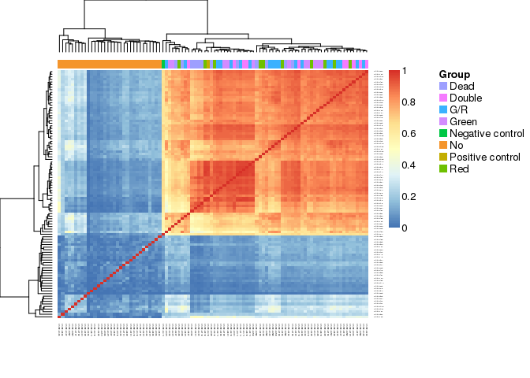

# RNhi10539


```r
LIBRARY      <- "RNhi10539" 
ZENBU_COLLAB <- "<Insert Zenbu collaboration ID>"
WORKFLOW     <- "OP-WORKFLOW-CAGEscan-short-reads-v2.0"
MOIRAI_STAMP <- "20160519001330"
MOIRAI_PROJ  <- "Timecourse"
MOIRAI_USER  <- "nano-fluidigm"
ASSEMBLY     <- "hg38"

GROUP_SHARED <- "/osc-fs_home/scratch/gmtu"
GENE_SYMBOLS <- paste0(GROUP_SHARED, "/annotation/homo_sapiens/gencode-23/gencode.v23.annotation.genes.bed")
ANNOTATION   <- paste0(GROUP_SHARED, "/annotation/homo_sapiens/gencode-23/gencode.v23.annotation.bed")

RunA  <- "1772-123-073"
ctrls <- list( RunA=list(posi="C10", nega="C11"))
```


HiSeq run RNhi10539
=====================

 - C1 run 1772-123-073.
 - Sequenced on HiSeq (RNhi10539).

 - Positive control (200 cells): C10.
 - Negative control: C11.
 
Jump directly to the [Analysis](#analysis) section if you are not
interested in the details of the data processing.

Data Processing
===============

Link files from MOIRAI.
-----------------------


```r
BASEDIR      <- "/osc-fs_home/scratch/moirai"
MOIRAI_RUN   <- paste(LIBRARY, WORKFLOW, MOIRAI_STAMP, sep=".")
MOIRAI_BASE  <- paste(BASEDIR, MOIRAI_USER, "project", MOIRAI_PROJ, MOIRAI_RUN, sep="/")
MOIRAI_ID    <- paste(LIBRARY, WORKFLOW, MOIRAI_STAMP, sep=".")
MOIRAI_FRAGS <- paste0(MOIRAI_BASE, "/CAGEscan_fragments")
MOIRAI_BAM   <- paste0(MOIRAI_BASE, "/genome_mapped")
MOIRAI_URL   <- paste0("http://moirai.gsc.riken.jp/", MOIRAI_BASE, "/", MOIRAI_RUN, ".html")

smallCAGEqc::exportInEnv("LIBRARY", "MOIRAI_BASE", "GENE_SYMBOLS", "ANNOTATION")
```

```
## export LIBRARY=RNhi10539
## export MOIRAI_BASE=/osc-fs_home/scratch/moirai/nano-fluidigm/project/Timecourse/RNhi10539.OP-WORKFLOW-CAGEscan-short-reads-v2.0.20160519001330
## export GENE_SYMBOLS=/osc-fs_home/scratch/gmtu/annotation/homo_sapiens/gencode-23/gencode.v23.annotation.genes.bed
## export ANNOTATION=/osc-fs_home/scratch/gmtu/annotation/homo_sapiens/gencode-23/gencode.v23.annotation.bed
```

Intranet link: [RNhi10539.OP-WORKFLOW-CAGEscan-short-reads-v2.0.20160519001330](http://moirai.gsc.riken.jp//osc-fs_home/scratch/moirai/nano-fluidigm/project/Timecourse/RNhi10539.OP-WORKFLOW-CAGEscan-short-reads-v2.0.20160519001330/RNhi10539.OP-WORKFLOW-CAGEscan-short-reads-v2.0.20160519001330.html)

Create a symbolic link from Moirai results to the working directory.


```bash
[ -L $LIBRARY.l1.osc.gz ] ||
  ln --symbolic $MOIRAI_BASE/$LIBRARY.l1.osc.gz
```

Annotation and gene symbols.
----------------------------

See also <https://gist.github.com/charles-plessy/9dbc8bc98fb773bf71b6>.


```bash
function osc2bed {
  zcat $1 |
    grep -v \# |
    sed 1d |
    awk '{OFS="\t"}{print $2, $3, $4, "l1", "1000", $5}'
}

function bed2annot {
  bedtools intersect -a $1 -b $ANNOTATION -s -loj |
    awk '{OFS="\t"}{print $1":"$2"-"$3$6,$10}' | 
    bedtools groupby -g 1 -c 2 -o collapse
}

function bed2symbols {
  bedtools intersect -a $1 -b $GENE_SYMBOLS -s -loj |
    awk '{OFS="\t"}{print $1":"$2"-"$3$6,$10}' | 
    bedtools groupby -g 1 -c 2 -o distinct
}

osc2bed $LIBRARY.l1.osc.gz | tee $LIBRARY.l1.bed | bed2annot - > $LIBRARY.l1.annot
bed2symbols $LIBRARY.l1.bed > $LIBRARY.l1.genes
```

Data load and QC in R.
======================

Moirai metadata
---------------


```r
library(magrittr)
library(oscR)
library(smallCAGEqc)
stopifnot(
    packageVersion("oscR") >= "0.2.0"
  , packageVersion("smallCAGEqc") >= "0.12.2"
)
library(data.table)
library(reshape)
library(ggplot2)
library(vegan)
library(plyr)
```


```r
PROCESSED_DATA <- MOIRAI_BASE

libs <- loadMoiraiStats(
  multiplex = paste0( "/osc-fs_home/scratch/moirai/nano-fluidigm/input/"
                    , LIBRARY
                    , ".name_to_id.txt"))
libs$Run <- RunA
libs$Well <- sub(".*_", "", libs$samplename)
libs$row <- sub(".", "", libs$Well)
libs$column <- sub("..$", "", libs$Well)
libs$library <- LIBRARY
```

Values in the `libs` table come from Moirai's `summary.txt` file, as
follows:

libs         Moirai
------------ ---------------------------
total        raw
extracted    extracted
cleaned      non_reference_extracted
tagdust      filtered_for_artefact
rdna         filtered_for_rrna
spikes       filtered_for_spikes
mapped       genome_mapped
properpairs  properly_mapped
counts       transcript_count

Transcript counts (properly paired)
-----------------------------------

Note that `fread` needs to temporarly save an uncompressed copy of the file
that is being read.  If there is not enough space in the temporary directory
(often `\tmp`),  either uncompress the file first, or point to a larger
directory to contain the temporary files (for example, run `R` with `TMPDIR=.
R`).

Note that _data.tables_ seem to be saved as simple _data frames_ when
closing a session.  After restoring a workspace, one needs to re-convert with the `data.table` command.


```r
l1 <- fread.osc(paste0(LIBRARY, ".l1.osc.gz"), dropIdCoords=TRUE)
```

```
## 
Read 0.0% of 608402 rows
Read 11.5% of 608402 rows
Read 23.0% of 608402 rows
Read 34.5% of 608402 rows
Read 46.0% of 608402 rows
Read 57.5% of 608402 rows
Read 70.7% of 608402 rows
Read 82.2% of 608402 rows
Read 95.3% of 608402 rows
Read 608402 rows and 197 (of 197) columns from 1.009 GB file in 00:00:14
```

```r
setnames(l1, colnames(l1) %>% sub('raw.', '', .) %>% sub('.None', '', .))

# Be sure that the "libs" and "l1" tables have matching names.
stopifnot(all(colnames(l1) == rownames(libs)))
```

Annotation
----------


```r
annot.l1 <- read.table(paste(LIBRARY,'l1','annot',sep='.'), head=F, col.names=c('id', 'feature'), row.names=1)
annot.l1 <- hierarchAnnot(annot.l1)

libs <- cbind(libs, t(rowsum(l1,  annot.l1[,'class']))[rownames(libs),])
```

Gene count
----------


```r
genesymbols <- read.table(paste(LIBRARY,'l1','genes',sep='.'), col.names=c("cluster","symbol"), stringsAsFactors=FALSE)
rownames(genesymbols) <- genesymbols$cluster

genes <- rowsum(l1, genesymbols$symbol)

libs$genes       <- colSums(genes > 0)
libs$geneSymbols <- countSymbols(genes) # Not the same!
```


Raw reads per molecule (BED12 data)
-----------------------------------


```r
# bed <- loadBED12( libs[libs$counts > 0, "samplename"] %>%
#              sub(RunA, "RunA", .) %>%
#              sub(RunB, "RunB", .) %>%
#              paste0(MOIRAI_FRAGS, "/", ., ".bed"))
```

Cell curation
-------------


```r
curation <- read.table( "../generated/samples.tsv"
                      , head=TRUE, sep = "\t"
                      , row.names = "Rownames")["Final"]

libs$Group <- curation[rownames(libs), "Final"] %>% as.character
```

cDNA concentration.
-------------------


```r
read.pg <- function(RUN)
  paste0("../source/", RUN, ".picogreen.xlsx") %>%
    fldgmPicoGreen("PN 100-6160") %>%
    extract(,"concentration")
libs$Concentration <- read.pg(RunA)
fldgmConcentrationPlot(libs) + facet_wrap(~Group)
```

<!-- -->

Controls
--------

Some samples with errors were repalced by the positive and negative controls.


```r
libs[libs$Well == ctrls$RunA$posi & libs$Run == RunA, "Group"] <- "Positive control"
libs[libs$Well == ctrls$RunA$nega & libs$Run == RunA, "Group"] <- "Negative control"
```

Combined analysis of fluorescence and cDNA concentration.
---------------------------------------------------------

Richness
--------


```r
libs$l1 <- colSums(l1 > 0)
libs$r100l1 <- rarefy(t(l1),100)
```

Analysis
========

Processing
----------


```r
plotAnnot(libs, 'steps', LIBRARY, libs$Group)
```

```
## Warning: Removed 10 rows containing missing values (geom_segment).
```

```
## Warning: Removed 10 rows containing missing values (geom_point).
```

<!-- -->


```r
plotAnnot(libs, 'steps', LIBRARY, rownames(libs))
```

```
## Warning: Removed 480 rows containing missing values (geom_segment).
```

```
## Warning: Removed 480 rows containing missing values (geom_point).
```

<!-- -->

QC barplots
-----------


```r
plotAnnot(libs, 'qc', LIBRARY, libs$Group)
```

```
## Warning: Removed 14 rows containing missing values (geom_segment).
```

```
## Warning: Removed 14 rows containing missing values (geom_point).
```

<!-- -->


```r
plotAnnot(libs, 'qc', LIBRARY, rownames(libs))
```

```
## Warning: Removed 672 rows containing missing values (geom_segment).
```

```
## Warning: Removed 672 rows containing missing values (geom_point).
```

<!-- -->

Annotation
----------


```r
plotAnnot(libs, 'counts', LIBRARY, libs$Group)
```

```
## Warning: Removed 8 rows containing missing values (geom_segment).
```

```
## Warning: Removed 8 rows containing missing values (geom_point).
```

<!-- -->


```r
plotAnnot(libs, 'counts', LIBRARY, rownames(libs))
```

```
## Warning: Removed 384 rows containing missing values (geom_segment).
```

```
## Warning: Removed 384 rows containing missing values (geom_point).
```

<!-- -->

Correlation between runs
------------------------


```r
NMF::aheatmap( cor(genes[-1, ])
             , annCol=list(Group=libs$Group))
```

<!-- -->

```r
NMF::aheatmap( cor(genes[-1, ] %>% TPM  %>% log1p)
             , annCol=list(Group=libs$Group))
```

<!-- -->


```r
singleCells <- libs$Group %in% c("Red", "Green", "G/R")
NMF::aheatmap( cor(genes[-1, singleCells])
            , annCol=list(Run=libs[singleCells, "Group"]))
```

<!-- -->

```r
NMF::aheatmap( cor(genes[-1, singleCells] %>% TPM %>% log1p)
            , annCol=list(Run=libs[singleCells, "Group"]))
```

<!-- -->

Gene counts and TSS discovery
-----------------------------

### Gene count by error code.


```r
dotsize <- 500
ggplot(libs, aes(x=Group, y=genes)) +
  stat_summary(fun.y=mean, fun.ymin=mean, fun.ymax=mean, geom="crossbar", color="gray") +
  geom_dotplot(aes(fill=Group), binaxis='y', binwidth=1, dotsize=dotsize, stackdir='center') +
  coord_flip()
```

<!-- -->

Rarefaction (hanabi plot).
--------------------------

### TSS discovery


```r
hanabiPlot( hanabi(l1, from=0)
          , ylab='number of TSS detected'
          , xlab='number of unique molecule counts'
          , main=paste("TSS discovery for", LIBRARY)
          , GROUP=libs$Group %>% factor)
```

<!-- -->

### Gene discovery


```r
hanabiPlot( hanabi(genes, from=0)
          , ylab='number of genes detected'
          , xlab='number of unique molecule counts'
          , main=paste("Gene discovery for", LIBRARY)
          , GROUP=libs$Group %>% factor)
```

<!-- -->


```r
write.table( libs
           , paste0(LIBRARY, ".libs.tsv")
           , sep="\t", quote = FALSE
           , row.names = FALSE)
libs
```

```
##            samplename                       sampleid   total extracted cleaned tagdust   rdna
## CAGE_5_A01 CAGE_5_A01 2nd_CAGE_A01_TAAGGCGA-CTCTCTAT 1277468    719036  535341    1374 130770
## CAGE_5_A02 CAGE_5_A02 2nd_CAGE_A02_CGTACTAG-CTCTCTAT 1456035    781021  205572    5907  43386
## CAGE_5_A03 CAGE_5_A03 2nd_CAGE_A03_AGGCAGAA-CTCTCTAT  995654    625228  457584    1256 116228
## CAGE_5_A04 CAGE_5_A04 2nd_CAGE_A04_TCCTGAGC-CTCTCTAT 1293535    816980  193811    9914  30873
## CAGE_5_A05 CAGE_5_A05 2nd_CAGE_A05_GGACTCCT-CTCTCTAT 1684830    940910  233734   12728  40884
## CAGE_5_A06 CAGE_5_A06 2nd_CAGE_A06_TAGGCATG-CTCTCTAT 2055601   1163794  860507    5228 202643
## CAGE_5_A07 CAGE_5_A07 2nd_CAGE_A07_CTCTCTAC-CTCTCTAT 1837330   1087095  303538    8922  77244
## CAGE_5_A08 CAGE_5_A08 2nd_CAGE_A08_CGAGGCTG-CTCTCTAT 1670917    972417  706400    1953 171384
## CAGE_5_A09 CAGE_5_A09 2nd_CAGE_A09_AAGAGGCA-CTCTCTAT 1926655   1034528  785178    2025 191237
## CAGE_5_A10 CAGE_5_A10 2nd_CAGE_A10_GTAGAGGA-CTCTCTAT 1250903    680244  172131    8530  24565
## CAGE_5_A11 CAGE_5_A11 2nd_CAGE_A11_GCTCATGA-CTCTCTAT 2085428   1009905  763202   10906 177711
## CAGE_5_A12 CAGE_5_A12 2nd_CAGE_A12_ATCTCAGG-CTCTCTAT 1557172    796077  250073   25402  20964
## CAGE_5_B01 CAGE_5_B01 2nd_CAGE_B01_TAAGGCGA-TATCCTCT 1270345    807551  633454    1698 115810
## CAGE_5_B02 CAGE_5_B02 2nd_CAGE_B02_CGTACTAG-TATCCTCT 1283550    723237  213475    5855  33419
## CAGE_5_B03 CAGE_5_B03 2nd_CAGE_B03_AGGCAGAA-TATCCTCT  967169    537719  120297    4042  27639
## CAGE_5_B04 CAGE_5_B04 2nd_CAGE_B04_TCCTGAGC-TATCCTCT 1407077    896321  676478    1946 168794
## CAGE_5_B05 CAGE_5_B05 2nd_CAGE_B05_GGACTCCT-TATCCTCT 1449304    764536  207453   12772  34263
## CAGE_5_B06 CAGE_5_B06 2nd_CAGE_B06_TAGGCATG-TATCCTCT 1636123    945855  238057   16215  35339
## CAGE_5_B07 CAGE_5_B07 2nd_CAGE_B07_CTCTCTAC-TATCCTCT 1585252   1092604  807242    2622 225906
## CAGE_5_B08 CAGE_5_B08 2nd_CAGE_B08_CGAGGCTG-TATCCTCT 1498465    983600  705790    2296 232114
## CAGE_5_B09 CAGE_5_B09 2nd_CAGE_B09_AAGAGGCA-TATCCTCT 1508405    890106  252273   10388  47419
## CAGE_5_B10 CAGE_5_B10 2nd_CAGE_B10_GTAGAGGA-TATCCTCT 1366591    737631  585391    2558  99514
## CAGE_5_B11 CAGE_5_B11 2nd_CAGE_B11_GCTCATGA-TATCCTCT 1090022    622003  191861   27409  14572
## CAGE_5_B12 CAGE_5_B12 2nd_CAGE_B12_ATCTCAGG-TATCCTCT 1583351    922301  693973   11732 149345
## CAGE_5_C01 CAGE_5_C01 2nd_CAGE_C01_TAAGGCGA-GTAAGGAG 1143634    645061  232147    5802  37146
## CAGE_5_C02 CAGE_5_C02 2nd_CAGE_C02_CGTACTAG-GTAAGGAG  993512    693678  559194    1446  89177
## CAGE_5_C03 CAGE_5_C03 2nd_CAGE_C03_AGGCAGAA-GTAAGGAG  917257    583442  407047    2740  46722
## CAGE_5_C04 CAGE_5_C04 2nd_CAGE_C04_TCCTGAGC-GTAAGGAG 1092640    661643  475876    1822 119490
## CAGE_5_C05 CAGE_5_C05 2nd_CAGE_C05_GGACTCCT-GTAAGGAG 1364115    732452  210017   10972  28041
## CAGE_5_C06 CAGE_5_C06 2nd_CAGE_C06_TAGGCATG-GTAAGGAG 1665209   1040017  726519    3843 202674
## CAGE_5_C07 CAGE_5_C07 2nd_CAGE_C07_CTCTCTAC-GTAAGGAG 1264497    893863  717077    1823 148828
## CAGE_5_C08 CAGE_5_C08 2nd_CAGE_C08_CGAGGCTG-GTAAGGAG 1170891    735265  530141    1900 126795
## CAGE_5_C09 CAGE_5_C09 2nd_CAGE_C09_AAGAGGCA-GTAAGGAG 1597033    870329  666046    2676 134277
## CAGE_5_C10 CAGE_5_C10 2nd_CAGE_C10_GTAGAGGA-GTAAGGAG 1102455    604182  475407    1572  98459
## CAGE_5_C11 CAGE_5_C11 2nd_CAGE_C11_GCTCATGA-GTAAGGAG 2292687   1299488  121673   34688    219
## CAGE_5_C12 CAGE_5_C12 2nd_CAGE_C12_ATCTCAGG-GTAAGGAG  980200    566303  192685   30225  20452
## CAGE_5_D01 CAGE_5_D01 2nd_CAGE_D01_TAAGGCGA-ACTGCATA  980268    574237  375112    3157  82698
## CAGE_5_D02 CAGE_5_D02 2nd_CAGE_D02_CGTACTAG-ACTGCATA 1102153    766681  603932    1482 138570
## CAGE_5_D03 CAGE_5_D03 2nd_CAGE_D03_AGGCAGAA-ACTGCATA  721181    484930  345447    1254 108638
## CAGE_5_D04 CAGE_5_D04 2nd_CAGE_D04_TCCTGAGC-ACTGCATA 1154106    686885  176008    9595  28827
## CAGE_5_D05 CAGE_5_D05 2nd_CAGE_D05_GGACTCCT-ACTGCATA 1346228    782624  236050   20262  40221
## CAGE_5_D06 CAGE_5_D06 2nd_CAGE_D06_TAGGCATG-ACTGCATA 1634894    927799  679228    6612 140056
## CAGE_5_D07 CAGE_5_D07 2nd_CAGE_D07_CTCTCTAC-ACTGCATA 1463374    979144  699625    3274 193046
## CAGE_5_D08 CAGE_5_D08 2nd_CAGE_D08_CGAGGCTG-ACTGCATA 1267974    805901  607092    2420 125254
## CAGE_5_D09 CAGE_5_D09 2nd_CAGE_D09_AAGAGGCA-ACTGCATA 1050254    577134  199935    8575  22621
## CAGE_5_D10 CAGE_5_D10 2nd_CAGE_D10_GTAGAGGA-ACTGCATA 1292103    769133  594609    3938 100152
## CAGE_5_D11 CAGE_5_D11 2nd_CAGE_D11_GCTCATGA-ACTGCATA 1395907    812048  645876    9382 125940
## CAGE_5_D12 CAGE_5_D12 2nd_CAGE_D12_ATCTCAGG-ACTGCATA 1375687    785853  615207   10381 100872
## CAGE_5_E01 CAGE_5_E01 2nd_CAGE_E01_TAAGGCGA-AAGGAGTA  922710    517718  185419    5223  22876
## CAGE_5_E02 CAGE_5_E02 2nd_CAGE_E02_CGTACTAG-AAGGAGTA 1074259    705316  545915    1740 110470
## CAGE_5_E03 CAGE_5_E03 2nd_CAGE_E03_AGGCAGAA-AAGGAGTA  723762    496229  396337     855  82096
## CAGE_5_E04 CAGE_5_E04 2nd_CAGE_E04_TCCTGAGC-AAGGAGTA  836342    500955  133950    4920  35541
## CAGE_5_E05 CAGE_5_E05 2nd_CAGE_E05_GGACTCCT-AAGGAGTA 1415238    826857  635049    3310 114765
## CAGE_5_E06 CAGE_5_E06 2nd_CAGE_E06_TAGGCATG-AAGGAGTA 1668277   1101133  920584    3721 141433
## CAGE_5_E07 CAGE_5_E07 2nd_CAGE_E07_CTCTCTAC-AAGGAGTA 1244866    794971  622808    2168 111258
## CAGE_5_E08 CAGE_5_E08 2nd_CAGE_E08_CGAGGCTG-AAGGAGTA  992376    634323  487839    1514  96314
## CAGE_5_E09 CAGE_5_E09 2nd_CAGE_E09_AAGAGGCA-AAGGAGTA 1099384    574224  219071    7665  18570
## CAGE_5_E10 CAGE_5_E10 2nd_CAGE_E10_GTAGAGGA-AAGGAGTA 1151311    690337  555820    1688 105540
## CAGE_5_E11 CAGE_5_E11 2nd_CAGE_E11_GCTCATGA-AAGGAGTA 1471121    791193  608660    8470 121241
## CAGE_5_E12 CAGE_5_E12 2nd_CAGE_E12_ATCTCAGG-AAGGAGTA 1498643    844343  681002    8014 113541
## CAGE_5_F01 CAGE_5_F01 2nd_CAGE_F01_TAAGGCGA-CTAAGCCT  797226    427613  167238    4173  17607
## CAGE_5_F02 CAGE_5_F02 2nd_CAGE_F02_CGTACTAG-CTAAGCCT  940646    536028  207904    5209  25742
## CAGE_5_F03 CAGE_5_F03 2nd_CAGE_F03_AGGCAGAA-CTAAGCCT  462488    259331   98603    2727  13847
## CAGE_5_F04 CAGE_5_F04 2nd_CAGE_F04_TCCTGAGC-CTAAGCCT 1216549    772043  588572    1499 145472
## CAGE_5_F05 CAGE_5_F05 2nd_CAGE_F05_GGACTCCT-CTAAGCCT 1182147    734437  566635    1800 125056
## CAGE_5_F06 CAGE_5_F06 2nd_CAGE_F06_TAGGCATG-CTAAGCCT 1512015    949623  723957    2604 184135
## CAGE_5_F07 CAGE_5_F07 2nd_CAGE_F07_CTCTCTAC-CTAAGCCT 1245445    722441  304680    6861  35376
## CAGE_5_F08 CAGE_5_F08 2nd_CAGE_F08_CGAGGCTG-CTAAGCCT 1076405    724952  539079    1458 134947
## CAGE_5_F09 CAGE_5_F09 2nd_CAGE_F09_AAGAGGCA-CTAAGCCT 1219640    694407  550982    1784  90197
## CAGE_5_F10 CAGE_5_F10 2nd_CAGE_F10_GTAGAGGA-CTAAGCCT 1113271    677248  541499    1424 116301
## CAGE_5_F11 CAGE_5_F11 2nd_CAGE_F11_GCTCATGA-CTAAGCCT 1739187    976213  796298    6381 133082
## CAGE_5_F12 CAGE_5_F12 2nd_CAGE_F12_ATCTCAGG-CTAAGCCT 1382772    813019  538412   12053  68422
## CAGE_5_G01 CAGE_5_G01 2nd_CAGE_G01_TAAGGCGA-CGTCTAAT  871854    565829  430740     927 107240
## CAGE_5_G02 CAGE_5_G02 2nd_CAGE_G02_CGTACTAG-CGTCTAAT  993303    701288  550692     973 125775
## CAGE_5_G03 CAGE_5_G03 2nd_CAGE_G03_AGGCAGAA-CGTCTAAT  539405    368444  286962     508  69170
## CAGE_5_G04 CAGE_5_G04 2nd_CAGE_G04_TCCTGAGC-CGTCTAAT 1096530    704904  178700    5824  67968
## CAGE_5_G05 CAGE_5_G05 2nd_CAGE_G05_GGACTCCT-CGTCTAAT 1225436    718439  469070    2253 141703
## CAGE_5_G06 CAGE_5_G06 2nd_CAGE_G06_TAGGCATG-CGTCTAAT 1432048    876908  634912    2193 163704
## CAGE_5_G07 CAGE_5_G07 2nd_CAGE_G07_CTCTCTAC-CGTCTAAT 1485025    846968  406435    4443  69052
## CAGE_5_G08 CAGE_5_G08 2nd_CAGE_G08_CGAGGCTG-CGTCTAAT 1191179    822773  618313    1257 157026
## CAGE_5_G09 CAGE_5_G09 2nd_CAGE_G09_AAGAGGCA-CGTCTAAT 1225215    718962  458566    1605 180442
## CAGE_5_G10 CAGE_5_G10 2nd_CAGE_G10_GTAGAGGA-CGTCTAAT  969802    559586  430390    1014 101283
## CAGE_5_G11 CAGE_5_G11 2nd_CAGE_G11_GCTCATGA-CGTCTAAT 1159891    669567  169470   14348  39632
## CAGE_5_G12 CAGE_5_G12 2nd_CAGE_G12_ATCTCAGG-CGTCTAAT 1452521    847192  669213    3966 112166
## CAGE_5_H01 CAGE_5_H01 2nd_CAGE_H01_TAAGGCGA-TCTCTCCG  988747    739979  613247    1061 115242
## CAGE_5_H02 CAGE_5_H02 2nd_CAGE_H02_CGTACTAG-TCTCTCCG 1108810    739548  535085    2172  66461
## CAGE_5_H03 CAGE_5_H03 2nd_CAGE_H03_AGGCAGAA-TCTCTCCG  653265    447932  329279     620  97327
## CAGE_5_H04 CAGE_5_H04 2nd_CAGE_H04_TCCTGAGC-TCTCTCCG 1128859    739257  534169    1214 153633
## CAGE_5_H05 CAGE_5_H05 2nd_CAGE_H05_GGACTCCT-TCTCTCCG 1237404    778357  148098    5733  89024
## CAGE_5_H06 CAGE_5_H06 2nd_CAGE_H06_TAGGCATG-TCTCTCCG 1230490    736715  169569    6612  73105
## CAGE_5_H07 CAGE_5_H07 2nd_CAGE_H07_CTCTCTAC-TCTCTCCG 1582026    847642  329983    4215  44069
## CAGE_5_H08 CAGE_5_H08 2nd_CAGE_H08_CGAGGCTG-TCTCTCCG 1205754    793777  504759    1458 212845
## CAGE_5_H09 CAGE_5_H09 2nd_CAGE_H09_AAGAGGCA-TCTCTCCG 1158780    728685  449432    2514  74835
## CAGE_5_H10 CAGE_5_H10 2nd_CAGE_H10_GTAGAGGA-TCTCTCCG  917169    538859  401203     933  94878
## CAGE_5_H11 CAGE_5_H11 2nd_CAGE_H11_GCTCATGA-TCTCTCCG 1777280    971026  726581    2994 211221
## CAGE_5_H12 CAGE_5_H12 2nd_CAGE_H12_ATCTCAGG-TCTCTCCG 1273635    758703  172764    8021  99009
##             spikes mapped properpairs counts          Run Well row column   library   exon intron
## CAGE_5_A01   51461 510590      432426 410624 1772-123-073  A01  01      A RNhi10539  61753  31798
## CAGE_5_A02  526106 156032      139653 124973 1772-123-073  A02  02      A RNhi10539  16502  12194
## CAGE_5_A03   50074 432984      370288 352969 1772-123-073  A03  03      A RNhi10539  48703  20314
## CAGE_5_A04  582328 113383       96661  87719 1772-123-073  A04  04      A RNhi10539   7599   6846
## CAGE_5_A05  653391 152018      131092 111295 1772-123-073  A05  05      A RNhi10539  25171   6112
## CAGE_5_A06   95331 808970      694962 646912 1772-123-073  A06  06      A RNhi10539  82615  50365
## CAGE_5_A07  697337 226910      188234 163797 1772-123-073  A07  07      A RNhi10539  36983  10188
## CAGE_5_A08   92604 670350      586240 552620 1772-123-073  A08  08      A RNhi10539  88686  26997
## CAGE_5_A09   56007 748464      642698 601317 1772-123-073  A09  09      A RNhi10539  98118  35976
## CAGE_5_A10  474973 101376       82564  74835 1772-123-073  A10  10      A RNhi10539  11618   4654
## CAGE_5_A11   57866 699059      577859 527718 1772-123-073  A11  11      A RNhi10539 113909  34237
## CAGE_5_A12  499584 107582       89677  81653 1772-123-073  A12  12      A RNhi10539  20806  13199
## CAGE_5_B01   56521 602168      478847 450811 1772-123-073  B01  01      B RNhi10539  87885  91922
## CAGE_5_B02  470442 159561      133260 119541 1772-123-073  B02  02      B RNhi10539  24670   7701
## CAGE_5_B03  385716  83925       69460  63154 1772-123-073  B03  03      B RNhi10539  12639   4121
## CAGE_5_B04   49035 644942      564911 537713 1772-123-073  B04  04      B RNhi10539  69840  31607
## CAGE_5_B05  510012 134127       98736  90452 1772-123-073  B05  05      B RNhi10539  16807   3990
## CAGE_5_B06  656179 139723      116733 101806 1772-123-073  B06  06      B RNhi10539  28798  17518
## CAGE_5_B07   56734 763950      661714 627536 1772-123-073  B07  07      B RNhi10539 102851  32308
## CAGE_5_B08   43316 674504      584138 550254 1772-123-073  B08  08      B RNhi10539  98224  51114
## CAGE_5_B09  579963 184880      155716 138927 1772-123-073  B09  09      B RNhi10539  25418  14033
## CAGE_5_B10   50074 551021      472396 447197 1772-123-073  B10  10      B RNhi10539  89231  40316
## CAGE_5_B11  388124  53664       37855  34406 1772-123-073  B11  11      B RNhi10539   7438   6281
## CAGE_5_B12   67155 634466      545450 505176 1772-123-073  B12  12      B RNhi10539 123429  28520
## CAGE_5_C01  369921 181225      163148 150530 1772-123-073  C01  01      C RNhi10539  31117   4658
## CAGE_5_C02   43807 532446      417179 396344 1772-123-073  C02  02      C RNhi10539  70368 108380
## CAGE_5_C03  126844 385234      330591 303372 1772-123-073  C03  03      C RNhi10539  91555  79305
## CAGE_5_C04   64348 452251      402888 385381 1772-123-073  C04  04      C RNhi10539  53630  15417
## CAGE_5_C05  483376 131722       99959  86959 1772-123-073  C05  05      C RNhi10539  18314  19719
## CAGE_5_C06  106830 683673      609166 574952 1772-123-073  C06  06      C RNhi10539 111445  24997
## CAGE_5_C07   26068 682661      596887 569901 1772-123-073  C07  07      C RNhi10539  94692  38227
## CAGE_5_C08   76375 502901      439984 421596 1772-123-073  C08  08      C RNhi10539  63273  20391
## CAGE_5_C09   67193 627983      538274 505042 1772-123-073  C09  09      C RNhi10539 113737  38763
## CAGE_5_C10   28675 453823      382019 358926 1772-123-073  C10  10      C RNhi10539  79755  39703
## CAGE_5_C11 1142830    843         205    205 1772-123-073  C11  11      C RNhi10539     40     17
## CAGE_5_C12  322909  45412       35548  32872 1772-123-073  C12  12      C RNhi10539   8590   3547
## CAGE_5_D01  113183 346763      275290 256098 1772-123-073  D01  01      D RNhi10539  74726  61953
## CAGE_5_D02   22633 574719      497731 475635 1772-123-073  D02  02      D RNhi10539  79100  31160
## CAGE_5_D03   29540 327912      284389 275086 1772-123-073  D03  03      D RNhi10539  51113  15668
## CAGE_5_D04  472405 114459       99189  84943 1772-123-073  D04  04      D RNhi10539  19997   3767
## CAGE_5_D05  486042 119055       95040  82365 1772-123-073  D05  05      D RNhi10539  15054   9774
## CAGE_5_D06  101818 625284      527415 490110 1772-123-073  D06  06      D RNhi10539  95567  44277
## CAGE_5_D07   83020 659809      558888 525824 1772-123-073  D07  07      D RNhi10539  93716  90411
## CAGE_5_D08   71074 573521      501258 476311 1772-123-073  D08  08      D RNhi10539  88491  36855
## CAGE_5_D09  345959 140974      127152 115051 1772-123-073  D09  09      D RNhi10539  24900  10175
## CAGE_5_D10   70376 558210      442710 416438 1772-123-073  D10  10      D RNhi10539 100626  97107
## CAGE_5_D11   30711 593223      497469 464323 1772-123-073  D11  11      D RNhi10539  97143  31849
## CAGE_5_D12   59305 553117      459791 427574 1772-123-073  D12  12      D RNhi10539 104710  49450
## CAGE_5_E01  304163 145205      122535 113110 1772-123-073  E01  01      E RNhi10539  32850   5617
## CAGE_5_E02   47132 516319      438181 416785 1772-123-073  E02  02      E RNhi10539  84381  36141
## CAGE_5_E03   16897 378882      327209 315858 1772-123-073  E03  03      E RNhi10539  60142  24673
## CAGE_5_E04  326516  92300       78309  71761 1772-123-073  E04  04      E RNhi10539  12146   9100
## CAGE_5_E05   73667 589700      490246 455553 1772-123-073  E05  05      E RNhi10539  83874  53174
## CAGE_5_E06   35300 870117      744435 688786 1772-123-073  E06  06      E RNhi10539 154253  71686
## CAGE_5_E07   58653 588673      516331 490471 1772-123-073  E07  07      E RNhi10539  93480  29119
## CAGE_5_E08   48618 463370      396283 379429 1772-123-073  E08  08      E RNhi10539  52747  31752
## CAGE_5_E09  328880 168445      141977 128923 1772-123-073  E09  09      E RNhi10539  21904  11146
## CAGE_5_E10   27222 530473      449560 426833 1772-123-073  E10  10      E RNhi10539  70851  45194
## CAGE_5_E11   52747 552408      457227 424503 1772-123-073  E11  11      E RNhi10539 107387  39065
## CAGE_5_E12   41717 629553      523050 483626 1772-123-073  E12  12      E RNhi10539 126813  42389
## CAGE_5_F01  238571 132834      119555 108133 1772-123-073  F01  01      F RNhi10539  25016   9805
## CAGE_5_F02  297136 171867      146368 135856 1772-123-073  F02  02      F RNhi10539  29580  11100
## CAGE_5_F03  144143  75639       67086  64605 1772-123-073  F03  03      F RNhi10539  13836   4433
## CAGE_5_F04   36458 559974      486484 463491 1772-123-073  F04  04      F RNhi10539  89462  30791
## CAGE_5_F05   40886 535988      446469 420946 1772-123-073  F05  05      F RNhi10539  75922  40080
## CAGE_5_F06   38846 688606      595195 557815 1772-123-073  F06  06      F RNhi10539  90431  44045
## CAGE_5_F07  375483 252837      231278 211897 1772-123-073  F07  07      F RNhi10539  49823  12569
## CAGE_5_F08   49416 512914      445909 423967 1772-123-073  F08  08      F RNhi10539  69064  19546
## CAGE_5_F09   51385 523637      412849 391151 1772-123-073  F09  09      F RNhi10539  82173  98443
## CAGE_5_F10   17979 516902      438568 420945 1772-123-073  F10  10      F RNhi10539  76484  35402
## CAGE_5_F11   40389 742409      614609 563655 1772-123-073  F11  11      F RNhi10539 145490  53203
## CAGE_5_F12  194013 458037      367623 325627 1772-123-073  F12  12      F RNhi10539 102738  94756
## CAGE_5_G01   26846 410471      354669 340166 1772-123-073  G01  01      G RNhi10539  54251  13613
## CAGE_5_G02   23800 523852      455350 435486 1772-123-073  G02  02      G RNhi10539  86298  31590
## CAGE_5_G03   11747 273691      236939 229176 1772-123-073  G03  03      G RNhi10539  35357  13260
## CAGE_5_G04  452373 130158      110929 101422 1772-123-073  G04  04      G RNhi10539  16889   6684
## CAGE_5_G05  105348 438287      370514 344492 1772-123-073  G05  05      G RNhi10539  67830  33146
## CAGE_5_G06   76013 602134      513736 478721 1772-123-073  G06  06      G RNhi10539  86496  60357
## CAGE_5_G07  366965 363703      317257 289560 1772-123-073  G07  07      G RNhi10539  51137  20538
## CAGE_5_G08   46134 587415      510476 481862 1772-123-073  G08  08      G RNhi10539  82014  21653
## CAGE_5_G09   78282 433311      370561 348782 1772-123-073  G09  09      G RNhi10539  73957  30328
## CAGE_5_G10   26856 410839      356536 341329 1772-123-073  G10  10      G RNhi10539  51531  23569
## CAGE_5_G11  446078  78982       71789  66097 1772-123-073  G11  11      G RNhi10539  20415   2520
## CAGE_5_G12   61760 625302      519507 478725 1772-123-073  G12  12      G RNhi10539 132357  38223
## CAGE_5_H01   10314 586901      438572 415022 1772-123-073  H01  01      H RNhi10539  94804 121935
## CAGE_5_H02  135738 501370      395083 368839 1772-123-073  H02  02      H RNhi10539  98855 143765
## CAGE_5_H03   20679 314527      270663 260088 1772-123-073  H03  03      H RNhi10539  40748  10968
## CAGE_5_H04   50193 507643      437546 417969 1772-123-073  H04  04      H RNhi10539  55807  20268
## CAGE_5_H05  535448 105341       94500  85218 1772-123-073  H05  05      H RNhi10539  10909   7737
## CAGE_5_H06  487390 117684      106119  95495 1772-123-073  H06  06      H RNhi10539  23144   4188
## CAGE_5_H07  469323 283662      234438 210379 1772-123-073  H07  07      H RNhi10539  60582  12591
## CAGE_5_H08   74662 478500      413356 388836 1772-123-073  H08  08      H RNhi10539  55431  11813
## CAGE_5_H09  201819 417251      324130 287427 1772-123-073  H09  09      H RNhi10539  89860  48052
## CAGE_5_H10   41805 379196      322862 311275 1772-123-073  H10  10      H RNhi10539  50562  22662
## CAGE_5_H11   30095 687125      546196 503877 1772-123-073  H11  11      H RNhi10539 132151  67942
## CAGE_5_H12  478862 110933       89733  80828 1772-123-073  H12  12      H RNhi10539  15112   7236
##            other promoter unknown genes geneSymbols            Group Concentration    l1   r100l1
## CAGE_5_A01  1384   251338   64351  3728        3939            Green         1.735 15365 95.84036
## CAGE_5_A02    23    84003   12251   480         519               No         0.915  1511 55.19708
## CAGE_5_A03   960   228487   54505  3005        3186              G/R         1.571 12110 94.08484
## CAGE_5_A04     6    60574   12694   410         434               No         0.751  1240 52.15931
## CAGE_5_A05     2    71596    8414   410         434               No         0.816  1540 57.70681
## CAGE_5_A06  1320   397668  114944  3928        4126              Red         1.681 19226 95.70905
## CAGE_5_A07    65    96339   20222   700         740               No         0.903  2456 55.39790
## CAGE_5_A08   579   367599   68759  3173        3323            Green         1.648 14394 94.98100
## CAGE_5_A09  1838   376830   88522  4437        4680              G/R         1.713 20527 95.65736
## CAGE_5_A10    11    47595   10957   439         462               No         0.862  1345 52.61261
## CAGE_5_A11   832   257898  120840  4560        4792           Double         1.673 20780 94.34121
## CAGE_5_A12    22    42627    4999   423         446               No         0.944  1316 57.04645
## CAGE_5_B01   890   196262   73852  4149        4377            Green         1.651 17370 95.00814
## CAGE_5_B02     2    66412   20756   442         463               No         0.923  1528 56.79829
## CAGE_5_B03    16    40224    6154   337         358               No         0.979  1196 54.60172
## CAGE_5_B04  1019   368583   66664  4185        4419              G/R         1.767 18584 96.04806
## CAGE_5_B05    17    56122   13516   374         395               No         0.904  1238 53.44359
## CAGE_5_B06    14    51035    4441   430         459               No         0.829  1240 52.97698
## CAGE_5_B07  1576   414934   75867  4453        4667           Double         1.758 19739 96.55438
## CAGE_5_B08  1318   326719   72879  4879        5152              Red         1.682 20426 94.81464
## CAGE_5_B09  1570    78751   19155   450         479               No         0.850  1513 56.44661
## CAGE_5_B10  1108   255630   60912  4027        4245            Green         1.638 16905 96.04090
## CAGE_5_B11     1    11129    9557   235         244               No         0.769   784 40.41306
## CAGE_5_B12  1529   245232  106411  3894        4139           Double         1.597 17176 94.00515
## CAGE_5_C01    54    97021   17680   495         529               No         0.952  1740 64.34049
## CAGE_5_C02  1669   145347   70580  4145        4354            Green         1.774 17126 95.37966
## CAGE_5_C03   490    63048   68974  1353        1439             Dead         1.360  6651 88.02526
## CAGE_5_C04  1028   266984   48322  2596        2740            Green         1.708 11607 94.89741
## CAGE_5_C05     1    46582    2343   281         300               No         0.873  1052 39.64857
## CAGE_5_C06   748   373698   64064  3018        3188            Green         1.685 13489 94.30499
## CAGE_5_C07  1176   352462   83261  5194        5464              G/R         1.821 23493 95.91648
## CAGE_5_C08   326   284002   53604  2885        3039              Red         1.603 12369 94.90942
## CAGE_5_C09  1451   271882   79209  3380        3549              Red         1.689 15080 94.44848
## CAGE_5_C10   404   172505   66558 10399       10671 Positive control         0.819 57395 94.35947
## CAGE_5_C11     1      116      31   145         154 Negative control         0.707   191 95.94748
## CAGE_5_C12     3    15586    5146   262         282               No         0.728   686 44.25940
## CAGE_5_D01   349    71510   47560  1375        1461             Dead         1.386  5955 87.36070
## CAGE_5_D02   801   287725   76849  4936        5192           Double         1.857 21787 95.97835
## CAGE_5_D03   642   168257   39300  2910        3097              G/R         1.723 11473 93.96230
## CAGE_5_D04    47    50810   10322   313         332               No         0.749   996 44.62896
## CAGE_5_D05     2    45368   12167   359         375               No         0.776  1106 45.51581
## CAGE_5_D06   486   261895   87885  2462        2629              G/R         1.715 11769 92.72280
## CAGE_5_D07  1129   277486   63082  3187        3393             Dead         1.693 13712 94.76952
## CAGE_5_D08   798   288372   61795  3021        3179              Red         1.723 13207 94.72286
## CAGE_5_D09   384    71824    7768   538         566               No         0.841  1747 58.11381
## CAGE_5_D10   978   143105   74618  4606        4870              G/R         1.521 16922 94.25007
## CAGE_5_D11  1184   230433  103714  4641        4860              G/R         2.023 20727 94.05461
## CAGE_5_D12  1377   183307   88730  3139        3336              Red         1.762 13515 93.32616
## CAGE_5_E01   477    65892    8274   482         505               No         0.960  1664 63.34657
## CAGE_5_E02  1144   234175   60944  3296        3476            Green         1.845 13865 94.69203
## CAGE_5_E03   530   180948   49542  4349        4557              G/R         1.820 16883 95.79575
## CAGE_5_E04     1    45177    5337   348         377               No         0.798  1116 47.48832
## CAGE_5_E05  2983   226999   88523  2994        3181              Red         1.602 14018 94.30918
## CAGE_5_E06  1935   329671  131241  5927        6203              G/R         1.813 28528 95.92692
## CAGE_5_E07  1277   295871   70721  3186        3385              G/R         1.858 14271 94.80908
## CAGE_5_E08  1105   233061   60764  3161        3326              Red         1.816 13639 95.33500
## CAGE_5_E09   128    88935    6810   535         566               No         0.932  1936 64.43885
## CAGE_5_E10  1304   238677   70806  4615        4839           Double         1.748 19877 95.72200
## CAGE_5_E11   508   190919   86623  3668        3877              G/R         1.936 15585 93.19224
## CAGE_5_E12   446   197390  116588  4164        4378              Red         1.746 18454 93.15145
## CAGE_5_F01   168    61773   11371   573         615               No         1.085  1978 64.42695
## CAGE_5_F02    62    78033   17081   541         573               No         0.931  1954 65.41588
## CAGE_5_F03   106    40549    5681   472         504               No         0.990  1525 71.59246
## CAGE_5_F04  1459   274144   67622  4465        4715              Red         1.704 18656 95.56709
## CAGE_5_F05   748   228996   75200  3542        3733              G/R         1.748 15605 94.25333
## CAGE_5_F06  1335   328277   93727  4187        4388             Dead         1.744 19492 94.69707
## CAGE_5_F07    51   134840   14614   659         691               No         1.036  2414 70.91118
## CAGE_5_F08   928   274698   59731  3677        3875              G/R         1.630 15325 94.83176
## CAGE_5_F09   349   147630   62556  3769        3976            Green         1.611 15289 94.89964
## CAGE_5_F10   646   234897   73516  5661        5915           Double         1.778 23807 95.69582
## CAGE_5_F11  1111   246330  117521  5061        5312              G/R         1.785 22629 93.99163
## CAGE_5_F12  1658    61488   64987  1275        1352             Dead         1.177  5991 83.17778
## CAGE_5_G01   444   217860   53998  4051        4301              G/R         1.780 15865 95.21195
## CAGE_5_G02  1302   257910   58385  5339        5603           Double         1.974 21808 96.55394
## CAGE_5_G03   615   144357   35587  4565        4772           Double         1.772 16572 96.08388
## CAGE_5_G04    24    62948   14877   307         329               No         0.806  1218 54.99441
## CAGE_5_G05  1662   177251   64603  1890        2010             Dead         1.430  8502 89.48728
## CAGE_5_G06   584   261054   70230  3356        3543             Dead         1.609 14578 94.71648
## CAGE_5_G07    54   194340   23491  1031        1094               No         1.247  3986 81.01503
## CAGE_5_G08  1297   309952   66946  4126        4353              G/R         1.555 17609 95.02284
## CAGE_5_G09  1514   193070   49913  2937        3123             Dead         1.511 11426 93.45276
## CAGE_5_G10   703   211991   53535  4193        4409              G/R         1.704 17175 95.07380
## CAGE_5_G11     6    40524    2632   324         337               No         0.807  1039 48.72784
## CAGE_5_G12  1918   217403   88823  3871        4083            Green         1.623 16441 93.54825
## CAGE_5_H01   885   115138   82258  7866        8171           Double         1.420 36550 95.44797
## CAGE_5_H02    23    63738   62458  2679        2827             Dead         1.225 10002 93.85999
## CAGE_5_H03   588   170669   37115  4217        4438           Double         1.573 15575 95.85788
## CAGE_5_H04  1383   283560   56951  3487        3671              G/R         1.565 14553 94.43350
## CAGE_5_H05     4    58849    7719   336         353               No         0.857  1113 49.09314
## CAGE_5_H06    13    57108   11042   393         418               No         0.847  1212 51.37951
## CAGE_5_H07    15   124834   12357   700         746               No         1.209  2873 73.91996
## CAGE_5_H08   931   275482   45178  2802        2975             Dead         1.441 11483 93.19622
## CAGE_5_H09   629    96169   52717  1377        1485             Dead         1.197  5643 84.94319
## CAGE_5_H10   892   197327   39832  3497        3691            Green         1.494 13592 95.94178
## CAGE_5_H11  1152   201250  101381  5495        5774             Dead         1.645 23365 94.46168
## CAGE_5_H12     3    52595    5882   341         370               No         0.853  1178 54.31867
```


```r
sessionInfo()
```

```
## R version 3.3.1 (2016-06-21)
## Platform: x86_64-pc-linux-gnu (64-bit)
## Running under: Debian GNU/Linux 8 (jessie)
## 
## locale:
##  [1] LC_CTYPE=C.UTF-8       LC_NUMERIC=C           LC_TIME=C.UTF-8        LC_COLLATE=C.UTF-8    
##  [5] LC_MONETARY=C.UTF-8    LC_MESSAGES=C.UTF-8    LC_PAPER=C.UTF-8       LC_NAME=C             
##  [9] LC_ADDRESS=C           LC_TELEPHONE=C         LC_MEASUREMENT=C.UTF-8 LC_IDENTIFICATION=C   
## 
## attached base packages:
## [1] parallel  stats     graphics  grDevices utils     datasets  methods   base     
## 
## other attached packages:
##  [1] RColorBrewer_1.1-2     Biobase_2.32.0         BiocGenerics_0.18.0    plyr_1.8.4            
##  [5] vegan_2.4-0            lattice_0.20-33        permute_0.9-0          ggplot2_2.1.0         
##  [9] reshape_0.8.5          data.table_1.9.7       smallCAGEqc_0.12.2.999 oscR_0.2.0            
## [13] magrittr_1.5          
## 
## loaded via a namespace (and not attached):
##  [1] Rcpp_0.12.5          formatR_1.4          futile.logger_1.4.3  iterators_1.0.8     
##  [5] futile.options_1.0.0 tools_3.3.1          rngtools_1.2.4       digest_0.6.9        
##  [9] gridBase_0.4-7       evaluate_0.9         gtable_0.2.0         nlme_3.1-128        
## [13] NMF_0.20.6           mgcv_1.8-12          foreach_1.4.3        Matrix_1.2-6        
## [17] registry_0.3         yaml_2.1.13          VennDiagram_1.6.17   pkgmaker_0.22       
## [21] stringr_1.0.0        knitr_1.13           cluster_2.0.4        gtools_3.5.0        
## [25] grid_3.3.1           rmarkdown_1.0        gdata_2.17.0         reshape2_1.4.1      
## [29] lambda.r_1.1.9       scales_0.4.0         codetools_0.2-14     htmltools_0.3.5     
## [33] MASS_7.3-45          xtable_1.8-2         colorspace_1.2-6     labeling_0.3        
## [37] stringi_1.1.1        doParallel_1.0.10    munsell_0.4.3
```
