# RNhi10540


```r
LIBRARY      <- "RNhi10540" 
ZENBU_COLLAB <- "<Insert Zenbu collaboration ID>"
WORKFLOW     <- "OP-WORKFLOW-CAGEscan-short-reads-v2.0"
MOIRAI_STAMP <- "20160519001347"
MOIRAI_PROJ  <- "Timecourse"
MOIRAI_USER  <- "nano-fluidigm"
ASSEMBLY     <- "hg38"

GROUP_SHARED <- "/osc-fs_home/scratch/gmtu"
GENE_SYMBOLS <- paste0(GROUP_SHARED, "/annotation/homo_sapiens/gencode-23/gencode.v23.annotation.genes.bed")
ANNOTATION   <- paste0(GROUP_SHARED, "/annotation/homo_sapiens/gencode-23/gencode.v23.annotation.bed")

RunA  <- "1772-123-074"
ctrls <- list( RunA=list(posi="C10", nega="C11"))
```


HiSeq run RNhi10540
=====================

 - C1 run 1772-123-074.
 - Sequenced on HiSeq (RNhi10540).

 - Positive control (200 cells): C10.
 - Negative control: C11.
 
Jump directly to the [Analysis](#analysis) section if you are not
interested in the details of the data processing.

Data Processing
===============

Link files from MOIRAI.
-----------------------


```r
BASEDIR      <- "/osc-fs_home/scratch/moirai"
MOIRAI_RUN   <- paste(LIBRARY, WORKFLOW, MOIRAI_STAMP, sep=".")
MOIRAI_BASE  <- paste(BASEDIR, MOIRAI_USER, "project", MOIRAI_PROJ, MOIRAI_RUN, sep="/")
MOIRAI_ID    <- paste(LIBRARY, WORKFLOW, MOIRAI_STAMP, sep=".")
MOIRAI_FRAGS <- paste0(MOIRAI_BASE, "/CAGEscan_fragments")
MOIRAI_BAM   <- paste0(MOIRAI_BASE, "/genome_mapped")
MOIRAI_URL   <- paste0("http://moirai.gsc.riken.jp/", MOIRAI_BASE, "/", MOIRAI_RUN, ".html")

smallCAGEqc::exportInEnv("LIBRARY", "MOIRAI_BASE", "GENE_SYMBOLS", "ANNOTATION")
```

```
## export LIBRARY=RNhi10540
## export MOIRAI_BASE=/osc-fs_home/scratch/moirai/nano-fluidigm/project/Timecourse/RNhi10540.OP-WORKFLOW-CAGEscan-short-reads-v2.0.20160519001347
## export GENE_SYMBOLS=/osc-fs_home/scratch/gmtu/annotation/homo_sapiens/gencode-23/gencode.v23.annotation.genes.bed
## export ANNOTATION=/osc-fs_home/scratch/gmtu/annotation/homo_sapiens/gencode-23/gencode.v23.annotation.bed
```

Intranet link: [RNhi10540.OP-WORKFLOW-CAGEscan-short-reads-v2.0.20160519001347](http://moirai.gsc.riken.jp//osc-fs_home/scratch/moirai/nano-fluidigm/project/Timecourse/RNhi10540.OP-WORKFLOW-CAGEscan-short-reads-v2.0.20160519001347/RNhi10540.OP-WORKFLOW-CAGEscan-short-reads-v2.0.20160519001347.html)

Create a symbolic link from Moirai results to the working directory.


```bash
[ -L $LIBRARY.l1.osc.gz ] ||
  ln --symbolic $MOIRAI_BASE/$LIBRARY.l1.osc.gz
```

Annotation and gene symbols.
----------------------------

See also <https://gist.github.com/charles-plessy/9dbc8bc98fb773bf71b6>.


```bash
function osc2bed {
  zcat $1 |
    grep -v \# |
    sed 1d |
    awk '{OFS="\t"}{print $2, $3, $4, "l1", "1000", $5}'
}

function bed2annot {
  bedtools intersect -a $1 -b $ANNOTATION -s -loj |
    awk '{OFS="\t"}{print $1":"$2"-"$3$6,$10}' | 
    bedtools groupby -g 1 -c 2 -o collapse
}

function bed2symbols {
  bedtools intersect -a $1 -b $GENE_SYMBOLS -s -loj |
    awk '{OFS="\t"}{print $1":"$2"-"$3$6,$10}' | 
    bedtools groupby -g 1 -c 2 -o distinct
}

osc2bed $LIBRARY.l1.osc.gz | tee $LIBRARY.l1.bed | bed2annot - > $LIBRARY.l1.annot
bed2symbols $LIBRARY.l1.bed > $LIBRARY.l1.genes
```

Data load and QC in R.
======================

Moirai metadata
---------------


```r
library(magrittr)
library(oscR)
library(smallCAGEqc)
stopifnot(
    packageVersion("oscR") >= "0.2.0"
  , packageVersion("smallCAGEqc") >= "0.12.2"
)
library(data.table)
library(reshape)
library(ggplot2)
library(vegan)
library(plyr)
```


```r
PROCESSED_DATA <- MOIRAI_BASE

libs <- loadMoiraiStats(
  multiplex = paste0( "/osc-fs_home/scratch/moirai/nano-fluidigm/input/"
                    , LIBRARY
                    , ".name_to_id.txt"))
libs$Run <- RunA
libs$Well <- sub(".*_", "", libs$samplename)
libs$row <- sub(".", "", libs$Well)
libs$column <- sub("..$", "", libs$Well)
libs$library <- LIBRARY
```

Values in the `libs` table come from Moirai's `summary.txt` file, as
follows:

libs         Moirai
------------ ---------------------------
total        raw
extracted    extracted
cleaned      non_reference_extracted
tagdust      filtered_for_artefact
rdna         filtered_for_rrna
spikes       filtered_for_spikes
mapped       genome_mapped
properpairs  properly_mapped
counts       transcript_count

Transcript counts (properly paired)
-----------------------------------

Note that `fread` needs to temporarly save an uncompressed copy of the file
that is being read.  If there is not enough space in the temporary directory
(often `\tmp`),  either uncompress the file first, or point to a larger
directory to contain the temporary files (for example, run `R` with `TMPDIR=.
R`).

Note that _data.tables_ seem to be saved as simple _data frames_ when
closing a session.  After restoring a workspace, one needs to re-convert with the `data.table` command.


```r
l1 <- fread.osc(paste0(LIBRARY, ".l1.osc.gz"), dropIdCoords=TRUE)
```

```
## 
Read 0.0% of 1051938 rows
Read 6.7% of 1051938 rows
Read 13.3% of 1051938 rows
Read 20.9% of 1051938 rows
Read 27.6% of 1051938 rows
Read 35.2% of 1051938 rows
Read 42.8% of 1051938 rows
Read 49.4% of 1051938 rows
Read 57.0% of 1051938 rows
Read 64.6% of 1051938 rows
Read 72.2% of 1051938 rows
Read 77.0% of 1051938 rows
Read 84.6% of 1051938 rows
Read 92.2% of 1051938 rows
Read 98.9% of 1051938 rows
Read 1051938 rows and 197 (of 197) columns from 1.744 GB file in 00:00:23
```

```r
setnames(l1, colnames(l1) %>% sub('raw.', '', .) %>% sub('.None', '', .))

# Be sure that the "libs" and "l1" tables have matching names.
stopifnot(all(colnames(l1) == rownames(libs)))
```

Annotation
----------


```r
annot.l1 <- read.table(paste(LIBRARY,'l1','annot',sep='.'), head=F, col.names=c('id', 'feature'), row.names=1)
annot.l1 <- hierarchAnnot(annot.l1)

libs <- cbind(libs, t(rowsum(l1,  annot.l1[,'class']))[rownames(libs),])
```

Gene count
----------


```r
genesymbols <- read.table(paste(LIBRARY,'l1','genes',sep='.'), col.names=c("cluster","symbol"), stringsAsFactors=FALSE)
rownames(genesymbols) <- genesymbols$cluster

genes <- rowsum(l1, genesymbols$symbol)

libs$genes       <- colSums(genes > 0)
libs$geneSymbols <- countSymbols(genes) # Not the same!
```


Raw reads per molecule (BED12 data)
-----------------------------------


```r
# bed <- loadBED12( libs[libs$counts > 0, "samplename"] %>%
#              sub(RunA, "RunA", .) %>%
#              sub(RunB, "RunB", .) %>%
#              paste0(MOIRAI_FRAGS, "/", ., ".bed"))
```

Cell curation
-------------


```r
curation <- read.table( "../generated/samples.tsv"
                      , head=TRUE, sep = "\t"
                      , row.names = "Rownames")["Final"]

libs$Group <- curation[rownames(libs), "Final"] %>% as.character
```

cDNA concentration.
-------------------


```r
read.pg <- function(RUN)
  paste0("../source/", RUN, ".picogreen.xlsx") %>%
    fldgmPicoGreen("PN 100-6160") %>%
    extract(,"concentration")
libs$Concentration <- read.pg(RunA)
fldgmConcentrationPlot(libs) + facet_wrap(~Group)
```

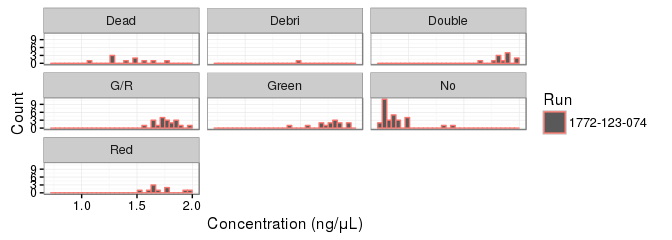<!-- -->

Controls
--------

Some samples with errors were repalced by the positive and negative controls.


```r
libs[libs$Well == ctrls$RunA$posi & libs$Run == RunA, "Group"] <- "Positive control"
libs[libs$Well == ctrls$RunA$nega & libs$Run == RunA, "Group"] <- "Negative control"
```

Combined analysis of fluorescence and cDNA concentration.
---------------------------------------------------------

Richness
--------


```r
libs$l1 <- colSums(l1 > 0)
libs$r100l1 <- rarefy(t(l1),100)
```

Analysis
========

Processing
----------


```r
plotAnnot(libs, 'steps', LIBRARY, libs$Group)
```

```
## Warning: Removed 15 rows containing missing values (geom_segment).
```

```
## Warning: Removed 15 rows containing missing values (geom_point).
```

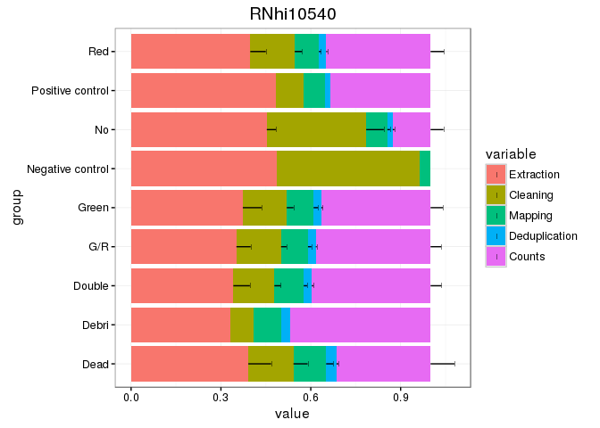<!-- -->


```r
plotAnnot(libs, 'steps', LIBRARY, rownames(libs))
```

```
## Warning: Removed 480 rows containing missing values (geom_segment).
```

```
## Warning: Removed 480 rows containing missing values (geom_point).
```

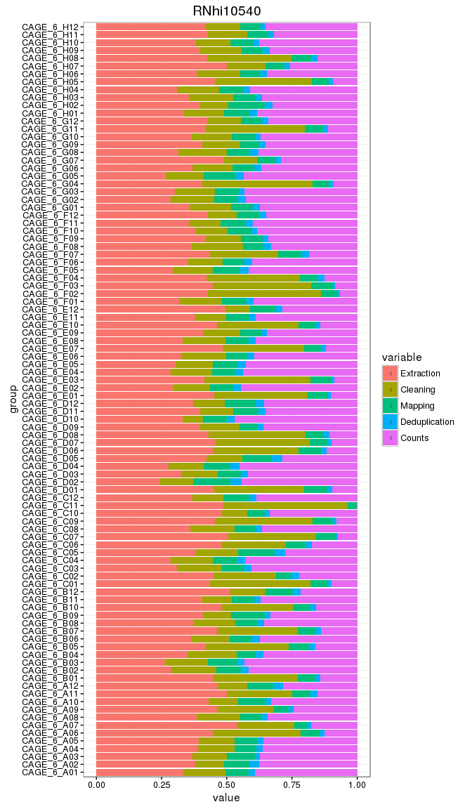<!-- -->

QC barplots
-----------


```r
plotAnnot(libs, 'qc', LIBRARY, libs$Group)
```

```
## Warning: Removed 21 rows containing missing values (geom_segment).
```

```
## Warning: Removed 21 rows containing missing values (geom_point).
```

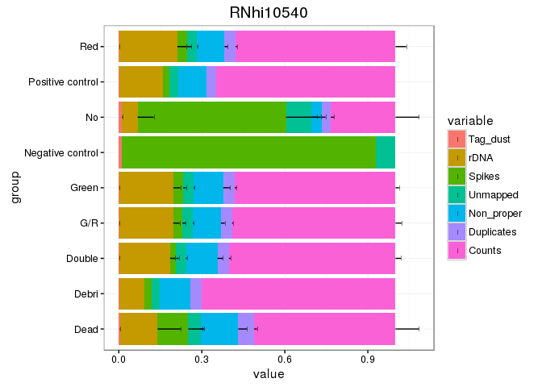<!-- -->


```r
plotAnnot(libs, 'qc', LIBRARY, rownames(libs))
```

```
## Warning: Removed 672 rows containing missing values (geom_segment).
```

```
## Warning: Removed 672 rows containing missing values (geom_point).
```

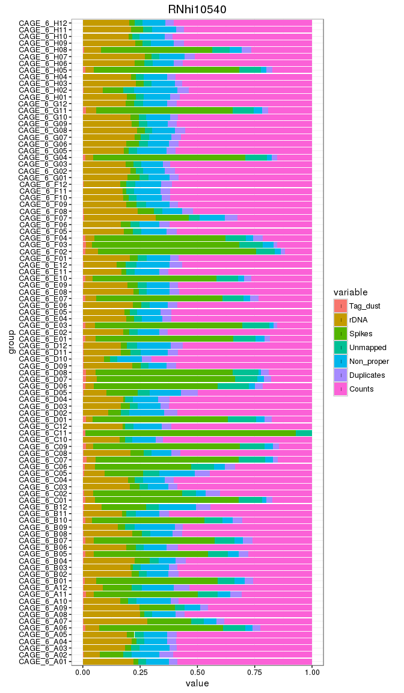<!-- -->

Annotation
----------


```r
plotAnnot(libs, 'counts', LIBRARY, libs$Group)
```

```
## Warning: Removed 12 rows containing missing values (geom_segment).
```

```
## Warning: Removed 12 rows containing missing values (geom_point).
```

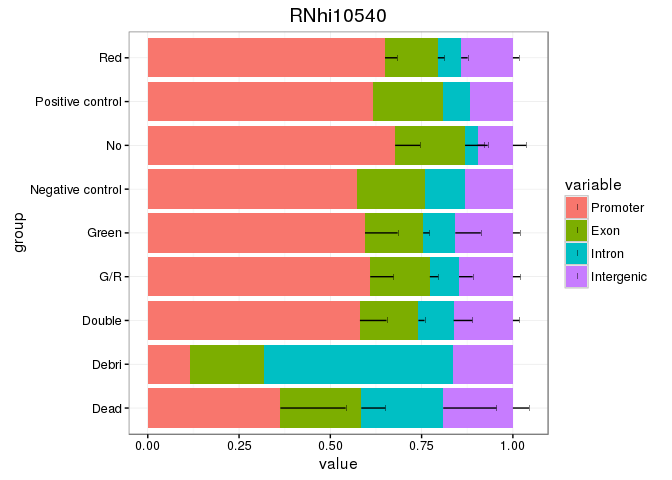<!-- -->


```r
plotAnnot(libs, 'counts', LIBRARY, rownames(libs))
```

```
## Warning: Removed 384 rows containing missing values (geom_segment).
```

```
## Warning: Removed 384 rows containing missing values (geom_point).
```

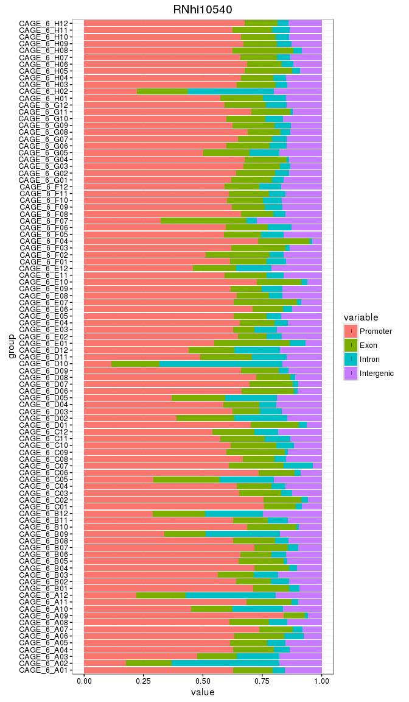<!-- -->

Correlation between runs
------------------------


```r
NMF::aheatmap( cor(genes[-1, ])
             , annCol=list(Group=libs$Group))
```

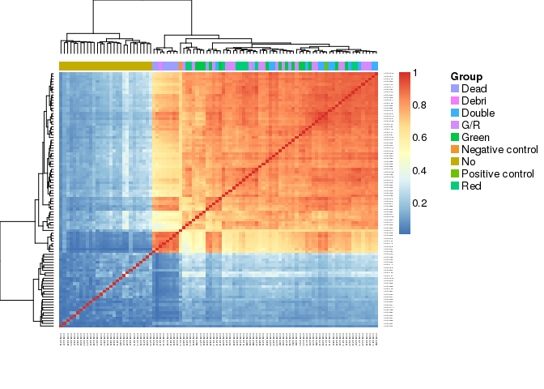<!-- -->

```r
NMF::aheatmap( cor(genes[-1, ] %>% TPM  %>% log1p)
             , annCol=list(Group=libs$Group))
```

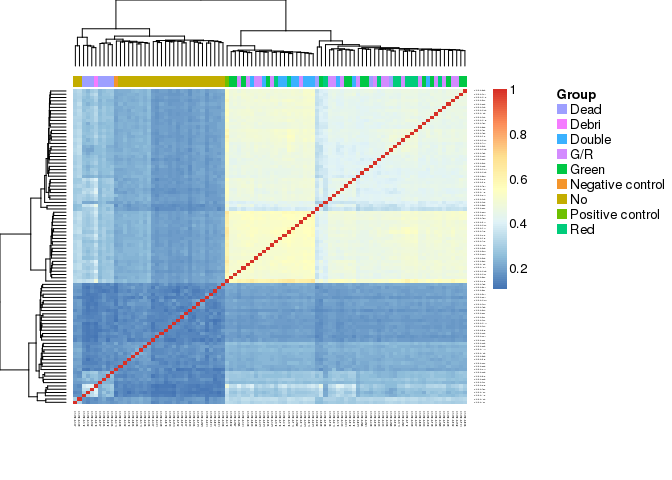<!-- -->


```r
singleCells <- libs$Group %in% c("Red", "Green", "G/R")
NMF::aheatmap( cor(genes[-1, singleCells])
            , annCol=list(Run=libs[singleCells, "Group"]))
```

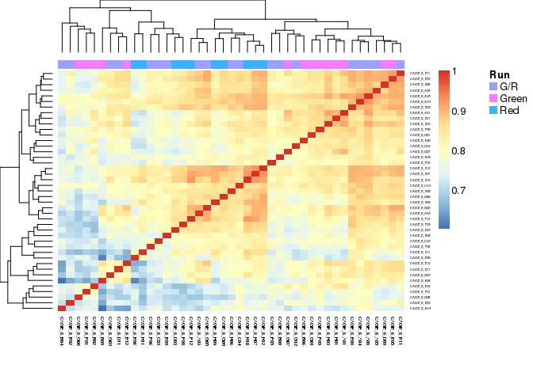<!-- -->

```r
NMF::aheatmap( cor(genes[-1, singleCells] %>% TPM %>% log1p)
            , annCol=list(Run=libs[singleCells, "Group"]))
```

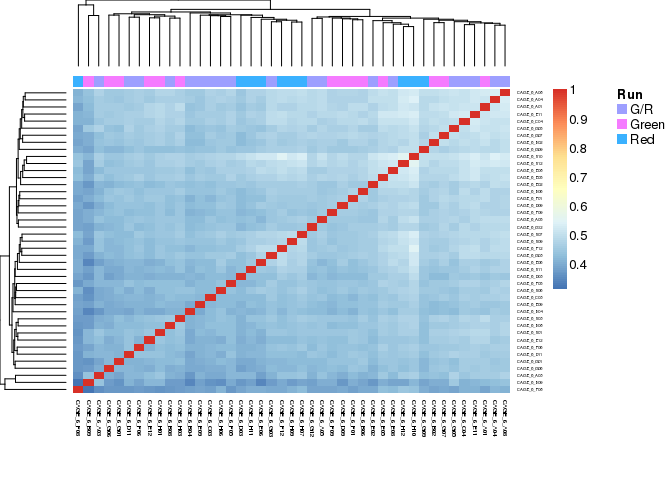<!-- -->

Gene counts and TSS discovery
-----------------------------

### Gene count by error code.


```r
dotsize <- 500
ggplot(libs, aes(x=Group, y=genes)) +
  stat_summary(fun.y=mean, fun.ymin=mean, fun.ymax=mean, geom="crossbar", color="gray") +
  geom_dotplot(aes(fill=Group), binaxis='y', binwidth=1, dotsize=dotsize, stackdir='center') +
  coord_flip()
```

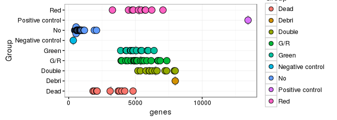<!-- -->

Rarefaction (hanabi plot).
--------------------------

### TSS discovery


```r
hanabiPlot( hanabi(l1, from=0)
          , ylab='number of TSS detected'
          , xlab='number of unique molecule counts'
          , main=paste("TSS discovery for", LIBRARY)
          , GROUP=libs$Group %>% factor)
```

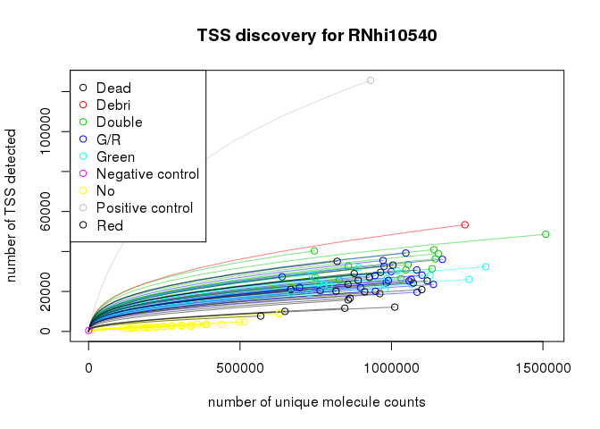<!-- -->

### Gene discovery


```r
hanabiPlot( hanabi(genes, from=0)
          , ylab='number of genes detected'
          , xlab='number of unique molecule counts'
          , main=paste("Gene discovery for", LIBRARY)
          , GROUP=libs$Group %>% factor)
```

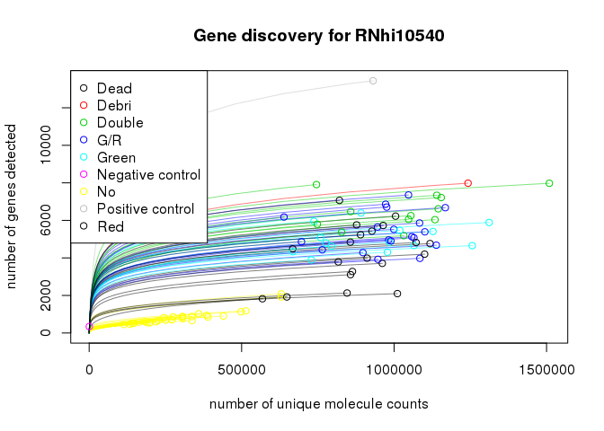<!-- -->


```r
write.table( libs
           , paste0(LIBRARY, ".libs.tsv")
           , sep="\t", quote = FALSE
           , row.names = FALSE)
libs
```

```
##            samplename                       sampleid   total extracted cleaned tagdust   rdna
## CAGE_6_A01 CAGE_6_A01 3rd_CAGE_A01_TAAGGCGA-CTCTCTAT 1880259   1251964  948636    1788 274735
## CAGE_6_A02 CAGE_6_A02 3rd_CAGE_A02_CGTACTAG-CTCTCTAT 2422482   1506810 1239288    4812 105514
## CAGE_6_A03 CAGE_6_A03 3rd_CAGE_A03_AGGCAGAA-CTCTCTAT 1713809   1083613  855273    1838 196906
## CAGE_6_A04 CAGE_6_A04 3rd_CAGE_A04_TCCTGAGC-CTCTCTAT 2684451   1643450 1260822    2883 348511
## CAGE_6_A05 CAGE_6_A05 3rd_CAGE_A05_GGACTCCT-CTCTCTAT 2637850   1601437 1241332    2925 302713
## CAGE_6_A06 CAGE_6_A06 3rd_CAGE_A06_TAGGCATG-CTCTCTAT 2200638   1220066  474467   14517  74162
## CAGE_6_A07 CAGE_6_A07 3rd_CAGE_A07_CTCTCTAC-CTCTCTAT 3592517   1645500  865995    7317 454897
## CAGE_6_A08 CAGE_6_A08 3rd_CAGE_A08_CGAGGCTG-CTCTCTAT 2839068   1744781 1277275    2681 432135
## CAGE_6_A09 CAGE_6_A09 3rd_CAGE_A09_AAGAGGCA-CTCTCTAT 2596401   1390357  832233    5266 339046
## CAGE_6_A10 CAGE_6_A10 3rd_CAGE_A10_GTAGAGGA-CTCTCTAT 2259269   1286888 1032090    2442 209121
## CAGE_6_A11 CAGE_6_A11 3rd_CAGE_A11_GCTCATGA-CTCTCTAT 2347494   1174373  584876   14841  41581
## CAGE_6_A12 CAGE_6_A12 3rd_CAGE_A12_ATCTCAGG-CTCTCTAT 3008459   1604741 1264713    6772 132258
## CAGE_6_B01 CAGE_6_B01 3rd_CAGE_B01_TAAGGCGA-TATCCTCT 2371075   1305076  538704    9897  67594
## CAGE_6_B02 CAGE_6_B02 3rd_CAGE_B02_CGTACTAG-TATCCTCT 2715167   1935864 1463234    2280 410830
## CAGE_6_B03 CAGE_6_B03 3rd_CAGE_B03_AGGCAGAA-TATCCTCT 1728305   1269152  991254    1297 261209
## CAGE_6_B04 CAGE_6_B04 3rd_CAGE_B04_TCCTGAGC-TATCCTCT 3017206   1966141 1394365    3881 442621
## CAGE_6_B05 CAGE_6_B05 3rd_CAGE_B05_GGACTCCT-TATCCTCT 2733423   1585419  719650   16025  59121
## CAGE_6_B06 CAGE_6_B06 3rd_CAGE_B06_TAGGCATG-TATCCTCT 3376848   2151159 1652216    3515 402555
## CAGE_6_B07 CAGE_6_B07 3rd_CAGE_B07_CTCTCTAC-TATCCTCT 2755578   1480590  629234   15490  54807
## CAGE_6_B08 CAGE_6_B08 3rd_CAGE_B08_CGAGGCTG-TATCCTCT 2753888   1734386 1286442    3278 370194
## CAGE_6_B09 CAGE_6_B09 3rd_CAGE_B09_AAGAGGCA-TATCCTCT 2676334   1584313 1292095    2915 238026
## CAGE_6_B10 CAGE_6_B10 3rd_CAGE_B10_GTAGAGGA-TATCCTCT 1933624   1005614  472317   12054  27847
## CAGE_6_B11 CAGE_6_B11 3rd_CAGE_B11_GCTCATGA-TATCCTCT 3094451   1835141 1486733    3942 310445
## CAGE_6_B12 CAGE_6_B12 3rd_CAGE_B12_ATCTCAGG-TATCCTCT 3005171   1462642 1057794   10126 111254
## CAGE_6_C01 CAGE_6_C01 3rd_CAGE_C01_TAAGGCGA-GTAAGGAG 1946922   1098144  351228   10850  47344
## CAGE_6_C02 CAGE_6_C02 3rd_CAGE_C02_CGTACTAG-GTAAGGAG 2323910   1280086  724353    8500  47667
## CAGE_6_C03 CAGE_6_C03 3rd_CAGE_C03_AGGCAGAA-GTAAGGAG 1883096   1298680  978468    1887 263515
## CAGE_6_C04 CAGE_6_C04 3rd_CAGE_C04_TCCTGAGC-GTAAGGAG 2560892   1828339 1414300    2437 357676
## CAGE_6_C05 CAGE_6_C05 3rd_CAGE_C05_GGACTCCT-GTAAGGAG 3052686   1895612 1395336    9088 170838
## CAGE_6_C06 CAGE_6_C06 3rd_CAGE_C06_TAGGCATG-GTAAGGAG 2863244   1485974  782797   13647  65519
## CAGE_6_C07 CAGE_6_C07 3rd_CAGE_C07_CTCTCTAC-GTAAGGAG 1995096    985110  315629   16012  39339
## CAGE_6_C08 CAGE_6_C08 3rd_CAGE_C08_CGAGGCTG-GTAAGGAG 2623852   1676217 1233013    3293 344955
## CAGE_6_C09 CAGE_6_C09 3rd_CAGE_C09_AAGAGGCA-GTAAGGAG 2065724   1128005  354252   16067  36260
## CAGE_6_C10 CAGE_6_C10 3rd_CAGE_C10_GTAGAGGA-GTAAGGAG 2770032   1433463 1171143    1796 228586
## CAGE_6_C11 CAGE_6_C11 3rd_CAGE_C11_GCTCATGA-GTAAGGAG 3500976   1800090  128208   18161    601
## CAGE_6_C12 CAGE_6_C12 3rd_CAGE_C12_ATCTCAGG-GTAAGGAG 2950353   1861080 1517591    3356 318839
## CAGE_6_D01 CAGE_6_D01 3rd_CAGE_D01_TAAGGCGA-ACTGCATA 2055742   1127800  415478   14761  34498
## CAGE_6_D02 CAGE_6_D02 3rd_CAGE_D02_CGTACTAG-ACTGCATA 2477500   1872204 1559971    3333 202235
## CAGE_6_D03 CAGE_6_D03 3rd_CAGE_D03_AGGCAGAA-ACTGCATA 1588423   1070248  850617    1338 176600
## CAGE_6_D04 CAGE_6_D04 3rd_CAGE_D04_TCCTGAGC-ACTGCATA 3354264   2428085 1978263    2194 425625
## CAGE_6_D05 CAGE_6_D05 3rd_CAGE_D05_GGACTCCT-ACTGCATA 3512107   2025967 1542314    9075 196873
## CAGE_6_D06 CAGE_6_D06 3rd_CAGE_D06_TAGGCATG-ACTGCATA 2591547   1427224  586030   17395  49645
## CAGE_6_D07 CAGE_6_D07 3rd_CAGE_D07_CTCTCTAC-ACTGCATA 2574170   1398124  471314   19043  66817
## CAGE_6_D08 CAGE_6_D08 3rd_CAGE_D08_CGAGGCTG-ACTGCATA 2283042   1301465  449544   17639  56154
## CAGE_6_D09 CAGE_6_D09 3rd_CAGE_D09_AAGAGGCA-ACTGCATA 2969939   1796166 1341668    3460 383382
## CAGE_6_D10 CAGE_6_D10 3rd_CAGE_D10_GTAGAGGA-ACTGCATA 2650841   1775245 1564150    3695 161644
## CAGE_6_D11 CAGE_6_D11 3rd_CAGE_D11_GCTCATGA-ACTGCATA 3007927   1809378 1433296    4665 296990
## CAGE_6_D12 CAGE_6_D12 3rd_CAGE_D12_ATCTCAGG-ACTGCATA 3183448   2006462 1619313    5381 325430
## CAGE_6_E01 CAGE_6_E01 3rd_CAGE_E01_TAAGGCGA-AAGGAGTA 1794397    984907  339305   10404  43520
## CAGE_6_E02 CAGE_6_E02 3rd_CAGE_E02_CGTACTAG-AAGGAGTA 2245015   1587903 1268162    1662 279221
## CAGE_6_E03 CAGE_6_E03 3rd_CAGE_E03_AGGCAGAA-AAGGAGTA 1512171    886518  269127   10095  37819
## CAGE_6_E04 CAGE_6_E04 3rd_CAGE_E04_TCCTGAGC-AAGGAGTA 2350343   1680634 1305501    1616 318878
## CAGE_6_E05 CAGE_6_E05 3rd_CAGE_E05_GGACTCCT-AAGGAGTA 3067219   2135962 1695254    2461 385476
## CAGE_6_E06 CAGE_6_E06 3rd_CAGE_E06_TAGGCATG-AAGGAGTA 2832260   1905022 1420950    3064 414920
## CAGE_6_E07 CAGE_6_E07 3rd_CAGE_E07_CTCTCTAC-AAGGAGTA 2253290   1161867  455595   13782  54561
## CAGE_6_E08 CAGE_6_E08 3rd_CAGE_E08_CGAGGCTG-AAGGAGTA 2785839   1865992 1410464    2408 407977
## CAGE_6_E09 CAGE_6_E09 3rd_CAGE_E09_AAGAGGCA-AAGGAGTA 2593876   1532083 1164059    2991 293894
## CAGE_6_E10 CAGE_6_E10 3rd_CAGE_E10_GTAGAGGA-AAGGAGTA 2149547   1155187  481396   12762  37065
## CAGE_6_E11 CAGE_6_E11 3rd_CAGE_E11_GCTCATGA-AAGGAGTA 3007250   1865958 1514404    2895 313427
## CAGE_6_E12 CAGE_6_E12 3rd_CAGE_E12_ATCTCAGG-AAGGAGTA 3444740   1741761 1414416    5674 251415
## CAGE_6_F01 CAGE_6_F01 3rd_CAGE_F01_TAAGGCGA-CTAAGCCT 1948086   1331836 1012636    1691 272809
## CAGE_6_F02 CAGE_6_F02 3rd_CAGE_F02_CGTACTAG-CTAAGCCT 2104929   1204393  293950   13234  65681
## CAGE_6_F03 CAGE_6_F03 3rd_CAGE_F03_AGGCAGAA-CTAAGCCT 1359550    754136  239321    9471  20681
## CAGE_6_F04 CAGE_6_F04 3rd_CAGE_F04_TCCTGAGC-CTAAGCCT 2695403   1560863  590973   16694  63078
## CAGE_6_F05 CAGE_6_F05 3rd_CAGE_F05_GGACTCCT-CTAAGCCT 2555999   1804459 1411574    2700 322335
## CAGE_6_F06 CAGE_6_F06 3rd_CAGE_F06_TAGGCATG-CTAAGCCT 2824527   1834571 1453692    3258 303264
## CAGE_6_F07 CAGE_6_F07 3rd_CAGE_F07_CTCTCTAC-CTAAGCCT 3076809   1740071  935656    9181 544877
## CAGE_6_F08 CAGE_6_F08 3rd_CAGE_F08_CGAGGCTG-CTAAGCCT 2621872   1662402 1146119    3540 396262
## CAGE_6_F09 CAGE_6_F09 3rd_CAGE_F09_AAGAGGCA-CTAAGCCT 2339736   1361002 1040897    2496 256564
## CAGE_6_F10 CAGE_6_F10 3rd_CAGE_F10_GTAGAGGA-CTAAGCCT 2234666   1382875 1108005    2107 240452
## CAGE_6_F11 CAGE_6_F11 3rd_CAGE_F11_GCTCATGA-CTAAGCCT 2883545   1863885 1511312    2779 320929
## CAGE_6_F12 CAGE_6_F12 3rd_CAGE_F12_ATCTCAGG-CTAAGCCT 2871186   1641435 1329772    3311 263368
## CAGE_6_G01 CAGE_6_G01 3rd_CAGE_G01_TAAGGCGA-CGTCTAAT 1948879   1253398  943589    1792 243140
## CAGE_6_G02 CAGE_6_G02 3rd_CAGE_G02_CGTACTAG-CGTCTAAT 2454236   1752524 1346425    1678 362007
## CAGE_6_G03 CAGE_6_G03 3rd_CAGE_G03_AGGCAGAA-CGTCTAAT 1613753   1126295  878268    1203 210375
## CAGE_6_G04 CAGE_6_G04 3rd_CAGE_G04_TCCTGAGC-CGTCTAAT 2523499   1497591  434936   15075  52002
## CAGE_6_G05 CAGE_6_G05 3rd_CAGE_G05_GGACTCCT-CGTCTAAT 2400823   1761217 1411179    1983 313087
## CAGE_6_G06 CAGE_6_G06 3rd_CAGE_G06_TAGGCATG-CGTCTAAT 2657433   1680581 1268604    2794 317774
## CAGE_6_G07 CAGE_6_G07 3rd_CAGE_G07_CTCTCTAC-CGTCTAAT 3481723   1784908 1332862    2451 400036
## CAGE_6_G08 CAGE_6_G08 3rd_CAGE_G08_CGAGGCTG-CGTCTAAT 2827676   1936416 1412255    2372 457995
## CAGE_6_G09 CAGE_6_G09 3rd_CAGE_G09_AAGAGGCA-CGTCTAAT 2647396   1570715 1186130    2301 333983
## CAGE_6_G10 CAGE_6_G10 3rd_CAGE_G10_GTAGAGGA-CGTCTAAT 2229077   1414272 1069379    2259 289852
## CAGE_6_G11 CAGE_6_G11 3rd_CAGE_G11_GCTCATGA-CGTCTAAT 1978836   1151071  399764   15799  49909
## CAGE_6_G12 CAGE_6_G12 3rd_CAGE_G12_ATCTCAGG-CGTCTAAT 2908899   1673079 1298433    2654 307737
## CAGE_6_H01 CAGE_6_H01 3rd_CAGE_H01_TAAGGCGA-TCTCTCCG 1981553   1314060 1010555    1378 252640
## CAGE_6_H02 CAGE_6_H02 3rd_CAGE_H02_CGTACTAG-TCTCTCCG 2521085   1515976 1247686    3532 128809
## CAGE_6_H03 CAGE_6_H03 3rd_CAGE_H03_AGGCAGAA-TCTCTCCG 1829832   1181891  868964    1313 273282
## CAGE_6_H04 CAGE_6_H04 3rd_CAGE_H04_TCCTGAGC-TCTCTCCG 2562930   1769093 1359513    1845 370925
## CAGE_6_H05 CAGE_6_H05 3rd_CAGE_H05_GGACTCCT-TCTCTCCG 2102774   1149224  365075   11992  44418
## CAGE_6_H06 CAGE_6_H06 3rd_CAGE_H06_TAGGCATG-TCTCTCCG 2735894   1680251 1228244    2373 378110
## CAGE_6_H07 CAGE_6_H07 3rd_CAGE_H07_CTCTCTAC-TCTCTCCG 3415839   1710888 1197041    2339 459440
## CAGE_6_H08 CAGE_6_H08 3rd_CAGE_H08_CGAGGCTG-TCTCTCCG 2546524   1463358  639173    9696 105239
## CAGE_6_H09 CAGE_6_H09 3rd_CAGE_H09_AAGAGGCA-TCTCTCCG 2646029   1590707 1175718    2392 362466
## CAGE_6_H10 CAGE_6_H10 3rd_CAGE_H10_GTAGAGGA-TCTCTCCG 2181364   1349348 1058936    1425 269302
## CAGE_6_H11 CAGE_6_H11 3rd_CAGE_H11_GCTCATGA-TCTCTCCG 2680159   1535476 1131388    2753 322060
## CAGE_6_H12 CAGE_6_H12 3rd_CAGE_H12_ATCTCAGG-TCTCTCCG 2752510   1595916 1235985    2042 321166
##             spikes  mapped properpairs  counts          Run Well row column   library   exon intron
## CAGE_6_A01   26758  905356      782299  737100 1772-123-074  A01  01      A RNhi10540 122570  37963
## CAGE_6_A02  157010 1184878     1004281  911502 1772-123-074  A02  02      A RNhi10540 176386 411448
## CAGE_6_A03   29522  815720      673322  638926 1772-123-074  A03  03      A RNhi10540 107463 114978
## CAGE_6_A04   31178 1204794     1038449  975772 1772-123-074  A04  04      A RNhi10540 167691  64568
## CAGE_6_A05   54416 1178011     1011476  945669 1772-123-074  A05  05      A RNhi10540 146301  72777
## CAGE_6_A06  656903  356025      318059  275507 1772-123-074  A06  06      A RNhi10540  57933  22634
## CAGE_6_A07  317256  777444      687267  629636 1772-123-074  A07  07      A RNhi10540  88918  25422
## CAGE_6_A08   32535 1215784     1037915  972395 1772-123-074  A08  08      A RNhi10540 162059  76752
## CAGE_6_A09  213786  773290      680206  630147 1772-123-074  A09  09      A RNhi10540  56332   9393
## CAGE_6_A10   43135  986064      792015  748149 1772-123-074  A10  10      A RNhi10540 131677 158055
## CAGE_6_A11  533056  485145      417704  359046 1772-123-074  A11  11      A RNhi10540  68185  10064
## CAGE_6_A12  200943 1191023      968583  857154 1772-123-074  A12  12      A RNhi10540 177781 325851
## CAGE_6_B01  688864  441996      383170  336829 1772-123-074  B01  01      B RNhi10540  50284  15045
## CAGE_6_B02   59352 1397447     1213588 1127451 1772-123-074  B02  02      B RNhi10540 165203  84838
## CAGE_6_B03   15307  949523      792915  745580 1772-123-074  B03  03      B RNhi10540 112983  76495
## CAGE_6_B04  125199 1313590     1171364 1084669 1772-123-074  B04  04      B RNhi10540 159520  37448
## CAGE_6_B05  790438  581324      508200  440324 1772-123-074  B05  05      B RNhi10540  83311   6022
## CAGE_6_B06   92817 1577402     1365533 1256342 1772-123-074  B06  06      B RNhi10540 165769  77473
## CAGE_6_B07  781021  501723      445298  385522 1772-123-074  B07  07      B RNhi10540  54567  16952
## CAGE_6_B08   74415 1222750     1056571  982432 1772-123-074  B08  08      B RNhi10540 174741  54966
## CAGE_6_B09   51186 1227871      945626  891754 1772-123-074  B09  09      B RNhi10540 154051 278407
## CAGE_6_B10  493371  393158      347137  307279 1772-123-074  B10  10      B RNhi10540  64129   2519
## CAGE_6_B11   33959 1412559     1223778 1144878 1772-123-074  B11  11      B RNhi10540 164931  96263
## CAGE_6_B12  283419  979947      738729  648386 1772-123-074  B12  12      B RNhi10540 141891 158664
## CAGE_6_C01  688690  238098      219187  189066 1772-123-074  C01  01      C RNhi10540  25376   4556
## CAGE_6_C02  499539  646790      594572  513869 1772-123-074  C02  02      C RNhi10540  81846  14721
## CAGE_6_C03   54783  929735      813468  764520 1772-123-074  C03  03      C RNhi10540 135457  35853
## CAGE_6_C04   53865 1346456     1177016 1100855 1772-123-074  C04  04      C RNhi10540 160888  64229
## CAGE_6_C05  320285 1261542      968707  845873 1772-123-074  C05  05      C RNhi10540 236648 192499
## CAGE_6_C06  623983  637162      563861  497935 1772-123-074  C06  06      C RNhi10540  75576  12364
## CAGE_6_C07  614108  202515      167620  146742 1772-123-074  C07  07      C RNhi10540  33735  18130
## CAGE_6_C08   94907 1175617     1030720  961363 1772-123-074  C08  08      C RNhi10540 127987  47319
## CAGE_6_C09  721397  234615      191898  162919 1772-123-074  C09  09      C RNhi10540  40089   2071
## CAGE_6_C10   31872 1123814      977679  931081 1772-123-074  C10  10      C RNhi10540 179089  69034
## CAGE_6_C11 1653076    2357         530     529 1772-123-074  C11  11      C RNhi10540     99     57
## CAGE_6_C12   21245 1450248     1221896 1140169 1772-123-074  C12  12      C RNhi10540 203054 113830
## CAGE_6_D01  663024  274422      233418  199275 1772-123-074  D01  01      D RNhi10540  40507   6238
## CAGE_6_D02  106554 1492443     1206397 1100203 1772-123-074  D02  02      D RNhi10540 267424 245504
## CAGE_6_D03   41636  815522      707746  667524 1772-123-074  D03  03      D RNhi10540  76328  61792
## CAGE_6_D04   21911 1896631     1632725 1509202 1772-123-074  D04  04      D RNhi10540 229661 108425
## CAGE_6_D05  277629 1432989     1156701 1010867 1772-123-074  D05  05      D RNhi10540 227295 220537
## CAGE_6_D06  774119  392745      355599  306290 1772-123-074  D06  06      D RNhi10540  67939   4361
## CAGE_6_D07  840919  335023      292243  250608 1772-123-074  D07  07      D RNhi10540  45383   5769
## CAGE_6_D08  778099  305473      290734  245348 1772-123-074  D08  08      D RNhi10540  34877   5028
## CAGE_6_D09   67579 1280445     1139396 1065416 1772-123-074  D09  09      D RNhi10540 168552  43785
## CAGE_6_D10   45611 1510867     1318008 1242596 1772-123-074  D10  10      D RNhi10540 252707 642731
## CAGE_6_D11   74382 1351393     1138925 1058217 1772-123-074  D11  11      D RNhi10540 230552 154496
## CAGE_6_D12   56260 1532961     1238506 1134132 1772-123-074  D12  12      D RNhi10540 219037 216122
## CAGE_6_E01  591659  242927      204284  181236 1772-123-074  E01  01      E RNhi10540  57475  11996
## CAGE_6_E02   38652 1209546     1060035  999214 1772-123-074  E02  02      E RNhi10540 119452  63414
## CAGE_6_E03  569456  164768      148337  134157 1772-123-074  E03  03      E RNhi10540  12095  12485
## CAGE_6_E04   54573 1246568     1099212 1031792 1772-123-074  E04  04      E RNhi10540 152580  58271
## CAGE_6_E05   52647 1629058     1411567 1311622 1772-123-074  E05  05      E RNhi10540 181031  83109
## CAGE_6_E06   66035 1348985     1197068 1117967 1772-123-074  E06  06      E RNhi10540 144042  44586
## CAGE_6_E07  637911  347543      313829  271682 1772-123-074  E07  07      E RNhi10540  71939   5089
## CAGE_6_E08   45095 1347774     1158334 1083491 1772-123-074  E08  08      E RNhi10540 149647  60804
## CAGE_6_E09   71078 1104082      952514  897819 1772-123-074  E09  09      E RNhi10540 117028  79705
## CAGE_6_E10  623940  371770      341573  305507 1772-123-074  E10  10      E RNhi10540  57220   8103
## CAGE_6_E11   35170 1442363     1245459 1168043 1772-123-074  E11  11      E RNhi10540 206334  83766
## CAGE_6_E12   70204 1333239     1085034  984982 1772-123-074  E12  12      E RNhi10540 178825 145319
## CAGE_6_F01   44650  959366      824628  776566 1772-123-074  F01  01      F RNhi10540 118590  64563
## CAGE_6_F02  831507  195837      163577  140810 1772-123-074  F02  02      F RNhi10540  37979   8236
## CAGE_6_F03  484644  162102      126012  113983 1772-123-074  F03  03      F RNhi10540  26009   2065
## CAGE_6_F04  890087  452137      401001  337227 1772-123-074  F04  04      F RNhi10540  73013   3798
## CAGE_6_F05   67776 1346311     1144650 1065034 1772-123-074  F05  05      F RNhi10540 167405 100038
## CAGE_6_F06   74275 1381073     1224723 1138525 1772-123-074  F06  06      F RNhi10540 202848 113629
## CAGE_6_F07  250259  851931      660486  568206 1772-123-074  F07  07      F RNhi10540 205185  25541
## CAGE_6_F08  116411 1085115      943239  863413 1772-123-074  F08  08      F RNhi10540 115225  45252
## CAGE_6_F09   60980  986522      845111  794788 1772-123-074  F09  09      F RNhi10540 110651  57684
## CAGE_6_F10   32254 1058233      906956  857842 1772-123-074  F10  10      F RNhi10540 130020  68572
## CAGE_6_F11   28815 1445105     1231137 1154548 1772-123-074  F11  11      F RNhi10540 193501  82445
## CAGE_6_F12   44949 1267015     1080387 1004888 1772-123-074  F12  12      F RNhi10540 145762  91837
## CAGE_6_G01   64840  895390      778688  728555 1772-123-074  G01  01      G RNhi10540 125082  34785
## CAGE_6_G02   42369 1291156     1125114 1047655 1772-123-074  G02  02      G RNhi10540 171187  61696
## CAGE_6_G03   36420  839294      733888  696306 1772-123-074  G03  03      G RNhi10540 108074  29612
## CAGE_6_G04  995528  293835      263960  226466 1772-123-074  G04  04      G RNhi10540  39909   2248
## CAGE_6_G05   34889 1343326     1119375 1047278 1772-123-074  G05  05      G RNhi10540 202004 133673
## CAGE_6_G06   91381 1202938     1049110  978192 1772-123-074  G06  06      G RNhi10540 179324  70178
## CAGE_6_G07   49468 1270979     1093884 1018684 1772-123-074  G07  07      G RNhi10540 148050  61313
## CAGE_6_G08   63703 1348676     1158066 1072132 1772-123-074  G08  08      G RNhi10540 149253  44409
## CAGE_6_G09   48262 1127095      989193  927363 1772-123-074  G09  09      G RNhi10540 164190  63209
## CAGE_6_G10   52735 1023288      876221  827859 1772-123-074  G10  10      G RNhi10540 135475  61695
## CAGE_6_G11  685571  292369      251271  219790 1772-123-074  G11  11      G RNhi10540  36270   1965
## CAGE_6_G12   63867 1233537     1059823  989596 1772-123-074  G12  12      G RNhi10540 174103  86105
## CAGE_6_H01   49440  966052      812123  759148 1772-123-074  H01  01      H RNhi10540 135513  73266
## CAGE_6_H02  135816 1176491      892639  816999 1772-123-074  H02  02      H RNhi10540 175243 295960
## CAGE_6_H03   38297  826735      707817  668645 1772-123-074  H03  03      H RNhi10540 109894  31634
## CAGE_6_H04   36739 1298164     1118824 1055027 1772-123-074  H04  04      H RNhi10540 141023  57126
## CAGE_6_H05  727721  255787      228499  197832 1772-123-074  H05  05      H RNhi10540  39601   6147
## CAGE_6_H06   71469 1166567     1012629  946960 1772-123-074  H06  06      H RNhi10540 137751  46459
## CAGE_6_H07   52013 1137782      952966  877106 1772-123-074  H07  07      H RNhi10540 135316  48332
## CAGE_6_H08  709213  524629      450650  389620 1772-123-074  H08  08      H RNhi10540  99887  13845
## CAGE_6_H09   50085 1119611      958706  890038 1772-123-074  H09  09      H RNhi10540 126046  53965
## CAGE_6_H10   19638 1014673      865466  820811 1772-123-074  H10  10      H RNhi10540 120079  47125
## CAGE_6_H11   79235 1070619      910525  856507 1772-123-074  H11  11      H RNhi10540 141399  64516
## CAGE_6_H12   36678 1181988     1021956  964202 1772-123-074  H12  12      H RNhi10540 134156  44984
##            other promoter unknown genes geneSymbols            Group Concentration     l1   r100l1
## CAGE_6_A01  2009   462856  111698  5956        6240            Green         1.694  28267 96.71243
## CAGE_6_A02  1325   160296  162047  3988        4204             Dead         1.295  19865 95.40601
## CAGE_6_A03  1007   303351  112127  6180        6449              G/R         1.657  27351 96.48827
## CAGE_6_A04  2079   610951  130481  6709        7017              G/R         1.860  32595 96.66420
## CAGE_6_A05  2584   581983  142024  5648        5920              G/R         1.717  27943 96.40987
## CAGE_6_A06  1507   173841   19592   859         910               No         0.862   2907 61.29605
## CAGE_6_A07   235   463734   51327  1919        2020               No         1.339   8762 90.04821
## CAGE_6_A08  2648   593885  136926  6860        7146              G/R         1.782  35490 96.56872
## CAGE_6_A09   210   528750   35462  2084        2203               No         1.414   9138 91.32877
## CAGE_6_A10  1576   336485  120354  5793        6072           Double         1.898  26976 96.21157
## CAGE_6_A11  1862   245437   33498  1023        1077               No         0.905   3597 70.92251
## CAGE_6_A12   529   187455  165538  3107        3289             Dead         1.467  15774 93.32410
## CAGE_6_B01    12   240020   31468   880         934               No         0.991   3237 72.52902
## CAGE_6_B02  1944   721692  153770  5409        5669            Green         1.583  27994 96.71171
## CAGE_6_B03  1487   420001  134561  7907        8171           Double         1.763  40306 96.41767
## CAGE_6_B04  2686   776097  108918  3978        4183              G/R         1.657  19635 95.50304
## CAGE_6_B05    57   286750   64184   901         967               No         0.835   3481 71.00377
## CAGE_6_B06  3673   825125  184300  4653        4866            Green         1.810  26024 96.00188
## CAGE_6_B07    11   276239   37753   941        1000               No         0.911   3408 68.94146
## CAGE_6_B08  4119   615744  132862  4958        5198              G/R         1.558  24274 95.99536
## CAGE_6_B09   995   301898  156403  6394        6668            Green         1.417  32024 97.13201
## CAGE_6_B10    56   210726   29849   760         803               No         0.886   2846 68.15233
## CAGE_6_B11  2975   719322  161387  6617        6909           Double         1.655  36302 96.94825
## CAGE_6_B12   620   188013  159198  1919        2050             Dead         1.382  10036 88.58676
## CAGE_6_C01    25   143214   15895   552         587               No         0.854   1897 55.05384
## CAGE_6_C02    20   387633   29649  1177        1254               No         0.994   4719 80.22780
## CAGE_6_C03  1773   498790   92647  4433        4657              G/R         1.713  20399 95.55653
## CAGE_6_C04  1875   706449  167413  5389        5648              G/R         1.663  28161 96.63745
## CAGE_6_C05  1552   245729  169432  2129        2267             Dead         1.266  11622 89.40395
## CAGE_6_C06  1644   365837   42514  1131        1203               No         1.005   4824 76.54200
## CAGE_6_C07     5    89306    5566   517         551               No         0.776   1662 50.48836
## CAGE_6_C08  1344   642276  142437  3710        3932             Dead         1.629  18929 95.18114
## CAGE_6_C09    37    97397   23325   578         621               No         0.787   1790 44.99829
## CAGE_6_C10  1797   574629  106531 13438       13591 Positive control         0.880 125597 95.91853
## CAGE_6_C11     2      303      68   345         378 Negative control         0.802    480 97.31249
## CAGE_6_C12  3058   614820  205370  7337        7630           Double         1.856  40932 96.32012
## CAGE_6_D01     6   139733   12791   552         584               No         0.778   2010 50.41723
## CAGE_6_D02  2281   429047  155885  4200        4432             Dead         1.555  20926 95.55422
## CAGE_6_D03  1241   416919  111241  4483        4680              Red         1.754  21014 96.13554
## CAGE_6_D04  2681   884100  284325  7977        8291           Double         1.802  48621 96.71498
## CAGE_6_D05  5045   371743  186247  2097        2250             Dead         1.291  12186 90.09174
## CAGE_6_D06  4462   202719   26809   883         919               No         0.792   2901 60.79950
## CAGE_6_D07    18   174556   24882   681         743               No         0.773   2316 57.00151
## CAGE_6_D08     4   177777   27662   821         864               No         0.773   2582 53.07379
## CAGE_6_D09  1976   703278  147825  4659        4905            Green         1.703  23495 95.86667
## CAGE_6_D10  1203   142596  203354  7982        8260            Debri         1.502  53363 98.04197
## CAGE_6_D11  2182   516960  154027  5131        5398              G/R         1.731  25264 96.51564
## CAGE_6_D12  2164   499093  197713  6038        6309           Double         1.829  31300 95.87679
## CAGE_6_E01     2    99446   12317   615         663               No         0.853   2115 60.89941
## CAGE_6_E02  1750   647516  167082  5523        5773              G/R         1.854  29975 97.54766
## CAGE_6_E03     2    84195   25380   460         489               No         0.780   1649 54.70191
## CAGE_6_E04  1191   675102  144648  5185        5427           Double         1.880  26459 96.44422
## CAGE_6_E05  1618   825245  220613  5888        6152            Green         1.952  32315 96.42844
## CAGE_6_E06  1615   791434  136290  4764        4977              Red         1.951  25324 95.77710
## CAGE_6_E07   762   171313   22579   697         731               No         0.824   2672 60.52301
## CAGE_6_E08  3062   694820  175158  5860        6138              G/R         1.775  30740 96.12352
## CAGE_6_E09   937   553510  146634  4284        4483              G/R         1.852  21931 96.52250
## CAGE_6_E10   165   221786   18233   842         898               No         0.854   2995 69.08057
## CAGE_6_E11  1573   689513  186851  6677        6954              G/R         1.967  36059 96.78989
## CAGE_6_E12  3325   451779  205734  4836        5053            Green         1.851  26376 95.93118
## CAGE_6_F01  2167   477130  114113  4797        5039            Green         1.841  23068 96.55022
## CAGE_6_F02   943    72022   21630   520         542               No         0.788   1735 45.59806
## CAGE_6_F03     7    70596   15306   451         468               No         0.795   1565 51.21749
## CAGE_6_F04   123   247302   12991   665         715               No         0.833   2469 59.93883
## CAGE_6_F05   849   625872  170870  5072        5315              G/R         1.898  26081 96.42700
## CAGE_6_F06  1921   678142  141944  4678        4919              G/R         1.803  23526 95.92941
## CAGE_6_F07   629   182577  154268  1824        1968             Dead         1.090   7708 84.14851
## CAGE_6_F08  2114   571101  129721  3278        3479              Red         1.627  16615 93.08723
## CAGE_6_F09   852   494168  131428  4623        4841            Green         1.748  23141 95.88458
## CAGE_6_F10  1944   516203  141103  6470        6768           Double         1.968  32765 96.39148
## CAGE_6_F11  3112   703682  171808  7216        7516           Double         1.878  38987 96.50565
## CAGE_6_F12  3291   594793  169205  6226        6486              Red         1.968  33196 95.92679
## CAGE_6_G01   711   451394  116583  3896        4122            Green         1.793  19066 95.42451
## CAGE_6_G02  1798   670763  142210  6051        6331           Double         1.973  30805 96.05958
## CAGE_6_G03  1347   466153   91120  4862        5082              G/R         1.781  21972 95.91614
## CAGE_6_G04  4873   152970   26466   668         708               No         0.801   2257 57.16608
## CAGE_6_G05  1440   526226  183925  7352        7638              G/R         1.796  39211 97.22798
## CAGE_6_G06  2191   585216  141283  4302        4536            Green         1.764  21398 95.86793
## CAGE_6_G07  1815   658974  148532  5467        5721            Green         1.931  30387 96.04260
## CAGE_6_G08  2251   737576  138628  4820        5099             Dead         1.777  24222 95.35192
## CAGE_6_G09  1754   579714  118490  5426        5690              Red         1.661  27047 96.00480
## CAGE_6_G10  1115   495616  133955  5376        5627           Double         1.887  25639 95.57118
## CAGE_6_G11    35   154535   26985   600         646               No         0.737   2086 57.20840
## CAGE_6_G12  1828   584218  143342  4907        5180              G/R         1.725  25519 96.30803
## CAGE_6_H01   931   435853  113585  5090        5349            Green         1.785  24080 96.17076
## CAGE_6_H02   204   182054  163536  3789        3961             Dead         1.473  20159 95.98258
## CAGE_6_H03  1714   430112   95291  4335        4563            Green         1.796  19182 95.38471
## CAGE_6_H04  1579   697946  157352  6252        6497           Double         1.820  33502 96.41841
## CAGE_6_H05   200   133840   18044   547         572               No         0.745   1997 56.48139
## CAGE_6_H06  2349   649085  111316  3925        4138              G/R         1.687  20097 95.46352
## CAGE_6_H07  2674   576515  114269  5759        6056              Red         1.663  28996 95.10987
## CAGE_6_H08   125   243628   32135   852         901               No         0.979   3517 73.47109
## CAGE_6_H09  1792   596571  111663  5234        5462              Red         1.513  25582 95.45325
## CAGE_6_H10  1781   541118  110708  7063        7350              Red         1.765  35066 95.78173
## CAGE_6_H11  1639   535793  113160  4841        5072              Red         1.656  23547 95.13276
## CAGE_6_H12  1743   650848  132467  5729        6010              Red         1.707  29588 95.84042
```


```r
sessionInfo()
```

```
## R version 3.3.1 (2016-06-21)
## Platform: x86_64-pc-linux-gnu (64-bit)
## Running under: Debian GNU/Linux 8 (jessie)
## 
## locale:
##  [1] LC_CTYPE=C.UTF-8       LC_NUMERIC=C           LC_TIME=C.UTF-8        LC_COLLATE=C.UTF-8    
##  [5] LC_MONETARY=C.UTF-8    LC_MESSAGES=C.UTF-8    LC_PAPER=C.UTF-8       LC_NAME=C             
##  [9] LC_ADDRESS=C           LC_TELEPHONE=C         LC_MEASUREMENT=C.UTF-8 LC_IDENTIFICATION=C   
## 
## attached base packages:
## [1] parallel  stats     graphics  grDevices utils     datasets  methods   base     
## 
## other attached packages:
##  [1] RColorBrewer_1.1-2     Biobase_2.32.0         BiocGenerics_0.18.0    plyr_1.8.4            
##  [5] vegan_2.4-0            lattice_0.20-33        permute_0.9-0          ggplot2_2.1.0         
##  [9] reshape_0.8.5          data.table_1.9.7       smallCAGEqc_0.12.2.999 oscR_0.2.0            
## [13] magrittr_1.5          
## 
## loaded via a namespace (and not attached):
##  [1] Rcpp_0.12.5          formatR_1.4          futile.logger_1.4.3  iterators_1.0.8     
##  [5] futile.options_1.0.0 tools_3.3.1          rngtools_1.2.4       digest_0.6.9        
##  [9] gridBase_0.4-7       evaluate_0.9         gtable_0.2.0         nlme_3.1-128        
## [13] NMF_0.20.6           mgcv_1.8-12          foreach_1.4.3        Matrix_1.2-6        
## [17] registry_0.3         yaml_2.1.13          VennDiagram_1.6.17   pkgmaker_0.22       
## [21] stringr_1.0.0        knitr_1.13           cluster_2.0.4        gtools_3.5.0        
## [25] grid_3.3.1           rmarkdown_1.0        gdata_2.17.0         reshape2_1.4.1      
## [29] lambda.r_1.1.9       scales_0.4.0         codetools_0.2-14     htmltools_0.3.5     
## [33] MASS_7.3-45          xtable_1.8-2         colorspace_1.2-6     labeling_0.3        
## [37] stringi_1.1.1        doParallel_1.0.10    munsell_0.4.3
```
