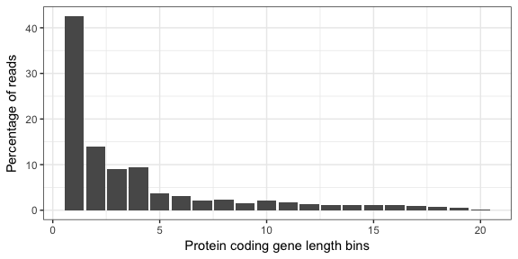
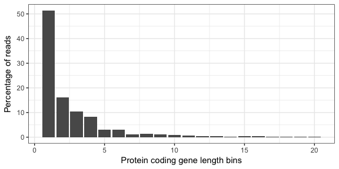
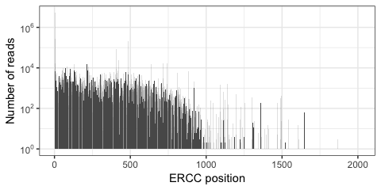
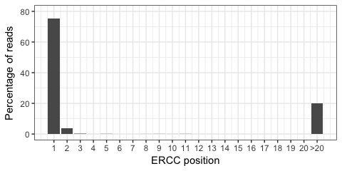
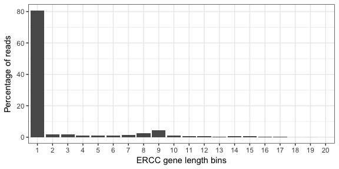
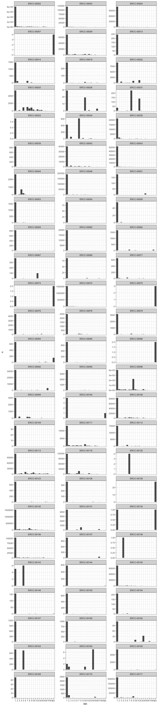

# ERCC TSS
Jonathan Moody  


Of reads mapping to ERCC spikes, how many map to the 1st base pair.

# Load ERCC data

```r
library(ggplot2)
library(data.table)
library(scales)
a <- fread('~/Documents/C1_timecourse/GENCODEv25.cage_cluster.coord.mask.ctss.intersect.anystrand.ercc.tab')
a <- a[V1 != 'ERCC_Vector_Sequence']
a$V2 <- NULL
a$V3 <- NULL
setnames(a, c('spike', 'pos', 'lib', 'reads', 'strand'))

samples <- fread('/Users/jonathan/Documents/C1_timecourse/samples.tsv', header = T)
sc_keep <- samples[Keep == T, Rownames]
toDrop <- c("CAGE_5_B01", "CAGE_5_C02", "CAGE_5_F09", "CAGE_5_D06", "CAGE_5_D10", "CAGE_5_D11", "CAGE_5_D12", "CAGE_5_E06", "CAGE_5_E05", "CAGE_5_E12", "CAGE_5_E11", "CAGE_5_F11", "CAGE_5_G12", "CAGE_6_B09")
a <- a[lib %in% sc_keep & ! lib %in% toDrop]
a <- a[grep('CAGE_[4-6]', lib)]

ercc_len <- fread('~/Documents/C1_timecourse/extra_seqs.len')
setnames(ercc_len, c('spike','len'))
ercc_len[spike=='ERCC-00086', len := len+5]

a <- merge(a, ercc_len, by='spike')
```

# Protein coding data
For gencode protein coding genes the union of thier exons were concatenated, and split into 100 bins of equal length.
CTSS files were intersected with these.

```r
c4 <- fread('~/Documents/C1_timecourse/CAGE_4_coverage.tab')
c4$lib <- 'CAGE_4'
c5 <- fread('~/Documents/C1_timecourse/CAGE_5_coverage.tab')
c5$lib <- 'CAGE_5'
c6 <- fread('~/Documents/C1_timecourse/CAGE_6_coverage.tab')
c6$lib <- 'CAGE_6'

df <- rbindlist(list(c4,c5,c6))

df$bin20 <- ceiling(df$V1/5) # 100 bins to 20
df <- df[,.(n=sum(V2)),by=.(bin20)]
df$pc <- df$n/sum(df$n)
df[bin20==1]
```

```
##    bin20        n        pc
## 1:     1 40137488 0.4252744
```

```r
(ggplot(df, aes(bin20, pc*100))
  +geom_bar(stat = 'identity', position='dodge')
  +xlab('Protein coding gene length bins')
  +ylab('Percentage of reads')
    )
```

<!-- -->

## BULK data comparison

```r
df <- fread('~/Documents/C1_timecourse/BULK_coverage.tab')
df$bin20 <- ceiling(df$V1/5) # 100 bins to 20
df <- df[,.(n=sum(V2)),by=.(bin20)]
df$pc <- df$n/sum(df$n)
df[bin20==1]
```

```
##    bin20        n        pc
## 1:     1 39108372 0.5132748
```

```r
(ggplot(df, aes(bin20, pc*100))
  +geom_bar(stat = 'identity', position='dodge')
  +xlab('Protein coding gene length bins')
  +ylab('Percentage of reads')
    )
```

<!-- -->

# ERCC analysis

```r
b <- copy(a)
b <- b[pos > 20, pos := 21][,.(n=sum(reads)),by=pos]
b[, pc := (n/sum(n))*100]


(ggplot(a[,.(n=sum(reads)),by=pos], aes(pos, n))
 +geom_histogram(stat = 'identity')
  +scale_y_continuous(trans = 'log10',
                        breaks = trans_breaks('log10', function(x) 10^x),
                        labels = trans_format('log10', math_format(10^.x)))
  +ylab('Number of reads')
 +xlab('ERCC position')
 )
```

```
## Warning: Ignoring unknown parameters: binwidth, bins, pad
```

<!-- -->

```r
(ggplot(b, aes(pos, pc))
 +geom_histogram(stat = 'identity')
 +ylab('Percentage of reads')
 +xlab('ERCC position')
 +scale_x_continuous(labels = c(1:20, '>20'), breaks = 1:21)
 +ylim(0,80)
)
```

```
## Warning: Ignoring unknown parameters: binwidth, bins, pad
```

<!-- -->

```r
ggsave('ERCC_5p.pdf', path='../manuscript/Fig1/')
```

```
## Saving 5 x 2.5 in image
```

## binned transcripts

```r
#b <- a[, .(bin=cut(pos, breaks = 10, labels=1:10), reads), by=.(spike)][,.(n=sum(reads)),by=.(bin, spike)]
b <- a[, .(bin=cut(pos, breaks = c(0,sapply(strsplit(levels(cut(c(0,len[1]), 20)), "\\(|,|]"), function(x) as.numeric(x[-1]))[2,]), labels=1:20), reads), by=.(spike)][,.(n=sum(reads)),by=.(bin, spike)]

df <- b[,.(n=sum(n)) ,by=.(bin)]
df$pc <- df$n/ sum(df$n)

(ggplot(df, aes(bin, pc*100))
  +geom_histogram(stat = 'identity')
  +ylab('Percentage of reads')
  +xlab('ERCC gene length bins')
  )
```

```
## Warning: Ignoring unknown parameters: binwidth, bins, pad
```

<!-- -->


```r
(ggplot(b, aes(bin, n))
  +geom_histogram(stat = 'identity')
  +facet_wrap(~spike, ncol = 3, scales = 'free_y')
  )
```

```
## Warning: Ignoring unknown parameters: binwidth, bins, pad
```

<!-- -->
