# FISH data
Jonathan Moody  

# setup

```r
library(data.table)
library(ggplot2)
library(scales)
library(knitr)
ggplot2::theme_set(ggplot2::theme_bw())
options(width = 120)
```

# Enhancer expression

```r
df <- fread('../generated/fish_enh_gene.csv')
setnames(df, gsub(' ','_',colnames(df)))
df$chr = 'chr10 eRNA'
df[Coding_gene == 'PMEPA1']$chr <- 'chr20 eRNA'
df[Coding_gene == 'PDK2']$chr <- 'chr17 eRNA'

df2 <- df[, .(enhancer=sum(Enhancer_spot_number>0), gene=sum(Coding_gene_spot > 0), overlap=sum(Overlapped_enhancer_number >0)), by=.(t=as.factor(Timepoint), gene_id=Coding_gene, chr=as.factor(chr))]
df3 <- melt.data.table(df2, id.vars = c('t', 'gene_id', 'chr'))

(ggplot(df3[variable=='enhancer'], aes(t, value, color=chr, group=chr))
  +geom_line(stat = 'identity')
  +xlab('Timepoint')
  +ylab('% cells with eRNA FISH spot')
  +scale_color_discrete(guide = guide_legend(title = NULL))
  )
```

<!-- -->

```r
# for spot count 
#df4.a <- df[, .(spots=as.integer(as.data.frame(table(Coding_gene_spot))[,1]), n=as.integer(as.data.frame(table(Coding_gene_spot))[,2])/.N, type='gene'), by=.(Timepoint, chr)]
#df4.b <- df[, .(spots=as.integer(as.data.frame(table(Enhancer_spot_number))[,1]), n=as.integer(as.data.frame(table(Enhancer_spot_number))[,2])/.N, type='enh'), by=.(Timepoint, chr)]
#df4 <- rbindlist(l = list(df4.a, df4.b))

df4.a <- df[Coding_gene_spot > 0, .(n=mean(Coding_gene_spot), type='gene'), by=.(Timepoint, chr)]
df4.b <- df[Enhancer_spot_number > 0, .(n=mean(Enhancer_spot_number), type='enhancer'), by=.(Timepoint, chr)]
df4 <- rbindlist(l = list(df4.a, df4.b))
```


```r
(ggplot(df3[variable %in% c('enhancer','gene'), .(chr=gsub(' eRNA','',chr), t, value, variable)], aes(t, value))
  +geom_bar(stat = 'identity')
  +xlab('Timepoint')
  +ylab('% cells with FISH spot')
  +facet_grid(variable~chr)
  )
```

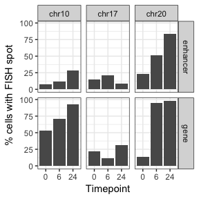<!-- -->

```r
ggsave('../manuscript/Fig5/all_erna.pdf', width = 6, height = 4, units='in')


(ggplot(df3[variable %in% c('enhancer') & chr=='chr20 eRNA'], aes(t, value))
  +geom_bar(stat = 'identity')
  +xlab('Timepoint (hours)')
  +ylab('% cells with FISH spot')
  +facet_grid(.~chr)
  )
```

<!-- -->

```r
ggsave('../manuscript/Fig5/chr20_erna.pdf', width = 3, height = 3, units='in')


(ggplot(df4, aes(as.factor(Timepoint), n))
  +geom_bar(stat = 'identity')
  +xlab('Timepoint')
  +ylab('Mean FISH spots per cell')
  +facet_grid(type~chr)
  )
```

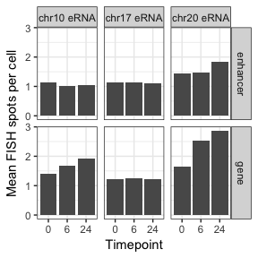<!-- -->

```r
ggsave('../manuscript/Fig5/all_erna_spotcount_2.pdf', width = 6, height = 4, units='in')
```


```r
(ggplot(df3, aes(t, value, color=variable, group=variable))
  +geom_line(stat = 'identity')
  +xlab('Timepoint')
  +ylab('% cells with eRNA FISH spot')
  +facet_wrap(~chr)
  +scale_color_discrete(guide = guide_legend(title = NULL))
  )
```

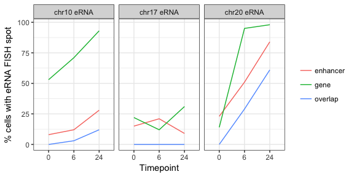<!-- -->

```r
ggsave('../manuscript/Fig5/all_overlap_line.pdf', width = 5, height = 3, units='in')


(ggplot(df3[chr %in% c('chr10 eRNA','chr20 eRNA')], aes(t, value, color=variable, group=variable))
  +geom_line(stat = 'identity')
  +xlab('Timepoint')
  +ylab('% cells with eRNA FISH spot')
  +facet_wrap(~chr)
  +scale_color_discrete(guide = guide_legend(title = NULL))
  )
```

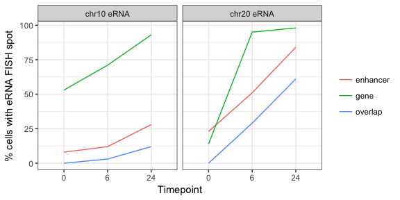<!-- -->

```r
ggsave('../manuscript/Fig5/chr10_20_overlap_line.pdf', width = 5, height = 3, units='in')
```


```r
df2[, pc_gene := overlap/gene]
df2[, pc_enh := overlap/enhancer]
df3 <- melt.data.table(df2, id.vars = c('t', 'gene_id', 'chr'))
```

```
## Warning in melt.data.table(df2, id.vars = c("t", "gene_id", "chr")): 'measure.vars' [enhancer, gene, overlap, pc_gene,
## pc_enh] are not all of the same type. By order of hierarchy, the molten data value column will be of type 'double'. All
## measure variables not of type 'double' will be coerced to. Check DETAILS in ?melt.data.table for more on coercion.
```

```r
(ggplot(df3[variable%in%c('pc_gene', 'pc_enh') & gene_id %in% c('KLF6', 'PMEPA1'), .(chr=gsub(' eRNA','',chr), t, value, variable)], 
        aes(t, value, color=variable, group=variable))
  +geom_line()
  +facet_wrap(~chr)
  +xlab('Timepoint')
  +ylab('% spot overlap')
)
```

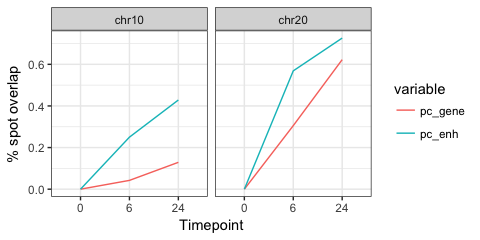<!-- -->

```r
(ggplot(df3[variable%in%c('pc_enh') & gene_id %in% c('KLF6', 'PMEPA1'), .(chr=gsub(' eRNA','',chr), t, value, variable)], 
        aes(t, value*100))
  +geom_bar(stat = 'identity')
  +facet_wrap(~chr)
  +xlab('Timepoint')
  +ylab('% eRNA overlaping nearby gene')
)
```

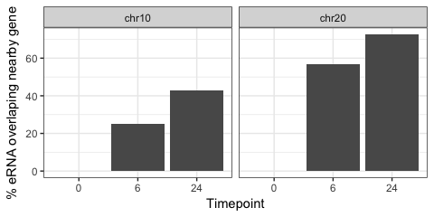<!-- -->

```r
ggsave('../manuscript/Fig5/all_overlap.pdf', width = 5, height = 3, units='in')


(ggplot(df3[variable%in%c('pc_enh') & gene_id %in% c( 'PMEPA1')], 
        aes(t, value*100))
  +geom_bar(stat = 'identity')
  +facet_wrap(~chr)
  +xlab('Timepoint (hours)')
  +ylab('% spots overlapping PMEPA1')
)
```

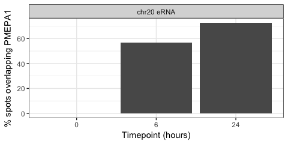<!-- -->

```r
ggsave('../manuscript/Fig5/chr20_overlap.pdf', width = 3, height = 3, units='in')
```


```r
df <- fread('../generated/fish_enh_overlap.csv')
setnames(df, gsub(' ','_',colnames(df)))
df$Chromosome_number <- paste0('chr',df$Chromosome_number,' eRNA')
df2 <- df[, .(
  sense_n=sum(Sense_enhancer_spot_number >0), 
  sense_t=sum(Sense_enhancer_spot_number), 
  anti_n=sum(`Anti-sense_enhancer_spot_number` >0), 
  anti_t=sum(`Anti-sense_enhancer_spot_number`), 
  over_n=sum(Overlapped_enhancer_number>0), 
  over_t=sum(Overlapped_enhancer_number)
  ), by=.(t=as.factor(Timepoint), chr=as.factor(Chromosome_number))]

df2[, `+ve strand` := sense_t/(sense_t+anti_t)]
df2[, `-ve strand` := anti_t/(sense_t+anti_t)]
df3 <- melt.data.table(df2, id.vars = c('t', 'chr'))
```

```
## Warning in melt.data.table(df2, id.vars = c("t", "chr")): 'measure.vars' [sense_n, sense_t, anti_n, anti_t, ...] are
## not all of the same type. By order of hierarchy, the molten data value column will be of type 'double'. All measure
## variables not of type 'double' will be coerced to. Check DETAILS in ?melt.data.table for more on coercion.
```

```r
(ggplot(df3[variable %in% c('+ve strand', '-ve strand')], aes(t, value*100, fill=variable)) 
  + geom_bar(stat = 'identity') 
  + facet_wrap(~chr)
  + xlab('Timepoint (hour)')
  + ylab('% eRNA spot')
)
```

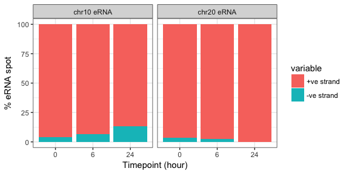<!-- -->

```r
ggsave('../manuscript/Fig5/all_direction.pdf', width = 6, height = 3, units='in')

(ggplot(df3[variable %in% c('+ve strand', '-ve strand') & chr=='chr20 eRNA'], aes(t, value*100, fill=variable)) 
  + geom_bar(stat = 'identity') 
  + facet_wrap(~chr)
  + xlab('Timepoint (hour)')
  + ylab('% eRNA spots')
  +scale_fill_discrete(guide = guide_legend(title = NULL))
)
```

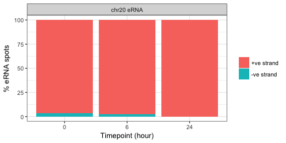<!-- -->

```r
ggsave('../manuscript/Fig5/chr20_direction.pdf', width = 4, height = 3, units='in')
```

# C1 CAGE comparison

Load data

```r
library(data.table)
library(ggplot2)
library(VennDiagram)
library(scales)
library(knitr)
ggplot2::theme_set(ggplot2::theme_bw())
#opts_chunk$set(cache=TRUE)
options(width = 120)
opts_chunk$set(tidy.opts=list(width.cutoff=80),tidy=TRUE)
exp <- readRDS('~/Documents/C1_timecourse/GENCODEv25.cage_cluster.coord.mask.q0.gene_sum.Rds')
samples <- fread('/Users/jonathan/Documents/C1_timecourse/samples.tsv', header = T)
sc_keep <- samples[Keep == T, Rownames]
toDrop <- c("CAGE_5_B01", "CAGE_5_C02", "CAGE_5_F09", "CAGE_5_D06", "CAGE_5_D10", "CAGE_5_D11", "CAGE_5_D12", "CAGE_5_E06", "CAGE_5_E05", "CAGE_5_E12", "CAGE_5_E11", "CAGE_5_F11", "CAGE_5_G12", "CAGE_6_B09")
exp <- exp[,union( grep("BULK|gene", colnames(exp)), which(colnames(exp) %in% sc_keep)), with=F]
exp <- exp[,!colnames(exp) %in% toDrop ,with=F]
rm(sc_keep)
rm(toDrop)

geneClass <- exp$geneClass
exp$geneClass <- NULL
geneID <- exp$geneID
exp$geneID <- NULL

counts <- as.matrix(exp)
rownames(counts) <- geneID
rm(exp)
rm(geneID)

bulk_idx <- grep('BULK', colnames(counts))
sc_idx <- grep('CAGE_[4-6]', colnames(counts)) # only use 4-6
sc_idx_456 <- grep('CAGE_[4-6]', colnames(counts))
e_idx <- geneClass == 'enhancer_locus'
pc_idx <- geneClass == 'protein_coding'
lc_idx <- geneClass == 'lincRNA'
#rm(geneClass)

sc_t00 <- colnames(counts) %in% samples[Timepoint=='t00', Rownames]
sc_t06 <- colnames(counts) %in% samples[Timepoint=='t06', Rownames]
sc_t24 <- colnames(counts) %in% samples[Timepoint=='t24', Rownames]
#rm(samples)

calc_cpm <- function (expr_mat)
{
  norm_factor <- colSums(expr_mat)
  return(t(t(expr_mat)/norm_factor) * 10^6)
}
counts[,bulk_idx] <- calc_cpm(counts[,bulk_idx])
#counts <- calc_cpm(counts)
```

Plots

```r
fish_genes <- c("ENSG00000067082.14_1", "ENSG00000124225.15_2", "ENSG00000005882.11_2", 
    "ADDG10003929991.E", "ADDG17048105016.E", "ADDG20056293544.E")
enh_m <- melt(counts[fish_genes, sc_idx_456])
enh_m <- as.data.table(enh_m)
setnames(enh_m, c("gene", "cell", "reads"))
enh_m <- merge(enh_m, samples[, .(cell = Rownames, t = Timepoint)])
enh_m$chr = "chr10"
enh_m[gene %in% c("ENSG00000005882.11_2", "ADDG17048105016.E")]$chr <- "chr17"
enh_m[gene %in% c("ENSG00000124225.15_2", "ADDG20056293544.E")]$chr <- "chr20"
enh_m$type <- "enhancer"
enh_m[grep("ENSG", gene)]$type <- "gene"

enh_m[, .(n = .SD[reads > 0, .N]/.N, cells = .SD[reads > 0, .N], tot = .N), by = .(gene, 
    t, chr, type)][order(gene, t)]
```

```
##                     gene   t   chr     type          n cells tot
##  1: ENSG00000067082.14_1 t00 chr10     gene 0.63888889    23  36
##  2: ENSG00000067082.14_1 t06 chr10     gene 0.86842105    33  38
##  3: ENSG00000067082.14_1 t24 chr10     gene 0.95238095    60  63
##  4: ENSG00000124225.15_2 t00 chr20     gene 0.11111111     4  36
##  5: ENSG00000124225.15_2 t06 chr20     gene 0.39473684    15  38
##  6: ENSG00000124225.15_2 t24 chr20     gene 0.53968254    34  63
##  7: ENSG00000005882.11_2 t00 chr17     gene 0.27777778    10  36
##  8: ENSG00000005882.11_2 t06 chr17     gene 0.31578947    12  38
##  9: ENSG00000005882.11_2 t24 chr17     gene 0.26984127    17  63
## 10:    ADDG10003929991.E t00 chr10 enhancer 0.00000000     0  36
## 11:    ADDG10003929991.E t06 chr10 enhancer 0.05263158     2  38
## 12:    ADDG10003929991.E t24 chr10 enhancer 0.06349206     4  63
## 13:    ADDG17048105016.E t00 chr17 enhancer 0.08333333     3  36
## 14:    ADDG17048105016.E t06 chr17 enhancer 0.02631579     1  38
## 15:    ADDG17048105016.E t24 chr17 enhancer 0.03174603     2  63
## 16:    ADDG20056293544.E t00 chr20 enhancer 0.02777778     1  36
## 17:    ADDG20056293544.E t06 chr20 enhancer 0.10526316     4  38
## 18:    ADDG20056293544.E t24 chr20 enhancer 0.09523810     6  63
```

```r
enh_m[, .(dcast.data.table(.SD, cell ~ type, value.var = "reads")[, sum(enhancer > 
    0 & gene > 0)/sum(enhancer > 0)]), by = .(chr, t)]
```

```
##      chr   t        V1
## 1: chr10 t24 1.0000000
## 2: chr20 t24 0.3333333
## 3: chr17 t24 0.0000000
## 4: chr10 t00       NaN
## 5: chr20 t00 0.0000000
## 6: chr17 t00 0.6666667
## 7: chr10 t06 0.5000000
## 8: chr20 t06 0.5000000
## 9: chr17 t06 1.0000000
```

```r
(ggplot(enh_m[chr == "chr20", .(dcast.data.table(.SD, cell ~ type, value.var = "reads")[, 
    sum(enhancer > 0 & gene > 0)/sum(enhancer > 0)]), by = .(chr = paste0(chr, " eRNA"), 
    t = gsub("t", "", t))], aes(t, V1 * 100)) + geom_bar(stat = "identity") + facet_wrap(~chr) + 
    xlab("Timepoint (hours)") + ylab("% eRNA expressing cells \nalso expressing PMEPA1"))
```

<!-- -->

```r
ggsave("../manuscript/Fig5/chr20_overlap_cage.pdf", width = 3, height = 3, units = "in")


(ggplot(enh_m[, .(n = .SD[reads > 0, .N]/.N), by = .(gene, t = gsub("t", "", t), 
    chr, type)], aes(t, n * 100)) + geom_bar(stat = "identity") + facet_grid(type ~ 
    chr, scales = "free_y") + ylab("% cells with CAGE signal") + xlab("Timepoint"))
```

<!-- -->

```r
ggsave("../manuscript/Fig5/all_erna_cage.pdf", width = 6, height = 4, units = "in")

(ggplot(enh_m[chr == "chr20" & type == "enhancer", .(n = .SD[reads > 0, .N]/.N), 
    by = .(gene, t = gsub("t", "", t), chr = paste0(chr, " eRNA"), type)], aes(t, 
    n * 100)) + geom_bar(stat = "identity") + facet_grid(. ~ chr, scales = "free_y") + 
    ylab("% cells with CAGE signal") + xlab("Timepoint"))
```

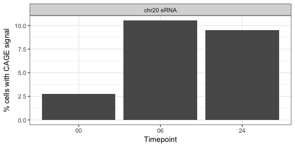<!-- -->

```r
ggsave("../manuscript/Fig5/chr20_erna_cage.pdf", width = 3, height = 3, units = "in")


fish_enh <- c("ADDG10003929991.E", "ADDG17048105016.E", "ADDG20056293544.E")
enh_m <- melt(counts[fish_enh, sc_idx_456])
enh_m <- as.data.table(enh_m)
setnames(enh_m, c("gene", "cell", "reads"))
enh_m <- merge(enh_m, samples[, .(cell = Rownames, t = Timepoint)])
enh_m[, .(n = .SD[reads > 0, .N]/.N, cells = .SD[reads > 0, .N], tot = .N), by = .(gene, 
    t)][order(gene, t)]
```

```
##                 gene   t          n cells tot
## 1: ADDG10003929991.E t00 0.00000000     0  36
## 2: ADDG10003929991.E t06 0.05263158     2  38
## 3: ADDG10003929991.E t24 0.06349206     4  63
## 4: ADDG17048105016.E t00 0.08333333     3  36
## 5: ADDG17048105016.E t06 0.02631579     1  38
## 6: ADDG17048105016.E t24 0.03174603     2  63
## 7: ADDG20056293544.E t00 0.02777778     1  36
## 8: ADDG20056293544.E t06 0.10526316     4  38
## 9: ADDG20056293544.E t24 0.09523810     6  63
```

```r
(ggplot(enh_m[, .(n = .SD[reads > 0, .N]/.N), by = .(gene, t)], aes(t, n * 100)) + 
    geom_bar(stat = "identity") + facet_wrap(~gene) + ylab("% cells with CAGE signal") + 
    xlab("Timepoint"))
```

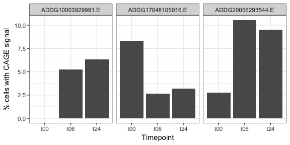<!-- -->

```r
# ggsave(filename = '~/Downloads/enh.png', width = 6, height = 3, units = 'in')

fish_genes <- c("ENSG00000067082.14_1", "ENSG00000124225.15_2", "ENSG00000005882.11_2")
enh_m <- melt(counts[fish_genes, sc_idx_456])
enh_m <- as.data.table(enh_m)
setnames(enh_m, c("gene", "cell", "reads"))
enh_m <- merge(enh_m, samples[, .(cell = Rownames, t = Timepoint)])
enh_m[, .(n = .SD[reads > 0, .N]/.N, cells = .SD[reads > 0, .N], tot = .N), by = .(gene, 
    t)][order(gene, t)]
```

```
##                    gene   t         n cells tot
## 1: ENSG00000067082.14_1 t00 0.6388889    23  36
## 2: ENSG00000067082.14_1 t06 0.8684211    33  38
## 3: ENSG00000067082.14_1 t24 0.9523810    60  63
## 4: ENSG00000124225.15_2 t00 0.1111111     4  36
## 5: ENSG00000124225.15_2 t06 0.3947368    15  38
## 6: ENSG00000124225.15_2 t24 0.5396825    34  63
## 7: ENSG00000005882.11_2 t00 0.2777778    10  36
## 8: ENSG00000005882.11_2 t06 0.3157895    12  38
## 9: ENSG00000005882.11_2 t24 0.2698413    17  63
```

```r
enh_m[gene == "ENSG00000067082.14_1", `:=`(gene, "KLF6")]
enh_m[gene == "ENSG00000124225.15_2", `:=`(gene, "PMEPA1")]
(ggplot(enh_m[, .(n = .SD[reads > 0, .N]/.N), by = .(gene, t)], aes(t, n * 100)) + 
    geom_bar(stat = "identity") + facet_wrap(~gene) + ylab("% cells with CAGE signal") + 
    xlab("Timepoint (hours)"))
```

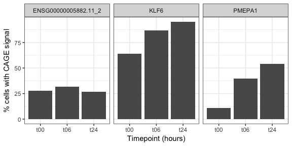<!-- -->

```r
# ggsave(filename = '~/Downloads/gene.png', width = 4, height = 3, units = 'in')

enh_m[reads > 0, `:=`(reads, 1)]
enh_m <- dcast(enh_m, cell ~ gene, value.var = "reads")
enh_m <- merge(enh_m, samples[, .(cell = Rownames, t = Timepoint)])

fish_genes <- c("ENSG00000067082.14_1", "ADDG10003929991.E")
enh_m <- melt(counts[fish_genes, sc_idx_456])
enh_m <- as.data.table(enh_m)
setnames(enh_m, c("gene", "cell", "reads"))
enh_m[reads > 0, `:=`(reads, 1)]
enh_m <- dcast(enh_m, cell ~ gene)
```

```
## Using 'reads' as value column. Use 'value.var' to override
```

```r
enh_m <- merge(enh_m, samples[, .(cell = Rownames, t = Timepoint)])
enh_m[, table(ENSG00000067082.14_1, ADDG10003929991.E)]
```

```
##                     ADDG10003929991.E
## ENSG00000067082.14_1   0   1
##                    0  20   1
##                    1 111   5
```

```r
enh_m[, table(ENSG00000067082.14_1, ADDG10003929991.E, t)]
```

```
## , , t = t00
## 
##                     ADDG10003929991.E
## ENSG00000067082.14_1  0  1
##                    0 13  0
##                    1 23  0
## 
## , , t = t06
## 
##                     ADDG10003929991.E
## ENSG00000067082.14_1  0  1
##                    0  4  1
##                    1 32  1
## 
## , , t = t24
## 
##                     ADDG10003929991.E
## ENSG00000067082.14_1  0  1
##                    0  3  0
##                    1 56  4
```

```r
enh_m$both <- as.numeric(enh_m$ENSG00000067082.14_1 & enh_m$ADDG10003929991.E)
enh_m <- enh_m[, .(gene = sum(ENSG00000067082.14_1)/.N, enh = sum(ADDG10003929991.E)/.N, 
    both = sum(both)/.N), by = .(t)]
enh_m <- melt(enh_m, id.vars = "t")
(ggplot(enh_m, aes(t, value * 100, color = variable)) + geom_point() + geom_line(aes(group = variable)) + 
    ylab("% cells with CAGE signal") + xlab("Timepoint") + ggtitle("KLF6 + eRNA"))
```

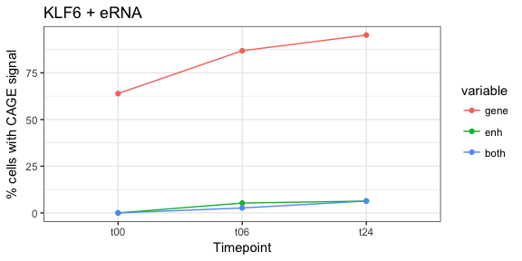<!-- -->

```r
# ggsave(filename = '~/Downloads/overlap_1.png', width = 4, height = 3, units =
# 'in')

fish_genes <- c("ENSG00000124225.15_2", "ADDG20056293544.E")
enh_m <- melt(counts[fish_genes, sc_idx_456])
enh_m <- as.data.table(enh_m)
setnames(enh_m, c("gene", "cell", "reads"))
enh_m[reads > 0, `:=`(reads, 1)]
enh_m <- dcast(enh_m, cell ~ gene)
```

```
## Using 'reads' as value column. Use 'value.var' to override
```

```r
enh_m <- merge(enh_m, samples[, .(cell = Rownames, t = Timepoint)])
enh_m[, table(ENSG00000124225.15_2, ADDG20056293544.E)]
```

```
##                     ADDG20056293544.E
## ENSG00000124225.15_2  0  1
##                    0 77  7
##                    1 49  4
```

```r
enh_m[, table(ENSG00000124225.15_2, ADDG20056293544.E, t)]
```

```
## , , t = t00
## 
##                     ADDG20056293544.E
## ENSG00000124225.15_2  0  1
##                    0 31  1
##                    1  4  0
## 
## , , t = t06
## 
##                     ADDG20056293544.E
## ENSG00000124225.15_2  0  1
##                    0 21  2
##                    1 13  2
## 
## , , t = t24
## 
##                     ADDG20056293544.E
## ENSG00000124225.15_2  0  1
##                    0 25  4
##                    1 32  2
```

```r
enh_m$both <- as.numeric(enh_m$ENSG00000124225.15_2 & enh_m$ADDG20056293544.E)
enh_m <- enh_m[, .(gene = sum(ENSG00000124225.15_2)/.N, enh = sum(ADDG20056293544.E)/.N, 
    both = sum(both)/.N), by = .(t)]
enh_m <- melt(enh_m, id.vars = "t")
(ggplot(enh_m, aes(t, value * 100, color = variable)) + geom_point() + geom_line(aes(group = variable)) + 
    ylab("% cells with CAGE signal") + xlab("Timepoint") + ggtitle("PMEPA1 + eRNA"))
```

<!-- -->

```r
# ggsave(filename = '~/Downloads/overlap_2.png', width = 4, height = 3, units =
# 'in')
```
