# Overview

This is the primary TGFbeta time course data processing and analysis of the Single Cell C1 CAGE Development Project. This notebook covers the initial data processing, quality control check, data normalization, and differential expression analysis on the variably expressed promoters.

Note that much of this analysis pipeline (and text) has been adapted from Lun, McCarthy and Marioni, F1000 Research 2016, and revised to run on scran version 1.6.6. 


---------

# Data Pre-Processing

## Library loading and parameter set up


```r
# Load the required libraries

library(tidyverse)
library(scran)
library(scater)
library(GenomicRanges)
library(org.Hs.eg.db)

# set the relevant paths
dirs <- list()
dirs$results <- "~/Projects/Molecular_Network/TGFbeta_Timecourse/results"
dirs$git <- "~/Projects/Molecular_Network/TGFbeta_Timecourse/C1_CAGE_Timecourse_public"
dirs$source <- file.path(dirs$git, "source")
dirs$analysis <- file.path(dirs$git, "analysis")
dirs$manuscript <- file.path(dirs$git, "manuscript")
dirs$generated <- file.path(dirs$git, "generated")
```

## Data loading and processing

This is the time course single-cell C1 CAGE data on A549 cells after TGFbeta treatment. The time points are 0 hrs, 6 hrs and 24 hrs after treatment. The possible confounding factors include the library and the fluorescent dye used for labeling. 

The raw data contains the CTSS counts for the promoters, enhancers and the spikes. 

```r
# To load sample information
sample.info.all <- read_tsv(file.path(dirs$source, "samples.tsv"))
                            
# This is the complete sample annotation
# We need to remove RNA-seq samples, and those that do not pass the quality control

# Size : only available for libraries 1-3
# Final: contains Color for all 6 libraries. Color column only 1-3.
sample.info <- sample.info.all[sample.info.all$Keep == TRUE,]
sample.info <- sample.info[,c('Rownames','Row','Col','Chamber','Final','Concentration','Timepoint')]

# simplify the Run ID and add it back as Lib
sample.info$Lib <- substr(sample.info$Rownames, 1, 6)

colnames(sample.info)[1] <- 'SampleName'
colnames(sample.info)[5] <- 'Color'

# Expression tables (sequencing data should be read counts)
# Rownames are genes/transcripts IDs.
# contains both ERCC and F5
rawcounts <- read_tsv("~/Projects/Molecular_Network/TGFbeta_Timecourse/data/F5expressionTable.tsv.gz")

# What are these ERCC_... samples?
# Remove them, along with BULK samples
rawcounts <- rawcounts[, c('Row.names', sample.info$SampleName)]

# What are the first 2 rows, <NA> and DJ_contig?
rawcounts <- rawcounts[-(1:2),]

# Remove rows with zero detected DPI/transcripts/spikes
rawcounts <- dplyr::filter(rawcounts, rowSums(rawcounts[,2:ncol(rawcounts)]) > 0)

# now the CAGE DPI cluster ID's are not the CAGE ID's, but names (i.e. p1@... etc.)
colnames(rawcounts)[1] <- 'F5_anno'

# spike T/F
# Make sure you put ^ at the front. Note that this only works because regular promoters start with p?@.
# Remember, there are human genes named ERCC?.
is.spike <- grepl("^ERCC-", rawcounts$F5_anno) 
```

Now we are left with 44339 promoters in 297 samples. 0 are enhancers and 92 are spikes.

Load the CAGE annotations, as constructed by Chung based on GENCODE v25.
I won't bother creaing a separate column for gene symbols at the moment. I have the HGNC IDs and Entrez IDs for now.


```r
#
# Load the annotations for the F5 promoters
#

# promoter annotations
annot <- read_tsv(file.path(dirs$source, "F5_CAGE_anno.GENCODEv25.cage_cluster.info.tsv.gz"))

# FANTOM5 CAGE cluster annotation can be downloaded from http://fantom.gsc.riken.jp/data/
F5.annot <- read_tsv(file.path("~/Projects/FANTOM5/data/hg19/promoters/hg19.cage_peak_phase1and2combined_ann.txt.gz"), comment="##")
colnames(F5.annot)[1] <- 'clusterID'

pos <- strsplit(dplyr::filter(annot, type=='promoter')$clusterID, split='\\.\\.')
pos1 <- unlist(lapply(pos, '[[', 1))
pos2 <- unlist(lapply(pos, '[[', 2))

chrom <- unlist(lapply(strsplit(pos1, split=':'), '[[', 1))
start <- unlist(lapply(strsplit(pos1, split=':'), '[[', 2))
end <- unlist(lapply(strsplit(pos2, split=','), '[[', 1))
strand <- unlist(lapply(strsplit(pos2, split=','), '[[', 2))

coord1 <- data_frame(clusterID=dplyr::filter(annot, type=='promoter')$clusterID,
                    chrom=chrom, start=start, end=end, strand=strand)

pos <- strsplit(dplyr::filter(annot, type=='enhancer')$clusterID, split='-')
pos1 <- unlist(lapply(pos, '[[', 1))
pos2 <- unlist(lapply(pos, '[[', 2))

chrom <- unlist(lapply(strsplit(pos1, split=':'), '[[', 1))
start <- unlist(lapply(strsplit(pos1, split=':'), '[[', 2))
end <- unlist(lapply(strsplit(pos2, split=','), '[[', 1))

coord2 <- data_frame(clusterID=dplyr::filter(annot, type=='enhancer')$clusterID,
                    chrom=chrom, start=start, end=end, strand=NA)

annot <- left_join(annot, rbind(coord1, coord2), by='clusterID')
annot <- left_join(annot, F5.annot[,c(1,5:7)], by='clusterID')
cName <- left_join(rawcounts, annot[,c('F5_anno','clusterID')], by='F5_anno')

# also should set spike clusterIDs (now they are all NA)
cName$clusterID[is.spike] <- cName$F5_anno[is.spike]
cName <- cName[,c(ncol(cName), 2:(ncol(cName)-1))]

rawcounts <- cName

# last row is rDNA
rDNA <- rawcounts[nrow(rawcounts),]
rawcounts <- rawcounts[-nrow(rawcounts),]
is.spike <- is.spike[-length(is.spike)]

# TF information
F5.TFs <- read.table(file="~/Projects/FANTOM5/TF/human.txt", sep="\t", header=TRUE)
F5.TFs <- as.character(F5.TFs$Human)

annot$TF <- FALSE
a <- sapply(F5.TFs, function(x) {annot$clusterID[annot$geneNameStr == x]})
annot[annot$clusterID %in% unique(unlist(a)),'TF'] <- TRUE

rm(a, cName, pos, pos1, pos2, chrom, start, end, coord1, coord2, F5.annot)
```

For comparison with the ChIP-seq data, load the EP300 annotations from ReMap DB.

```r
# for checking the quality of the enhancers
# ReMap data files downloaded from http://tagc.univ-mrs.fr/remap/
ep300 <- list()
ep300$a549 <- read_tsv(file.path("~/Projects/Data/Regulation/ReMap/EP300/ReMap2_ep300_allPeaks_hg19.bed"), col_names=FALSE)
ep300$a549 <- ep300$a549[grep('a549', ep300$a549$X4),]
colnames(ep300$a549) <- c('chrom','start','end','source','score','strand')
ep300$merged <- read_tsv(file.path("~/Projects/Data/Regulation/ReMap/EP300/ReMap2_ep300_nrPeaks_hg19.bed"), col_names=FALSE)
colnames(ep300$merged) <- c('chrom','start','end','source','score','strand')
```

Before we go on, let's also set up helper functions. 


```r
# for easier handling of genomic range intersection
find_overlap <- function(query, subjects)
{
    query$start <- as.numeric(query$start)
    query$end <- as.numeric(query$end)
    query <- GRanges(query$chrom, IRanges(query$start, query$end))
    subjects$start <- as.numeric(subjects$start)
    subjects$end <- as.numeric(subjects$end)
    subjects <- with(subjects, GRanges(chrom, IRanges(start, end)))
    overlap <- findOverlaps(query, subjects)
    subjectHits(overlap)
}

#
# plotting functions
#

# for drawing violin plot for expression levels of a given promoter, with jitter for samples.
# given a clusterID, plot the expression of the DPI cluster across all cells, grouped by
# the group_by parameter
vioplot_expression <- function(ids, dat=sce, group_by='Timepoint', id.type='clusterID')
{
  if (id.type == 'clusterName') {
    ids <- dplyr::filter(annot, clusterName %in% ids)
    ids <- ids$clusterID
  }
  gtab <- dplyr::filter(annot, clusterID %in% ids) %>% dplyr::group_by(geneNameStr) %>% dplyr::arrange(clusterName, .by_group=TRUE)
  ids <- gtab$clusterID
  ids <- ids[ids %in% rownames(dat)]
  
  if (length(ids) > 0)
  {
    ylim <- c(min(scater::norm_exprs(dat[ids,])), 
              max(scater::norm_exprs(dat[ids,])))
    plots <- map(ids, function(id) {
      tab <- data.frame(Exp=scater::norm_exprs(dat)[id,], Group=as.character(colData(dat)[,group_by]))
      ggplot(tab, aes(x=Group, y=Exp, color=Group)) + geom_violin() + geom_jitter(shape=16, position=position_jitter(0.2)) + fontsize + ggtitle(rowData(dat[id,])$clusterName, subtitle=id) + scale_color_manual(values=sample.colors[[group_by]][tab$Group])
    })
    cols <- ifelse(length(plots) >= 6, 3, ifelse(length(plots) < 6 & length(plots) > 1, 2, 1))
    scater::multiplot(plotlist=plots, cols=cols)
  } else {
    print('No CAGE clusters found')
  }
}

# given a set of gene symbols, produce violin plots of all associated promoters
vioplot_expression_by_genes <- function(geneSymbols, dat=sce, group_by='Timepoint')
{
    ids <- dplyr::filter(annot, geneNameStr %in% geneSymbols)$clusterID
    vioplot_expression(ids, dat=dat, group_by=group_by)
}
```

---------

# Initial Data Quality Control

Once the data has been loaded and pre-processed, it needs to go through QC analysis to remove any outlier cells (samples) or mostly unexpressed promoters (features). From this point on, we will make heavy use of scater and scran packages.

## SCE preparation

The expression data needs to be stored in a SCE object for processing. We identify the spikes and mitochondrial promoters, which is necessary for inspecting the quality of the expression data for each cell.


```r
#
# put things into an SCE object
#

# only contains promoter annotations
# for genomic position, rely on external annot, as this cannot contain colnames such as start, end, strand
ft <- dplyr::left_join(rawcounts[,'clusterID'], annot, by='clusterID')
colnames(ft)[13:15] <- c('cluster.start','cluster.end','cluster.strand')
is.spike <- grepl("^ERCC-", ft$clusterID)
ft$clusterName[is.spike] <- ft$clusterID[is.spike]

# metadata for SCE
rowData <- DataFrame(ft, row.names=ft$clusterID)
colData <- DataFrame(sample.info[,-1], row.names=sample.info$SampleName)

sce <- SingleCellExperiment(assays=list(counts=as.matrix(rawcounts[,rownames(colData)])), rowData=rowData, colData=colData)

# identify mitochondrial genes
is.mito <- rowData(sce)$chrom %in% 'chrM'

#sum(is.spike)
sum(is.mito)
```

```
## [1] 463
```

```r
sce <- scater::calculateQCMetrics(sce, feature_controls=list(ERCC=is.spike, Mt=is.mito))
isSpike(sce, "ERCC") <- is.spike

rm(ft, rowData, colData)
```

## Quality control on the cells

We need to remove low-quality cells from further analysis. The quality of the cells is determined by 1) library size, 2) number of expressed genes, 3) mitochondrial proportion and 4) ERCC proportion. If the mitochondrial gene or ERCC proportion is abnormally high, this would indicate lysed cells with lost cytoplasmic RNA. It is possible that depending on the cell types, there may be naturally more mitochondrial activity, so we need to take things in perspective.


```r
par(mfrow=c(2,2))
hist(sce$total_counts/1e6, xlab='Library sizes (millions)', breaks=20, col='grey80', ylab="Number of cells", main="vs. Library Size")
hist(sce$total_features, xlab='Num expressed genes', breaks=20, col='grey80', ylab="Number of cells", main="vs. Num. Expressed Features")
hist(sce$pct_counts_Mt, xlab='Mitochondrial proportion (%)', ylab='Number of cells', breaks=20, main='vs. Mitochondrial Proportion', col='grey80')
hist(sce$pct_counts_ERCC, xlab='ERCC proportion (%)', ylab='Number of cells', breaks=20, main='vs. ERCC proportion', col='grey80')
```

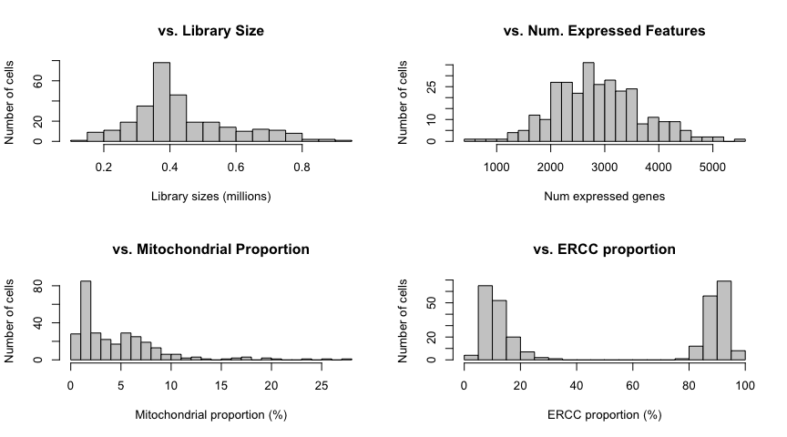<!-- -->

We have a fairly high ERCC proportion (double digits vs. single digit in the reference example). More importantly, all of the CAGE libraries 1-3 fail as they cotain > 70% ERCC proportion. So we should stick to CAGE libraries 4-6, as before.

```r
table(sce$Lib[sce$pct_counts_ERCC > 70])
```

```
## 
## CAGE_1 CAGE_2 CAGE_3 
##     40     42     64
```

```r
# before finding outliers, remove libraries 1-3
sample.info <- sample.info[!sample.info$Lib %in% c('CAGE_1','CAGE_2','CAGE_3'),]

sce <- sce[,sample.info$SampleName]

# recalculate, just in case
sce <- scater::calculateQCMetrics(sce, feature_controls=list(ERCC=is.spike, Mt=is.mito))
isSpike(sce, "ERCC") <- is.spike
```

Now that the sample annotations have been finalized, assign colours to be used in plotting, create spike and enhnacer indices etc.


```r
# for plots
sample.colors <- list()

sample.colors$Lib <- RColorBrewer::brewer.pal(length(unique(sample.info$Lib)), 'Set2')
names(sample.colors$Lib) <- unique(sample.info$Lib)

sample.colors$Color <- c('green3','brown','red2')
names(sample.colors$Color) <- c('Green','G/R','Red')

sample.colors$Timepoint <- RColorBrewer::brewer.pal(length(unique(sample.info$Timepoint)), "Set1")
names(sample.colors$Timepoint) <- sort(unique(sample.info$Timepoint))

# for ggplot-based plots
fontsize <- theme(axis.text=element_text(size=8), axis.title=element_text(size=10),
                  legend.text=element_text(size=8), legend.title=element_text(size=10),
                  plot.title=element_text(size=12))
```

Now, look at the histograms again:

```r
par(mfrow=c(2,2))
hist(sce$total_counts/1e6, xlab='Library sizes (millions)', breaks=20, col='grey80', ylab="Number of cells", main="vs. Library Size")
hist(sce$total_features, xlab='Num expressed genes', breaks=20, col='grey80', ylab="Number of cells", main="vs. Num. Expressed Features")
hist(sce$pct_counts_Mt, xlab='Mitochondrial proportion (%)', ylab='Number of cells', breaks=20, main='vs. Mitochondrial Proportion', col='grey80')
hist(sce$pct_counts_ERCC, xlab='ERCC proportion (%)', ylab='Number of cells', breaks=20, main='vs. ERCC proportion', col='grey80')
```

<!-- -->

We see a bimodal (or tri-) distribution of library size. This is due to CAGE Lib 5 being sequenced only once, where as the other libraries were sequenced twice. This needs to be kept in mind during the QC and normalization.

Instead of taking hard thresholds to remove outliers / bad quality samples, we can take a more measured, adaptive approach, relying on the MAD-based definition, where MAD stands for median absolute deviations. We mark the threshold at 3 MADs below the median value. 

Things to look for when determining which samples to drop:

* library size
* feature size
* mitochondrial proportion
* spike proportion

Use the median absolute deviations (MAD) method to determine the thresholds (3 MADs).

```r
# 3 MADs threshold for library and feature size
libsize.drop <- isOutlier(sce$total_counts, nmads=3, type='lower', log=TRUE)
feature.drop <- isOutlier(sce$total_features, nmads=3, type='lower', log=TRUE)

# 3 MADs threshold for mitochondrial and spike proportion
mito.drop <- isOutlier(sce$pct_counts_Mt, nmads=3, type='higher')
spike.drop <- isOutlier(sce$pct_counts_ERCC, nmads=3, type='higher')

data.frame(Category=c('libsize','feature','mito','spike','total'), 
           Number=c(sum(libsize.drop), sum(feature.drop), sum(mito.drop), sum(spike.drop),
                    sum(libsize.drop | feature.drop | mito.drop | spike.drop)))
```

```
##   Category Number
## 1  libsize      0
## 2  feature      0
## 3     mito     12
## 4    spike      8
## 5    total     15
```

```r
# what are the dropped samples?
colnames(sce)[libsize.drop | feature.drop | mito.drop | spike.drop]
```

```
##  [1] "CAGE_5_B01" "CAGE_5_C02" "CAGE_5_C06" "CAGE_5_D06" "CAGE_5_D10"
##  [6] "CAGE_5_D11" "CAGE_5_D12" "CAGE_5_E05" "CAGE_5_E06" "CAGE_5_E11"
## [11] "CAGE_5_E12" "CAGE_5_F09" "CAGE_5_F11" "CAGE_5_G12" "CAGE_6_B09"
```

```r
# what are their Timepoint?
table(sce$Timepoint[libsize.drop | feature.drop | mito.drop | spike.drop])
```

```
## 
## t00 t06 t24 
##   5   3   7
```

There are 15 samples that will be dropped from further analyses, leaving us with 136.
Fraction dropped = 0.099

If you look at the samples that are to be dropped, all but 1 are from CAGE_5, which again was sequenced only once. In terms of time points, there is no visible bias.

How does the mitochondrial proportion relate to the spike proportion?

```r
tab <- as.data.frame(colData(sce)[,c("Lib", "Timepoint", "pct_counts_Mt", "pct_counts_ERCC")])
ggplot(tab, aes(x=pct_counts_Mt, y=pct_counts_ERCC, color=Lib)) + geom_point() + scale_color_manual(values=sample.colors$Lib[tab$Lib])  + theme_bw() 
```

<!-- -->

The separation of CAGE_5 from the other two libraries is evident. 

Tung et al. (Scientific Reports 2017) state that spike proportion is not a reliable measure of cell data quality. How does the spike proportion relate to the library size in our data?

```r
to.drop <- rep('Keep', ncol(sce))
to.drop[spike.drop] <- 'Spike'
to.drop[mito.drop] <- 'Mito'
to.drop[spike.drop & mito.drop] <- 'Spike & Mito'

#to.drop <- libsize.drop | feature.drop | mito.drop | spike.drop

tab <- as.data.frame(colData(sce)[,c("Lib", "Timepoint", "total_counts", "total_features",  "pct_counts_ERCC")])
tab$Drop <- to.drop

p1 <- ggplot(tab, aes(x=total_counts, y=pct_counts_ERCC, color=Lib, shape=Drop)) + geom_point() + scale_color_manual(values=sample.colors$Lib[tab$Lib]) + theme_bw()
p2 <- ggplot(tab, aes(x=total_features, y=pct_counts_ERCC, color=Lib, shape=Drop)) + geom_point() + scale_color_manual(values=sample.colors$Lib[tab$Lib]) + theme_bw()
multiplot(p1, p2, cols=2)
```

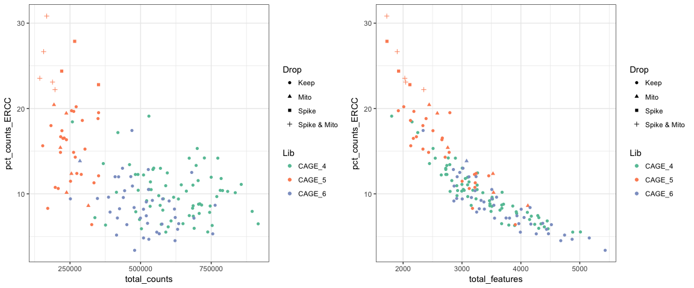<!-- -->

```r
rm(p1, p2, tab, to.drop)
```

All the samples that are dropped due to high spike concentration have low library size / feature counts, whereas this is not necessarily the case for those that are dropped due to high mitochondrial proportion. The number of features detected shows a clear inverse relationship with the spike proportion. Based on this, it would be prudent to remove all the identified cells from further analysis.

### PCA for QC

When we put all samples together, we see clustering based on the libraries.


```r
sce.filtered <- sce[,!(libsize.drop | feature.drop | mito.drop | spike.drop)]
rm(libsize.drop, feature.drop, mito.drop, spike.drop)
```


```r
# scran's runPCA uses prcomp function, with scale_features = TRUE by default, and ntop=500
# no word on centering though
# you can either use runPCA then plot on your own, or use the plotPCA function. Unfortunately, customization options for plotPCA
# are a bit lacking.
sce.filtered <- runPCA(sce.filtered, ntop=500, exprs_values="counts")

tab <- data.frame(reducedDim(sce.filtered, 'PCA'), Timepoint=sce.filtered$Timepoint, Lib=sce.filtered$Lib, Color=sce.filtered$Color)

p1 <- ggplot(tab, aes(x=PC1, y=PC2, color=Timepoint)) + geom_point() + fontsize + ggtitle("Unnormalized: Time Points") + scale_color_manual(values=sample.colors$Timepoint[sce$Timepoint]) + theme_bw()
p2 <- ggplot(tab, aes(x=PC1, y=PC2, color=Lib)) + geom_point() + fontsize + ggtitle("Unnormalized: Library") + scale_color_manual(values=sample.colors$Lib[sce$Lib])+ theme_bw()
p3 <- ggplot(tab, aes(x=PC1, y=PC2, color=Color)) + geom_point() + fontsize + ggtitle("Unnormalized: Stain") + scale_color_manual(values=sample.colors$Color[sce$Color])+ theme_bw()

multiplot(p1, p2, p3, cols=3)
```

<!-- -->

```r
# Supplementary Figure S1 in the manuscript
pdf(file.path(dirs$manuscript, "FigS1/unnormalized_PCA.pdf"), width=14, height=5)
multiplot(p1, p2, p3, cols=3)
dev.off()
```

```
## quartz_off_screen 
##                 2
```

```r
sce <- sce.filtered
sce <- sce[rowSums(counts(sce)) > 0,]

rm(tab, p1, p2, p3, sce.filtered)
```

You can clearly see the effects of the library, which will need to be corrected for later on. 


##Classification of Cell Cycle Phases

Are there any biases towards a certain cell cycle phase in the control vs. treated samples? Does that tell us anything about what kind of effects the treatments have? Or should we look into adjusting the expression values for the cell cycle phases they are in?

Here, we calculate the cell cycle phase scores based on pre-computed human cell cycle marker pairs using the cyclone function. 


```r
# first, need to convert the annotation to Ensembl gene ID
# right now, we have the Ensembl transcript IDs, but they are not compatible with the pre-calculated values for the cyclone method

# get the Ensembl annotations
x <- org.Hs.egENSEMBL

# Get the entrez gene IDs that are mapped to an Ensembl ID
mapped_genes <- mappedkeys(x)

# Convert to a list
xx <- as.list(x[mapped_genes])
entrez.ids <- rowData(sce)$entrezgene_id
entrez.ids <- gsub("entrezgene:", "", entrez.ids)
a <- xx[unique(entrez.ids)]
b <- unlist(lapply(a, '[[', 1))

# load the cyclone pairs data for human
hs.pairs <- readRDS(system.file("exdata", "human_cycle_markers.rds", package="scran"))

# match the IDs and calculate the cell cycle phase scores
ensembl <- b[entrez.ids]
assignments <- cyclone(sce, hs.pairs, gene.names=ensembl)

rm(a,b,x,xx,mapped_genes,ensembl,entrez.ids,hs.pairs)
```


```r
dat <- data.frame(G1=assignments$score$G1, G2M=assignments$score$G2M)
rownames(dat) <- colnames(sce)
dat$Lib <- colData(sce)$Lib
dat$Time <- colData(sce)$Timepoint

p1 <- ggplot(dat, aes(x=G1, y=G2M, color=Lib)) + geom_point(shape=1) + theme_bw()
p2 <- ggplot(dat, aes(x=G1, y=G2M, color=Time)) + geom_point(shape=1) + theme_bw()

multiplot(p1, p2, cols=2)
```

<!-- -->

```r
# save the scores and the identified phases to SCEobject
sce$cell_cycle_phase <- assignments$phases
sce$G1 <- assignments$scores$G1
sce$S <- assignments$scores$S
sce$G2M <- assignments$scores$G2M

rm(assignments, dat, p1, p2)

table(colData(sce)$cell_cycle_phase)
```

```
## 
##  G1 G2M   S 
## 116   7  13
```

```r
tapply(colData(sce)$Timepoint, colData(sce)$cell_cycle_phase, table)
```

```
## $G1
## 
## t00 t06 t24 
##  28  30  58 
## 
## $G2M
## 
## t00 t06 t24 
##   3   3   1 
## 
## $S
## 
## t00 t06 t24 
##   4   5   4
```

So what can you do with this information? 

The classification is according to the following rules: 1) G1 if G1 score > 0.5 and G1 score > G2/M score; 2) G2/M if G2/M score > 0.5 and > G1 score; 3) S if both G1 and G2/M scores < 0.5. Based on this criteria, it appears most of the cells are in G1. 

There is also the question of whether the pre-computed scores used here are really reliable for our own data. We should look into training our own using the sandbag function. But where can we get the data from? The ideal data would be based on the same cell lines, with expression from CAGE, but we also need to identify the cell cycle phase of each cells. 

Due to these limitations, the scores calculated here will be only kept as a reference, but not used as blocking factors. 

## QC: Highly Expressed Promoters and Library Size

Now look at what types of promoters are the most highly expressed. This should be dominated by constitutively expressed promoters, such as those of mitochondrial genes. If we see the too many spikes at the top, it would indicate that too much was added during library preparation. What we see are a number of spikes, along with housekeeping genes such as FTL, ACTB and GAPDHP1.


```r
scater::plotQC(sce, type = "highest-expression", n=50) + fontsize
```

<!-- -->

Another thing you can do is to find the correlation between principle components and feature sizes. Here, we do find positive but low correlations with components 1 and 3. So some normalization may be useful.

```r
scater::plotQC(sce, type = "find-pcs", variable = "total_features", exprs_values = "counts")
```

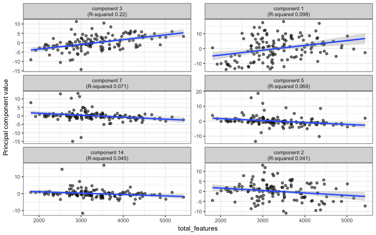<!-- -->

But what if we restricted ourselves to CAGE 4 & 6 or CAGE 5 only?

```r
scater::plotQC(sce[sce$Lib != 'CAGE_5',], type = "find-pcs", variable = "total_features", exprs_values = "counts")
```

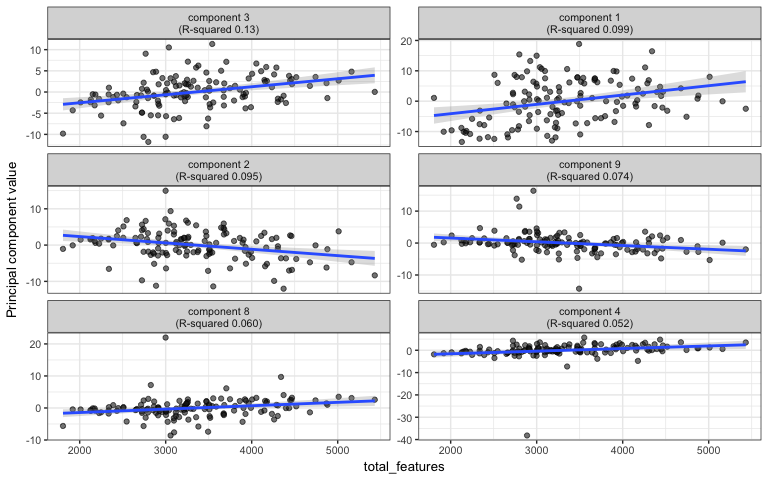<!-- -->

```r
scater::plotQC(sce[sce$Lib == 'CAGE_5',], type = "find-pcs", variable = "total_features", exprs_values = "counts")
```

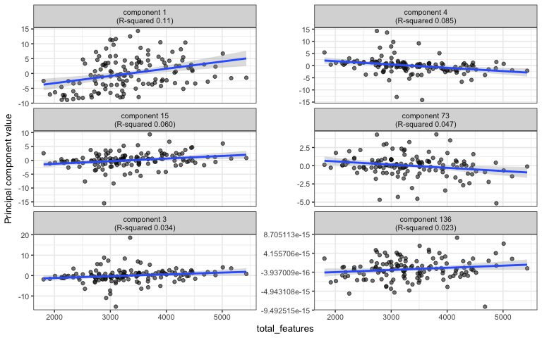<!-- -->

While the problem is worsened by the presence of CAGE_5, positive correlation with component 1 for 4/6 or 5 separately indicates this is an inherent problem. Thus, there is a small but consistent need for normalization of library size.

## Filtering out low abundance promoters

Before proper normalization and downstream analyses, low abundance promoters need to be removed from the data, as they do not contribute enough information and only add noise. However, this introduces a potential problem that real lowly expressed promoters may get filtered out unnecessarily; on the flip side, it could introduce unwanted amplification of low signals.

In more detail, counts near zero level do not contain enough information for statistical inference, and interferes with downstream procedures by compromising the accuracy of continuous approximations. Brennecke et al. (Nature 2016) studied the dependence of technical noise strength on average read count; due to the limitations of the sensitivity of the single cell methods, low average count genes are dominated by technical noise and their biological variation cannot be recovered. Near zero-count promoters are likely to be mostly drop-out events. 

Per the author's words in reply to a reviewer's question:
"most normalization methods (TMM, DESeq etc.) perform poorly with unfiltered data due to poor precision of low counts. This necessiates some degree of filtering prior to normalization."

But the worry is that because CAGE_5 library was sequenced only once, the promoters in CAGE_5 samples would be under-reported compared to those in libraries 4 and 5, and this would be exacerbated by the pre-filtering. So it would be prudent to examine how filtering before/after normalization affect the counts.

```r
# each Timepoint: 39 t00, 40 t06, 69 t24

avg.threshold <- 0.3

# make sure these refer to the actual row numbers in the sce object, to avoid confusion later on
enhancer.index <- which(rowData(sce)$type %in% 'enhancer')
promoter.index <- which(rowData(sce)$type %in% 'promoter')
```

### Average count threshold

```r
avg.counts <- calcAverage(sce)

par(mfrow=c(1,3))

hist(log10(avg.counts), breaks=100, col='grey80', main='log10(avg.counts): All')
abline(v=log10(avg.threshold), col='red', lwd=2, lty=2)

hist(log10(avg.counts)[promoter.index], breaks=100, col='grey80')
abline(v=log10(avg.threshold), col='red', lwd=2, lty=2)

hist(log10(avg.counts)[enhancer.index], breaks=100, col='grey80', main='log10(avg.counts): Enhancer Only')
abline(v=log10(avg.threshold), col='red', lwd=2, lty=2)
```

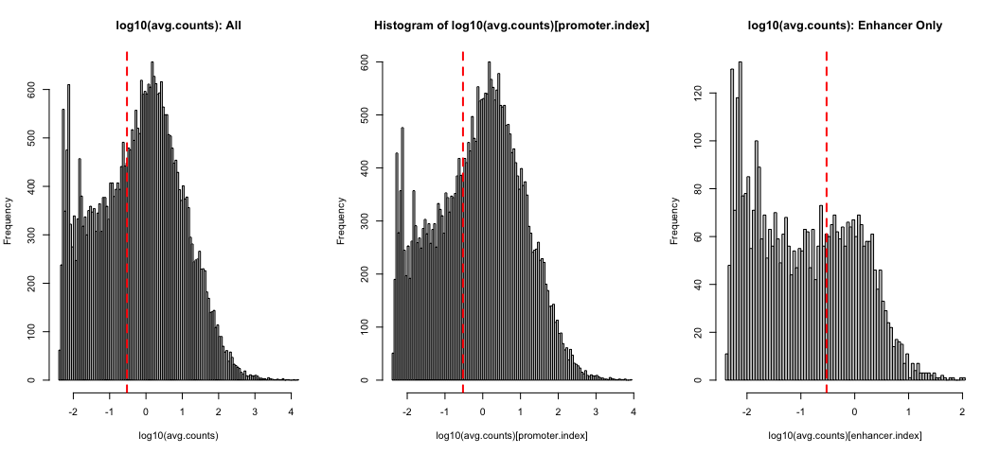<!-- -->

### Number of expressing cells

```r
numcells <- list()
numcells$promoter <- nexprs(sce[promoter.index,], byrow=TRUE)
names(numcells$promoter) <- rownames(sce)[promoter.index]
numcells$enhancer <- nexprs(sce[enhancer.index,], byrow=TRUE)
names(numcells$enhancer) <- rownames(sce)[enhancer.index]

# let's try cell threhsold from 1 (all) to 5
# again, I have to be careful here.
# make sure that the indices refer to actual row numbers in the sce object
keep.rows <- map(1:5, function(t) {
  promoter <- promoter.index[numcells$promoter >= t]
  enhancer <- enhancer.index[numcells$enhancer >= t]
  list(promoter=promoter, enhancer=enhancer)
})
names(keep.rows) <- paste0('t', 1:5)

# output knitly
tab <- plyr::join_all(map(keep.rows, function(x) {plyr::ldply(x, length, .id='Type')}), by='Type')
colnames(tab) <- c('Type','t1','t2','t3','t4','t5')
knitr::kable(tab)
```


Type           t1      t2      t3      t4      t5
---------  ------  ------  ------  ------  ------
promoter    31649   22156   17973   15504   13843
enhancer     3926    1334     695     443     360

```r
par(mfrow=c(1,2))
map(names(keep.rows), function(ind) {
  hist(log10(avg.counts[keep.rows[[ind]]$promoter]), breaks=100, col='grey80', xlim=c(min(log10(avg.counts)), max(log10(avg.counts))), main=paste0("Log10(avg.counts): Promoter ", ind))
  abline(v=log10(avg.threshold), col='red', lwd=2, lty=2)
  hist(log10(avg.counts[keep.rows[[ind]]$enhancer]), breaks=100, col='grey80', xlim=c(min(log10(avg.counts)), max(log10(avg.counts))), main=paste0("Log10(avg.counts): Enhancer ", ind))
  abline(v=log10(avg.threshold), col='red', lwd=2, lty=2)
})
```

<!-- --><!-- --><!-- --><!-- --><!-- -->

```
## [[1]]
## NULL
## 
## [[2]]
## NULL
## 
## [[3]]
## NULL
## 
## [[4]]
## NULL
## 
## [[5]]
## NULL
```

For enhancers, check the overlap with known EP300 binding sites in A549 cells

```r
ep300_a549_overlap <- map(keep.rows, function(x) {
  x$enhancer[unique(find_overlap(ep300$a549, dplyr::filter(annot, clusterID %in% rownames(sce)[x$enhancer])))]
})

# visualize
plot(unlist(lapply(ep300_a549_overlap, length)), type='b', xlab='Cell Number Threshold', ylab='Num with EP300', main="Enhancers with EP300 ChIP-seq evidence")
```

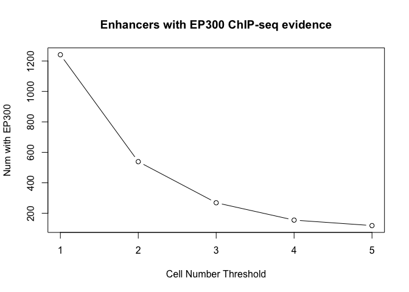<!-- -->

```r
# how do these enhancers break down in terms of EP300 evidence, expression, and spread?
row_max_n <- map(names(ep300_a549_overlap), function(t) {
  # overlap should refer to the actual row indices in the sce object
  a <- rownames(sce[ep300_a549_overlap[[t]],])
  nonoverlap <- keep.rows[[t]]$enhancer
  nonoverlap <- nonoverlap[!nonoverlap %in% ep300_a549_overlap[[t]]]
  b <- rownames(sce[nonoverlap,])
  
  row_max <- reshape2::melt(list(EP300=rowMax(counts(sce)[a,]), No_EP300=rowMax(counts(sce)[b,])), value.name='MaxCount')
  row_avg <- reshape2::melt(list(EP300=rowMeans(counts(sce)[a,]), No_EP300=rowMeans(counts(sce)[b,])), value.name='AvgCount')
  row_n <- reshape2::melt(list(EP300=nexprs(sce[a,], byrow=TRUE), No_EP300=nexprs(sce[b,], byrow=TRUE)), value.name='NumCells')
  
  data.frame(MaxCount=row_max[,1], AvgCount=row_avg[,1], NumCells=row_n[,1], Type=row_max[,2])
})
names(row_max_n) <- names(ep300_a549_overlap)
```


```r
# look at how their densities change with different thresholds
map(names(row_max_n), function(t) {
  res <- row_max_n[[t]]
  subtitle <- paste0("Filtering: ", t)
  p1 <- ggplot(res, aes(x=log10(MaxCount), colour=Type)) + geom_density(alpha=0.6) + 
        scale_x_continuous(name = "Log10 Max. Count") +
        scale_y_continuous(name = "Density") +
        ggtitle("Density Plot: Max. Count for Enhancers", subtitle=subtitle) +
        fontsize + scale_fill_brewer(palette="Accent")  

 p2 <- ggplot(res, aes(x=log10(AvgCount), colour=Type)) + geom_density(alpha=0.6) + 
        scale_x_continuous(name = "Log10 Avg. Count") +
        scale_y_continuous(name = "Density") +
        ggtitle("Density Plot: Avg. Count for Enhancers", subtitle=subtitle) +
        fontsize + scale_fill_brewer(palette="Accent")  

  p3 <- ggplot(res, aes(x=log10(NumCells), colour=Type)) + geom_density(alpha=0.6) + 
        scale_x_continuous(name = "Log10 Num. Cells Expressed") +
        scale_y_continuous(name = "Density") +
        ggtitle("Density Plot: Num. Cells Expressed for Enhancers", subtitle=subtitle) +
        fontsize + scale_fill_brewer(palette="Accent")  
  multiplot(p1, p2, p3, cols=3)
})
```

<!-- --><!-- --><!-- --><!-- --><!-- -->

```
## [[1]]
## NULL
## 
## [[2]]
## NULL
## 
## [[3]]
## NULL
## 
## [[4]]
## NULL
## 
## [[5]]
## NULL
```


```r
# barplots of the numbers of enhancers and promoters

res <- map(names(row_max_n), function(t) {
  c(sum(row_max_n[[t]]$Type == 'EP300'), sum(row_max_n[[t]]$Type != 'EP300'))
})
res <- t(plyr::ldply(res))
colnames(res) <- names(row_max_n)
rownames(res) <- c('EP300','No_EP300')
barplot(res, main="Enhancers Overlapping EP300", names.arg=paste0("NumCells >= ", 1:5), legend.text=c('EP300','No EP300'), beside=TRUE, las=2, cex.axis=0.8, cex.names=0.8)
```

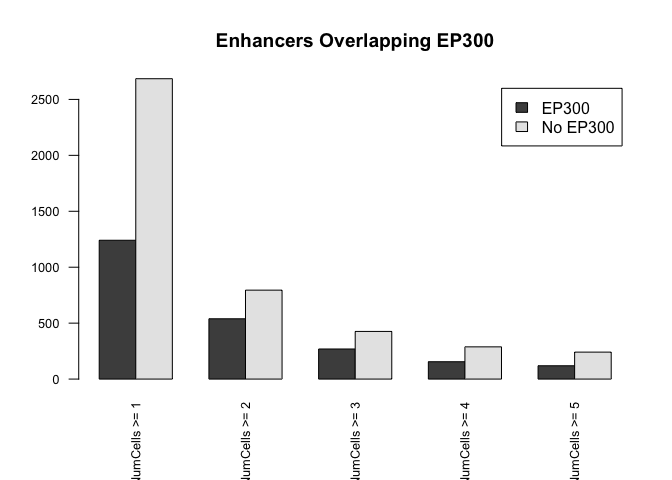<!-- -->

```r
res <- map(names(row_max_n), function(t) {
  c(sum(row_max_n[[t]]$Type == 'EP300' & row_max_n[[t]]$MaxCount > 1), sum(row_max_n[[t]]$Type != 'EP300' & row_max_n[[t]]$MaxCount > 1))
})
res <- t(plyr::ldply(res))
colnames(res) <- names(row_max_n)
rownames(res) <- c('EP300','No_EP300')
barplot(res, main="Enhancers Overlapping EP300", names.arg=paste0("NumCells >= ", 1:5), legend.text=c('EP300 & Max Read > 1','No EP300 & Max Read > 1'), beside=TRUE, las=2, cex.axis=0.8, cex.names=0.8)
```

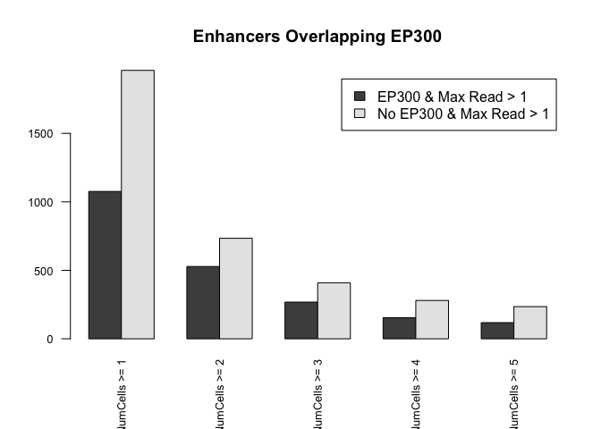<!-- -->

```r
res <- map(names(row_max_n), function(t) {
  c(sum(row_max_n[[t]]$Type == 'EP300' & row_max_n[[t]]$AvgCount > avg.threshold), sum(row_max_n[[t]]$Type != 'EP300' & row_max_n[[t]]$AvgCount > avg.threshold))
})
res <- t(plyr::ldply(res))
colnames(res) <- names(row_max_n)
rownames(res) <- c('EP300','No_EP300')
barplot(res, main="Enhancers Overlapping EP300", names.arg=paste0("NumCells >= ", 1:5), legend.text=c('EP300 & Avg Read > 0.3','No EP300 & Avg Read > 0.3'), beside=TRUE, las=2, cex.axis=0.8, cex.names=0.8)
```

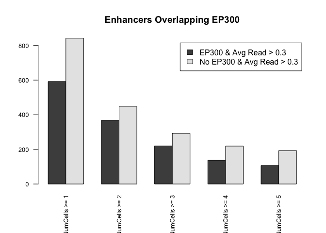<!-- -->

```r
# barplot of promoter counts as thresholds change
res <- map(1:5, function(t) {
  c(sum(rowMax(counts(sce)[names(numcells$promoter)[numcells$promoter >= t],]) > 1),
    sum(rowMeans(counts(sce)[names(numcells$promoter)[numcells$promoter >= t],]) > avg.threshold))
})
res <- t(plyr::ldply(res))
colnames(res) <- names(row_max_n)
rownames(res) <- c('Max','Avg')
barplot(res, main="Promoters", names.arg=paste0("NumCells >= ", 1:5), legend.text=c('Max Read > 1','Avg Read > 0.2'), las=2, beside=TRUE, cex.axis=0.8, cex.names=0.8)
```

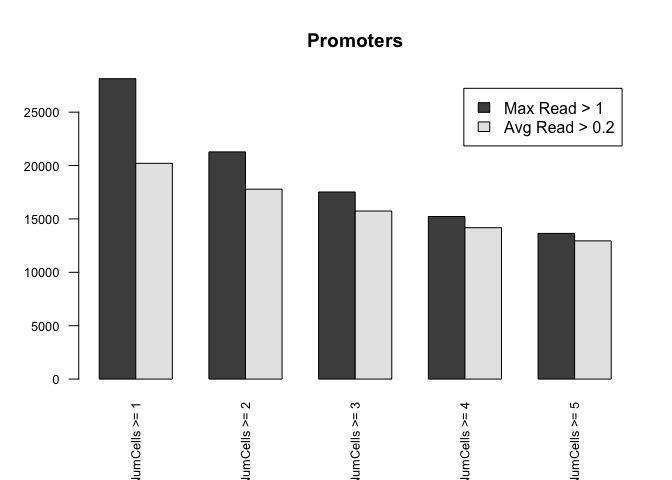<!-- -->

```r
# cleanup
rm(row_max_n, res, tab)
```


Compare the relationship between the number of expressing cells and the average expression values. 

```r
smoothScatter(log10(avg.counts), nexprs(sce, byrow=TRUE), xlab=expression(Log[10]~"average count"), ylab="number of expressing cells")
is.ercc <- isSpike(sce, type="ERCC")
points(log10(avg.counts[is.ercc]), nexprs(sce, byrow=TRUE)[is.ercc], col="red", pch=16, cex=0.5)
```

<!-- -->

In this plot, the blue smear is the spread of individual rows (promoters), while the red dots represent the spikes. The black dots represent the outlier rows. Thus in general, there is relatively good agreement with the promoters and the spikes, in terms of the relationship between their expression levels and the rate of detection (in number of cells).

So what do I do with filtering?

* There is a substantial decrease in the number of enhancers left as we increase the min. cell number threshold

* While it may be better to filter by the number of cells expressed only in order to account for the fact that we have 1 library of different amount of sequencing done, we cannot choose a very low cell number threshold without losing too many enhancers

Based on available literature and the observed normalization problems, I will pre-filter the promoters before they are normalized based on the number of cells they are expressed in (this would be better indication of truly expressed promoter in CAGE_5).

So what should be the cell.threshold? 

```r
table(sce$Lib)
```

```
## 
## CAGE_4 CAGE_5 CAGE_6 
##     68     26     42
```

```r
a <- colData(sce)[sce$Lib == 'CAGE_5',]
table(a$Timepoint)
```

```
## 
## t00 t06 t24 
##   6   7  13
```

There are 26 CAGE_5 samples, out of 136 viable samples. 
Of these CAGE_5 samples, we have 6:7:13 ratio among the three time points. If we look at all 3 libraries combined, it is 35:38:63. Even if we expect a number of sub-groups to be present at each time point, the threhsold could be as high as 5.

Based on the above analyses, it appears that we obtain the most reasonable number of promoters and enhancers when we set the cell threshold at 2 and avg count threshold at 0.3.


```r
sce.bak <- sce # for additional comparison later
sce <- sce[c(which(is.ercc), keep.rows$t2$enhancer, keep.rows$t2$promoter),]
sce <- sce[avg.counts[rownames(sce)] > avg.threshold,]

rm(avg.counts, avg.threshold, keep.rows, numcells, is.ercc, a)
```

What about mitochondrial genes? Should they be removed?
They don't seem to be so highly expressed overall, according to the above figures, and may have real biological variation in our data. Let's keep them.

For this final set, what is the distribution of different annotations?

```r
n <- unique(rowData(sce)$geneClassStr)
n <- unique(unlist(strsplit(n, split=';')))
categories <- numeric(length=length(n))
names(categories) <- n

# slow and not a good style, but...
genes <- unique(rowData(sce)$geneNameStr)
for (g in genes) {
  class <- unique(rowData(sce)[match(g, rowData(sce)$geneNameStr),'geneClassStr'])
  class <- unique(unlist(strsplit(class, ';')))
  for (c in class) {
    categories[c] <- categories[c] + 1
  }
}

names(categories)[names(categories) == 'promoter_locus'] <- 'unknown'
categories <- categories[!is.na(names(categories))] # remove ERCC entries

a <- data.frame(Category=names(categories), Frequency=categories)
ggplot(a, aes(x=reorder(Category, Frequency), y=Frequency, fill='white')) + geom_col() + geom_text(label=a$Frequency, lineheight=0.8, y=0.1, hjust=0, size=3) + ggtitle("Annotation Breakdown") + theme_bw() + guides(fill=FALSE) + labs(x='', y='Count') + coord_flip()
```

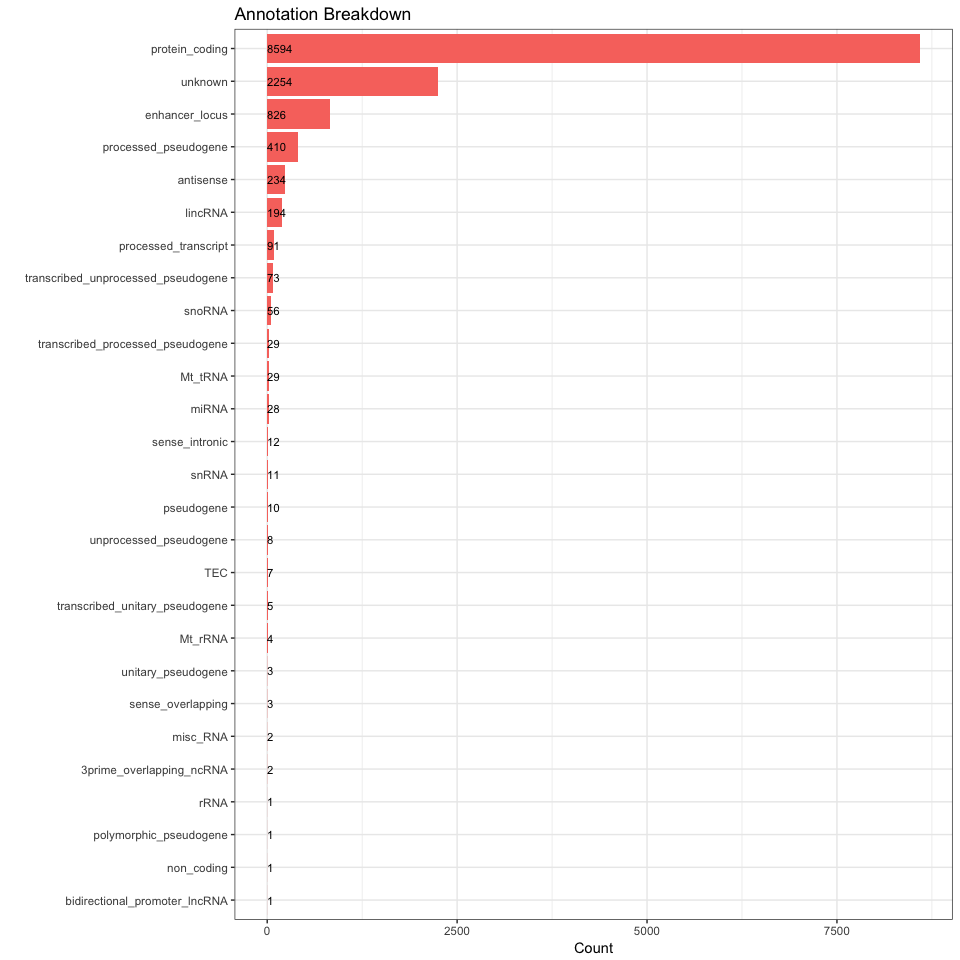<!-- -->

```r
# Supplementary Figure S2
pdf(file.path(dirs$manuscript, "FigS2/annotation_breakdown.pdf"))
ggplot(a, aes(x=reorder(Category, Frequency), y=Frequency, fill='white')) + geom_col() + geom_text(label=a$Frequency, lineheight=0.8, y=0.1, hjust=0, size=3) + ggtitle("Annotation Breakdown") + theme_bw() + guides(fill=FALSE) + labs(x='', y='Count') + coord_flip()
dev.off()
```

```
## quartz_off_screen 
##                 2
```

```r
rm(a, genes, n, categories)
```

---------

# Normalization of Expression Levels 

Single cell data are dominated by low and zero counts, such that directly applying the traditional bulk data normalization factors is problematic. Instead, we can pool counts from many cells to increase the count size, which can lead to better estimation of normalization factors. These can be later deconvolved into individual cell level for cell-specific normalization.

An additional step here is to first cluster similar cells together then normalize the cells in each cluster using the deconvolution method. This way, you reduce the number of DE genes between the cells in the same cluster, improving the normalization accuracy. 

We can also compute separate size factors based on the spikes used. While the amount of cDNA added in each library may be variable, the same amount of spikes would have been added. This means that we cannot use the size factors computed from the gene expression levels for the spikes. Thus calculated spike size factors are kept separate in the SCE object.

## Cluster-Based Size Factor Calculation and Normalization

### Calculation of the size factors

```r
# promoters, including mitochondrial
#sce <- computeSumFactors(sce, sizes=c(50,100,200,300))
clusters <- quickCluster(sce, min.size=30) # based on rank correlation
sce <- computeSumFactors(sce, cluster=clusters, sizes=c(5,10,15,20,25,30))
sce <- computeSpikeFactors(sce, type="ERCC", general.use=FALSE)

summary(sizeFactors(sce))
```

```
##    Min. 1st Qu.  Median    Mean 3rd Qu.    Max. 
##  0.1872  0.6920  1.0342  1.0000  1.3081  2.2890
```

```r
summary(sizeFactors(sce, "ERCC"))
```

```
##    Min. 1st Qu.  Median    Mean 3rd Qu.    Max. 
##  0.2749  0.7176  0.9593  1.0000  1.2050  2.1233
```

```r
rm(clusters)
```


```r
plot(sizeFactors(sce), sce$total_counts/1e6, log='xy', ylab="Library size (1e6)", xlab="Size factor", col=sample.colors$Lib[colData(sce)$Lib], pch=16)
legend("topleft", legend=names(sample.colors$Lib), fill=sample.colors$Lib, cex=0.6)
```

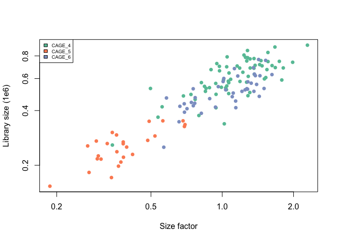<!-- -->

```r
plot(sizeFactors(sce, "ERCC"), sce$total_counts/1e6, log='xy', ylab="Library size (1e6)", xlab="Size factor", col=sample.colors$Lib[colData(sce)$Lib], pch=16)
legend("topleft", legend=names(sample.colors$Lib), fill=sample.colors$Lib, cex=0.6)
```

<!-- -->

We see a clear separation of CAGE_5 library from the other 2, as expected. For the spike size factors, we can see that they are generally in the same range as the other 2 libraries, despite the smaller library sizes of CAGE_5 samples.

Is it the case that more spikes were added to CAGE_5 somehow? That may explain why CAGE_5 size factors are in the same range as the other 2 libraries, even though the library sizes should be lower.


```r
spikes <- counts(sce)[isSpike(sce),]
tapply(colSums(spikes), sce$Lib, summary)
```

```
## $CAGE_4
##    Min. 1st Qu.  Median    Mean 3rd Qu.    Max. 
##   23834   47858   59510   62076   74056  109697 
## 
## $CAGE_5
##    Min. 1st Qu.  Median    Mean 3rd Qu.    Max. 
##   14201   32312   37884   38638   45285   68516 
## 
## $CAGE_6
##    Min. 1st Qu.  Median    Mean 3rd Qu.    Max. 
##   16198   31324   40728   42865   50861   85176
```

```r
# order spikes by median and take a look at the top ones
a <- apply(spikes, 1, median)
a <- sort(a, decreasing = TRUE)

par(mfrow=c(1,2))
boxplot(colSums(spikes) ~ sce$Lib, main="Sum of all spike counts per library")
barplot(a, cex.names=0.6, las=2, main="Median Counts")
```

<!-- -->

```r
# take a look at the top 4

b <- apply(spikes[names(a)[1:4],], 1, tapply, sce$Lib, function(x) {as.numeric(summary(x))})
b <- lapply(b, function(x) {tab <- Reduce(rbind, x); colnames(tab) <- c('Min','1st Qu','Median','Mean','3rd Qu','Max'); rownames(tab) <- c('CAGE_4','CAGE_5','CAGE_6'); t(tab)})

par(mfrow=c(2,4))
boxplot(b[[1]], main=names(b)[1])
boxplot(b[[2]], main=names(b)[2])
boxplot(b[[3]], main=names(b)[3])
boxplot(b[[4]], main=names(b)[4])
```

<!-- -->

### Applying the size factors to normalize expression

We can finally compute normalized log-expression values from the count data. 
Each value is the log-ratio of each count to the size factor for the corresponding cell, with prior.count of 1. The computed values can be retrieved from the SCE object by 'exprs(sce)'.


```r
sce <- normalize(sce)
```


## Checking for Important Technical Factors

Are there any technical factors that are significantly affecting to gene expression variation? These need to be removed to ensure unwanted variances or correlations. 

Note that in single cell data, it is often the case that the number of total features becomes a leading distinguishing feature (high correlation with principle component 1 for example). This is something that needs to be accounted for.

While we check for the technical factors, we also compare the results for before/after promoter filtering based on the mean expression level and the number of cells they are expressed in.

```r
plotExplanatoryVariables(sce, variables=c('total_features',"total_counts_ERCC", "log10_total_counts_ERCC", "Lib", "Concentration", "Timepoint", "Color","cell_cycle_phase")) + fontsize
```

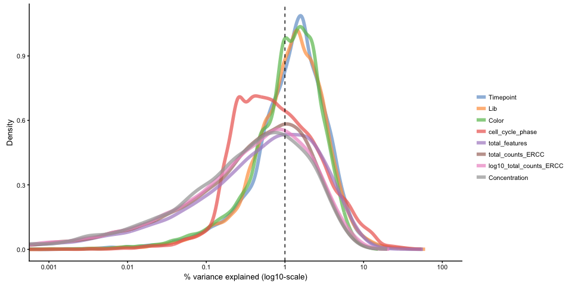<!-- -->

---------

# Identification of HVGs from the normalized log-expression

We need to identify the highly variable genes, then separate the variance into biological and technical components. In theory, the technical component can be calculated by fitting the mean-variance trend to the spike-in transcripts (trendVar), the calculate the biological components by removing this technical component from the total variance (decomposeVar). However, in practice, relying on spikes for this purpose can be unreliable due to a number of reasons (covered in various authors, including Tung et al. 2017). Instead, we can fit the trend to the variance estimates of the endogenous genes (assumption = most of the genes are not variably expressed, such that the technical component dominates), and this trend is used as an estimate of the technical component. Having said that, since we are dealing with differently treated samples, this may not be a safe assumption.

So which one works better?

## Mean-Variance Trend Fitting and Identification of Highly Variable Promoters

First, the model design:

```r
# Leave out cell cycle scores, as we are unsure of their reliability
design <- model.matrix(~Lib + Color, data=colData(sce)) 
```

For the fit without spikes, the assumption is that the cells are mostly homogenous, with little expression differences. However, this is not the case with our data (at least not our expectation), as we have time-series data after TGF-beta induction. So it's possible that spike-based fit would be better, but let's try all cases and see how they look.


```r
# all endogenous genes, no spikes, span=0.1
var.fit1 <- trendVar(sce, parametric=TRUE, design=design, use.spikes=FALSE, span=0.1)
var.out1 <- decomposeVar(sce, var.fit1)

# all endogenous genes, no spikes, span=0.2
var.fit2 <- trendVar(sce, parametric=TRUE, design=design, use.spikes=FALSE, span=0.2)
var.out2 <- decomposeVar(sce, var.fit2)

# spikes
var.fit3 <- trendVar(sce, parametric=TRUE, design=design, span=0.2)
var.out3 <- decomposeVar(sce, var.fit3)
```

We will plot the variance of expression vs. the mean expression only for the full set, as the inclusion/exclusion of mitochondrial promoters should not produce noticeable effect.


```r
par(mfrow=c(1,3))

plot(var.out1$mean, var.out1$total, pch=16, cex=0.6, xlab="Mean log-expression", ylab="Variance of log-expression", main="Using Endogenous Genes: Span=0.1")
cur.spike <- isSpike(sce)
points(var.out1$mean[cur.spike], var.out1$total[cur.spike], col="red", pch=16)
o <- order(var.out1$mean)
lines(var.out1$mean[o], var.out1$tech[o], col="blue", lwd=2)

plot(var.out2$mean, var.out2$total, pch=16, cex=0.6, xlab="Mean log-expression", ylab="Variance of log-expression", main="Using Endogenous Genes: Span=0.2")
cur.spike <- isSpike(sce)
points(var.out2$mean[cur.spike], var.out1$total[cur.spike], col="red", pch=16)
o <- order(var.out2$mean)
lines(var.out2$mean[o], var.out2$tech[o], col="blue", lwd=2)

plot(var.out3$mean, var.out3$total, pch=16, cex=0.6, xlab="Mean log-expression", ylab="Variance of log-expression", main="Using Spikes")
cur.spike <- isSpike(sce)
points(var.out3$mean[cur.spike], var.out3$total[cur.spike], col="red", pch=16)
o <- order(var.out3$mean)
lines(var.out3$mean[o], var.out3$tech[o], col="red", lwd=2)
```

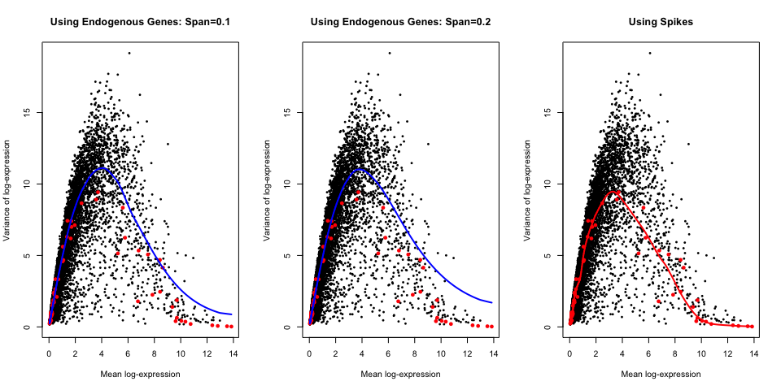<!-- -->

Trend fitting using spikes results would result in much higher number of high variance genes comapred to the fitting using the endogenous genes. For the endogenous genes, using span of 0.1 results in a better fit for higher expressed genes.


```r
hvg.spikes <- var.out2[which(var.out2$FDR <= 0.05 & var.out2$bio >= mean(var.out2$bio)),] # need to keep this consistent
hvg.spikes <- hvg.spikes[order(hvg.spikes$bio, decreasing=TRUE),]

hvg.nonvar <- var.out3[which(var.out3$FDR <= 0.05 & var.out3$bio >= mean(var.out3$bio)),]
hvg.nonvar <- hvg.nonvar[order(hvg.nonvar$bio, decreasing=TRUE),]
```

We define High Variance Genes as those with biological variation above the 75% quantile and FDR < 0.05.

```r
var.out <- var.out3
var.fit <- var.fit3
hvg.out <- var.out[which(var.out$FDR <= 0.05 & var.out$bio >= quantile(var.out$bio)[4]),]
hvg.out <- hvg.out[order(hvg.out$bio, decreasing=TRUE),]

rm(var.out1, var.fit1, var.out2, var.fit2, var.out3, var.fit3, o)
```


```r
# for convenience, let's add promoter annotation to hvg.out
hvg.out$clusterID <- rownames(hvg.out)
hvg.out <- dplyr::right_join(annot[,c('clusterID','clusterName','type','geneNameStr','geneClassStr','chrom','start','end','strand')], hvg.out, by='clusterID')
```
We now have 1148 promoters identified as highly variable. Of those, 23 are enhancers.

## Denoising expression values using PCA

This is a new feature in the updated scran package. We use PCA to remove random technical noise after it has been modeled. 


```r
sce <- denoisePCA(sce, technical=var.fit$trend)
dim(reducedDim(sce, "PCA"))
```

```
## [1] 136  18
```

How do the top HVGs look in terms of expression? 


```r
# for convenience, so that you can show clusterNames instead of IDs
sce.plot <- sce
rownames(sce.plot) <- rowData(sce.plot)$clusterName

plotExpression(sce.plot, features=hvg.out$clusterName[1:10], colour_by='Timepoint', jitter="jitter") + scale_color_manual(values=sample.colors$Timepoint[sce$Timepoint])
```

```
## Scale for 'colour' is already present. Adding another scale for
## 'colour', which will replace the existing scale.
```

<!-- -->

* 'p1@ALDH3A1' is strongly down-regulated as part of the TGF-beta response. ALDH3A1 is a known predictor of therapeutic response to chemotherapy in breast cancer patients.

* 'p1@SERPINE1' is strongly up-regulated as part of the TGF-beta response. SERPINE1 is an indicator of increased metastasis in human melanoma, and an EMT marker.


## Genes defining sub-populations

To identify sub-populations based on the HVGs, we calculate the pairwise correlations among them. We focus on the top 1000.


```r
set.seed(100)
var.cor <- correlatePairs(sce, design=design, subset.row=hvg.out$clusterID)

sig.cor <- var.cor$FDR <= 0.05
summary(sig.cor)
```

```
##    Mode   FALSE    TRUE 
## logical  658246     132
```

```r
var.cor <- var.cor[sig.cor,]
```

---------

# Batch Effect Removal

There are three batch effects to be removed from the data: Lib and Color (ideally Cell Cycle as well, but not performed here). For calculations, we should maintain the original data and use the design to block the effects. The adjusting for batch effects is for data exploration or other methods that cannot use the design to block the effects. The adjusted values can be stored separately within the SCE object (norm_exprs) field.

## Batch removal in normalized data
The batch removal itself is done using limma::removeBatchEffect function.

Given a time point, Lib and Color are not orthogonal. But their usage are not consistent across the Timepoint. 

```r
table(colData(sce)[,c('Lib','Color','Timepoint')])
```

```
## , , Timepoint = t00
## 
##         Color
## Lib      G/R Green Red
##   CAGE_4  19     0   0
##   CAGE_5   0     6   0
##   CAGE_6   0     0  10
## 
## , , Timepoint = t06
## 
##         Color
## Lib      G/R Green Red
##   CAGE_4   0    12   0
##   CAGE_5   0     0   7
##   CAGE_6  19     0   0
## 
## , , Timepoint = t24
## 
##         Color
## Lib      G/R Green Red
##   CAGE_4   0     0  37
##   CAGE_5  13     0   0
##   CAGE_6   0    13   0
```

Should they both be included as covariates? Or only one? While not shown in this analysis, there are some differences in the batch-removed expression values depending on whether Lib or Color is used as the sole source of batch effects. Let's include them both, but in an explicit manner using the design matrix.

```r
design <- model.matrix(~Timepoint + Lib + Color, data=colData(sce))
treat.design <- design[,1:3]
batch.design <- design[,-(1:3)]

adj.exprs <- limma::removeBatchEffect(exprs(sce), design=treat.design, covariates=batch.design)

norm_exprs(sce) <- adj.exprs

rownames(adj.exprs) <- rownames(sce.plot)
norm_exprs(sce.plot) <- adj.exprs

rm(adj.exprs, treat.design, batch.design, design)
```


### PCA of the normalized, batch-corrected data

```r
sce <- runPCA(sce, ntop=500, exprs_values='norm_exprs')

tab <- data.frame(reducedDim(sce, 'PCA'), Timepoint=sce$Timepoint, Lib=sce$Lib)
p1 <- ggplot(tab, aes(x=PC1, y=PC2, color=Timepoint)) + geom_point() + fontsize + ggtitle("Normalized, Corrected: Time Points") + scale_color_manual(values=sample.colors$Timepoint[sce$Timepoint]) + theme_bw()
p2 <- ggplot(tab, aes(x=PC1, y=PC2, color=Lib)) + geom_point() + fontsize + ggtitle("Normalized, Corrected: Library") + scale_color_manual(values=sample.colors$Lib[sce$Lib]) + theme_bw()
multiplot(p1, p2, cols=2)
```

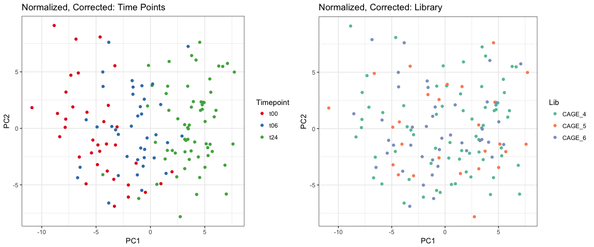<!-- -->

```r
# supplementary figure S1
pdf(file.path(dirs$manuscript, "FigS1/batch_corrected_PCA.pdf"), width=12, height=5)
multiplot(p1, p2, cols=2)
dev.off()
```

```
## quartz_off_screen 
##                 2
```

PCA clearly separates the samples by time points (PC1). When you actually look at the percentage of variance explained along each principal component, you can see that time actually explains very little (only ~2%).

--------


