# Overview

Based on the normalized, batch-removed data, we look into identifying potential sub-populations by clustering the samples and ordering the cells by pseudotime. 

---------

# Set Up

## Library and data loading

We continue from where we left off from s1.


```r
# Load the required libraries
library(tidyverse) 
library(scran)
library(SC3) # consensus clustering approach

# we need TSCAN later, but if we try to load scran, SC3 and TSCAN at the same time, we run into the max DLL problem
# since we only use a few functions from TSCAN, let's not load it for now.

load("~/Projects/Molecular_Network/TGFbeta_Timecourse/results/R_sessions/s1_scran.RData")
```

## Helper Functions

Helper functions for visualization of expression by pseudotime.

```r
pseudotime_plot_by_genes <- function(geneSymbols, dat=sce, order=tscan.order)
{
    ids <- dplyr::filter(annot, geneNameStr %in% geneSymbols)$clusterID
    ids <- ids[ids %in% rownames(dat)]
    if (length(ids) > 0)
    {
        plots <- sapply(ids, function(x) {
            TSCAN::singlegeneplot(scater::norm_exprs(dat)[x,], order) + ggtitle(rowData(sce[x,])$clusterName, subtitle=x) + fontsize}, simplify=FALSE)
        cols <- ifelse(length(plots) >= 2, 2, 1)
        scater::multiplot(plotlist=plots, cols=cols)
    } else {
        print('No promoters found')
    }
}

pseudotime_plot_by_ids <- function(ids, dat=sce, order=tscan.order, id.type='clusterID')
{
    if (id.type == 'clusterName') {
      ids <- dplyr::filter(annot, clusterName %in% ids)$clusterID
    }
    gtab <- dplyr::filter(annot, clusterID %in% ids) %>% dplyr::group_by(geneNameStr) %>% dplyr::arrange(clusterName, .by_group=TRUE)
    ids <- gtab$clusterID
    ids <- ids[ids %in% rownames(dat)]
    if (length(ids) > 0)
    {
        plots <- sapply(ids, function(x) {
            TSCAN::singlegeneplot(scater::norm_exprs(dat)[x,], order) + ggtitle(rowData(sce[x,])$clusterName, subtitle=x) + fontsize}, simplify=FALSE)
        cols <- ifelse(length(plots) >= 2, 2, 1)
        scater::multiplot(plotlist=plots, cols=cols)
    } else {
        print('No promoters found')
    }
}
```

---------

# Clustering into sub-populations

While we have the time point annotation for our samples, we are interested in finding out whether we have sub-populations of cells, and their relative make up in each time point. 

## SC3 Clusters

SC3 is a consensus approach-based unsupervised clustering tool for scRNA-seq data. It contains a Shiny app for interactive view of the results. It is designed to work with scater/scran packages, using the same SCESet object as data container.


```r
# we need to specify the number of clusters to look for
# as we have 3 timepoints, we should start with 3, and look for 3x as many

# before we go on, we need to make sure 'feature_symbol' column is set
rowData(sce)$feature_symbol <- rowData(sce)$clusterName

sce <- sc3(sce[!isSpike(sce),], ks=3:6, gene_filter=TRUE, biology=TRUE, n_cores=3)
```

```
## Setting SC3 parameters...
```

```
## Calculating distances between the cells...
```

```
## Performing transformations and calculating eigenvectors...
```

```
## Performing k-means clustering...
```

```
## Calculating consensus matrix...
```

```
## Calculating biology...
```

```r
# again, for plotting convenience
sce.plot <- sce
rownames(sce.plot) <- rowData(sce)$clusterName
```

If you want to use the interactive interface to view the results:

```r
sc3_interactive(sce.plot)
```

We can view the consensus matrix heatmap and silouttes to see which k results in the most stable sets of clusters. The average silhouette width of 0.78 for k=4 is the highest. The cluster stabilities are on the lower side compared to other k, but cluster 3 stands out with strong consensus and distinct markers. 

```r
sc3_plot_consensus(sce.plot, k=4, 
                   show_pdata=c('Timepoint','G2M',
                                  'sc3_4_clusters','sc3_4_log2_outlier_score',
                                  'sc3_5_clusters','sc3_4_log2_outlier_score'))
```

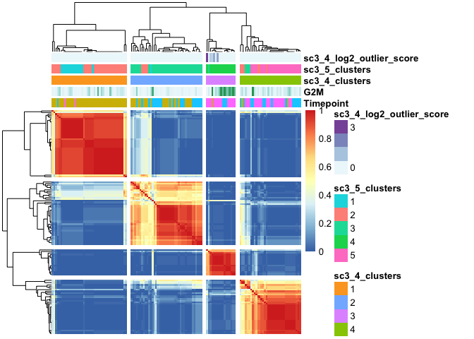<!-- -->

```r
sc3_plot_silhouette(sce.plot, k=4)
```

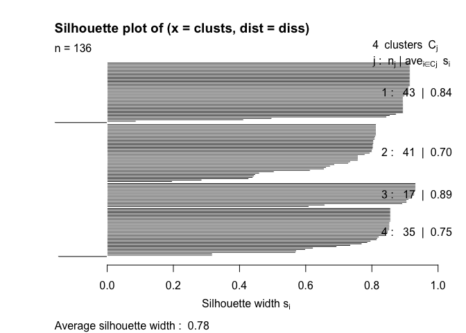<!-- -->

```r
sc3_plot_cluster_stability(sce.plot, k=4)
```

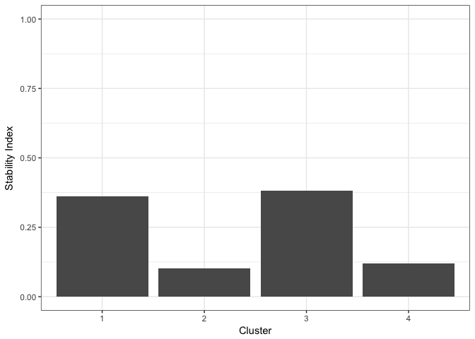<!-- -->
You can see that this cluster stays constant when we raise k to 5, except for one cell. With k=5, the stability of this cluster is the highest.

What are the genes that are differentially expressed in these clusters? Let's first take a look with the default, rather stringent settings.

```r
sc3_plot_de_genes(sce.plot, k=4, p.val=0.01,
                  show_pdata=c(
                      'Timepoint', 'sc3_4_clusters',
                      'G1', 'S', 'G2M', 'cell_cycle_phase'
                  ))
```

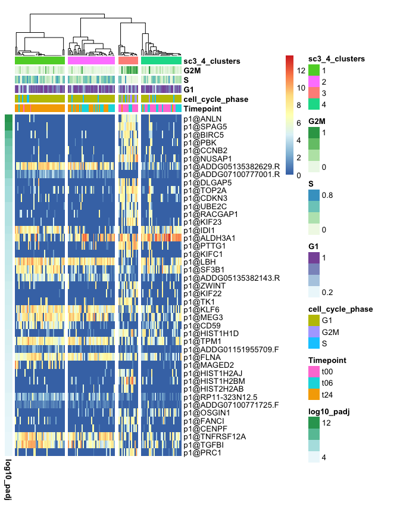<!-- -->

What about markers?

```r
sc3_plot_markers(sce.plot, k=4, auroc=0.85,
                 show_pdata=c(
                     "Timepoint",
                     "sc3_4_clusters",
                     "G1", "S", "G2M", "cell_cycle_phase"
                 ))
```

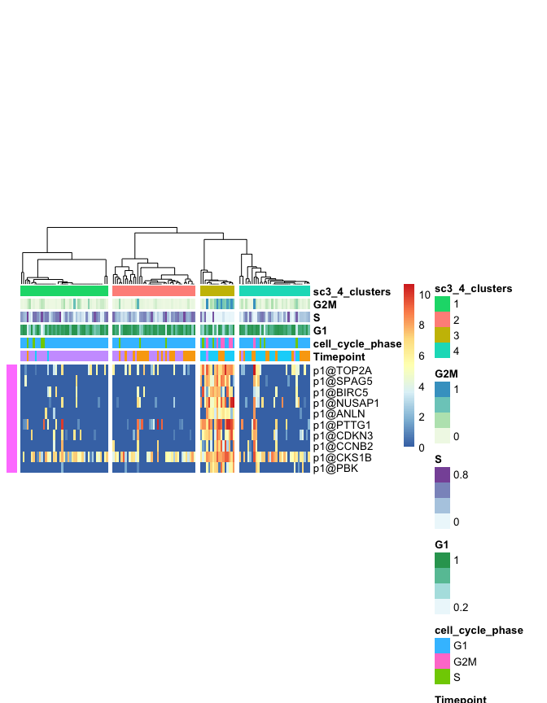<!-- -->

Surprisingly, SERPINE1/2 are not found in the list of DE genes.


```r
tab <- data.frame(Timepoint=sce$Timepoint, Clusters=paste0('cluster', sce$sc3_4_clusters))
knitr::kable(plyr::ddply(tab, 'Clusters', function(x) {table(x$Timepoint)}))
```


Clusters    t00   t06   t24
---------  ----  ----  ----
cluster1      2     1    40
cluster2      0    21    20
cluster3     13     3     1
cluster4     20    13     2

Cluster 1 is almost exclusively t24, whereas cluster3 is mostly t00. The other two clusters are intermediate mixes of t00/t06 or t06/t24. 

Looking at Cluster 3, we can see that only this cluster has different distribution of G2M and S scores. The marker genes for this cluster are all cell-cycle related genes. What is also clear is that this cluster is the most prominent, besides the cluster consisting of t24 cells. Combined with the fact that most of the cells in this cluster come from t00, it is likely that these are cells that are not properly synchronized for their cell cycle.

Let's see where they belong on the diffusion map.

```r
p <- scater::plotDiffusionMap(sce, feature_set=chosen, colour_by='Timepoint')
tab <- data.frame(p$data[,1:2], Timepoint=sce$Timepoint, Clusters=paste0('cluster', sce$sc3_4_clusters), G2M=sce$G2M)

p1 <- ggplot(tab, aes(x=DC1, y=DC2, color=Clusters)) + geom_point() + fontsize + ggtitle("SC3 Clusters") 
p2 <- ggplot(tab, aes(x=DC1, y=DC2, color=G2M)) + geom_point() + fontsize + ggtitle("G2M") + scale_color_gradient(low="blue", high="red")
scater::multiplot(p1, p2, cols=2)
```

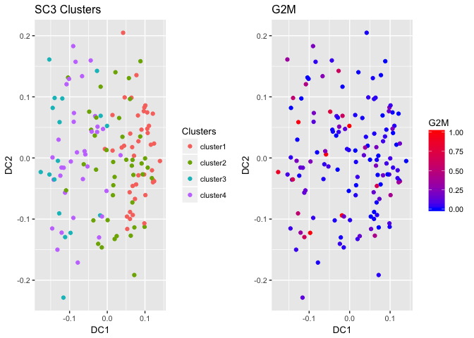<!-- -->

```r
rm(p, tab, p1, p2)
```

Consistent with other observations, most of the Cluster 3 cells are found at the beginning of the diffusion map trajectory, on the right side. 

There are:

k | Number of G2M cells
--|--------------------
4 | 17
5 | 16
6 | 16

So the number of G2M cells stays between 16 to 17 cells even if you increase k.


```r
plot(sce$G2M[order(sce$G2M)], col='red', type='l')
points(sce$S[order(sce$G2M)], col='blue', type='l')
legend('topleft', legend=c('G2M','S'), col=c('red','blue'), pch=16)
```

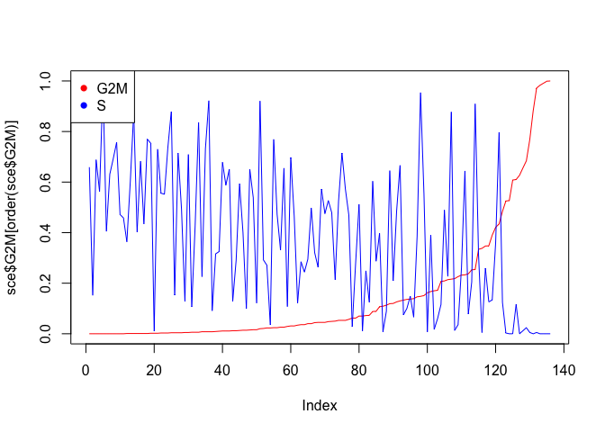<!-- -->

The distribution of G2M and S scores sorted by increasing G2M score supports this number as well (the last ~20 cells show marked increase in G2M and decrease in S).

Let's label the cluster 3 markers as cell cycle markers. 

```r
# first, let's make a tally of the cluster3-specific genes
cc.markers <- rownames(sce)[rowData(sce)$sc3_4_markers_clusts == 3]
cc.markers <- cc.markers[!is.na(cc.markers)]
cc.markers <- cc.markers[rowData(sce[cc.markers,])$sc3_4_markers_padj < 1]
```

For convenience, let's label sc3_4_clusters as sc3. 

```r
sce$sc3 <- paste0('cluster', sce$sc3_4_clusters)

sample.colors$sc3 <- RColorBrewer::brewer.pal(length(unique(sce$sc3)), 'Set2')
names(sample.colors$sc3) <- unique(sce$sc3)

rm(sce.plot) # no longer needed
```

------

# Pseudotime Analysis with TSCAN

Based on the normalized and batch-corrected single cell C1 CAGE data, we perform pseudo-time analysis. Here, we will be using the TSCAN package (Ji and Ji, NAR 2016). 

## Constructing Pseudotime

The first step in TSCAN analysis is to use the built-in pre-processing step to remove lowly expressed promoters and convert to log2 values. Based on these values, clusters are created within the specified range. We first perform dimensional reduction using PCA and model-based clustering. This is carried out by the function exprmclust().

But...we have our own pre-processed data that is already converted to log2 values. Use those instead. TSCAN's exprmclust function cannot handle the entire normalized table. Based on our analyses so far, we should select the key promoters to be used for the pseudotime construction.


```r
# go with a generous p value cutoff. 
sc3.proms <- unique(c(rownames(sce)[rowData(sce)$sc3_4_de_padj < 0.1],            
                      rownames(sce)[rowData(sce)$sc3_4_markers_auroc > 0.5 & rowData(sce)$sc3_4_markers_padj < 0.1],
                      rownames(sce)[rowData(sce)$sc3_5_de_padj < 0.1],
                      rownames(sce)[rowData(sce)$sc3_5_markers_auroc > 0.5 & rowData(sce)$sc3_5_markers_padj < 0.1]))

sc3.proms <- sc3.proms[!is.na(sc3.proms)] # 127
sum(sc3.proms %in% cc.markers) # 56
```

```
## [1] 56
```

```r
length(intersect(sc3.proms, chosen)) # 12
```

```
## [1] 13
```

```r
length(intersect(sc3.proms, hvg.out$clusterID)) # 24
```

```
## [1] 25
```

Surprisingly, there are only 12 promoters found in both lists (24 if we consider the entire hvg.out table). Perhaps the pseudotime should be constructed with a combination of the two sets. Let's keep the cell cycle markers to make sure we get good separation of these out of sync cells.


```r
tscan.proms <- unique(c(sc3.proms, chosen, hvg.out$clusterID[1:100])) 
exp.mclust <- TSCAN::exprmclust(logcounts(sce)[tscan.proms,], clusternum=4:6)

sce$tscan <- paste0('state', exp.mclust$clusterid)

# TSCAN's singlegeneplot function is tricky to customize. Let's just use the default colours used by TSCAN to make sure
# everything is consistent.
sample.colors$tscan <- scales::hue_pal()(length(unique(sce$tscan)))
names(sample.colors$tscan) <- sort(unique(sce$tscan))
```

Visualize the constructed clusters.

```r
# filtering by TSCAN
p1 <- TSCAN::plotmclust(exp.mclust, cell_name_size=2) + fontsize + ggtitle("TSCAN Layout")

tab <- data.frame(exp.mclust$pcareduceres, Time=sce$Timepoint, TSCAN=sce$tscan, SC3=sce$sc3)

p2 <- ggplot(tab, aes(x=PC1, y=PC2, colour=Time)) + geom_point() + ggtitle("By Time Points") +  scale_color_manual(values=sample.colors$Timepoint[tab$Time])
p3 <- ggplot(tab, aes(x=PC1, y=PC2, colour=TSCAN)) + geom_point() + ggtitle("By TSCAN States")
p4 <- ggplot(tab, aes(x=PC1, y=PC2, colour=SC3)) + geom_point() + ggtitle("By SC3 Clusters") +  scale_color_manual(values=sample.colors$sc3[tab$SC3])

scater::multiplot(p1, p2, p3, p4, cols=2)
```

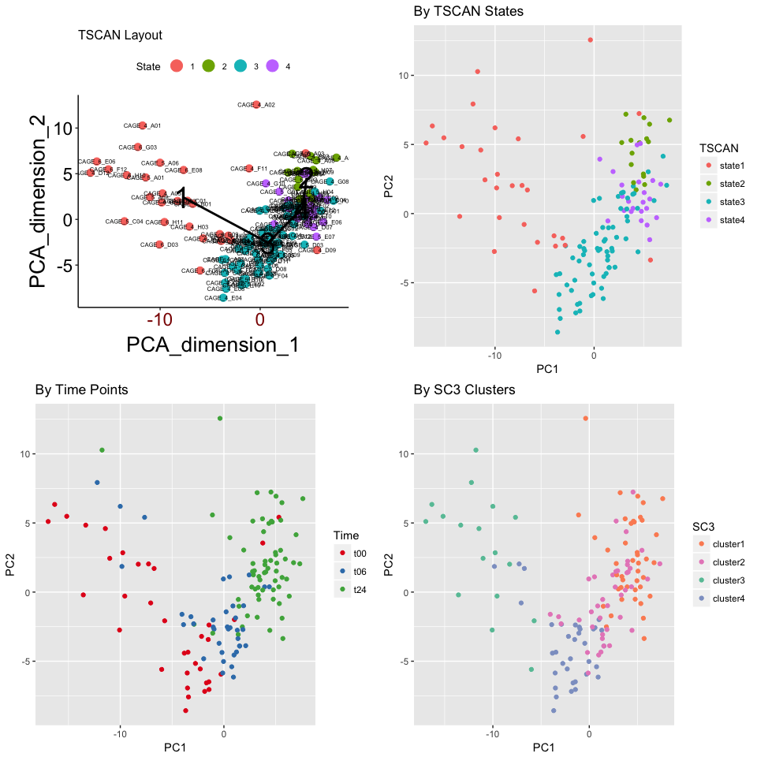<!-- -->


```r
plyr::ddply(tab, 'TSCAN', function(x) {table(x$Time)})
```

```
##    TSCAN t00 t06 t24
## 1 state1  16   8   5
## 2 state2   2   0  14
## 3 state3  17  29  22
## 4 state4   0   1  22
```

```r
plyr::ddply(tab, 'TSCAN', function(x) {table(x$SC3)})
```

```
##    TSCAN cluster1 cluster2 cluster3 cluster4
## 1 state1        3        4       17        5
## 2 state2       12        4        0        0
## 3 state3        7       31        0       30
## 4 state4       21        2        0        0
```

Now we can construct the pseudotime. Let's visualize the expression levels of the 4 marker promoters that we can identify from this process along the pseudotime axis. Also, now is a good time to change the TSCAN state names so that they are ordered in agreement with the pseudotime.


```r
tscan.order <- TSCAN::TSCANorder(exp.mclust, orderonly=FALSE)
sce$pseudotime <- tscan.order[colnames(sce),'Pseudotime']

# there seems to be inconsistency between the manual and the actual difftest function. Instead of taking the original
# TSCANorder result data frame, it requires a character vector
diff.tscan <- TSCAN::difftest(scater::norm_exprs(sce)[tscan.proms,], tscan.order$sample_name)
diff.tscan <- diff.tscan[order(diff.tscan$qval),]

# change state names
tscan.order$State <- rep(1:4, table(tscan.order$State)[unique(tscan.order$State)])
sce$tscan <- paste0('state', tscan.order[colnames(sce),'State'])
```

First we look at the expression profiles of the 4 marker genes along the pseudotime.

```r
markers <- dplyr::filter(annot, clusterName %in% c('p1@ALDH3A1','p1@SERPINE1','p1@SERPINE2','p1@RBM3'))$clusterID
names(markers) <- c('p1@ALDH3A1','p1@SERPINE1','p1@SERPINE2','p1@RBM3')
pseudotime_plot_by_ids(markers)
```

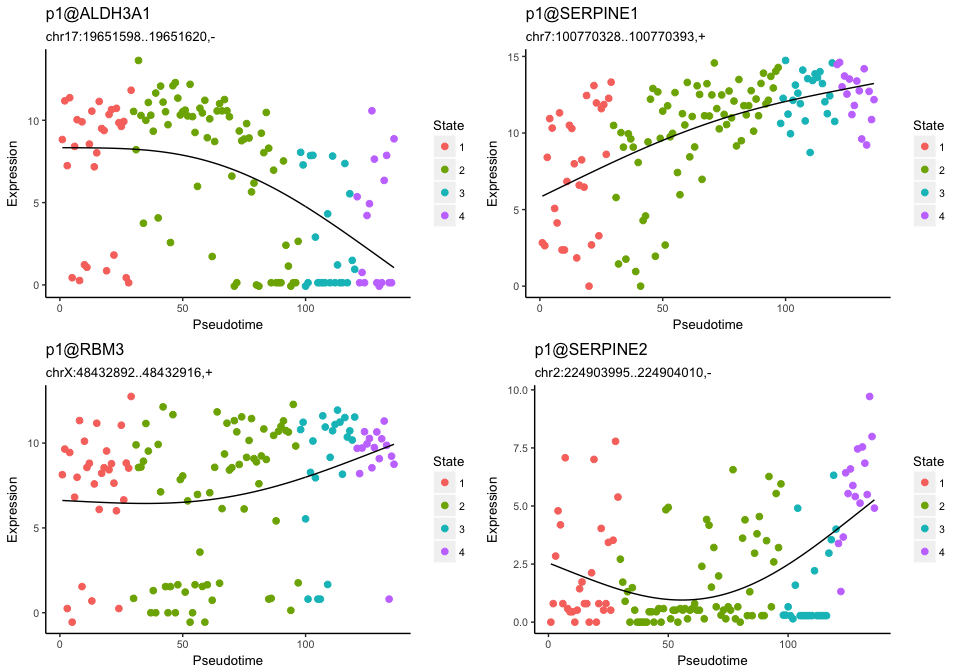<!-- -->


```r
tab <- data.frame(t(scater::norm_exprs(sce)[markers,]), exp.mclust$pcareduceres, 
                  Time=sce$Timepoint, TSCAN=sce$tscan, SC3=sce$sc3, G2M=sce$G2M)
colnames(tab)[1:4] <- names(markers)

p1 <- ggplot(tab, aes(x=PC1, y=PC2, colour=Time)) + geom_point() + ggtitle("By Time Points") +  scale_color_manual(values=sample.colors$Timepoint[tab$Time])
p2 <- ggplot(tab, aes(x=PC1, y=PC2, colour=TSCAN)) + geom_point() + ggtitle("By TSCAN States")
p3 <- ggplot(tab, aes(x=PC1, y=PC2, colour=`p1@ALDH3A1`)) + geom_point() + ggtitle("p1@ALDH3A1") 
p4 <- ggplot(tab, aes(x=PC1, y=PC2, colour=`p1@SERPINE1`)) + geom_point() + ggtitle("p1@SERPINE1") 
p5 <- ggplot(tab, aes(x=PC1, y=PC2, colour=G2M)) + geom_point() + ggtitle("G2M") 
scater::multiplot(p1, p2, p3, p4, p5, cols=2)
```

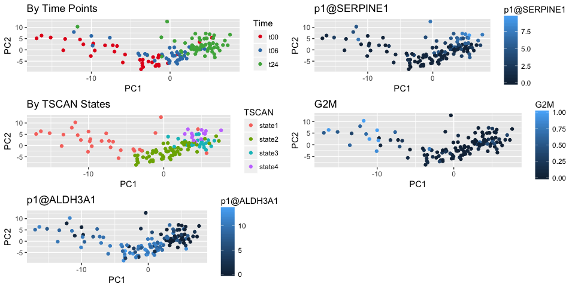<!-- -->

```r
# manuscript figure 2
pdf(file.path(dirs$manuscript, "Fig2/time_vs_tscan_PCA.pdf"))
scater::multiplot(p1, p2, p3, p4, p5, cols=2)
dev.off()
```

```
## quartz_off_screen 
##                 2
```

```r
rm(p1, p2, p3, p4, p5)
```

One question is: how do ALDH3A1 and SERPINE1 relate to each other? Can their expression levels be the main indicators of the cellular states for TGF-beta activation?

```r
p1 <- ggplot(tab, aes(x=`p1@ALDH3A1`, y=`p1@SERPINE1`, colour=Time)) + geom_point() + fontsize + ggtitle("ALDH3A1 vs. SERPINE1: Time") + scale_color_manual(values=sample.colors$Timepoint[sce$Timepoint])
p2 <- ggplot(tab, aes(x=`p1@ALDH3A1`, y=`p1@SERPINE1`, colour=SC3)) + geom_point() + fontsize + ggtitle("ALDH3A1 vs. SERPINE1: SC3") + scale_color_manual(values=sample.colors$sc3[sce$sc3])
p3 <- ggplot(tab, aes(x=`p1@ALDH3A1`, y=`p1@SERPINE1`, colour=TSCAN)) + geom_point() + fontsize + ggtitle("ALDH3A1 vs. SERPINE1: TSCAN") + scale_color_manual(values=sample.colors$tscan[sce$tscan])

scater::multiplot(p1, p2, p3, cols=3)
```

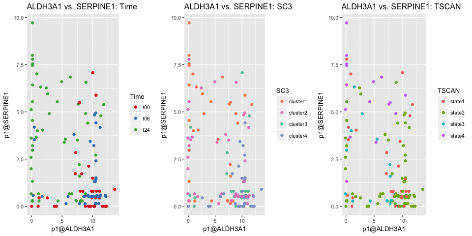<!-- -->

```r
rm(tab, p1, p2, p3)
```

Time is actually almost perfectly represented by these two promoters. The trend is:

* t00: high ALDH3A1 and low SERPINE1

* t06: high ALDH3A1 and high SERPINE1

* t24: low ALDH3A1 and high SERPINE1

--------


