# Overview

Based on the normalized and batch-removed TGFbeta timecourse C1 CAGE data, we perform WGCNA to see how the promoters and enhnacers cluster together. We identify the major modules and compare their expression patterns according to the sample clusters and pseudotime. 

---------

# 1. Initial Set Up and Data Prepping

## Library loading and parameter setting

Load the necessary libraries and start process threading. Set the relevant file paths. We use the data from s3.


```r
library(tidyverse)

library(scran)
library(scater)
library(WGCNA)
```

```
## ==========================================================================
## *
## *  Package WGCNA 1.61 loaded.
## *
## *    Important note: It appears that your system supports multi-threading,
## *    but it is not enabled within WGCNA in R. 
## *    To allow multi-threading within WGCNA with all available cores, use 
## *
## *          allowWGCNAThreads()
## *
## *    within R. Use disableWGCNAThreads() to disable threading if necessary.
## *    Alternatively, set the following environment variable on your system:
## *
## *          ALLOW_WGCNA_THREADS=<number_of_processors>
## *
## *    for example 
## *
## *          ALLOW_WGCNA_THREADS=8
## *
## *    To set the environment variable in linux bash shell, type 
## *
## *           export ALLOW_WGCNA_THREADS=8
## *
## *     before running R. Other operating systems or shells will
## *     have a similar command to achieve the same aim.
## *
## ==========================================================================
```

```r
allowWGCNAThreads()
```

```
## Allowing multi-threading with up to 8 threads.
```

```r
load("~/Projects/Molecular_Network/TGFbeta_Timecourse/results/R_sessions/s3_sample_clusters.RData")
```

Set the necessary WGCNA parameters.
* mostly following the default WGCNA settings


```r
wgcna.params <- list()

# network type, topological overlap options
wgcna.params$networkType = 'signed'
wgcna.params$TOMType = 'signed'

# basic tree cut options
wgcna.params$detectCutHeight = 0.995 # dendrogram cut height for module detection
wgcna.params$deepSplit = 2 # (1,4) sensitivity for module splitting (4 = most sensitive)

# We like large modules, so we set the minimum module size relatively high
# there are too many small modules if we set to a relatively low numbers of 
# module size
# this can be change:
wgcna.params$minModuleSize = 100 # min module size for detection

# advanced tree cut options
wgcna.params$pamStage = TRUE # 2nd PAM-like stage of module detection
wgcna.params$pamRespectsDendro = FALSE

# gene reassignment and trimming from modules
# if a module does not contain at least wgcna.params$wgcna.params$minCoreKMESize genes with eigengene
# connectivity of wgcna.params$minCoreKME, module is disbanded
# genes with connectivity less than wgcna.params$minKMEtoStay are removed
wgcna.params$minCoreKME = 0.5 
wgcna.params$wgcna.params$minCoreKMESize = wgcna.params$minModuleSize / 3
wgcna.params$minKMEtoStay = 0.3
wgcna.params$reassignThreshold = 1e-6 # p-value ratio threshold for reassigning genes

# At wgcna.params$mergeCutHeight = 0.25, for modules to merge, need correlation of 0.75
# can be changed based on what modules to be merged
wgcna.params$mergeCutHeight = 0.25
```

## Helper functions

Let's set up a helper function to draw a smoothed eigengene plot for each module separately. These functions will also add a colour bar at the top of each plot to represent the cell states according to time, SC3 or TSCAN.


```r
# type = which annotation to add as the colour bar
draw_wgcna_pc <- function(MEs, pd, type, lowY=-0.2, highY=0.2)
{
    marks <- table(pd[,type])
    p <- list()
    for (mod in colnames(MEs)) 
    {
        tab <- data.frame(pd, val=MEs[,mod])
        tab <- tab[order(tab[,type]),]
        if (type == 'tscan') {
            tab <- tab[order(tab$pseudotime),]
        }
        marks <- table(pd[,type])
        tab$Sample <- 1:nrow(MEs)
        
        p[[mod]] <- ggplot(tab, aes(x=Sample, y=val, group=1)) +
            geom_smooth(colour=mod, span=0.3) + ylim(lowY, highY) +
            geom_point(y=highY, aes(x=Sample, colour=tab[,type]), shape=15) + 
            geom_hline(yintercept=0) + 
            ggtitle(mod) + 
            guides(color=guide_legend(title=type)) +
            fontsize
        prev <- 0
        for (i in 1:(length(marks)-1))
        {
            p[[mod]] <- p[[mod]] + geom_vline(xintercept=marks[i] + prev, linetype='dashed')
            prev <- prev + marks[i]
        }
    }
    p
}
```

## Data preparation

Prepare the WGCNA input table. This should be a subset of the whole promoter/enhancer set.
Use the pre-calculated expression variance table to select those with mean > 0.5 and |biological variatio|) > median.

* We want to restrict ourselves to reasonably expressed set of promoters, as too many lowly-expressed ones will simply add noise.
* WGCNA authors recommend against filtering by differential expression, but we do want to focus on those that show some variation in expression.


```r
# choose promoters that show some variation as the WGCNA input set
wgcna.proms <- rownames(var.out)[abs(var.out$bio) >= median(abs(var.out$bio)) & var.out$mean >= median(var.out$mean) &  rownames(var.out) %in% rownames(sce)[!isSpike(sce)]]

# make sure to include all TSCAN promoters
wgcna.proms <- sort(union(wgcna.proms, tscan.proms))

# to avoid confusion with functional analysis from minor promoters, restrict ourselves to the top most expressed promoter
# per gene
a <- dplyr::filter(annot, clusterID %in% wgcna.proms) %>% select(clusterID, clusterName, geneNameStr) %>% dplyr::mutate(sum=rowSums(norm_exprs(sce)[clusterID,])) %>% group_by(geneNameStr) %>% top_n(sum, n=1)
wgcna.proms <- a$clusterID
names(wgcna.proms) <- rowData(sce[wgcna.proms,])$clusterName

wgcna.input <- t(norm_exprs(sce)[wgcna.proms,])

# For better readability, let's rearrange the samples in the order of Timepoint, then by TSCAN clusters.
tab <- tibble(Sample=colnames(sce), Timepoint=sce$Timepoint, tscan=sce$tscan)
tab <- dplyr::arrange(tab, Timepoint, tscan)
wgcna.input <- wgcna.input[tab$Sample,]

# for convenience, set up colors again
wgcna.cols <- list()
wgcna.cols$Timepoint <- sample.colors$Timepoint[colData(sce)[rownames(wgcna.input),'Timepoint']]
wgcna.cols$sc3 <- sample.colors$sc3[colData(sce)[rownames(wgcna.input),'sc3']]
wgcna.cols$tscan <- sample.colors$tscan[colData(sce)[rownames(wgcna.input),'tscan']]

#Before clustering, check for entries with too many missing values.

gsg <- goodSamplesGenes(wgcna.input,verbose=3)
```

```
##  Flagging genes and samples with too many missing values...
##   ..step 1
```

```r
# remove offending genes
# I can just use gsg as input index
if (!gsg$allOK)
{
	if (sum(!gsg$goodGenes) > 0)
		printFlush(paste("Removing genes:", paste(names(wgcna.input)[!gsg$goodGenes], collapse=", ")));
	if (sum(!gsg$goodSamples) > 0)
		printFlush(paste("Removing samples:", paste(rownames(wgcna.input)[!gsg$goodSamples], collapse=", ")));
	wgcna.input <- wgcna.input[gsg$goodSamples, gsg$goodGenes]
}

rm(gsg, tab, a)

dim(wgcna.input)
```

```
## [1]  136 6028
```

```r
# wgcna.params$maxBlockSize set to 10000, as we have ~6000 promoters
wgcna.params$maxBlockSize = 10000
```

We are left with 6028 rows, of which 118 are enhancers.

## Initial data exploration with PCA

Before we go any further, see how the samples cluster together with the filtered set of promoters as a sanity check.


```r
res.pca <- FactoMineR::PCA(wgcna.input, scale.unit=TRUE, ncp=5, graph=F)

FactoMineR::plot.PCA(res.pca, axes=c(1,2), choix='ind', col.ind=wgcna.cols$Timepoint, label='none', title='PCA: Filtered Samples')
legend("topright", legend=names(sample.colors$Timepoint), col=sample.colors$Timepoint, pch=16, cex=0.6)
```

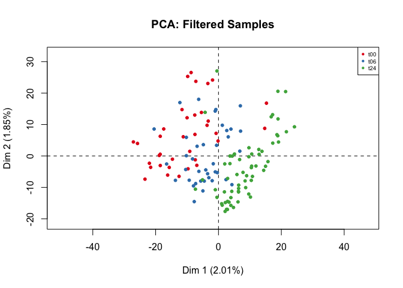<!-- -->

The PCA plot shows the expected distribution, with relatively good separation between t00 and t24, while t06 is mixed in between the two.

If we look at the top (cos^2 cutoff of 0.3) contributing variables to the first 2 principle components:

```r
# which CAGE promoters get the top cosine values?
dplyr::filter(annot, clusterID %in% rownames(res.pca$var$cos2)[apply(res.pca$var$cos2[,1:2], 1, sum) > 0.3])$clusterName
```

```
##  [1] "p3@SCD"               "p1@KLF6"              "p3@RDX"              
##  [4] "p1@HSPA8"             "p1@FTH1"              "p1@FTH1P16"          
##  [7] "p2@TXNRD1"            "p1@FTH1P7"            "p1@MEG3"             
## [10] "p1@NUSAP1"            "p1@TPM1"              "p1@KIF23"            
## [13] "p1@PRC1"              "p1@MRPS34"            "p1@TNFRSF12A"        
## [16] "p1@SLC7A5"            "p1@SPAG5"             "p1@ADDG17033478266.R"
## [19] "p1@TOP2A"             "p1@PFN1"              "p1@C1QBP"            
## [22] "p1@BIRC5"             "p1@ADDG17079478966.F" "p1@ACTG1"            
## [25] "p1@FASN"              "p1@JUNB"              "p1@PLAUR"            
## [28] "p1@S100A11"           "p1@PDXK"              "p1@ADDG02133038650.R"
## [31] "p1@SERPINE2"          "p1@FTH1P3"            "p1@LBH"              
## [34] "p1@TGFBI"             "p1@ADDG05135382143.R" "p1@ADDG05135382629.R"
## [37] "p1@ITGA2"             "p1@SERPINE1"          "p1@ADDG07100777001.R"
## [40] "p1@HSPA8P8"           "p1@ANLN"              "p1@ADDG07005566885.F"
## [43] "p1@ACTB"              "p1@DAGLB,p1@KDELR2"   "p1@SLC39A14"         
## [46] "p1@PBK"               "p1@FTH1P11"           "p1@FTH1P12"          
## [49] "p1@ANXA2P2"           "p1@ALDH1A1"           "p1@ADDG0X108297700.F"
## [52] "p1@FTH1P8"            "p1@FLNA"
```

```r
rm(res.pca)
```

---------

# 2. Network Building

This is where the main WGCNA is performed. It is performed in a number of stages, from power parameter selection to intial clustering to merging of clusters. 

## Threshold selection

We first need to select the power threshold to ensure we get reasonable scale independence.

```r
#
# a. Selection of power threshold
#

# choose a set of soft-thresholding powers
powers = c(c(1:10), seq(from=12, to=20, by=2))

# call the network topology analysis function
sft <- pickSoftThreshold(wgcna.input, powerVector=powers, verbose=5)
```

```
## pickSoftThreshold: will use block size 6028.
##  pickSoftThreshold: calculating connectivity for given powers...
##    ..working on genes 1 through 6028 of 6028
##    Power SFT.R.sq  slope truncated.R.sq  mean.k. median.k.  max.k.
## 1      1    0.721 -17.40          0.742 4.31e+02  4.27e+02 577.000
## 2      2    0.949  -9.96          0.940 4.84e+01  4.73e+01  93.700
## 3      3    0.979  -6.10          0.983 7.10e+00  6.78e+00  22.000
## 4      4    0.924  -3.95          0.950 1.28e+00  1.18e+00   7.550
## 5      5    0.970  -2.84          0.982 2.86e-01  2.37e-01   3.760
## 6      6    0.963  -2.29          0.953 8.11e-02  5.39e-02   2.510
## 7      7    0.955  -1.87          0.970 3.11e-02  1.35e-02   1.880
## 8      8    0.951  -1.54          0.975 1.62e-02  3.70e-03   1.480
## 9      9    0.972  -1.32          0.986 1.06e-02  1.08e-03   1.200
## 10    10    0.934  -1.20          0.921 7.94e-03  3.34e-04   0.988
## 11    12    0.991  -1.09          0.991 5.34e-03  3.53e-05   0.857
## 12    14    0.977  -1.13          0.978 3.99e-03  4.21e-06   0.835
## 13    16    0.965  -1.14          0.958 3.13e-03  5.29e-07   0.814
## 14    18    0.383  -1.43          0.252 2.54e-03  6.92e-08   0.793
## 15    20    0.335  -1.64          0.194 2.11e-03  9.36e-09   0.773
```

```r
# plot the results
par(mfrow=c(1,2))
cex1 = 0.9

# scale-free topology fit index as a function of the soft-thresholding power
plot(sft$fitIndices[,1],
	 -sign(sft$fitIndices[,3])*sft$fitIndices[,2],
	 xlab='Soft Threshold (power)', 
	 ylab='Scale Free Topology Model Fit, signed R^2',
	 type='n', main=paste('Scale Independence'))
text(sft$fitIndices[,1],
	 -sign(sft$fitIndices[,3])*sft$fitIndices[,2], labels=powers, 
	 cex=cex1, col='red')
abline(h=0.90, col='red')

# mean connectivity as a function of the soft-thresholding power
plot(sft$fitIndices[,1], sft$fitIndices[,5], 
	 xlab='Soft Threshold (power)', ylab='Mean Connectivity', type='n',
	 main=paste('Mean connectivity'))
text(sft$fitIndices[,1], sft$fitIndices[,5], labels=powers, 
	 cex=cex1, col='red')
```

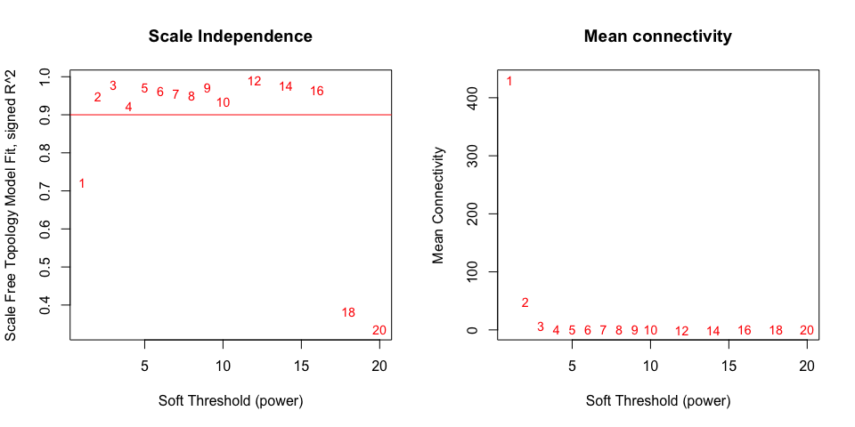<!-- -->

Choosing the threshold of 5 should be satisfactory.


```r
# selected power thresholds
wgcna.params$softPower <- 5

rm(sft, powers, cex1)
```

## Main WGCNA Computation

Now to the main body of the calculations. The reference WGCNA pipeline produces many intermediate plots such as dendrograms, but we will skip those steps here.


```r
#
# b. Module Clustering based on Topological Overlap Matrix (TOM)
# - TOMs are saved in separate RData files for space/memory management
# - adjacency and dissTOM (1-TOM) matrices are not kept
#

# Adjacency matrix
adjacency <- adjacency(wgcna.input, power=wgcna.params$softPower, type=wgcna.params$networkType)

# Topological Overlap Matrix (TOM)
# Turn adjacency into topological overlap
TOM <- TOMsimilarity(adjacency);
```

```
## ..connectivity..
## ..matrix multiplication..
## ..normalization..
## ..done.
```

```r
colnames(TOM) <- colnames(adjacency)
rownames(TOM) <- rownames(adjacency)

dissTOM <- 1-TOM

# Call the hierarchical clustering function
peakTree <- hclust(as.dist(dissTOM), method="average");

# Plot the resulting clustering tree (dendrogram)
#pdf(file.path(dirs$manuscript, "p1_peakClustering.pdf"), height=10, width=15)
#plot(peakTree, xlab="", sub="", main = "Peak clustering on TOM-based dissimilarity", labels = FALSE, hang = 0.04);
#dev.off()

# Module identification using dynamic tree cut:
# try smaller wgcna.params$minModuleSize...
#wgcna.params$minModuleSize = 100
dynamicMods <- cutreeDynamic(dendro=peakTree, method="hybrid", distM=dissTOM, 
							 cutHeight=wgcna.params$detectCutHeight, deepSplit=wgcna.params$deepSplit, 
							 pamRespectsDendro=FALSE,
							 minClusterSize=wgcna.params$minModuleSize, verbose = 2);
```

```
##  ..done.
```

```r
table(dynamicMods)
```

```
## dynamicMods
##    1    2    3    4    5 
## 2223 1775 1041  825  164
```

```r
# Convert numeric lables into colors
dynamicColors <- labels2colors(dynamicMods)
table(dynamicColors)
```

```
## dynamicColors
##      blue     brown     green turquoise    yellow 
##      1775      1041       164      2223       825
```

```r
#
# c. Merging of modules whose expression profiles are very similar
#

# Calculate eigengenes
MEList <- moduleEigengenes(wgcna.input, colors=dynamicColors, softPower=wgcna.params$softPower, nPC=1)
MEs = MEList$eigengenes
rownames(MEs) <- rownames(wgcna.input)

# Calculate dissimilarity of module eigengenes
MEDiss <- 1-cor(MEs);

# Cluster module eigengenes
METree <- hclust(as.dist(MEDiss), method="average");

# Call an automatic merging function
merge = mergeCloseModules(wgcna.input, dynamicColors, cutHeight=wgcna.params$mergeCutHeight, verbose=3)
```

```
##  mergeCloseModules: Merging modules whose distance is less than 0.25
##    multiSetMEs: Calculating module MEs.
##      Working on set 1 ...
##      moduleEigengenes: Calculating 5 module eigengenes in given set.
##    Calculating new MEs...
##    multiSetMEs: Calculating module MEs.
##      Working on set 1 ...
##      moduleEigengenes: Calculating 5 module eigengenes in given set.
```

```r
# The merged module colors
mergedColors = merge$colors;

# Eigengenes of the new merged modules:
mergedMEs = merge$newMEs;

table(mergedColors)
```

```
## mergedColors
##      blue     brown     green turquoise    yellow 
##      1775      1041       164      2223       825
```

```r
#
# In the subsequent analyses, we will use the merged module colors in 
# mergedColors.
#

# Rename to moduleColors
moduleColors = mergedColors
names(moduleColors) = colnames(wgcna.input) # for convenience
moduleNames <- unique(moduleColors)

# free space
rm(merge, dynamicColors, dynamicMods, mergedColors, peakTree, MEList, MEDiss, METree)
rm(TOM)

# Construct numerical labels corresponding to the colors
# Note: label 0 and color grey are for unassigned genes
colorOrder = c("grey", standardColors(50));
moduleLabels = match(moduleColors, colorOrder)-1;
MEs = mergedMEs;
rownames(MEs) <- rownames(wgcna.input)
rm(mergedMEs)

# unique module names, in order of MEs
colnames(MEs) = substring(names(MEs), 3)

rm(colorOrder, moduleLabels)
```

---------

# 3. Module inspection

Now that the WGCNA modules have been created, let's look at their characteristics.

## Module Sizes and Inter-Comparison

First, the module sizes.

```r
par(mfrow=c(1,1))
barplot(sort(table(moduleColors)), 
		col=names(sort(table(moduleColors))), 
		cex=0.8, cex.axis=0.8, cex.lab=0.8, las=2,
		main=paste0("WGCNA Module Sizes"),
		ylab="Module Sizes")
```

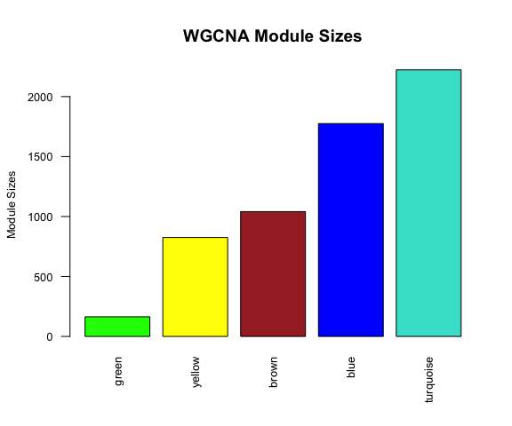<!-- -->

We obtain 4 main modules, each with reasonable number of promoters. Our aggressive filtering based on variance and mean expression seems to have removed much noise. The turquoise is the largest. 

How do the modules compare to each other?

```r
# ME dendrogram + heatmap
par(cex = 0.7)
plotEigengeneNetworks(MEs, "", marDendro=c(0,4,1,13), marHeatmap=c(3,4,1,2), 
					  printAdjacency=FALSE, cex.adjacency = 0.5, 
					  plotPreservation="both", cex.preservation = 0.5)
```

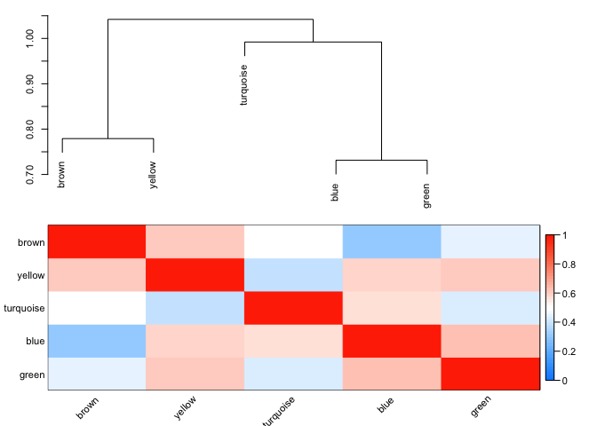<!-- -->

## Principle Components: module eigengene profiles (representation profile )

Module eigengene profiles show the representative behaviours of the features belonging to a given module across the samples. For better readability, let's sort the samples by Timepoint, then by TSCAN cluster.


```r
PCvalues <- MEs
namesSamp <- as.character(rownames(wgcna.input))

par(mar=c(7,4,3,2), las=2, cex.axis=0.7, cex.lab=0.7)
ylim = c(signif(min(PCvalues), digits=1) - 0.1, signif(max(PCvalues), digits=1) + 0.1)
plot(smooth.spline(PCvalues[,1],spar=0.4), xlab="", type="n", ylim=ylim, ylab="First Principal Component", axes=F, main=" Modules")

for (mod in 1:length(PCvalues)) 
{
	lines(smooth.spline(PCvalues[,mod],spar=0.4), col=colnames(MEs)[mod], lwd=4)
}
rm(mod)

abline(h=0)

axis(1,at=1:length(namesSamp), labels=namesSamp)
axis(2, at=seq(ylim[1], ylim[2], 0.1))
legend("bottomright", colnames(MEs),fill=colnames(MEs), cex=0.5)
```

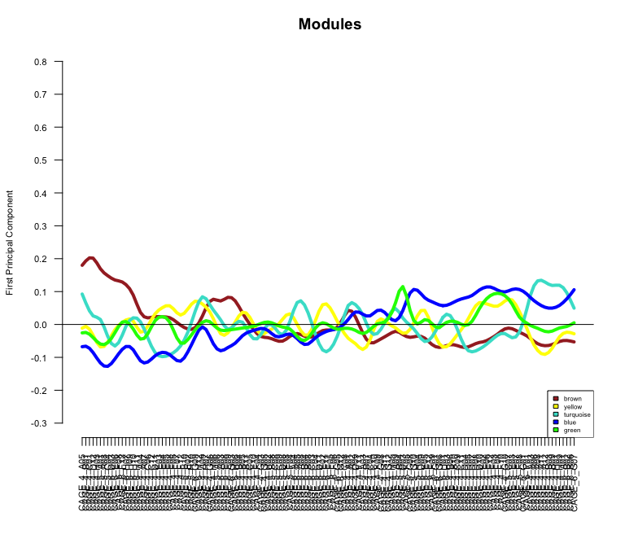<!-- -->

```r
rm(namesSamp, PCvalues, ylim)
```

This is rather confusing. Let's plot the profiles for each module separately, with the samples ordered according to the time points, TSCAN states or SC3 clusters. 
**1) By Timepoint**

```r
p <- draw_wgcna_pc(MEs=MEs, pd=colData(sce)[rownames(wgcna.input),], type='Timepoint')
multiplot(plotlist=p, cols=2)
```

```
## `geom_smooth()` using method = 'loess'
## `geom_smooth()` using method = 'loess'
## `geom_smooth()` using method = 'loess'
## `geom_smooth()` using method = 'loess'
## `geom_smooth()` using method = 'loess'
```

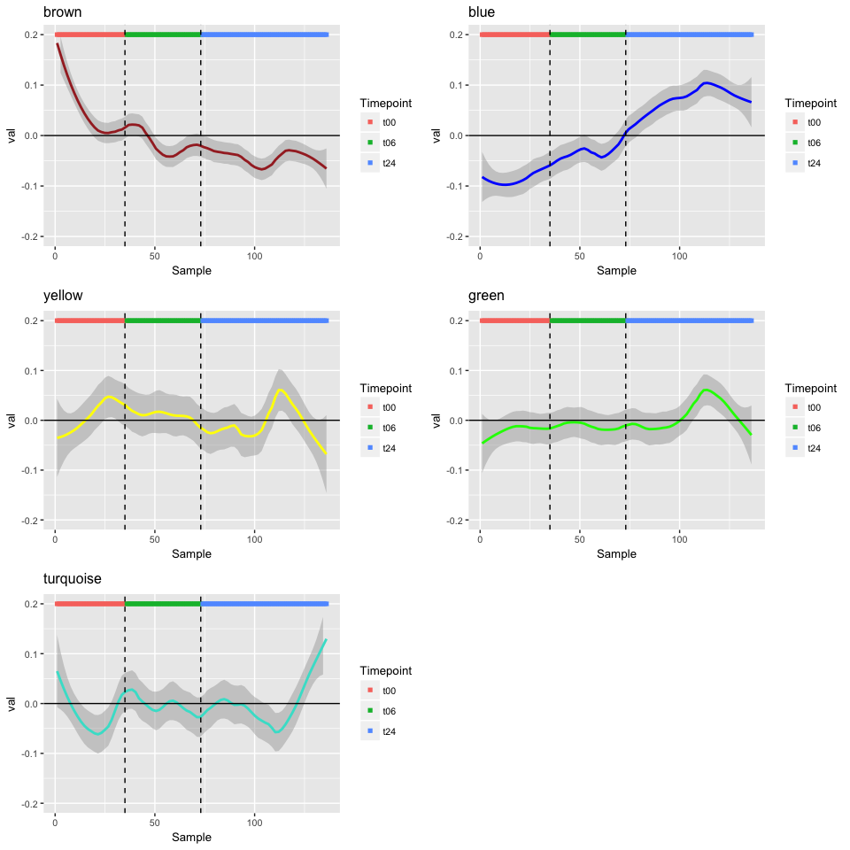<!-- -->

**2) By TSCAN**

```r
p <- draw_wgcna_pc(MEs, colData(sce)[rownames(wgcna.input),], 'tscan')
multiplot(plotlist=p, cols=2)
```

```
## `geom_smooth()` using method = 'loess'
## `geom_smooth()` using method = 'loess'
## `geom_smooth()` using method = 'loess'
## `geom_smooth()` using method = 'loess'
## `geom_smooth()` using method = 'loess'
```

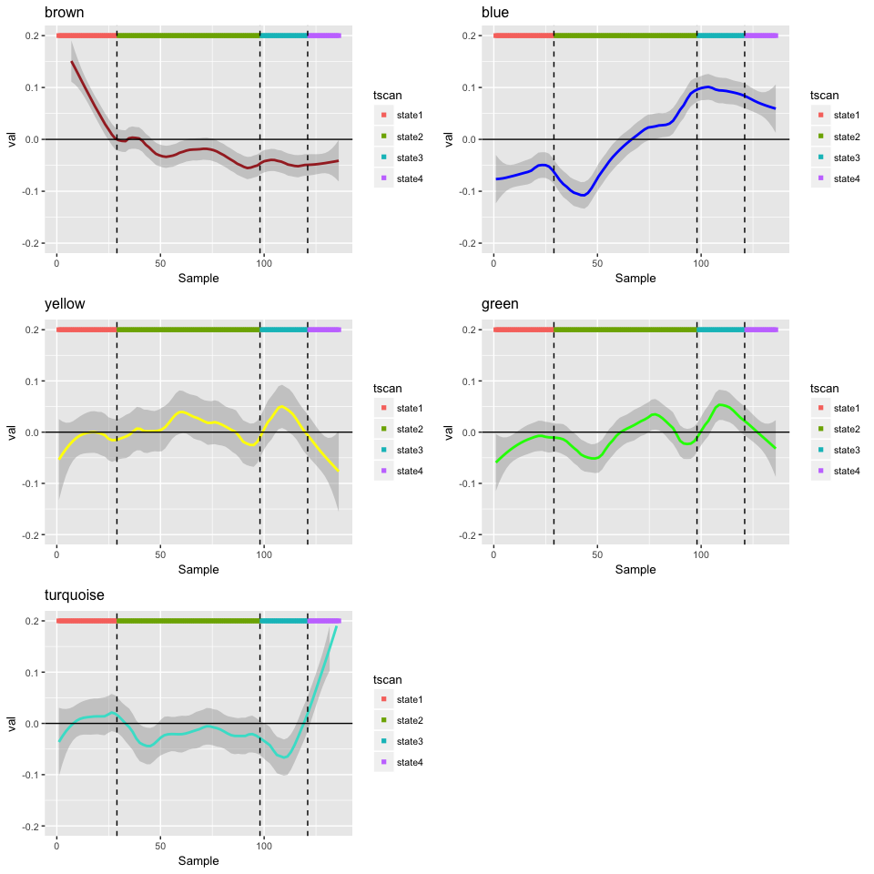<!-- -->

**3) SC3 Clustering**

```r
p <- draw_wgcna_pc(MEs, colData(sce)[rownames(wgcna.input),], 'sc3')
multiplot(plotlist=p, cols=2)
```

```
## `geom_smooth()` using method = 'loess'
## `geom_smooth()` using method = 'loess'
## `geom_smooth()` using method = 'loess'
## `geom_smooth()` using method = 'loess'
## `geom_smooth()` using method = 'loess'
```

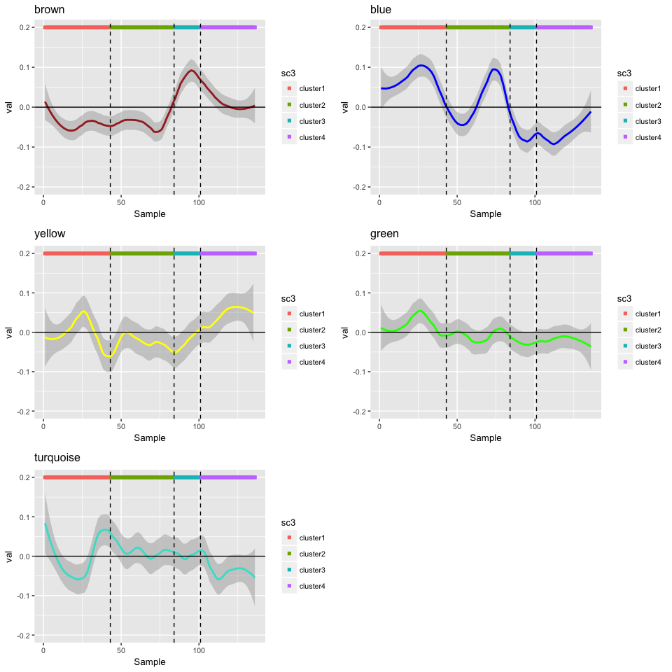<!-- -->

The yellow module shows the early peak at t00, and these likely represent those promoters responsible for the high G2M cell cycle scores in some cells we saw earlier. The brown module shows the latest peak in t24 samples, corresponding to the final TSCAN state, meaning these represent those promoters that are activated at the later stages of TGFbeta activation.

## Promoter expression levels in each module

Do any of the modules have very different spread of promoter expression?

```r
tab <- reshape2::melt(t(wgcna.input))
tab <- cbind(tab, module=moduleColors[tab$Var1])
colnames(tab) <- c('promoter','sample','expression','module')


p <- ggplot(tab, aes(module, expression))
p + geom_violin(aes(fill=module)) + scale_fill_manual(values=levels(tab$module)) + geom_boxplot(width=0.1) + xlab('Modules') + ylab('Log2 Expression') + guides(fill=guide_legend(title='Modules'))
```

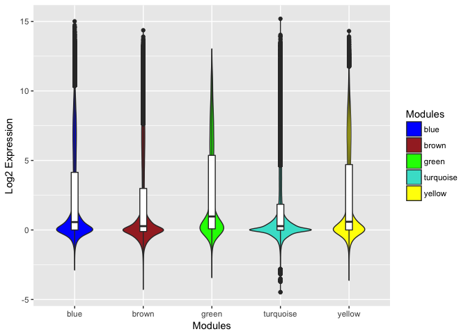<!-- -->

```r
rm(tab, p)
```

---------

# 4. Module Connectivity Calculations

We can now calculate the connectivity scores for each feature in each module. These scores represent how close each feature is to the eigengene profile of the module it belongs to. With these scores calcualted, we can save all the information in a single table.


```r
# connectivity: networkConcepts$ScaledConnectivity

#
# intramodularConnectivity
# - calculate connectivity of nodes to other nodes within the same module
#
intraConnect <- intramodularConnectivity(adjacency, moduleColors,
								  scaleByMax=FALSE)
a = intramodularConnectivity(adjacency, moduleColors, scaleByMax=TRUE)
intraConnect <- cbind(intraConnect, scaled_kWithin=as.numeric(a[,2]))
rm(a)

#rm(adjacency)

#
# Gene relationship to trait and important modules
# - Module Membership
# - KE information
#

nPeaks = ncol(wgcna.input);
nSamples = nrow(wgcna.input);

peakModuleMembership = as.data.frame(cor(wgcna.input, MEs, use = "p"));
colnames(peakModuleMembership) <- paste0(colnames(peakModuleMembership), '.cor_coef')
MMPvalue = as.data.frame(corPvalueStudent(as.matrix(peakModuleMembership), nSamples));
colnames(MMPvalue) <- paste0(colnames(MMPvalue), '.pval')

membership <- map(names(moduleColors), function(id) {
    peakModuleMembership[id, grep(moduleColors[id], colnames(peakModuleMembership))]
})
membership <- unlist(membership)
names(membership) <- names(moduleColors)

pvals <- map(names(moduleColors), function(id) {
    MMPvalue[id, grep(moduleColors[id], colnames(MMPvalue))]
})
pvals <- unlist(pvals)
names(pvals) <- names(moduleColors)

# save the information into a single table
wgcna <- dplyr::filter(annot, clusterID %in% names(moduleColors))
wgcna$module <- moduleColors[match(wgcna$clusterID, names(moduleColors))]
wgcna$corr_eigengene <- membership
wgcna$pvalue_eigengene <- pvals
intraConnect$clusterID <- rownames(intraConnect)
wgcna <- dplyr::left_join(wgcna, intraConnect, by='clusterID')

rm(nPeaks, nSamples, membership, pvals, intraConnect)
```

---------

# 5. Functional Analysis of the Modules

What can we tell about each of the modules? From the eigengene plots, we can see that the brown, blue and turquoise modules are likely to contain genes responding to TGFbeta stimulation. For more in depth look, let's perform GO enrichment analysis and Gene Set Enrichment Analysis (GSEA)>

## GO enrichment analysis
With the associated Entrez IDs, perform GO enrichment using limma's goana function. To reduce spurious genes, we restrict ourselves to those that correlate with the eigengenes of the modules they belong to. 

```r
universe <- wgcna$entrezgene_id
universe <- sub('entrezgene:', '', universe)
universe <- universe[!is.na(universe)] #14669

entrez.subsets <- map(moduleNames, function(mod) {
  genes <- dplyr::filter(wgcna, module %in% mod & pvalue_eigengene < 0.1 & abs(corr_eigengene) > 0.2) 
  sub('entrezgene:', '', genes$entrezgene_id)
})
names(entrez.subsets) <- moduleNames

# perform GO/KEGG analysis using limma
# universe already set 
go.subsets <- limma::goana(entrez.subsets, species='Hs', universe=universe, FDR=0.05)

# for display purposes, insert \n for long names
tabs <- map(moduleNames, function(mod) {limma::topGO(go.subsets, sort=mod, ontology='BP', number=10)})
names(tabs) <- moduleNames
tabs$brown$Term[5] <- "nuclear chromosome\nsegregation"
tabs$brown$Term[8] <- "sister chromatid\nsegregation"
tabs$yellow$Term[1] <- "ribonucleoprotein complex\nbiogenesis"
tabs$yellow$Term[7] <- "riobosomal large subunit\nbiogenesis"
tabs$yellow$Term[9] <- "establishment of integrated\nproviral latency"
tabs$green$Term[1] <- "mitochondrial RNA 3'-end\nprocessing"
tabs$green$Term[2] <- "cerebellar cortex\ndevelopment"
tabs$green$Term[3] <- "macromolecule metabolic\nprocess"
tabs$green$Term[4] <- "nitrogen compound\nmetabolic process"
tabs$green$Term[5] <- "positive regulation of\ncalcium-dependent\nexocytosis"
tabs$green$Term[6] <- "cerebellar coretex\nmorphogenesis"
tabs$green$Term[8] <- "negative regulation of\ndevelopmental process"
tabs$green$Term[9] <- "cellular macromolecule\nmetabolic process"
tabs$blue$Term[6] <- "supramolecular fiber\norganization"
tabs$blue$Term[8] <- "actin filament-based\nprocess"
tabs$blue$Term[9] <- "regulation of\nsupramolecular fiber\norganization"
tabs$turquoise$Term[1] <- "cardiac muscle tissue\ndevelopment"
tabs$turquoise$Term[3] <- "cytokine biosynthetic\nprocess"
tabs$turquoise$Term[4] <- "cytokine metabolic\nprocess"
tabs$turquoise$Term[5] <- "positive regulation of lipid\nlocalization"
tabs$turquoise$Term[6] <- "anatomical structure\nformation involved in\nmorphogenesis"
tabs$turquoise$Term[9] <- "myeloid leukocyte\ndifferentiation"
tabs$turquoise$Term[10] <- "multivesicular body\nassembly"

# plot
p.list <- map(c('brown','yellow','green','blue','turquoise'), function(mod) {
  tab <- tabs[[mod]]
  tab <- tab[,c('Term',paste0('P.', mod))]
  colnames(tab) <- c('Term','p.value')
  category <- factor(tab$Term)
  ggplot(tab, aes(x=reorder(category, -log10(p.value)), y=-log10(p.value))) + geom_bar(stat='identity', color=mod, fill='white') + geom_text(label=tab$Term, lineheight=0.8, y=0.1, hjust=0, size=3) + theme_bw() + theme(axis.text.y=element_blank(), axis.ticks.x=element_blank()) + labs(x='', y='') + coord_flip()
})
scater::multiplot(plotlist=p.list, cols=5)
```

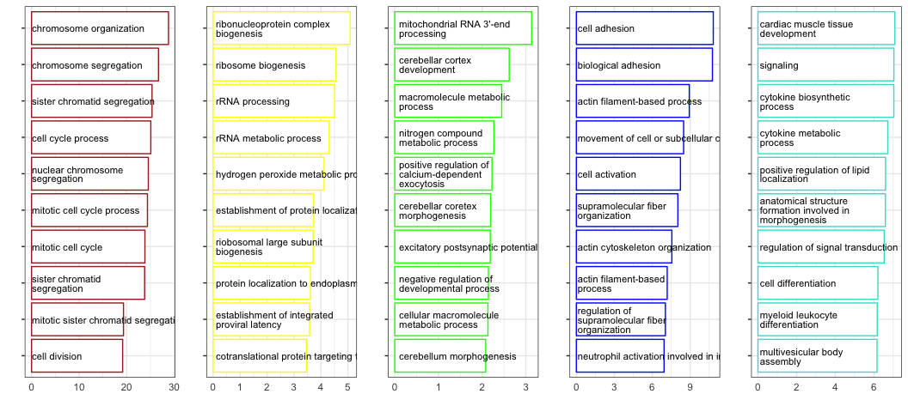<!-- -->

```r
# Fig3
pdf(file.path(dirs$manuscript, "Fig3/wgcna_go_bp.pdf"), width=14)
scater::multiplot(plotlist=p.list, cols=5)
dev.off()
```

```
## quartz_off_screen 
##                 2
```

## Gene Set Enrichment Analysis 
While GO enrichment analysis is good for its simplicity, it doesn't completely take advantage of the expression information we have available. The blue and turquoise modules correspond to TSCAN states 3 and 4, and the difference between the two is of high interest to us. Let's use GSEA to see if we can gather any other information. 

We first load the gene sets from MSigDB.

```r
dirs$MSigDB <- "~/Projects/Data/MSigDB"

load(file.path(dirs$MSigDB, "human_H_v5p2.rdata")) # hallmark gene sets
load(file.path(dirs$MSigDB, "human_c2_v5p2.rdata")) # curated gene sets
load(file.path(dirs$MSigDB, "human_c3_v5p2.rdata")) # motif gene sets
load(file.path(dirs$MSigDB, "human_c5_v5p2.rdata")) # GO gene sets

# for the curated set, only interested in the main ones
curated <- map(c('REACTOME_','KEGG_','PID_','BIOCARTA_'), function(name) {
  Hs.c2[grep(paste0("^", name), names(Hs.c2), perl=TRUE)]
})
names(curated) <- c('REACTOME','KEGG','PID','BIOCARTA')

# let's chop up GO into individual categories: BP, CC and MF
go.bp <- read_tsv(file.path(dirs$MSigDB, 'c5.bp.v6.1.entrez.gmt'), col_names=FALSE)$X1
```

```
## Parsed with column specification:
## cols(
##   .default = col_integer(),
##   X1 = col_character(),
##   X2 = col_character()
## )
```

```
## See spec(...) for full column specifications.
```

```r
go.cc <- read_tsv(file.path(dirs$MSigDB, 'c5.cc.v6.1.entrez.gmt'), col_names=FALSE)$X1
```

```
## Parsed with column specification:
## cols(
##   .default = col_integer(),
##   X1 = col_character(),
##   X2 = col_character()
## )
## See spec(...) for full column specifications.
```

```r
go.mf <- read_tsv(file.path(dirs$MSigDB, 'c5.mf.v6.1.entrez.gmt'), col_names=FALSE)$X1
```

```
## Parsed with column specification:
## cols(
##   .default = col_integer(),
##   X1 = col_character(),
##   X2 = col_character()
## )
## See spec(...) for full column specifications.
```

```r
# also chop up motif into TFs and MIRs

MSigDB <- list(hallmark=Hs.H, 
               TFT=Hs.c3[-grep('MIR-', names(Hs.c3))], 
               MIR=Hs.c3[grep('MIR-', names(Hs.c3))],
               GO.BP=Hs.c5[names(Hs.c5) %in% go.bp],
               GO.CC=Hs.c5[names(Hs.c5) %in% go.cc],
               GO.MF=Hs.c5[names(Hs.c5) %in% go.mf])
rm(Hs.H, Hs.c2, Hs.c3, Hs.c5, go.bp, go.cc, go.mf)

MSigDB <- c(MSigDB, curated)
```

We are specifically interested in the genes belonging to blue and turquoise modules, representing TSCAN states 3 and 4. For this, we use limma's camera function, and set the design to be the contrast between the two TSCAN states of interest. 

```r
# set up expression table and entrez ids

# for the expression table, restrict to those in WGCNA and have entrez IDs
entrez.ids <- wgcna$entrezgene_id[!is.na(wgcna$entrezgene_id)]
entrez.ids <- gsub("entrezgene:", "", entrez.ids)
exptab <- norm_exprs(sce)[wgcna$clusterID,]
exptab <- exptab[!is.na(wgcna$entrezgene_id),]
rownames(exptab) <- entrez.ids

# now, the test set is those in blue and turquoise modules, with corr. coef. > 0.2 and p.val < 0.1
entrez.ids <- unique(dplyr::filter(wgcna, module %in% c('blue','turquoise') & corr_eigengene > 0.2 & pvalue_eigengene < 0.1)$entrezgene_id)
entrez.ids <- gsub("entrezgene:", "", entrez.ids)

# for speed, go parallel
# note: this was performed on MacOS. May need to set up differently on other OS.
library(foreach)
```

```
## 
## Attaching package: 'foreach'
```

```
## The following objects are masked from 'package:purrr':
## 
##     accumulate, when
```

```r
library(doParallel)
```

```
## Loading required package: iterators
```

```r
cores_2_use <- detectCores() - 1
cl <- makeCluster(cores_2_use)
registerDoParallel(cl)

design <- model.matrix(~tscan, data=colData(sce))

camera.res <- foreach(no = 1:length(MSigDB), 
                      .packages=c('purrr','limma','scater')) %dopar%
{
  i <- limma::ids2indices(MSigDB[[no]], entrez.ids)
  index <- lapply(i, function(x) {which(rownames(exptab) %in% entrez.ids[x])})
  camera.res <- limma::camera(exptab, index, design=design, contrast=c(0,0,-1,1), use.ranks=TRUE)
  camera.res
}
stopCluster(cl)
names(camera.res) <- names(MSigDB)

# scan through top results
map(camera.res, head)
```

```
## $hallmark
##                                    NGenes Direction       PValue
## HALLMARK_OXIDATIVE_PHOSPHORYLATION     25        Up 6.656482e-06
## HALLMARK_ADIPOGENESIS                  26        Up 2.190075e-05
## HALLMARK_GLYCOLYSIS                    23        Up 3.978667e-05
## HALLMARK_MTORC1_SIGNALING              42        Up 6.678274e-05
## HALLMARK_IL6_JAK_STAT3_SIGNALING        9        Up 7.778162e-05
## HALLMARK_TNFA_SIGNALING_VIA_NFKB       37        Up 9.840444e-05
##                                             FDR
## HALLMARK_OXIDATIVE_PHOSPHORYLATION 0.0003328241
## HALLMARK_ADIPOGENESIS              0.0005475187
## HALLMARK_GLYCOLYSIS                0.0006631111
## HALLMARK_MTORC1_SIGNALING          0.0007778162
## HALLMARK_IL6_JAK_STAT3_SIGNALING   0.0007778162
## HALLMARK_TNFA_SIGNALING_VIA_NFKB   0.0008200370
## 
## $TFT
##                   NGenes Direction       PValue          FDR
## GGGCGGR_V$SP1_Q6     244        Up 5.192782e-08 3.152019e-05
## CAGGTA_V$AREB6_01     35        Up 7.694565e-07 2.293552e-04
## V$BACH2_01            23        Up 1.601529e-06 2.293552e-04
## TTANTCA_UNKNOWN       63        Up 1.789522e-06 2.293552e-04
## V$AP1_Q2_01           16        Up 1.938663e-06 2.293552e-04
## TGANTCA_V$AP1_C       81        Up 2.267102e-06 2.293552e-04
## 
## $MIR
##                         NGenes Direction       PValue        FDR
## TGCCTTA,MIR-124A            61        Up 0.0001135642 0.01293688
## AAAGGGA,MIR-204,MIR-211     20        Up 0.0001872229 0.01293688
## GTGACTT,MIR-224             16        Up 0.0003034013 0.01293688
## GCAAGAC,MIR-431              5        Up 0.0003346460 0.01293688
## ACTTTAT,MIR-142-5P          25        Up 0.0003798547 0.01293688
## ACCAAAG,MIR-9               40        Up 0.0004703205 0.01293688
## 
## $GO.BP
##                                                    NGenes Direction
## GO_REGULATION_OF_INTRACELLULAR_SIGNAL_TRANSDUCTION    102        Up
## GO_PHOSPHATE_CONTAINING_COMPOUND_METABOLIC_PROCESS    113        Up
## GO_POSITIVE_REGULATION_OF_CELL_COMMUNICATION           89        Up
## GO_POSITIVE_REGULATION_OF_RESPONSE_TO_STIMULUS        127        Up
## GO_PROTEIN_LOCALIZATION                               154        Up
## GO_INTERSPECIES_INTERACTION_BETWEEN_ORGANISMS          66        Up
##                                                          PValue
## GO_REGULATION_OF_INTRACELLULAR_SIGNAL_TRANSDUCTION 7.857455e-10
## GO_PHOSPHATE_CONTAINING_COMPOUND_METABOLIC_PROCESS 1.907366e-09
## GO_POSITIVE_REGULATION_OF_CELL_COMMUNICATION       4.027431e-09
## GO_POSITIVE_REGULATION_OF_RESPONSE_TO_STIMULUS     1.145811e-08
## GO_PROTEIN_LOCALIZATION                            1.178227e-08
## GO_INTERSPECIES_INTERACTION_BETWEEN_ORGANISMS      1.192683e-08
##                                                             FDR
## GO_REGULATION_OF_INTRACELLULAR_SIGNAL_TRANSDUCTION 2.798825e-06
## GO_PHOSPHATE_CONTAINING_COMPOUND_METABOLIC_PROCESS 3.397018e-06
## GO_POSITIVE_REGULATION_OF_CELL_COMMUNICATION       4.781903e-06
## GO_POSITIVE_REGULATION_OF_RESPONSE_TO_STIMULUS     7.080559e-06
## GO_PROTEIN_LOCALIZATION                            7.080559e-06
## GO_INTERSPECIES_INTERACTION_BETWEEN_ORGANISMS      7.080559e-06
## 
## $GO.CC
##                                              NGenes Direction       PValue
## GO_MITOCHONDRION                                121        Up 4.974318e-08
## GO_PERINUCLEAR_REGION_OF_CYTOPLASM               69        Up 6.318336e-08
## GO_INTRINSIC_COMPONENT_OF_ORGANELLE_MEMBRANE     31        Up 2.549889e-07
## GO_GOLGI_APPARATUS                              103        Up 3.707132e-07
## GO_ENVELOPE                                      87        Up 4.019027e-07
## GO_MITOCHONDRIAL_PART                            74        Up 5.304180e-07
##                                                       FDR
## GO_MITOCHONDRION                             1.529037e-05
## GO_PERINUCLEAR_REGION_OF_CYTOPLASM           1.529037e-05
## GO_INTRINSIC_COMPONENT_OF_ORGANELLE_MEMBRANE 3.890418e-05
## GO_GOLGI_APPARATUS                           3.890418e-05
## GO_ENVELOPE                                  3.890418e-05
## GO_MITOCHONDRIAL_PART                        4.278705e-05
## 
## $GO.MF
##                                                                   NGenes
## GO_ENZYME_BINDING                                                    160
## GO_TRANSFERASE_ACTIVITY_TRANSFERRING_PHOSPHORUS_CONTAINING_GROUPS     42
## GO_PROTEIN_DIMERIZATION_ACTIVITY                                      79
## GO_PEPTIDASE_ACTIVITY                                                 31
## GO_MACROMOLECULAR_COMPLEX_BINDING                                    104
## GO_ZINC_ION_BINDING                                                   56
##                                                                   Direction
## GO_ENZYME_BINDING                                                        Up
## GO_TRANSFERASE_ACTIVITY_TRANSFERRING_PHOSPHORUS_CONTAINING_GROUPS        Up
## GO_PROTEIN_DIMERIZATION_ACTIVITY                                         Up
## GO_PEPTIDASE_ACTIVITY                                                    Up
## GO_MACROMOLECULAR_COMPLEX_BINDING                                        Up
## GO_ZINC_ION_BINDING                                                      Up
##                                                                         PValue
## GO_ENZYME_BINDING                                                 6.237779e-08
## GO_TRANSFERASE_ACTIVITY_TRANSFERRING_PHOSPHORUS_CONTAINING_GROUPS 5.155898e-07
## GO_PROTEIN_DIMERIZATION_ACTIVITY                                  5.900491e-07
## GO_PEPTIDASE_ACTIVITY                                             1.220816e-06
## GO_MACROMOLECULAR_COMPLEX_BINDING                                 4.882641e-06
## GO_ZINC_ION_BINDING                                               6.169195e-06
##                                                                            FDR
## GO_ENZYME_BINDING                                                 4.154361e-05
## GO_TRANSFERASE_ACTIVITY_TRANSFERRING_PHOSPHORUS_CONTAINING_GROUPS 1.309909e-04
## GO_PROTEIN_DIMERIZATION_ACTIVITY                                  1.309909e-04
## GO_PEPTIDASE_ACTIVITY                                             2.032658e-04
## GO_MACROMOLECULAR_COMPLEX_BINDING                                 6.503677e-04
## GO_ZINC_ION_BINDING                                               6.847806e-04
## 
## $REACTOME
##                                                NGenes Direction
## REACTOME_IMMUNE_SYSTEM                             63        Up
## REACTOME_ADAPTIVE_IMMUNE_SYSTEM                    47        Up
## REACTOME_METABOLISM_OF_LIPIDS_AND_LIPOPROTEINS     35        Up
## REACTOME_SIGNALLING_BY_NGF                         21        Up
## REACTOME_CELL_CYCLE                                24        Up
## REACTOME_MITOTIC_G1_G1_S_PHASES                     8        Up
##                                                      PValue          FDR
## REACTOME_IMMUNE_SYSTEM                         3.572156e-07 0.0001789650
## REACTOME_ADAPTIVE_IMMUNE_SYSTEM                7.951357e-07 0.0001991815
## REACTOME_METABOLISM_OF_LIPIDS_AND_LIPOPROTEINS 1.406419e-05 0.0023487190
## REACTOME_SIGNALLING_BY_NGF                     7.901682e-05 0.0098968570
## REACTOME_CELL_CYCLE                            1.435061e-04 0.0129954521
## REACTOME_MITOTIC_G1_G1_S_PHASES                1.897344e-04 0.0129954521
## 
## $KEGG
##                                   NGenes Direction       PValue
## KEGG_PATHWAYS_IN_CANCER               26        Up 6.157449e-06
## KEGG_SMALL_CELL_LUNG_CANCER           13        Up 2.145102e-05
## KEGG_CELL_ADHESION_MOLECULES_CAMS     10        Up 3.024139e-05
## KEGG_PANCREATIC_CANCER                 8        Up 5.078861e-05
## KEGG_CHRONIC_MYELOID_LEUKEMIA          8        Up 7.976869e-05
## KEGG_ENDOCYTOSIS                      20        Up 8.645973e-05
##                                           FDR
## KEGG_PATHWAYS_IN_CANCER           0.000972877
## KEGG_SMALL_CELL_LUNG_CANCER       0.001592713
## KEGG_CELL_ADHESION_MOLECULES_CAMS 0.001592713
## KEGG_PANCREATIC_CANCER            0.002006150
## KEGG_CHRONIC_MYELOID_LEUKEMIA     0.002156551
## KEGG_ENDOCYTOSIS                  0.002156551
## 
## $PID
##                              NGenes Direction       PValue        FDR
## PID_RB_1PATHWAY                   8        Up 0.0003887308 0.03903594
## PID_BETA_CATENIN_NUC_PATHWAY     10        Up 0.0006504473 0.03903594
## PID_AP1_PATHWAY                  12        Up 0.0009566624 0.03903594
## PID_TAP63_PATHWAY                 6        Up 0.0012754605 0.03903594
## PID_MYC_ACTIV_PATHWAY             9        Up 0.0014149135 0.03903594
## PID_CMYB_PATHWAY                 13        Up 0.0014649020 0.03903594
## 
## $BIOCARTA
##                          NGenes Direction       PValue        FDR
## BIOCARTA_PPARA_PATHWAY        6        Up 0.0003911540 0.06688733
## BIOCARTA_HIF_PATHWAY          4        Up 0.0008803992 0.07527413
## BIOCARTA_P38MAPK_PATHWAY      5        Up 0.0018745663 0.10685028
## BIOCARTA_IL1R_PATHWAY         5        Up 0.0033634785 0.14378871
## BIOCARTA_G1_PATHWAY           4        Up 0.0060829200 0.14692215
## BIOCARTA_CASPASE_PATHWAY      3        Up 0.0064236699 0.14692215
```

We see a number of gene sets upregulated in TSCAN state 4 (turquoise), including Epithelial to Mesencymal transition. 

---------

# 6. Wrap Up and Examples

Before we finish, let's save the WGCNA tables produced for later use.

```r
write_tsv(wgcna, file.path(dirs$generated, "WGCNA/WGCNA.tsv"))
```

As a sanity check, let's see to which module the cell cycle markers belong to. 

```r
# sanity check: what module do the cell cycle markers belong to?
cc.wgcna <- dplyr::filter(wgcna, clusterID %in% cc.markers)[,c('clusterName','corr_eigengene','pvalue_eigengene','module')]
table(cc.wgcna$module)
```

```
## 
##     brown turquoise 
##        56         1
```
As expected, most are in the brown module.

For each module, let's pick some example genes for illustration.

```r
# let's pick example promoters for the modules
markers <- c('p1@ALDH3A1','p1@CCNB2') # brown (early)
markers <- c(markers, 'p1@SERPINE1','p1@KLF6') # blue (mid to late)
markers <- c(markers, 'p1@SERPINE2','p1@FASN') # turquoise (early and late)
markers <- c(markers, 'p1@VPS35','p1@HMGCS1') # yellow
markers <- c(markers, 'p1@MYOCD','p1@CCNI') # green
pseudotime_plot_by_ids(markers, id.type='clusterName')
```

<!-- -->

```r
# these go into Fig 3
pdf(file.path(dirs$manuscript, "Fig3/module_example_pseudotime.pdf"))
pseudotime_plot_by_ids(markers, id.type='clusterName')
dev.off()
```

```
## quartz_off_screen 
##                 2
```

How do some mesenchymal markers (CDH2 and VIM) appear in pseudotime plots and in bulk?

```r
pseudotime_plot_by_ids(c('p1@CDH2','p1@VIM'), id.type='clusterName')
```

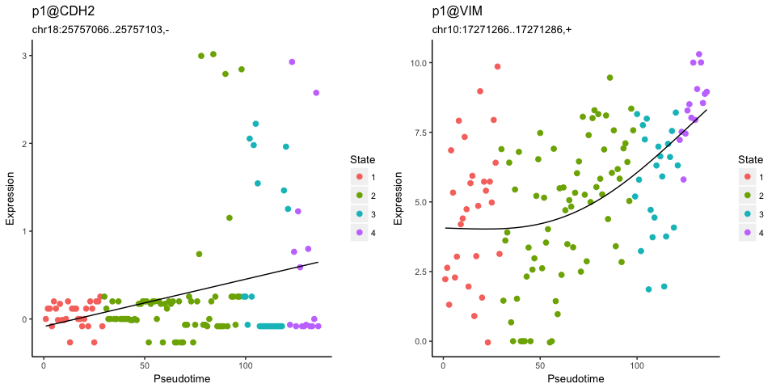<!-- -->

```r
dotplot_expression(c('p1@CDH2','p1@VIM'), id.type='clusterName')
```

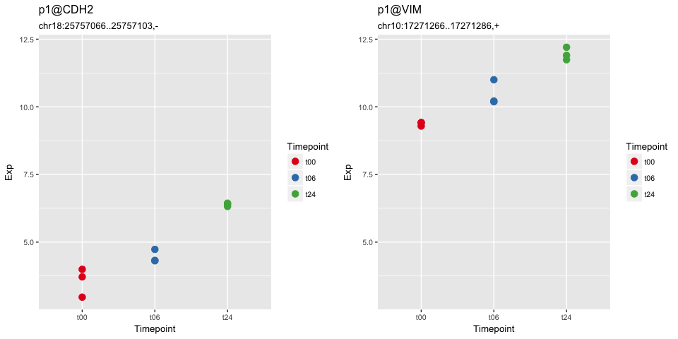<!-- -->

```r
# manuscript Fig. S5
pdf(file.path(dirs$manuscript, "FigS6/klf6_tfap2c_pseudotime.pdf"))
pseudotime_plot_by_ids(c('p1@CDH2','p1@VIM'), id.type='clusterName')
dotplot_expression(c('p1@CDH2','p1@VIM'), id.type='clusterName')
dev.off()
```

```
## quartz_off_screen 
##                 2
```

From the oPOSSUM analysis of the WGCNA modules, we see that HINFP, TFAP2n, EGR1 motifs are enriched in turquoise module vs. others. How do their expression levels look?

```r
# these are motifs that were enriched in turquoise vs. others
pseudotime_plot_by_genes(c('HINFP','TFAP2A','TFAP2C','EGR1'))
```

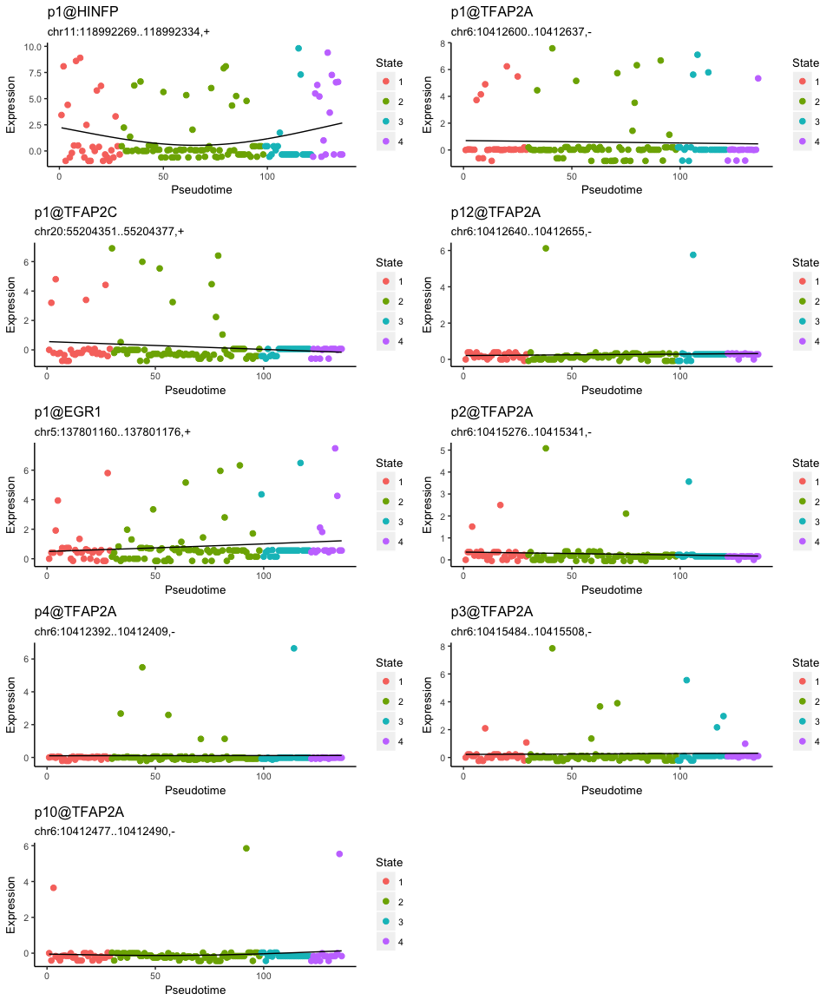<!-- -->

While many of these are unclear, p1@TFAP2C shows an interesting behaviour, with clear drop in expression in later pseudotime. Along with KLF6, these two may represent opposing transcription activator/repressor pairings. Do the expression patterns hold in the bulk data as well?

```r
pseudotime_plot_by_ids(c('p1@KLF6','p1@TFAP2C'), id.type='clusterName')
```

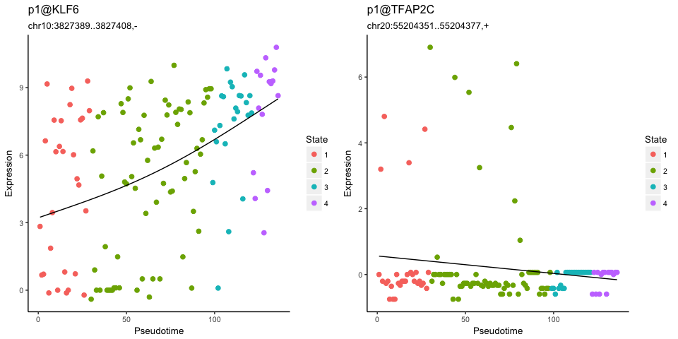<!-- -->

```r
dotplot_expression(c('p1@KLF6','p1@TFAP2C'), id.type='clusterName')
```

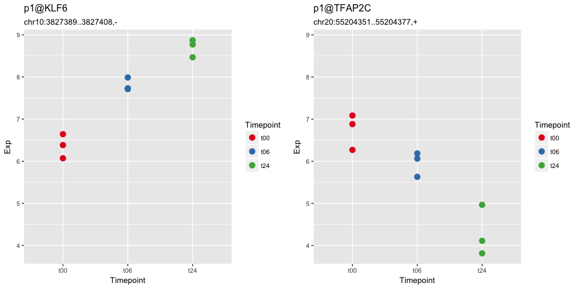<!-- -->

```r
# manuscript Fig. S6
pdf(file.path(dirs$manuscript, "FigS6/klf6_tfap2c_pseudotime.pdf"))
pseudotime_plot_by_ids(c('p1@KLF6','p1@TFAP2C'), id.type='clusterName')
dotplot_expression(c('p1@KLF6','p1@TFAP2C'), id.type='clusterName')
dev.off()
```

```
## quartz_off_screen 
##                 2
```
It appears so.


