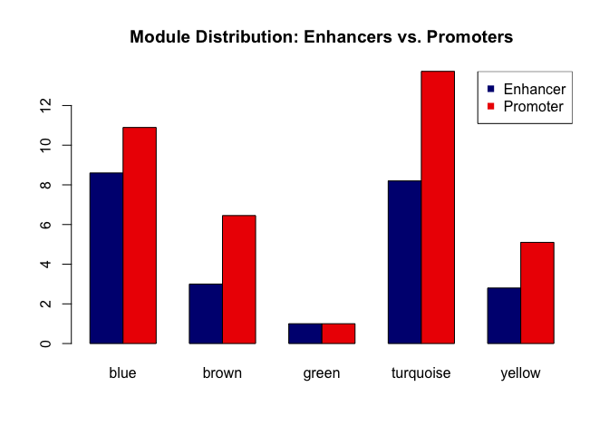
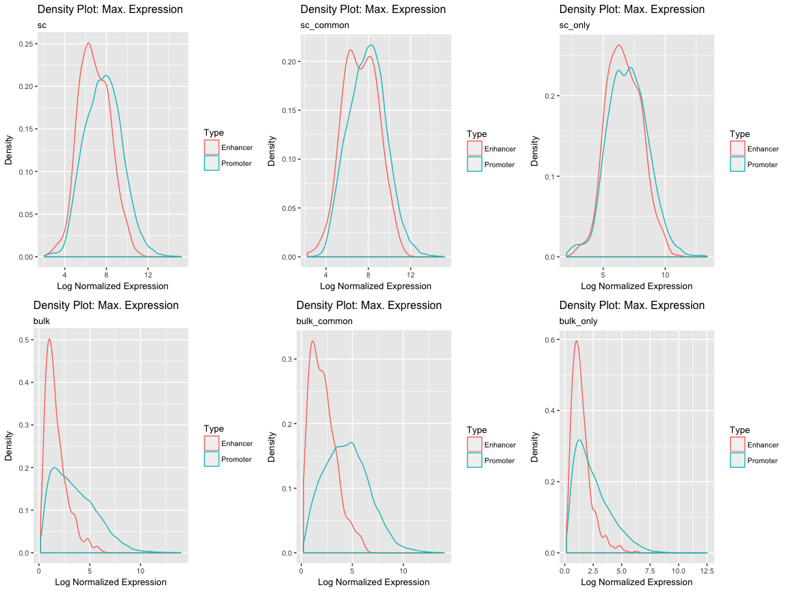
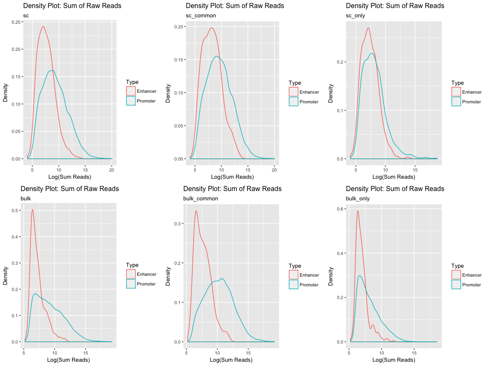
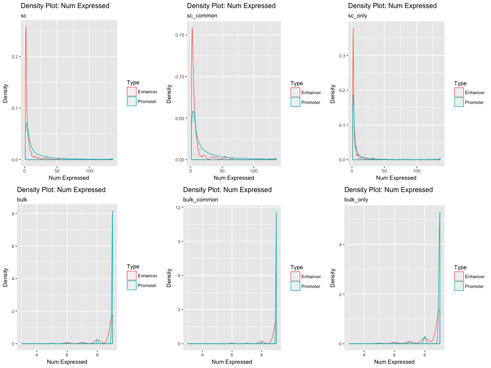
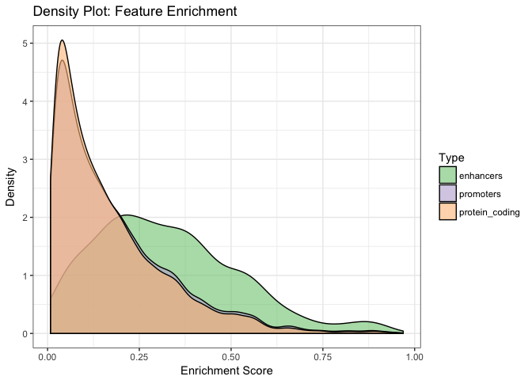
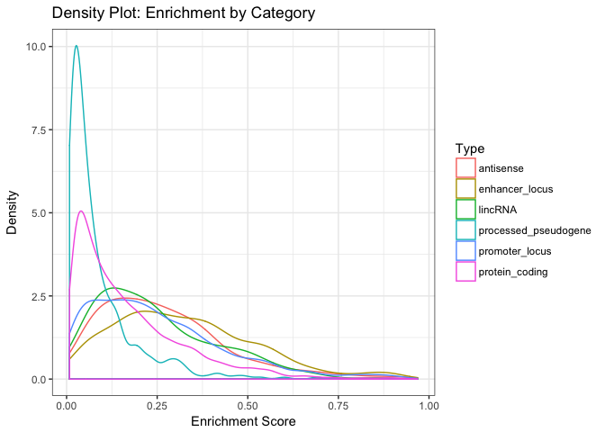
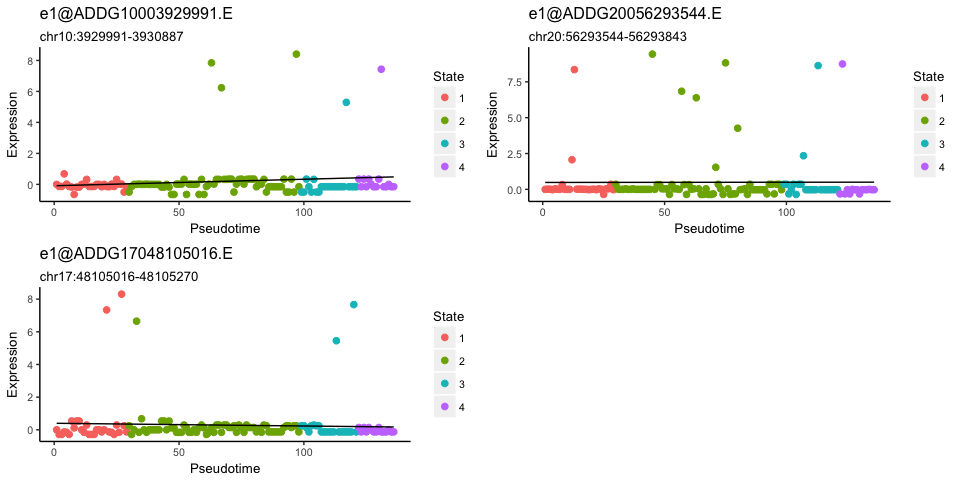
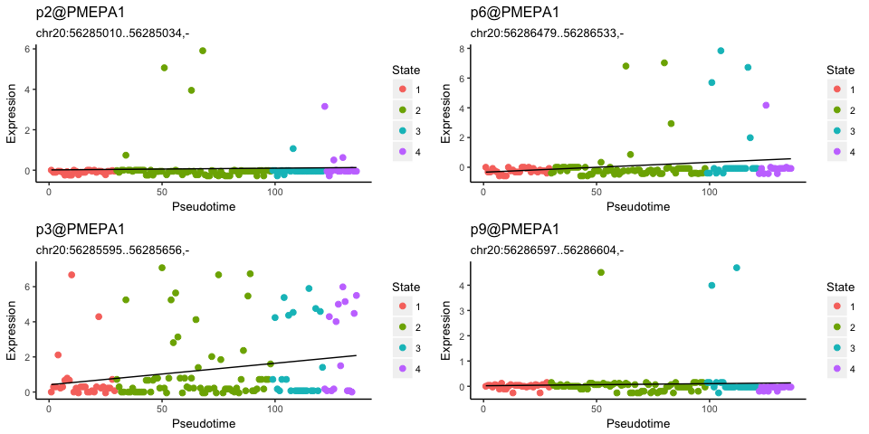
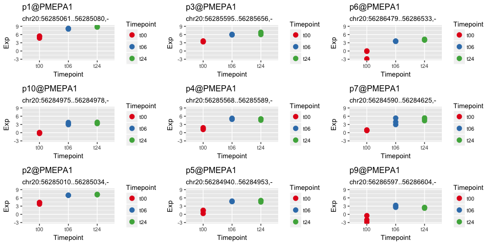

# Overview

Now that we have the sample clusters, pseudotime, and the promoter WGCNA modules, let's see what we can learn about the enhancers in our data. 

What we have now:

* enhancer coordinates and their expression levels (both SC and bulk)
* gene promoters and their expression levels
* WGCNA modules, their eigengene profiles, and which promoters and enhancers that are included in them
* TSCAN and SC3 clusters of each sample

Things to consider:

* enhancer expression levels will not be as robust as regular promoter expression levels
  + expect much higher number of drop outs
  + this means that it will be hard to obtain reliable results from metrics such as correlation etc.
* restrict to enhancer and promoter pairs on the same chromosome
* can / should we include topological domain information?
* is it the expression level that is important? or the state of expression (i.e. on/off)?
* are there any general characteristics we can learn about enhancers from our data?

## Initial Set Up


```r
library(tidyverse)
library(scran)
library(scater)
library(GenomicRanges)

# containing WGCNA analysis
load("~/Projects/Molecular_Network/TGFbeta_Timecourse/results/R_sessions/s4_WGCNA.RData")

# bulk CAGE data edgeR object
dge <- readRDS("~/Projects/Molecular_Network/TGFbeta_Timecourse/results/R_sessions/s2_bulk_dge.Rds")
```


# Characterizing Enhancers

Using the collected data, let's see which enhancers are supported by external data, and have strong enough expression to have been includd in the WGCNA analysis.

## Enhancers and WGCNA

Tally up the enhancers we have in our filtered data, and see how they are spread among the WGCNA modules.

```r
# all enhancers
enhancers <- rownames(sce)[rowData(sce)$type == 'enhancer'] 

# enhancers we have in WGCNA
wgcna.enhancers <- enhancers[enhancers %in% wgcna.proms]

# for those that are included in the WGCNA analysis, what is their distribution?
a <- rbind(table(moduleColors[wgcna.enhancers]) / min(table(moduleColors[wgcna.enhancers])),
table(moduleColors[wgcna.proms[!wgcna.proms %in% wgcna.enhancers]]) / min(table(moduleColors[wgcna.proms[!wgcna.proms %in% wgcna.enhancers]])))

barplot(a, beside=TRUE, main="Module Distribution: Enhancers vs. Promoters", col=c('navy','red2'))
legend("topright", legend=c('Enhancer','Promoter'), col=c('navy','red2'), pch=15)
```

<!-- -->

```r
rm(a)
```
Out of 826 enhancers, 118 are included in the WGCNA input set.

## Enhancers and EP300 ChIP-seq

We have the EP300 ChIP-seq data from s1, for both A549 cells only and all available cell types. What proportion of our enhancers are supported by EP300 ChIP-seq data?


```r
enhancers_ep300 <- map(ep300, function(p) {
  enhancers[unique(find_overlap(p, dplyr::filter(annot, clusterID %in% enhancers)))]
})
names(enhancers_ep300) <- names(ep300)

lapply(enhancers_ep300, function(x) {length(x) / length(enhancers)})
```

```
## $a549
## [1] 0.4455206
## 
## $merged
## [1] 0.5811138
```

If we consider the A549 ChIP-seq peaks only, we have 0.45 with EP300 peak support, and for the merged set 0.58.

# Comparison of enhancers in bulk and single cell data

Overall, the enhancers show very much sporadic expression patterns in our single cell CAGE data. Although this is common to all single cell transcriptome data due to drop outs and sensitivity issues, one cannot help notice that enhancers seem to be more sporadic than promoters. Can we actually confirm and quantify this? Also, how do the corresponding enhancers look in the bulk data? Not only do the enhancers appear sporadic, when they do get expressed, they seem to be expressed at rather high levels. This is counterintuitive to what we know from how enhancers are expressed in bulk, where they are often expressed at much lower levels than promoters.

What we can do is to look at the maximum expression level of the promoters and enhancers separately, and see how their distributions differ in single cell data vs bulk data.

## Expression Distributions in Single Cell and Bulk Data

First, categorize which enhancers are found in SC only, bulk only, common to both etc.

```r
# categorize enhancers
all.e <- dplyr::filter(annot, type=='enhancer')$clusterID
enhancers <- list(sc=enhancers)
enhancers$bulk <- all.e[all.e %in% rownames(dge)]
enhancers$common <- enhancers$sc[enhancers$sc %in% enhancers$bulk]
enhancers$sc_only <- enhancers$sc[!enhancers$sc %in% enhancers$bulk]
enhancers$bulk_only <- enhancers$bulk[!enhancers$bulk %in% enhancers$sc]
rm(all.e)
```

### Maximum Normalized Expression Levels

For each category of the enhancers, what is the spread of the maximum expression? How does this compare to promoters? Are there any differences between the two?

```r
# a) enhancers
en.maxexp <- list()
en.maxexp$sc <- rowMax(norm_exprs(sce)[enhancers$sc,])
en.maxexp$sc_only <- rowMax(norm_exprs(sce)[enhancers$sc_only,])
en.maxexp$sc_common <- rowMax(norm_exprs(sce)[enhancers$common,])
en.maxexp$bulk_common <- rowMax(edgeR::cpm(dge, log=TRUE)[enhancers$common,])
en.maxexp$bulk <- rowMax(edgeR::cpm(dge, log=TRUE)[enhancers$bulk,])
en.maxexp$bulk_only <- rowMax(edgeR::cpm(dge, log=TRUE)[enhancers$bulk_only,])

# b) promoters
prom.maxexp <- list()
prom.maxexp$sc <- rowMax(norm_exprs(sce)[rowData(sce)$type %in% 'promoter',])
prom.maxexp$bulk <- rowMax(edgeR::cpm(dge, log=TRUE)[!rownames(dge) %in% enhancers$bulk,])
common <- rownames(dge)[rownames(dge) %in% rownames(sce)[rowData(sce)$type %in% 'promoter']]
prom.maxexp$sc_common <- rowMax(norm_exprs(sce)[common,])
prom.maxexp$bulk_common <- rowMax(edgeR::cpm(dge, log=TRUE)[common,])
prom.maxexp$sc_only <- rowMax(norm_exprs(sce)[!rownames(sce) %in% common,])
prom.maxexp$bulk_only <- rowMax(edgeR::cpm(dge, log=TRUE)[!rownames(dge) %in% common,])
rm(common)

p.list <- map(names(en.maxexp), function(cat) {
  tab <- reshape2::melt(list(Enhancer=en.maxexp[[cat]], Promoter=prom.maxexp[[cat]]), value.name="MaxExp")
  colnames(tab)[2] <- 'Type'
  ggplot(tab, aes(x=MaxExp, colour=Type)) + geom_density(alpha=0.6) + 
        scale_x_continuous(name = "Log Normalized Expression") +
        scale_y_continuous(name = "Density") +
        ggtitle("Density Plot: Max. Expression", subtitle=cat) +
        fontsize + scale_fill_brewer(palette="Accent")  
})
names(p.list) <- names(en.maxexp)

scater::multiplot(plotlist=p.list[c('sc','bulk','sc_common','bulk_common','sc_only','bulk_only')], cols=3)
```

<!-- -->

Compared to the bulk data, the difference in the distribution between promoters and enhancers in single cells is much lower.

### Sum of Raw Reads

Is it possible that the above results are artefacts of normalization process? Just for sanity check, let's look at the distribution of the sum of raw reads for bulk and single cell data as well and compare between promoters and enhancers.

```r
# a) enhancers
en.sumreads <- list()
en.sumreads$sc <- log2(rowSums(counts(sce)[enhancers$sc,])+1)
en.sumreads$sc_only <- log2(rowSums(counts(sce)[enhancers$sc_only,])+1)
en.sumreads$sc_common <- log2(rowSums(counts(sce)[enhancers$common,])+1)
en.sumreads$bulk_common <- log2(rowSums(dge$counts)[enhancers$common]+1)
en.sumreads$bulk <- log2(rowSums(dge$counts)[enhancers$bulk]+1)
en.sumreads$bulk_only <- log2(rowSums(dge$counts)[enhancers$bulk_only]+1)

# b) promoters
prom.sumreads <- list()
prom.sumreads$sc <- log2(rowSums(counts(sce)[rowData(sce)$type %in% 'promoter',])+1)
prom.sumreads$bulk <- log2(rowSums(dge$counts)[!rownames(dge) %in% enhancers$bulk]+1)
common <- rownames(dge)[rownames(dge) %in% rownames(sce)[rowData(sce)$type %in% 'promoter']]
prom.sumreads$sc_common <- log2(rowSums(counts(sce)[common,])+1)
prom.sumreads$bulk_common <- log2(rowSums(dge$counts[common,])+1)
prom.sumreads$sc_only <- log2(rowSums(counts(sce)[!rownames(sce) %in% common,])+1)
prom.sumreads$bulk_only <- log2(rowSums(dge$counts)[!rownames(dge) %in% common]+1)
rm(common)

p.list <- map(names(en.sumreads), function(cat) {
  tab <- reshape2::melt(list(Enhancer=en.sumreads[[cat]], Promoter=prom.sumreads[[cat]]), value.name="SumReads")
  colnames(tab)[2] <- 'Type'
  ggplot(tab, aes(x=SumReads, colour=Type)) + geom_density(alpha=0.6) + 
        scale_x_continuous(name = "Log(Sum Reads)") +
        scale_y_continuous(name = "Density") +
        ggtitle("Density Plot: Sum of Raw Reads", subtitle=cat) +
        fontsize + scale_fill_brewer(palette="Accent")  
})
names(p.list) <- names(en.sumreads)
scater::multiplot(plotlist=p.list[c('sc','bulk','sc_common','bulk_common','sc_only','bulk_only')], cols=3)
```

<!-- -->

While we get a higher number of low value enhancers, the distributions for promoters and enhancers in single cell data are still closer to each other than in bulk data.

### Number of Expressed Cells

Finally, let's look at the number of cells the promoters and enhancers are expressed in. 

```r
# raw read > 1
# a) enhancers
en.numexp <- list()
en.numexp$sc <- rowSums(counts(sce)[enhancers$sc,] > 1)
en.numexp$sc_only <- rowSums(counts(sce)[enhancers$sc_only,] > 1)
en.numexp$sc_common <- rowSums(counts(sce)[enhancers$common,] > 1)
en.numexp$bulk_common <- rowSums(dge$counts[enhancers$common,] > 1)
en.numexp$bulk <- rowSums(dge$counts[enhancers$bulk,] > 1)
en.numexp$bulk_only <- rowSums(dge$counts[enhancers$bulk_only,] > 1)

# b) promoters
prom.numexp <- list()
prom.numexp$sc <- rowSums(counts(sce)[rowData(sce)$type %in% 'promoter',] > 1)
prom.numexp$bulk <- rowSums(dge$counts[!rownames(dge) %in% enhancers$bulk,] > 1)
common <- rownames(dge)[rownames(dge) %in% rownames(sce)[rowData(sce)$type %in% 'promoter']]
prom.numexp$sc_common <- rowSums(counts(sce)[common,] > 1)
prom.numexp$bulk_common <- rowSums(dge$counts[common,] > 1)
prom.numexp$sc_only <- rowSums(counts(sce)[!rownames(sce) %in% common,] > 1)
prom.numexp$bulk_only <- rowSums(dge$counts[!rownames(dge) %in% common,] > 1)
rm(common)

p.list <- map(names(en.numexp), function(cat) {
  tab <- reshape2::melt(list(Enhancer=en.numexp[[cat]], Promoter=prom.numexp[[cat]]), value.name="NumExp")
  colnames(tab)[2] <- 'Type'
  ggplot(tab, aes(x=NumExp, colour=Type)) + geom_density(alpha=0.6) + 
        scale_x_continuous(name = "Num Expressed") +
        scale_y_continuous(name = "Density") +
        ggtitle("Density Plot: Num Expressed", subtitle=cat) +
        fontsize + scale_fill_brewer(palette="Accent")  
})
names(p.list) <- names(en.numexp)
scater::multiplot(plotlist=p.list[c('sc','bulk','sc_common','bulk_common','sc_only','bulk_only')], cols=3)
```

<!-- -->

Most of the bulk enhancers and promoters are expressed in majority of the samples, although enhancers show more wide range of the number of cells than the promoters. For single cell data, while a large percentage of the both features are expressed in a minority of the samples only, there is definitely a higher proportion of enhancers that are expressed in strikingly small subset of samples than the promoters. 

## Enrichment Score

Can we quantitatively measure the sparsity of the samples expressing enhancers compared to promoters? We need to capture the specificity in terms of both the height and breadth of each feature. One way of accomplishing this would be to calculate a score based on the maximum expression level and the number of cells the feature is expressed in. If our assumptions about enhancer and promoter expression patterns across the samples are true, enhancers in general should have higher enrichment scores than the promoters. We test 3 categories of features: enhancers, promoters, and protein-coding promoters.


```r
enrich_score <- function(exp, threshold) {
  max(exp) / (sum(exp[exp > threshold]))
}

threshold <- 0 # cell should express the feature higher than this threshold to count as being expressed
enrichment <- list()
enrichment$enhancers <- sort(apply(norm_exprs(sce)[enhancers$sc,], 1, enrich_score, threshold))
enrichment$promoters <- sort(apply(norm_exprs(sce)[rowData(sce)$type %in% 'promoter',], 1, enrich_score, threshold))
enrichment$protein_coding <- sort(apply(norm_exprs(sce)[rowData(sce)$geneClassStr %in% 'protein_coding',], 1, enrich_score, threshold))

tab <- reshape2::melt(enrichment)
colnames(tab) <- c('Enrichment','Type')
ggplot(tab, aes(x=Enrichment, fill=Type)) + geom_density(alpha=0.6) + 
        scale_x_continuous(name = "Enrichment Score") +
        scale_y_continuous(name = "Density") +
        ggtitle("Density Plot: Feature Enrichment") +
        theme_bw() +
        scale_fill_brewer(palette="Accent")  
```

<!-- -->

We see that the density of enhancers is higher as enrichment score goes up. There is minimal difference between all promoters and protein-coding promoters. 

Is the difference significant?

```r
# Kolmogorov-Smirnov Test to test for significance
ks.test(enrichment$enhancers, enrichment$promoters)
```

```
## 
## 	Two-sample Kolmogorov-Smirnov test
## 
## data:  enrichment$enhancers and enrichment$promoters
## D = 0.36562, p-value < 2.2e-16
## alternative hypothesis: two-sided
```

What if we looked at the top 6 categories? 

```r
cats <- names(sort(table(rowData(sce)$geneClassStr), decreasing=TRUE)[1:6])
scores <- map(cats, function(n) {
  sort(apply(norm_exprs(sce)[rowData(sce)$geneClassStr %in% n,], 1, enrich_score, threshold))
})
names(scores) <- cats
tab <- reshape2::melt(scores)
colnames(tab) <- c('Enrichment','Type')
ggplot(tab, aes(x=Enrichment, colour=Type)) + geom_density(alpha=0.6) + 
        scale_x_continuous(name = "Enrichment Score") +
        scale_y_continuous(name = "Density") +
        ggtitle("Density Plot: Enrichment by Category") +
        theme_bw() +
        scale_fill_brewer(palette="Accent")  
```

<!-- -->

If we discount the pseudogenes, the density profiles are closer to one another, but enhancers still have the highest enrichment score distribution overall.

In summary,

```r
p.list <- list()

tab <- reshape2::melt(list(Enhancer=en.maxexp$sc_common, Promoter=prom.maxexp$sc_common), value.name="MaxExp")
colnames(tab)[2] <- 'Type'
p.list$sc <-  ggplot(tab, aes(x=MaxExp, fill=Type)) + geom_density(alpha=0.6) + 
    scale_x_continuous(name = "Max. Expression (log2 CPM)", limits=c(0,16)) +
    scale_y_continuous(name = "Density", limits=c(0,0.35)) +
    ggtitle("Density Plot: Max. Expression", subtitle='Single Cell') +
    theme_bw() + scale_fill_brewer(palette="Accent")  

tab <- reshape2::melt(list(Enhancer=en.maxexp$bulk_common, Promoter=prom.maxexp$bulk_common), value.name="MaxExp")
colnames(tab)[2] <- 'Type'
p.list$bulk <-  ggplot(tab, aes(x=MaxExp, fill=Type)) + geom_density(alpha=0.6) + 
    scale_x_continuous(name = "Max. Expression (log2 CPM)", limits=c(0,16)) +
    scale_y_continuous(name = "Density", limits=c(0,0.35)) +
    ggtitle("Density Plot: Max. Expression", subtitle='Bulk') +
    theme_bw() + scale_fill_brewer(palette="Accent")  

tab <- reshape2::melt(enrichment)
colnames(tab) <- c('Enrichment','Type')
tab <- tab[tab$Type %in% c('enhancers','promoters'),]
p.list$enrichment <- ggplot(tab, aes(x=Enrichment, fill=Type)) + geom_density(alpha=0.6) + 
    scale_x_continuous(name = "Enrichment Score") +
    scale_y_continuous(name = "Density") +
    ggtitle("Density Plot: Feature Enrichment", subtitle='Single Cell') +
    theme_bw() +
    scale_fill_brewer(palette="Accent")  

scater::multiplot(plotlist=p.list, cols=3)
```

<!-- -->

```r
# manuscript Figure 4
pdf(file.path(dirs$manuscript, "Fig4/enhancer_promoter_exp_comparison.pdf"), width=12, height=5)
scater::multiplot(plotlist=p.list, cols=3)
dev.off()
```

```
## quartz_off_screen 
##                 2
```

# Selection of enhancers to be validated using FISH

Using the probes for eRNAs, we may be able to observe in vivo expression of some of these enhancers using FISH. We can also test for the co-expression (or lack of) of their target promoters, if we can come up with any candidates. To accomplish this, we need to filter our enhancers for those that overlap other known gene structures, as that may confound our findings and make the results unreliable.

## Selection of transcripts overlapping enhancers

Using the Gencode v25 annotation, we filter for any enhancers that may overlap any of the known transcript models. Of those remaining, we rank the enhancers in terms of their expression. We then need to check these candidates to see if they are part of any larger transcripts, by observing their expression patterns in other external RNA-seq data. Based on these observations, we hand pick the top candidates to be subject to FISH validation.

```r
gencode <- read_tsv(file.path("~/Projects/Data/Gencode/annotation/homo_sapiens/gencode-25/gencode.v25lift37.annotation.gtf.gz"), col_names=FALSE, comment="##", quote='\"') %>% dplyr::filter(X3=='gene')
gencode <- gencode[,-c(2,6,8)]
colnames(gencode) <- c('chrom','type','start','end','strand','info')
genes <- lapply(strsplit(gencode$info, split=';'), function(x) {x[c(2,4)]})

a <- unlist(lapply(genes, '[[', 1))
a <- gsub(" gene_type ", '', a)
a <- gsub("\\\"", '', a)
b <- unlist(lapply(genes, '[[', 2))
b <- gsub(" gene_name ", '', b)
b <- gsub("\\\"", '', b)

gencode$gene_type <- a
gencode$gene_name <- b
gencode <- gencode[,-6]

en.overlap <- map(enhancers$sc, function(en) {
  find_overlap(dplyr::filter(annot, clusterID %in% en), gencode)})

nonoverlap <- enhancers$sc[which(unlist(lapply(en.overlap, function(x) {length(x) == 0})))] # 185 / 826
nonoverlap.exp <- norm_exprs(sce)[nonoverlap,]

ranked.enhancers <- sort(apply(nonoverlap.exp, 1, function(x) {sum(x > 1)}), decreasing=TRUE)

rm(gencode, genes, a, b, en.overlap, nonoverlap, nonoverlap.exp)
```

After manual evaluation of the top candidates from ranked.enhancers on ZENBU, 'chr10:3929991-3930887','chr20:56293544-56293843','chr17:48105016-48105270' were picked for FISH validation.


```r
fish.enhancers <- c('chr10:3929991-3930887','chr20:56293544-56293843','chr17:48105016-48105270') # handpicked among these candidates
pseudotime_plot_by_ids(fish.enhancers)
```

<!-- -->

## Selection of potential target genes for the FISH enhancers

Can we associate any promoters to these 3 enhancers to be tested using FISH? We can look at the promoters that are co-located within the same TADs.


```r
# Load TAD data from John Dekker: A549 cells (ENCODE)
A549.TAD <- read_tsv(file.path("~/Projects/Data/ENCODE/Chromatin Interactions/A549 HiC/ENCFF336WPU.bed.gz"), col_names=c('chrom','start','end','TAD','score'))
```

```
## Parsed with column specification:
## cols(
##   chrom = col_character(),
##   start = col_integer(),
##   end = col_integer(),
##   TAD = col_character(),
##   score = col_integer()
## )
```

```r
# for these functions, let's use A549 data as default

# elem: promoter/enhancer IDs (same as rownames of sce)
# beware: you can have the same tad composed of segments from different chromosomes
get_TAD <- function(elem, TAD=A549.TAD)
{
  query <- dplyr::filter(annot, clusterID == elem)
  domain <- TAD[find_overlap(query, TAD),]
  
  proms <- character()
  if (nrow(domain) > 0) {
    subjects <- dplyr::filter(annot, clusterID %in% rownames(sce) & chrom == domain$chrom & type == 'promoter')
    proms <- subjects$clusterID[find_overlap(domain, subjects)]
    proms
  }
  proms
}

chromatin.sig <- sapply(enhancers$sc, get_TAD, simplify=FALSE)
chromatin.sig <- chromatin.sig[unlist(lapply(chromatin.sig, length)) > 0]
map(fish.enhancers, function(en) {
  unique(dplyr::filter(annot, clusterID %in% chromatin.sig[[en]])$geneNameStr)
})
```

```
## [[1]]
## [1] "PITRM1"            "ADDG10003820389.R" "ADDG10003821267.R"
## [4] "KLF6"             
## 
## [[2]]
## [1] "HMGB1P1"           "ADDG20056224184.R" "ADDG20056234717.R"
## [4] "ADDG20056283735.F" "PMEPA1"           
## 
## [[3]]
##  [1] "PHB"               "EIF4EP2"           "SPOP"             
##  [4] "SLC35B1"           "KAT7"              "RP11-1094H24.4"   
##  [7] "ITGA3"             "ADDG17048167165.F" "PDK2"             
## [10] "SGCA"              "ADDG17048262749.F" "ADDG17048262810.F"
## [13] "ADDG17048262950.F" "ADDG17048263775.R" "ADDG17048264032.F"
## [16] "COL1A1"            "ADDG17048265264.R" "TMEM92"           
## [19] "XYLT2"
```

For the enhancer 'chr10:3929991-3930887', we see that KLF6 is located on the same TAD. We have already noted KLF6 as an interesting TF with relevant expression profile. We also saw from the previous section that this enhancer is mainly expressed later in pseudotime. 

For the enhancer 'chr20:56293544-56293843', one interesting candidate is PMEPA1.


```r
pseudotime_plot_by_genes('PMEPA1')
```

<!-- -->

```r
dotplot_expression_by_genes('PMEPA1')
```

<!-- -->

```r
# manuscript Figure S7
pdf(file.path(dirs$manuscript, "FigS7/pmepa1_pseudotime.pdf"))
pseudotime_plot_by_genes('PMEPA1')
dotplot_expression_by_genes('PMEPA1')
dev.off()
```

```
## quartz_off_screen 
##                 2
```
