# bulk and single cell library comparison
Jonathan Moody  

# Analysis run on the server
Bulk data: rename | sort
SC data: collapse the nucleotide count | sort

all data: intersect with annotation | select for strand if not enhancer | cat to file


```bash
-bash-4.1$ pwd
/home/jonathan/data/C1_cage

# bulk data preperation
# switch filenames
# pre collapsed
grep -v '^##' ../repos/C1_CAGE_Timecourse/source/bulk.tsv | awk 'NR>1 {print $10,$1}' OFS='\t' > bulk_filenames.tab

cat bulk_filenames.tab 
CNhi10676.nAnT-iCAGE-bwa.20151215185238/ctss/CNhi10676_NoIndex_L002_R1_001.A549_2nd_24hour_G_R_AGT.ctss.bed	BULK_t24_2
CNhi10677.nAnT-iCAGE-bwa.20151215185256/ctss/CNhi10677_NoIndex_L003_R1_001.A549_3rd_6hour_G_GCT.ctss.bed	BULK_t06_3
CNhi10679.nAnT-iCAGE-bwa.20151215185331/ctss/CNhi10679_NoIndex_L005_R1_001.A549_2nd_0hour_G_CAC.ctss.bed	BULK_t00_2
CNhi10680.nAnT-iCAGE-bwa.20151215185348/ctss/CNhi10680_NoIndex_L006_R1_001.A549_1st_24hour_G_GCT.ctss.bed	BULK_t24_1
CNhi10681.nAnT-iCAGE-bwa.20151215185408/ctss/CNhi10681_NoIndex_L007_R1_001.A549_1st_6hour_G_R_AGT.ctss.bed	BULK_t06_1
CNhi10682.nAnT-iCAGE-bwa.20151215185427/ctss/CNhi10682_NoIndex_L008_R1_001.A549_3rd_24hour_R_ACC.ctss.bed	BULK_t24_3
CNhi10682.nAnT-iCAGE-bwa.20151215185427/ctss/CNhi10682_NoIndex_L008_R1_001.A549_3rd_0hour_G_R_AGT.ctss.bed	BULK_t00_3
CNhi10682.nAnT-iCAGE-bwa.20151215185427/ctss/CNhi10682_NoIndex_L008_R1_001.A549_1st_0hour_R_ATG.ctss.bed	BULK_t00_1
CNhi10683.nAnT-iCAGE-bwa.20151215185444/ctss/CNhi10683_NoIndex_L002_R1_001.A549_2nd_6hour_R_ACG.ctss.bed	BULK_t06_2

tmp=$(wc -l < bulk_filenames.tab)
for ((i=1; i<=$tmp; i++))
do 
export file=$(awk "NR==$i" bulk_filenames.tab | cut -f 1)
export name=$(awk "NR==$i" bulk_filenames.tab | cut -f 2)
sort -k1,1 -k2,2n /quality_control/delivery/2648/Mapping/BWA/$file | awk '{print $1,$2,$3,ENVIRON["name"],$5,$6}' OFS="\t" > /home/jonathan/data/C1_cage/data/ctss/$name'.bed'
done

# sc data
# filenames are already good
# need to be collapsed
for file in /osc-fs_home/scratch/moirai/nano-fluidigm/Timecourse/hg19+spikes+rRNA/RNhi105*/CAGEscan_fragments/CAGE*.bed
do
export name=$(basename $file .bed)
bedToCTSS $file | sort -k1,1 -k2,2n | awk '{print $1,$2,$3,ENVIRON["name"],$5,$6}' OFS="\t" > /home/jonathan/data/C1_cage/data/ctss/$name".bed"
done

# ERCC contigs added to the annotation
cut -f 1,2 hg19_male_hsap_ercc_rdna_fix.fa.fai | grep -v 'chr[1-9XYM]' | awk '{print $1,0,$2,$1,1,"."}' OFS="\t" > hg19_male_hsap_ercc_rdna_fix_size.bed
cat <(cut -f 1-6 annotation/F5_CAGE_anno.GENCODEv25.cage_cluster.coord.mask.bed) ~/data/hg19/hg19_male_hsap_ercc_rdna_fix_size.bed | sort -k1,1 -k2,2n > annotation/F5_CAGE_anno.GENCODEv25.cage_cluster.coord.mask_ERCC.bed

# Intersect files (filename in name column) > file
rm -f /home/jonathan/data/C1_cage/results/GENCODEv25.cage_cluster.coord.mask.ctss.intersect.tab
for file in data/ctss/*.bed
do
bedtools intersect -a annotation/F5_CAGE_anno.GENCODEv25.cage_cluster.coord.mask_ERCC.bed -b $file -wa -wb | awk '$6=="."{print} $6==$12{print}'| awk '{print $4,$7,$8,$9,$10,$11,$12}' OFS="\t" >> /home/jonathan/data/C1_cage/results/GENCODEv25.cage_cluster.coord.mask.ctss.intersect.tab
done
```

## Collapse at the DPI level

```r
library(data.table)
ctss <- fread('/home/jonathan/data/C1_cage/results/GENCODEv25.cage_cluster.coord.mask.ctss.intersect.tab', sep="\t")
setnames(ctss, c('dpi', 'chr', 'st','end','library','reads','strand'))

# Cast summing reads for each annotation window
x <- dcast.data.table(ctss, dpi ~ library, value.var = 'reads', fun.aggregate = sum)
write.table(x, '/home/jonathan/data/C1_cage/results/GENCODEv25.cage_cluster.coord.mask.dpi_sum.tab', sep='\t', row.names = F, col.names = T, quote = F)
saveRDS(x, '/home/jonathan/data/C1_cage/results/GENCODEv25.cage_cluster.coord.mask.dpi_sum.Rds')
```

## Collapse at the Gene level

```r
library(data.table)
ctss <- readRDS('/home/jonathan/data/C1_cage/results/GENCODEv25.cage_cluster.coord.mask.dpi_sum.Rds')
meta <- fread('/home/jonathan/data/C1_cage/annotation/F5_CAGE_anno.GENCODEv25.ID_mapping.info.tsv')
meta <- meta[, .(clusterID, geneID, geneClass)]
meta <- unique(meta)
x <- merge(ctss, meta, by.x='dpi', by.y='clusterID')
x$dpi <- NULL
x$geneClass <- NULL
z <- melt(x, id.vars = 'geneID')
z <- dcast.data.table(z, geneID ~ variable,  fun.aggregate = sum)
meta$clusterID <- NULL
meta <- unique(meta)
z <- merge(z, meta, by='geneID')

write.table(z, '/home/jonathan/data/C1_cage/results/GENCODEv25.cage_cluster.coord.mask.gene_sum.tab', sep='\t', row.names = F, col.names = T, quote = F)
saveRDS(z, '/home/jonathan/data/C1_cage/results/GENCODEv25.cage_cluster.coord.mask.gene_sum.Rds')

# summary table
z$sc_cage_libs <- apply(z[,grep('CAGE', colnames(z)), with=F], 1, function(x){sum(x>0)})
z$sc_cage_mean <- apply(z[,grep('CAGE', colnames(z)), with=F], 1, function(x){mean(x[x>0])})
z$bulk_cage_libs <- apply(z[,grep('BULK', colnames(z)), with=F], 1, function(x){sum(x>0)})
z$bulk_cage_mean <- apply(z[,grep('BULK', colnames(z)), with=F], 1, function(x){mean(x[x>0])})

write.table(z[, .(geneID, sc_cage_libs, sc_cage_mean, bulk_cage_libs, bulk_cage_mean)],
            '/home/jonathan/data/C1_cage/results/GENCODEv25.cage_cluster.coord.mask.gene_sum_summary.tab',
            sep='\t', row.names = F, col.names = T, quote = F)
```

# Load data

```r
library(data.table)
library(ggplot2)
library(VennDiagram)
```

```
## Loading required package: grid
```

```
## Loading required package: futile.logger
```

```r
library(scales)
library(knitr)
ggplot2::theme_set(ggplot2::theme_bw())
#opts_chunk$set(cache=TRUE)
options(width = 80)
exp <- readRDS('~/Documents/C1_timecourse/GENCODEv25.cage_cluster.coord.mask.gene_sum.Rds')
samples <- fread('~/Documents/C1_timecourse/samples.tsv', header = T)
sc_keep <- samples[Keep == T, Rownames]
toDrop <- c("CAGE_5_B01", "CAGE_5_C02", "CAGE_5_F09", "CAGE_5_D06", "CAGE_5_D10", "CAGE_5_D11", "CAGE_5_D12", "CAGE_5_E06", "CAGE_5_E05", "CAGE_5_E12", "CAGE_5_E11", "CAGE_5_F11", "CAGE_5_G12", "CAGE_6_B09")
exp <- exp[,union( grep("BULK|gene", colnames(exp)), which(colnames(exp) %in% sc_keep)), with=F]
exp <- exp[,!colnames(exp) %in% toDrop ,with=F]
rm(sc_keep)
rm(toDrop)

geneClass <- exp$geneClass
exp$geneClass <- NULL
geneID <- exp$geneID
exp$geneID <- NULL

counts <- as.matrix(exp)
rownames(counts) <- geneID
rm(exp)
rm(geneID)

bulk_idx <- grep('BULK', colnames(counts))
sc_idx <- grep('CAGE_[4-6]', colnames(counts)) # only use 4-6
sc_idx_456 <- grep('CAGE_[4-6]', colnames(counts))
e_idx <- geneClass == 'enhancer_locus'
pc_idx <- geneClass == 'protein_coding'
lc_idx <- geneClass == 'lincRNA'
#rm(geneClass)

sc_t00 <- colnames(counts) %in% samples[Timepoint=='t00', Rownames]
sc_t06 <- colnames(counts) %in% samples[Timepoint=='t06', Rownames]
sc_t24 <- colnames(counts) %in% samples[Timepoint=='t24', Rownames]
#rm(samples)
```

# Analysis
## Features detected per library

```r
dim(counts)
```

```
## [1] 34356   394
```

```r
counts[11:15,8:12]
```

```
##                   BULK_t24_2 BULK_t24_3 CAGE_1_A01 CAGE_1_A02 CAGE_1_A04
## ADDG01000994198.E          0          1          0          0          0
## ADDG01001004646.E          1          1          0          0          0
## ADDG01001005293.E          0          0          0          0          0
## ADDG01001014834.E          5          0          0          0          0
## ADDG01001093610.E          0          0          0          0          0
```

```r
nrow(counts)            #genes detected
```

```
## [1] 34356
```

```r
nrow(counts[pc_idx,])   #protein coding detected
```

```
## [1] 14201
```

```r
nrow(counts[e_idx,])    #enhancer loci detected
```

```
## [1] 16811
```

```r
nrow(counts[lc_idx,])   #gencode lncRNA genes detected
```

```
## [1] 805
```

```r
x <- list()
x[[1]] <- summary(apply( counts[pc_idx, bulk_idx], 2, function(x){sum(x>0)})) 
x[[2]] <- summary(apply( counts[e_idx, bulk_idx], 2, function(x){sum(x>0)}))
x[[3]] <- summary(apply( counts[lc_idx, bulk_idx], 2, function(x){sum(x>0)}))
x[[4]] <- summary(apply( counts[pc_idx, sc_idx_456], 2, function(x){sum(x>0)}))
x[[5]] <- summary(apply( counts[e_idx, sc_idx_456], 2, function(x){sum(x>0)}))
x[[6]] <- summary(apply( counts[lc_idx, sc_idx_456], 2, function(x){sum(x>0)}))

x <- data.frame(matrix(unlist(x), ncol = 6, byrow = T))
colnames(x) <- names(summary(1:10))
x$library <- c('bulk' ,'bulk','bulk', 'single', 'single','single')
x$feature <- c('protein coding gene','enhancer locus','lncRNA gene','protein coding gene','enhancer locus','lncRNA gene')
x <- x[,c(7:8,1:6)]

kable(x,caption = 'Number of detected features in each library', digits = 0)
```


Table: Number of detected features in each library

library   feature                 Min.   1st Qu.   Median    Mean   3rd Qu.    Max.
--------  --------------------  ------  --------  -------  ------  --------  ------
bulk      protein coding gene    12938     13072    13108   13099     13137   13178
bulk      enhancer locus          4144      4428     4819    4740      4931    5355
bulk      lncRNA gene              531       560      573     573       587     603
single    protein coding gene     1212      1937     2268    2306      2696    3742
single    enhancer locus            38        71       83      88       106     187
single    lncRNA gene                9        17       21      22        26      44

```r
rm(x)
```


## Overlap in detected features
With pooling single cell libraries


```r
#Promotor
vennList <- list(bulk=which(rowSums(counts[pc_idx,bulk_idx])>0), 
                 sc=which(rowSums(counts[pc_idx,sc_idx_456])>0))

venn.plot <- venn.diagram(vennList , NULL, 
                          category.names  = c("Bulk\n(pooled)", "Single Cell\n(pooled)"), 
                          main            = "Detected pc gene promoters",
                          main.pos        = c(0.5,0.82),
                          main.cex        = 1,
                          scaled          = TRUE, 
                          margin          = 0.15,
                          fill            = c("blue", "red"),
                          lty             = "blank",
                          cex             = 1,
                          cat.cex         = 1,
                          cat.dist        = 0.01,
                          ext.length      = 0.85,
                          ext.line.lwd    = 2,
                          ext.line.lty    = "dashed"
                          )

grid.draw(venn.plot)
```

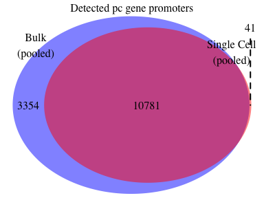<!-- -->

```r
grid.newpage()
file.remove(list.files(path='.', pattern='Venn.*.log'))
```

```
## [1] TRUE
```

```r
# Enhancer
vennList <- list(bulk=which(rowSums(counts[e_idx,bulk_idx])>0), 
                 sc=which(rowSums(counts[e_idx,sc_idx_456])>0))

venn.plot <- venn.diagram(vennList , NULL, 
                          category.names  = c("Bulk\n(pooled)", "Single Cell\n(pooled)"), 
                          main            = "Detected enhancer loci",
                          main.pos        = c(0.5,0.82),
                          main.cex        = 1,
                          scaled          = TRUE, 
                          margin          = 0.15,
                          fill            = c("blue", "red"),
                          lty             = "blank",
                          cex             = 1,
                          cat.cex         = 1,
                          cat.dist        = 0.01,
                          ext.length      = 0.85,
                          ext.line.lwd    = 2,
                          ext.line.lty    = "dashed"
                          )

grid.draw(venn.plot)
```

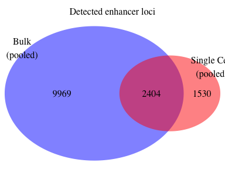<!-- -->

```r
grid.newpage()
file.remove(list.files(path='.', pattern='Venn.*.log'))
```

```
## [1] TRUE
```

```r
# lncRNA
vennList <- list(bulk=which(rowSums(counts[lc_idx,bulk_idx])>0), 
                 sc=which(rowSums(counts[lc_idx,sc_idx_456])>0))

venn.plot <- venn.diagram(vennList , NULL, 
                          category.names  = c("Bulk\n(pooled)", "Single Cell\n(pooled)"), 
                          main            = "Detected lncRNA promoters",
                          main.pos        = c(0.5,0.82),
                          main.cex        = 1,
                          scaled          = TRUE, 
                          margin          = 0.15,
                          fill            = c("blue", "red"),
                          lty             = "blank",
                          cex             = 1,
                          cat.cex         = 1,
                          cat.dist        = 0.01,
                          ext.length      = 0.85,
                          ext.line.lwd    = 2,
                          ext.line.lty    = "dashed"
                          )

grid.draw(venn.plot)
```

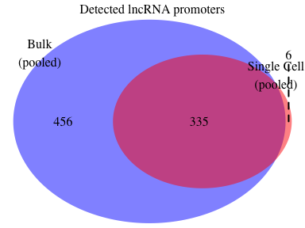<!-- -->

```r
grid.newpage()
file.remove(list.files(path='.', pattern='Venn.*.log'))
```

```
## [1] TRUE
```

## Correlation of bulk and sc expression

```r
# individual C1 libraries
pairs(log2(cbind(counts[, bulk_idx][,1:3], counts[,sc_idx_456][,1:3]) +1))
```

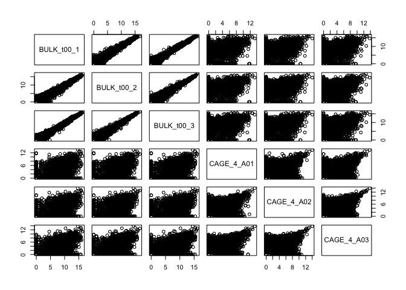<!-- -->

```r
# global
x <- cor(counts[, bulk_idx], method = 'spearman')
summary(x[upper.tri(x)])
```

```
##    Min. 1st Qu.  Median    Mean 3rd Qu.    Max. 
##  0.9031  0.9165  0.9226  0.9212  0.9265  0.9372
```

```r
x <- cor(counts[, sc_idx_456], method = 'spearman')
summary(x[upper.tri(x)])
```

```
##    Min. 1st Qu.  Median    Mean 3rd Qu.    Max. 
##  0.3069  0.4202  0.4446  0.4437  0.4673  0.5653
```

```r
x <- cor(counts[, c(1,sc_idx_456)], method = 'spearman')
summary(x[upper.tri(x)])
```

```
##    Min. 1st Qu.  Median    Mean 3rd Qu.    Max. 
##  0.2723  0.4192  0.4440  0.4427  0.4669  0.5653
```

```r
# by timepoint summing C1 libraries
x.res <- numeric(3)
x <- cor(cbind(rowSums(counts[,c(1,2,3)]), rowSums(counts[,sc_t00])), method = 'spearman')
x.res[1] <- x[1,2]
x <- cor(cbind(rowSums(counts[,c(4,5,6)]), rowSums(counts[,sc_t06])), method = 'spearman')
x.res[2] <- x[1,2]
x <- cor(cbind(rowSums(counts[,c(7,8,9)]), rowSums(counts[,sc_t24])), method = 'spearman')
x.res[3] <- x[1,2]
summary(x.res)
```

```
##    Min. 1st Qu.  Median    Mean 3rd Qu.    Max. 
##  0.6750  0.6812  0.6873  0.6874  0.6936  0.6999
```

```r
# summing C1 libraries across each run
cor(cbind(
          BULK_t00=rowSums(counts[,c(1,2,3)]),
          BULK_t06=rowSums(counts[,c(4,5,6)]),
          BULK_t24=rowSums(counts[,c(7,8,9)]),
          C1_t00=rowSums(counts[,sc_t00]),
          C1_t06=rowSums(counts[,sc_t06]),
          C1_t24=rowSums(counts[,sc_t24])
          ), method = 'spearman')
```

```
##           BULK_t00  BULK_t06  BULK_t24    C1_t00    C1_t06    C1_t24
## BULK_t00 1.0000000 0.9219893 0.9048223 0.6872680 0.6760908 0.6892630
## BULK_t06 0.9219893 1.0000000 0.9257623 0.6813239 0.6750412 0.6945181
## BULK_t24 0.9048223 0.9257623 1.0000000 0.6783815 0.6726940 0.6998982
## C1_t00   0.6872680 0.6813239 0.6783815 1.0000000 0.8087906 0.8061766
## C1_t06   0.6760908 0.6750412 0.6726940 0.8087906 1.0000000 0.8057440
## C1_t24   0.6892630 0.6945181 0.6998982 0.8061766 0.8057440 1.0000000
```

```r
pairs(log2(cbind(
          BULK_t00=rowSums(counts[,c(1,2,3)]),
          BULK_t06=rowSums(counts[,c(4,5,6)]),
          BULK_t24=rowSums(counts[,c(7,8,9)]),
          C1_t00=rowSums(counts[,sc_t00]),
          C1_t06=rowSums(counts[,sc_t06]),
          C1_t24=rowSums(counts[,sc_t24])
          ) +1))
```

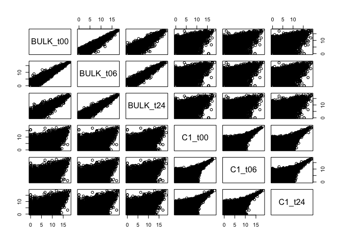<!-- -->

## library Variability
### Bulk
* How many TSS are detected in all 9 bulk libraries, and 8, 7 ....

```r
# TSS detected in the bulk libraries
bulk_counts <- apply(counts[,bulk_idx], 1, function(x){sum(x>0)})
table(bulk_counts[pc_idx]) # protein coding genes detected in bulk library number
```

```
## 
##     0     1     2     3     4     5     6     7     8     9 
##    66   413   279   204   174   175   184   215   295 12196
```

```r
format(table(bulk_counts[pc_idx])/nrow(counts[pc_idx,])*100, digits = 2) # percentage of protein coding genes  detected in bulk libraries
```

```
## 
##       0       1       2       3       4       5       6       7       8       9 
## " 0.46" " 2.91" " 1.96" " 1.44" " 1.23" " 1.23" " 1.30" " 1.51" " 2.08" "85.88"
```

```r
table(bulk_counts[e_idx]) # enhancer loci detected in bulk library number
```

```
## 
##    0    1    2    3    4    5    6    7    8    9 
## 4438 4881 1786 1100  827  665  656  586  609 1263
```

```r
format(table(bulk_counts[e_idx])/nrow(counts[e_idx,])*100, digits = 2) # percentage of enhancer loci detected in bulk
```

```
## 
##      0      1      2      3      4      5      6      7      8      9 
## "26.4" "29.0" "10.6" " 6.5" " 4.9" " 4.0" " 3.9" " 3.5" " 3.6" " 7.5"
```

```r
table(bulk_counts[lc_idx]) # lncRNA genes detected in bulk library number
```

```
## 
##   0   1   2   3   4   5   6   7   8   9 
##  14 100  49  42  35  33  46  34  50 402
```

```r
format(table(bulk_counts[lc_idx])/nrow(counts[lc_idx,])*100, digits = 2) # percentage of lncRNA detected in bulk
```

```
## 
##      0      1      2      3      4      5      6      7      8      9 
## " 1.7" "12.4" " 6.1" " 5.2" " 4.3" " 4.1" " 5.7" " 4.2" " 6.2" "49.9"
```

```r
bulk_counts_p <- apply(counts[pc_idx,bulk_idx], 1, function(x){sum(x>0)})
bulk_counts_e <- apply(counts[e_idx,bulk_idx], 1, function(x){sum(x>0)})
bulk_counts_l <- apply(counts[lc_idx,bulk_idx], 1, function(x){sum(x>0)})
(qplot(bulk_counts_p[bulk_counts_p > 0], geom='histogram', binwidth=1)
  +theme_minimal()
  +xlab('number of bulk cell libraries detected in')
  +ylab('protein coding genes')
  + scale_x_continuous(breaks=1:9)
)
```

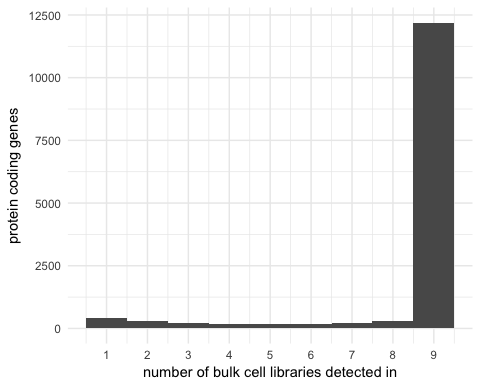<!-- -->

```r
(qplot(bulk_counts_e[bulk_counts_e > 0], geom='histogram', binwidth=1)
  +theme_minimal()
  +xlab('number of bulk cell libraries detected in')
  +ylab('enhancer loci')
  +scale_x_continuous(breaks=1:9)
)
```

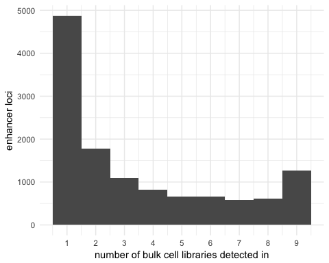<!-- -->

```r
(qplot(bulk_counts_l[bulk_counts_l > 0], geom='histogram', binwidth=1)
  +theme_minimal()
  +xlab('number of bulk cell libraries detected in')
  +ylab('lncRNA genes')
  +scale_x_continuous(breaks=1:9)
)
```

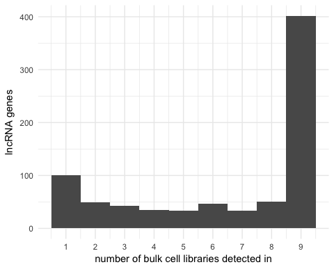<!-- -->

### Single cell
* How many TSS are detected in multiple single cell libraries


```r
sc_counts_p <- apply(counts[pc_idx,sc_idx], 1, function(x){sum(x>0)})
sc_counts_e <- apply(counts[e_idx,sc_idx], 1, function(x){sum(x>0)})
sc_counts_l <- apply(counts[lc_idx,sc_idx], 1, function(x){sum(x>0)})
(qplot(sc_counts_p[sc_counts_p > 0], geom='histogram', binwidth=1)
  +theme_minimal()
  +xlab('number of single cell libraries detected in')
  +ylab('Protein coding genes')
)
```

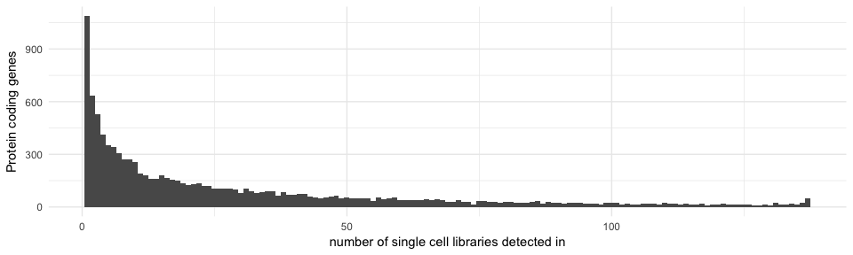<!-- -->

```r
(qplot(sc_counts_e[sc_counts_e > 0], geom='histogram', binwidth=1)
  +theme_minimal()
  +xlab('number of single cell libraries')
  +ylab('enhancer loci')
)
```

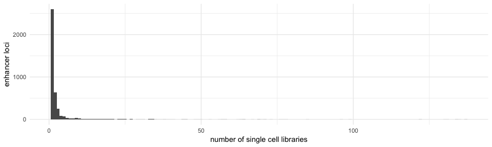<!-- -->

```r
(qplot(sc_counts_l[sc_counts_l > 0], geom='histogram', binwidth=1)
  +theme_minimal()
  +xlab('number of single cell libraries')
  +ylab('lncRNA genes')
)
```

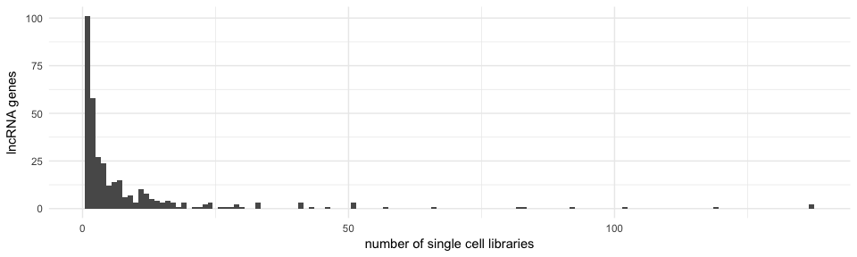<!-- -->

## single cell specific enhancers


```r
z <- as.data.table(counts[, union(bulk_idx, sc_idx_456)])
z$geneID <- rownames(counts)
z$geneClass <- geneClass
z$sc_cage_libs <- apply(z[,grep('CAGE', colnames(z)), with=F], 1, function(x){sum(x>0)})
z$sc_cage_mean <- apply(z[,grep('CAGE', colnames(z)), with=F], 1, function(x){mean(x[x>0])})
z$sc_cage_median <- apply(z[,grep('CAGE', colnames(z)), with=F], 1, function(x){median(x[x>0])})
z$bulk_cage_libs <- apply(z[,grep('BULK', colnames(z)), with=F], 1, function(x){sum(x>0)})
z$bulk_cage_mean <- apply(z[,grep('BULK', colnames(z)), with=F], 1, function(x){mean(x[x>0])})
z$bulk_cage_median <- apply(z[,grep('BULK', colnames(z)), with=F], 1, function(x){median(x[x>0])})

gene.stats <- z[, .(geneID, geneClass, sc_cage_libs, sc_cage_mean, sc_cage_median, bulk_cage_libs, bulk_cage_mean, bulk_cage_median)]
rm(z)

#meta <- fread('zcat <~/Documents/repos/C1_CAGE_Timecourse/gene_models/GENCODEv25/log/F5_CAGE_anno.GENCODEv25.ID_mapping.info.tsv.gz')
#meta <- meta[, .(clusterID, geneID)]
#meta <- unique(meta)
#gene.stats <- merge(meta, gene.stats)

gene.stats$uniq <- 'Both'
gene.stats[bulk_cage_libs == 0]$uniq <- 'C1 only'
gene.stats[sc_cage_libs == 0]$uniq <- 'Bulk only'
gene.stats[is.nan(sc_cage_mean)]$sc_cage_mean <- 0
gene.stats[is.nan(bulk_cage_mean)]$bulk_cage_mean <- 0
gene.stats[is.na(sc_cage_median)]$sc_cage_median <- 0
gene.stats[is.na(bulk_cage_median)]$bulk_cage_median <- 0

# c1 specific enhancers
gene.stats[geneClass=='enhancer_locus' & uniq == 'C1 only', .N]
```

```
## [1] 1530
```

```r
gene.stats[geneClass=='enhancer_locus' & uniq == 'C1 only', summary(sc_cage_mean)]
```

```
##    Min. 1st Qu.  Median    Mean 3rd Qu.    Max. 
##    1.00    1.00    3.00   34.32   25.00 1057.00
```

```r
gene.stats[geneClass=='enhancer_locus' & uniq == 'Both', summary(sc_cage_mean)]
```

```
##    Min. 1st Qu.  Median    Mean 3rd Qu.    Max. 
##   1.000   2.327  13.000  53.115  59.000 956.000
```

```r
gene.stats[geneClass=='enhancer_locus' & uniq == 'C1 only', summary(sc_cage_libs)]
```

```
##    Min. 1st Qu.  Median    Mean 3rd Qu.    Max. 
##   1.000   1.000   1.000   1.835   1.000  69.000
```

```r
gene.stats[geneClass=='enhancer_locus' & uniq == 'Both', summary(sc_cage_libs)]
```

```
##    Min. 1st Qu.  Median    Mean 3rd Qu.    Max. 
##   1.000   1.000   1.000   3.875   2.000 137.000
```

```r
gene.stats[geneClass=='enhancer_locus' & uniq == 'C1 only'][order(-sc_cage_libs)]
```

```
##                  geneID      geneClass sc_cage_libs sc_cage_mean sc_cage_median
##    1: ADDG03149657313.E enhancer_locus           69     1.768116              1
##    2: ADDG03015780032.E enhancer_locus           64     6.000000              2
##    3: ADDG04024660007.E enhancer_locus           63     9.158730              6
##    4: ADDG01157030350.E enhancer_locus           58    33.068966             21
##    5: ADDG02204499475.E enhancer_locus           53     3.245283              2
##   ---                                                                          
## 1526: ADDG22045080339.E enhancer_locus            1    23.000000             23
## 1527: ADDG22045117144.E enhancer_locus            1   230.000000            230
## 1528: ADDG22047173530.E enhancer_locus            1     1.000000              1
## 1529: ADDG22047430319.E enhancer_locus            1   186.000000            186
## 1530: ADDG22050331571.E enhancer_locus            1    14.000000             14
##       bulk_cage_libs bulk_cage_mean bulk_cage_median    uniq
##    1:              0              0                0 C1 only
##    2:              0              0                0 C1 only
##    3:              0              0                0 C1 only
##    4:              0              0                0 C1 only
##    5:              0              0                0 C1 only
##   ---                                                       
## 1526:              0              0                0 C1 only
## 1527:              0              0                0 C1 only
## 1528:              0              0                0 C1 only
## 1529:              0              0                0 C1 only
## 1530:              0              0                0 C1 only
```

```r
gene.stats$sel <- F
gene.stats[sc_cage_libs^2+sc_cage_mean>100]$sel <- T
gene.stats[, table(sel)]
```

```
## sel
## FALSE  TRUE 
## 24952  9404
```

```r
# bulk / c1 comparison
(ggplot(gene.stats[geneClass=='protein_coding'], aes(log2(sc_cage_mean), log2(bulk_cage_mean), colour=sel))
  +geom_point()
  )
```

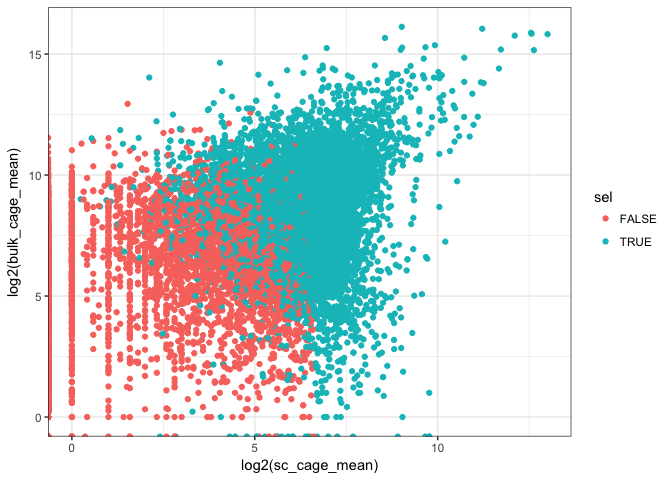<!-- -->

```r
# number of sc specific DPI / genes
gene.stats[bulk_cage_libs == 0 & sc_cage_libs > 0, table(geneClass)]
```

```
## geneClass
##                          antisense                     enhancer_locus 
##                                  4                               1530 
##                            lincRNA                              miRNA 
##                                  6                                  2 
##                           misc_RNA               processed_pseudogene 
##                                  4                                195 
##               processed_transcript                     protein_coding 
##                                  2                                 41 
##                         pseudogene                  sense_overlapping 
##                                  2                                  1 
##                             snoRNA                                TEC 
##                                 13                                  2 
##   transcribed_processed_pseudogene transcribed_unprocessed_pseudogene 
##                                 10                                  7 
##             unprocessed_pseudogene 
##                                  5
```

```r
gene.stats <- gene.stats[geneClass %in% c('enhancer_locus', 'protein_coding', 'lincRNA')]

(ggplot(gene.stats, aes(x=bulk_cage_median, y=sc_cage_median)) 
  +geom_point()
    +scale_x_continuous(trans = 'log10',
                        breaks = trans_breaks('log10', function(x) 10^x),
                        labels = trans_format('log10', math_format(10^.x)))
   +scale_y_continuous(trans = 'log10',
                        breaks = trans_breaks('log10', function(x) 10^x),
                        labels = trans_format('log10', math_format(10^.x)))
)
```

```
## Warning: Transformation introduced infinite values in continuous x-axis
```

```
## Warning: Transformation introduced infinite values in continuous y-axis
```

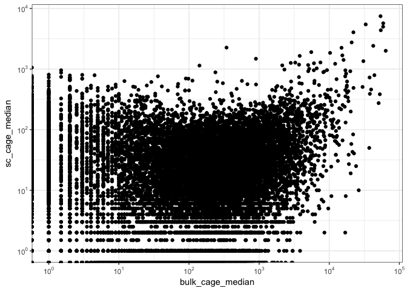<!-- -->

```r
# Read counts of all detected enhancers
summary(rowMeans(counts[rowSums(counts[, sc_idx]) >0,sc_idx]))
```

```
##     Min.  1st Qu.   Median     Mean  3rd Qu.     Max. 
##    0.007    0.197    2.153   26.575   14.308 8213.504
```

```r
# Read counts of single cell specific enhancers
summary(rowMeans(counts[gene.stats[geneClass=='enhancer_locus' & bulk_cage_libs == 0, geneID],sc_idx]))
```

```
##      Min.   1st Qu.    Median      Mean   3rd Qu.      Max. 
##  0.000000  0.000000  0.000000  0.122602  0.007299 14.000000
```

```r
gene.stats[uniq=='C1 only'][order(-sc_cage_libs)][1:20]
```

```
##                         geneID      geneClass sc_cage_libs sc_cage_mean
##  1:          ENSG00000183558.5 protein_coding          137   810.029197
##  2:          ENSG00000203812.2 protein_coding          137   871.744526
##  3:        ENSG00000272196.2_1 protein_coding          137   871.744526
##  4:        ENSG00000188375.4_2 protein_coding          136   152.808824
##  5:       ENSG00000184110.14_1 protein_coding          118   128.584746
##  6:          ENSG00000204152.6 protein_coding           95    65.568421
##  7:       ENSG00000169100.13_1 protein_coding           89    87.629213
##  8:        ENSG00000169627.7_1 protein_coding           86    49.604651
##  9: ENSG00000169100.13_1_PAR_Y protein_coding           77    84.129870
## 10:          ADDG03149657313.E enhancer_locus           69     1.768116
## 11:          ADDG03015780032.E enhancer_locus           64     6.000000
## 12:          ADDG04024660007.E enhancer_locus           63     9.158730
## 13:          ADDG01157030350.E enhancer_locus           58    33.068966
## 14:       ENSG00000002586.18_2 protein_coding           56     7.142857
## 15:       ENSG00000182774.10_2 protein_coding           56    22.071429
## 16:          ADDG02204499475.E enhancer_locus           53     3.245283
## 17:       ENSG00000124333.15_1 protein_coding           53    38.792453
## 18:          ADDG14022080552.E enhancer_locus           49    32.326531
## 19:          ADDG06094545083.E enhancer_locus           45     2.755556
## 20:          ADDG13042646001.E enhancer_locus           45     7.911111
##     sc_cage_median bulk_cage_libs bulk_cage_mean bulk_cage_median    uniq  sel
##  1:          514.0              0              0                0 C1 only TRUE
##  2:          497.0              0              0                0 C1 only TRUE
##  3:          497.0              0              0                0 C1 only TRUE
##  4:          128.0              0              0                0 C1 only TRUE
##  5:           91.0              0              0                0 C1 only TRUE
##  6:           46.0              0              0                0 C1 only TRUE
##  7:           50.0              0              0                0 C1 only TRUE
##  8:           28.5              0              0                0 C1 only TRUE
##  9:           49.0              0              0                0 C1 only TRUE
## 10:            1.0              0              0                0 C1 only TRUE
## 11:            2.0              0              0                0 C1 only TRUE
## 12:            6.0              0              0                0 C1 only TRUE
## 13:           21.0              0              0                0 C1 only TRUE
## 14:            5.0              0              0                0 C1 only TRUE
## 15:            4.5              0              0                0 C1 only TRUE
## 16:            2.0              0              0                0 C1 only TRUE
## 17:           12.0              0              0                0 C1 only TRUE
## 18:           11.0              0              0                0 C1 only TRUE
## 19:            2.0              0              0                0 C1 only TRUE
## 20:            5.0              0              0                0 C1 only TRUE
```

```r
#(ggplot(gene.stats, aes(sc_cage_mean, sc_cage_cv))
#  +geom_point()
#  +facet_grid(geneClass ~ bulk_cage_libs == 0, scales = 'free_x')
#     +scale_x_continuous(trans = 'log10',
#                        breaks = trans_breaks('log10', function(x) 10^x),
#                        labels = trans_format('log10', math_format(10^.x)))
#  )
(ggplot(gene.stats[uniq != 'Bulk only'], aes(sc_cage_libs, sc_cage_median))
  +geom_point(alpha=0.2)
  +facet_grid(geneClass ~ uniq, scales='free_y')
  +xlab('C1 CAGE libraries')
  +ylab('C1 CAGE mean reads')
  )
```

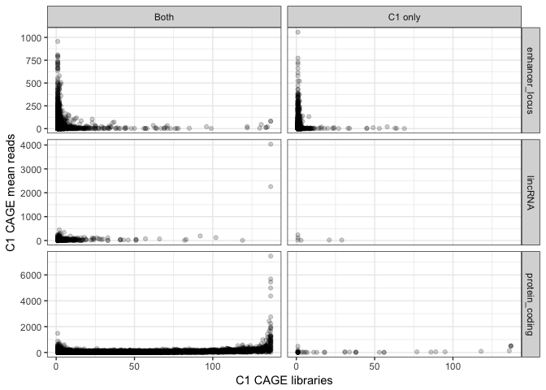<!-- -->

```r
(ggplot(gene.stats[uniq != 'Bulk only'], aes(sc_cage_mean, sc_cage_median))
  +geom_point()
  +facet_grid(geneClass ~ uniq)
  +scale_x_continuous(trans = 'log10',
                        breaks = trans_breaks('log10', function(x) 10^x),
                        labels = trans_format('log10', math_format(10^.x)))
   +scale_y_continuous(trans = 'log10',
                        breaks = trans_breaks('log10', function(x) 10^x),
                        labels = trans_format('log10', math_format(10^.x)))
  +ylab('C1 CAGE median reads')
  +xlab('C1 CAGE mean reads')
  )
```

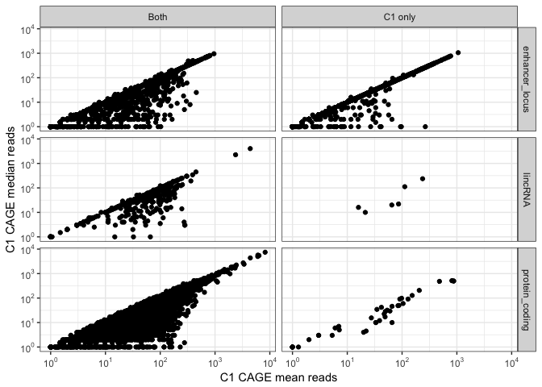<!-- -->

```r
(ggplot(gene.stats, aes(bulk_cage_median, sc_cage_libs))
  +geom_point(alpha=0.2)
  #+geom_density_2d()
  +facet_wrap(~geneClass)
  +xlab('Bulk CAGE median reads')
  +ylab('C1 CAGE libraries')
    +scale_x_continuous(trans = 'log10',
                        breaks = trans_breaks('log10', function(x) 10^x),
                        labels = trans_format('log10', math_format(10^.x)))
  )
```

```
## Warning: Transformation introduced infinite values in continuous x-axis
```

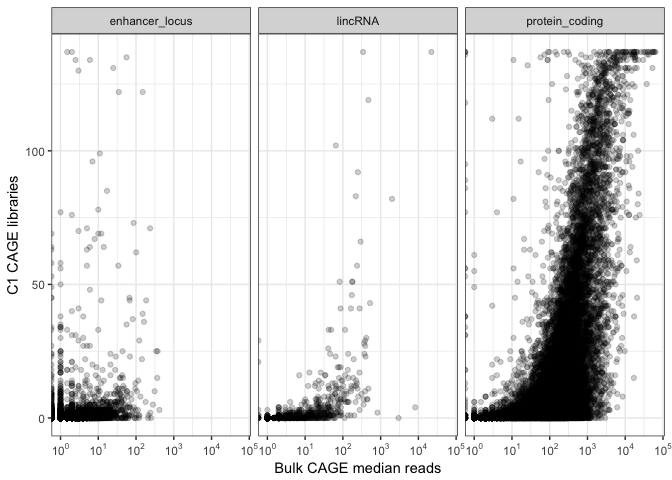<!-- -->

```r
# Expressing cells
quantile(apply(counts[rowSums(counts[, sc_idx]) >0,sc_idx], 1, function(x){sum(x>0)}), seq(0.1,1,0.1))
```

```
##  10%  20%  30%  40%  50%  60%  70%  80%  90% 100% 
##    1    1    2    4    7   13   23   39   68  137
```

```r
quantile(apply(counts[gene.stats[geneClass=='enhancer_locus' & bulk_cage_libs == 0, geneID],sc_idx], 1, function(x){sum(x>0)}), seq(0.1,1,0.1))
```

```
##  10%  20%  30%  40%  50%  60%  70%  80%  90% 100% 
##    0    0    0    0    0    0    1    1    1   69
```

```r
#gene.stats$uniq <- 'both'
#gene.stats[sc_cage_libs > 0 & bulk_cage_libs == 0]$uniq <- 'c1'
#gene.stats[sc_cage_libs == 0 & bulk_cage_libs > 0]$uniq <- 'bulk'

(ggplot(gene.stats, aes(sc_cage_median, fill=uniq))
  +geom_density(alpha=0.4)
  +xlab('C1 CAGE median reads')
  +scale_x_continuous(trans = 'log10',
                        breaks = trans_breaks('log10', function(x) 10^x),
                        labels = trans_format('log10', math_format(10^.x)))
    )
```

```
## Warning: Transformation introduced infinite values in continuous x-axis
```

```
## Warning: Removed 16720 rows containing non-finite values (stat_density).
```

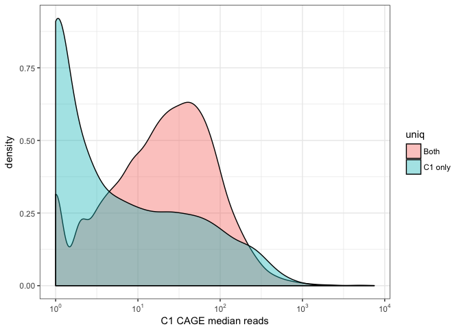<!-- -->

```r
(ggplot(gene.stats, aes(sc_cage_mean, fill=uniq))
  +geom_density(alpha=0.4)
    +xlab('C1 CAGE mean reads')
  +scale_x_continuous(trans = 'log10',
                        breaks = trans_breaks('log10', function(x) 10^x),
                        labels = trans_format('log10', math_format(10^.x)))
  +guides(fill=guide_legend(title = ''))
    )
```

```
## Warning: Transformation introduced infinite values in continuous x-axis

## Warning: Removed 16720 rows containing non-finite values (stat_density).
```

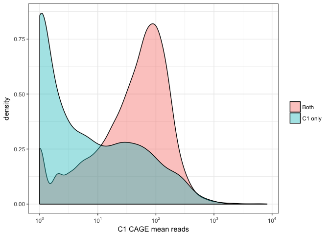<!-- -->

```r
(ggplot(gene.stats, aes(sc_cage_libs, fill=uniq))
  +geom_density(alpha=0.4)
  +xlab('C1 CAGE libraries')
  +scale_x_continuous(trans = 'log10',
                        breaks = trans_breaks('log10', function(x) 10^x),
                        labels = trans_format('log10', math_format(10^.x)))
  +guides(fill=guide_legend(title = ''))
    )
```

```
## Warning: Transformation introduced infinite values in continuous x-axis

## Warning: Removed 16720 rows containing non-finite values (stat_density).
```

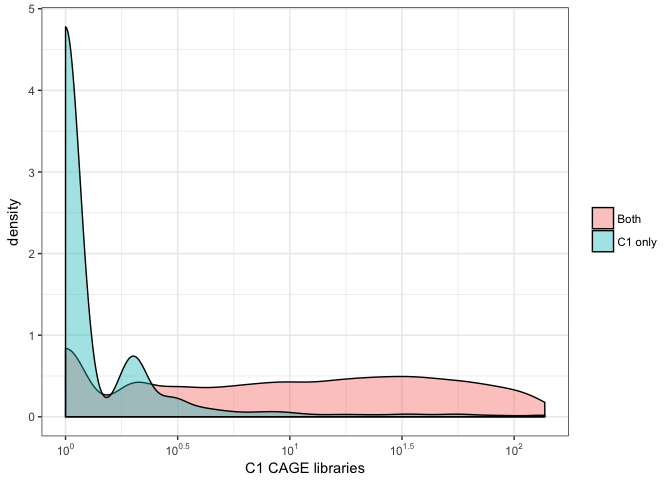<!-- -->

```r
(ggplot(gene.stats[uniq!='Bulk only'], aes(sc_cage_libs, fill=uniq))
  +geom_histogram(position = 'dodge', binwidth = 1)
  +xlab('C1 CAGE libraries')
  +facet_wrap(~uniq, scales = 'free_y', ncol = 1)
  +guides(fill=FALSE)
    )
```

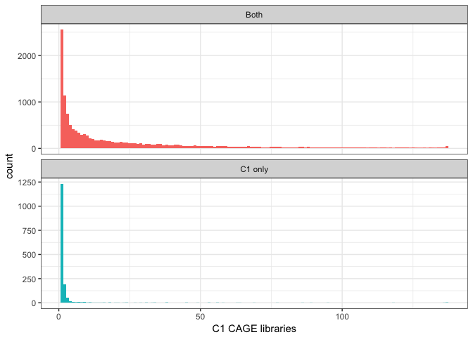<!-- -->

```r
mappability  <- fread('~/Documents/C1_timecourse/F5_CAGE_anno.GENCODEv25.cage_cluster.coord.enhancer.mappability')
setnames(mappability, c('geneID','mapp.size','mapp.covered','mapp.sum','mapp.mean0','mapp.mean'))
mappability$geneID <- mappability[, tstrsplit(geneID, '@')]$V2
gene.stats.e <- merge(mappability, gene.stats, by='geneID')
(ggplot(gene.stats.e, aes(log(bulk_cage_median), sc_cage_libs, colour=mapp.mean > 0.5))
  +geom_point()
  )
```

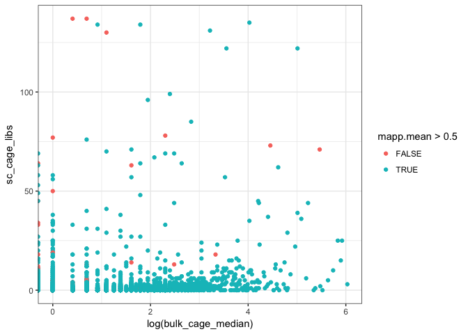<!-- -->

## Read depth - Hanabi plots
Assuming all reads fall within these annotations, and that the pooled libraries represent the universe of discoverable features. What are the TSS features discovered in single cell/bulk for the same sequencing depth.

### By feature category

```r
library(smallCAGEqc)
```

```
## Loading required package: magrittr
```

```r
.add.alpha <- function(col, alpha) {
  apply( sapply(col, col2rgb) / 255
       , 2
       , function(x)
           rgb(x[1], x[2], x[3], alpha=alpha))
}
hana.pc <- rbind(counts[pc_idx,], other=colSums(counts[!pc_idx,]))
hana.e <- rbind(counts[e_idx,], other=colSums(counts[!e_idx,]))
hana.lc <- rbind(counts[lc_idx,], other=colSums(counts[!lc_idx,]))

x <- hanabi(hana.pc[,bulk_idx])
x2 <- hanabi(hana.e[,bulk_idx])
x3 <- hanabi(hana.lc[,bulk_idx])
plot(x, xlab = 'Read count', ylab='Protein coding genes', main = 'Bulk CAGE libraries')
```

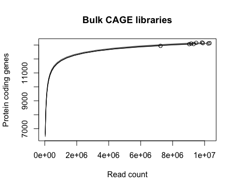<!-- -->

```r
plot(x2, xlab = 'Read count', ylab='Enhancer loci', main = 'Bulk CAGE libraries')
```

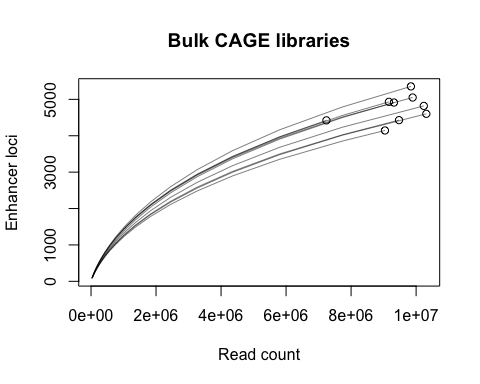<!-- -->

```r
plot(x3, xlab = 'Read count', ylab='lncRNA genes', main = 'Bulk CAGE libraries')
```

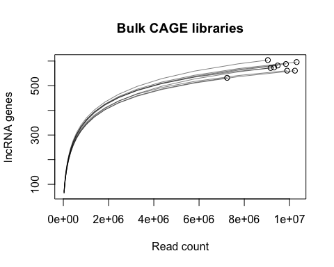<!-- -->

```r
h <- x
  xmax <- sapply(h, function(x) max(x$x))
  xmin <- sapply(h, function(x) min(x$x))
  ymax <- sapply(h, function(x) max(x$y))
  ymin <- sapply(c(x,x2,x3), function(x) min(x$y))
  plot( c(min(xmin), max(xmax))
      , c(min(ymin), max(ymax))
      , type="n"
      , xlab = 'Read Count'
      , ylab = 'Features'
, main = 'Bulk CAGE libraries')
  
    lines( h
       , col = .add.alpha('black', 0.5))
  points( h
        , col = 'black'
        , pch = 1)
      lines( x2
       , col = .add.alpha('red', 0.5))
  points( x2
        , col = 'red'
        , pch = 1)
        lines( x3
       , col = .add.alpha('green', 0.5))
    points( x3
        , col = 'green'
        , pch = 1)
  
    legend( x = 'topleft'
          , legend = c('Protein coding genes', 'Enhancer loci', 'lncRNA genes')
          , col = c('black', 'red', 'green')
, pch = 1)
```

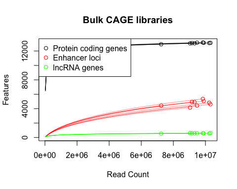<!-- -->

```r
colsum <- colSums(counts[, sc_idx_456])
total <- samples[names(colsum),total,on='Rownames']
summary(total)
```

```
##    Min. 1st Qu.  Median    Mean 3rd Qu.    Max. 
##  721181 1860670 2527460 2348701 2896793 3778237
```

```r
counts.add <- rbind(counts[,sc_idx_456], total - colsum)

x.all <- hanabi(counts.add)
plot(x.all, xlab = 'Read count', ylab='Genes detected', main='')
```

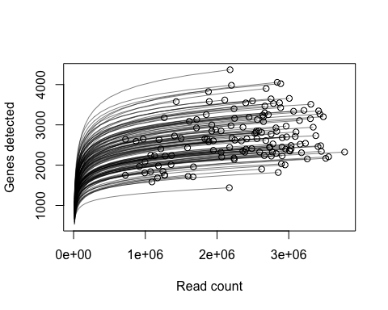<!-- -->

```r
pdf('../manuscript/Fig2/hanabi.pdf', height = 4, width = 5)
plot(x.all, xlab = 'Read count', ylab='Genes detected', main='', xaxt = "n")
axis(side=1, at=c(0, 1e+6, 2e+6, 3e+6),labels=expression(0, 1%*%10^6, 2%*%10^6, 3%*%10^6)) 
dev.off()
```

```
## quartz_off_screen 
##                 2
```

```r
rm(counts.add)
rm(total)
rm(colsum)
#x <- unlist(x.all)
#x <- matrix(x, nrow = 20, byrow = F)

x <- hanabi(hana.pc[,sc_idx_456])
plot(x, xlab = 'Read count', ylab='Protein coding genes', main = 'C1 CAGE libraries')
```

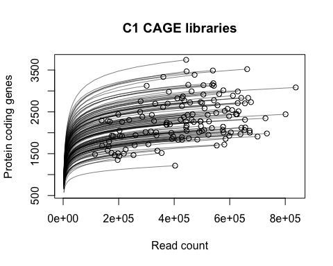<!-- -->

```r
x2 <- hanabi(hana.e[,sc_idx_456])
plot(x2, xlab = 'Read count', ylab='Enhancer loci', main = 'C1 CAGE libraries')
```

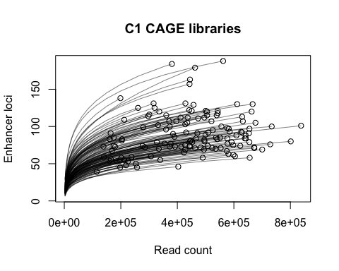<!-- -->

```r
x3 <- hanabi(hana.lc[,sc_idx_456])
plot(x3, xlab = 'Read count', ylab='lncRNA genes', main = 'C1 CAGE libraries')
```

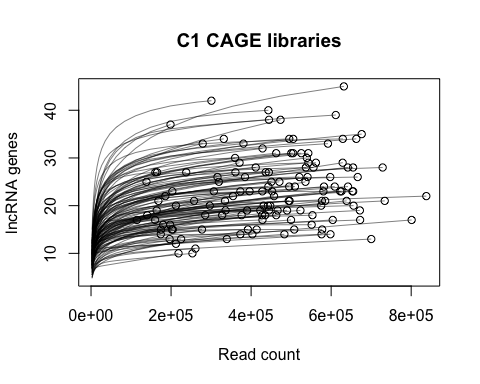<!-- -->

```r
h <- x
  xmax <- sapply(h, function(x) max(x$x))
  xmin <- sapply(h, function(x) min(x$x))
  ymax <- sapply(h, function(x) max(x$y))
  ymin <- sapply(c(x,x2), function(x) min(x$y))
  plot( c(min(xmin), max(xmax))
      , c(min(ymin), max(ymax))
      , type="n"
      , xlab = 'Read Count'
      , ylab = 'Features'
, main = 'C1 CAGE libraries')
  
    lines( h
       , col = .add.alpha('black', 0.5))
  points( h
        , col = 'black'
        , pch = 1)
      lines( x2
       , col = .add.alpha('red', 0.5))
  points( x2
        , col = 'red'
        , pch = 1)
          lines( x3
       , col = .add.alpha('green', 0.5))
    points( x3
        , col = 'green'
        , pch = 1)
  
    legend( x = 'topleft'
          , legend = c('Protein coding genes', 'Enhancer loci', 'lncRNA genes')
          , col = c('black', 'red', 'green')
, pch = 1)
```

<!-- -->

### By expression quartile
Hanabi plots subset by expression (in bulk)

```r
#protein coding genes split into quartiles
expr <- sort(rowSums(counts[pc_idx, bulk_idx]))
expr <- expr[expr > 0]
n <- length(expr)

q1 <- rownames(counts) %in% names(expr[1:round(n/4)])[1:3534]
q2 <- rownames(counts) %in% names(expr[round(n/4) : round(n/2)])[1:3534]
q3 <- rownames(counts) %in% names(expr[round(n/2) : round((n*3)/4)])[1:3534]
q4 <- rownames(counts) %in% names(expr[round((n*3)/4) : n])[1:3534]

hana <- cbind(rbind(counts[q1,bulk_idx], other=colSums(counts[!q1,bulk_idx])),
                 rbind(counts[q2,bulk_idx], other=colSums(counts[!q2,bulk_idx])),
                 rbind(counts[q3,bulk_idx], other=colSums(counts[!q3,bulk_idx])),
                 rbind(counts[q4,bulk_idx], other=colSums(counts[!q4,bulk_idx])))

x <- hanabi(hana)
hanabiPlot(x, GROUP=c(rep('4', 9),rep('3', 9),rep('2', 9),rep('1', 9)), legend.pos='bottomright',
           main='BULK CAGE protein coding genes by expression quartile', 
           ylab='Protein coding genes')
```

<!-- -->

```r
n=10
hana <- cbind(rbind(counts[q1,sc_idx_456[1:n]], other=colSums(counts[!q1,sc_idx_456[1:n]])),
                 rbind(counts[q2,sc_idx_456[1:n]], other=colSums(counts[!q2,sc_idx_456[1:n]])),
                 rbind(counts[q3,sc_idx_456[1:n]], other=colSums(counts[!q3,sc_idx_456[1:n]])),
                 rbind(counts[q4,sc_idx_456[1:n]], other=colSums(counts[!q4,sc_idx_456[1:n]])))

x <- hanabi(hana)
hanabiPlot(x, GROUP=c(rep('4', n),rep('3', n),rep('2', n),rep('1', n)), legend.pos='bottomright',
           main='C1 CAGE protein coding genes by expression quartile',
           ylab='Protein coding genes')
```

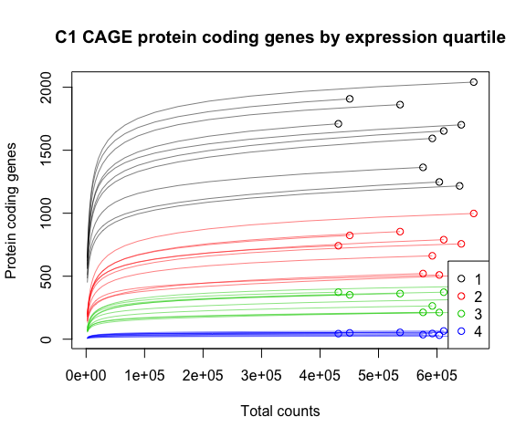<!-- -->

### Detection in single cell by bulk tpm bin

```r
bins <- c(0, 1,5,10,100,100000)
bin_labs <- c('<1','1-5','5-10','10-100','>100')
calc_cpm <- function (expr_mat)
{
  norm_factor <- colSums(expr_mat)
  return(t(t(expr_mat)/norm_factor) * 10^6)
}
bulk_cpm <- calc_cpm(counts[,bulk_idx])
bulk_cpm_median <- apply(bulk_cpm, 1, mean)
bulk_reads <- apply(counts[,bulk_idx], 1, sum)
df <- data.table(geneID = names(bulk_cpm_median),
                 cpm    = bulk_cpm_median)
df$type <- 'none'
invisible(df[pc_idx, type:= 'protein coding'])
invisible(df[e_idx, type:= 'enhancer RNA'])
invisible(df[lc_idx, type:= 'lncRNA'])
df <- df[cpm > 0 & ! type == 'none' & bulk_reads >= 3]
invisible(df[, bin:= cut(cpm, breaks = bins, labels = 1:5)])

c1_detect <- as.data.table(counts[rownames(counts) %in% df$geneID, sc_idx_456])
invisible(c1_detect[, geneID := rownames(counts[rownames(counts) %in% df$geneID, sc_idx_456])])
c1_detect <- melt(c1_detect, id.vars = 'geneID')
setnames(c1_detect, c('geneID', 'library', 'reads'))

x <- merge(df, c1_detect)
x <- x[, .(n=nrow(.SD[reads > 0]), bulk=length(unique(geneID))), by=.(library, bin, type)]
invisible(x[, pc := n/bulk])

xx <- copy(x)
xx[type != 'enhancer RNA', type := 'Promotor']
xx[type == 'enhancer RNA', type := 'Enhancer']

(ggplot(xx, aes(bin, pc*100, colour=type))
  +geom_boxplot()
  +xlab('Bulk CAGE expression TPM')
  +ylab('Features detected per cell (%)')
  +scale_x_discrete(labels=bin_labs)
  +scale_color_brewer(palette="Accent")
  )
```

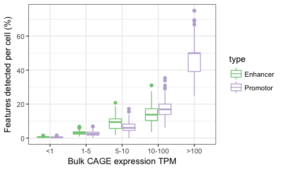<!-- -->

```r
ggsave('cf_bulk_frac.pdf', path='../manuscript/Fig4/', height = 3, width = 5, units = 'in')

(ggplot(x[!bin %in% c('6','7', '8') ], aes(bin, pc*100, colour=type))
  +geom_boxplot()
  +xlab('Bulk CAGE expression TPM')
  +ylab('Expressed features detected per library (%)')
  +scale_x_discrete(labels=bin_labs)
  )
```

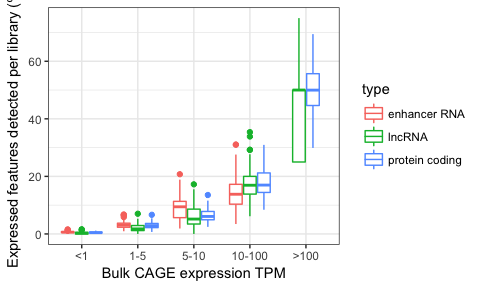<!-- -->

```r
(ggplot(x, aes(bin, n, colour=type))
  +geom_boxplot()
  +xlab('Bulk CAGE expression TPM')
  +ylab('Features detected per library')
  +scale_x_discrete(labels=bin_labs)
  )
```

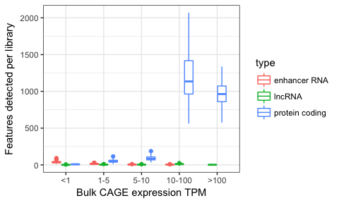<!-- -->

```r
# Pooling replicates, including standard errors
x <- merge(df, c1_detect)
x$rep <- 1
invisible(x[grep('CAGE_5', library), rep := 2])
invisible(x[grep('CAGE_6', library), rep := 3])
std <- function(x) sd(x)/sqrt(length(x))
x <- x[, .(n=.SD[reads > 3, length(unique(geneID))], bulk=length(unique(geneID))), by=.(bin, type, rep)]
invisible(x[, pc := n/bulk])
x <- x[, .(se.pc=std(pc), pc=mean(pc), se.n=std(n), n=mean(n)), by=.(bin, type)]


(ggplot(x, aes(bin, pc, fill=type))
  +geom_bar(stat = 'identity', position = 'dodge')
  +xlab('Expression TPM')
  +ylab('Fraction of bulk features detected')
  +scale_x_discrete(labels=bin_labs)
  +geom_errorbar(aes(ymin=pc-se.pc, ymax=pc+se.pc), position = "dodge")
  )
```

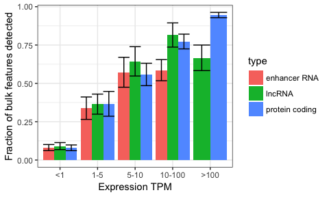<!-- -->

```r
(ggplot(x, aes(bin, n, fill=type))
  +geom_bar(stat = 'identity', position = 'dodge')
  +xlab('Expression TPM')
  +ylab('Features detected')
  +scale_x_discrete(labels=bin_labs)
  +geom_errorbar(aes(ymin=n-se.n, ymax=n+se.n), position = "dodge")
  )
```

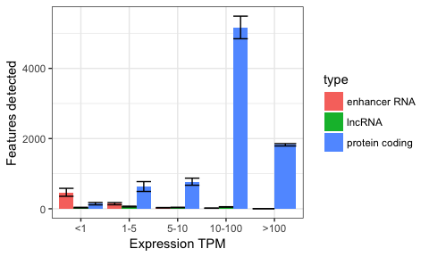<!-- -->

```r
# Pooling everything
x <- merge(df, c1_detect)
x <- x[, .(n=.SD[reads > 3, length(unique(geneID))], bulk=length(unique(geneID))), by=.(bin, type)]
invisible(x[, pc := n/bulk])

(ggplot(x, aes(bin, pc, fill=type))
  +geom_bar(stat = 'identity', position = 'dodge')
  +xlab('Expression TPM')
  +ylab('Fraction of bulk features detected')
  +scale_x_discrete(labels=bin_labs)
  )
```

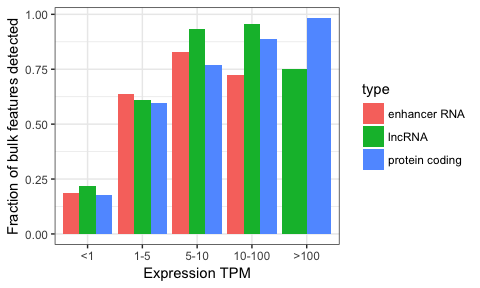<!-- -->

```r
(ggplot(x, aes(bin, n, fill=type))
  +geom_bar(stat = 'identity', position = 'dodge')
  +xlab('Expression TPM')
  +ylab('Features detected')
  +scale_x_discrete(labels=bin_labs)
  )
```

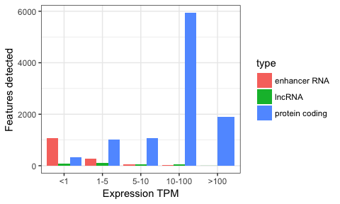<!-- -->

# specificity by Gini

```r
library(ineq)
x <- merge(df, c1_detect)
x <- x[, .(g=Gini(reads, na.rm = T)), by=.(geneID, cpm, type, bin)][!is.nan(g)]
(ggplot(x, aes(bin, g, colour=type))
  +geom_boxplot()
  +xlab('Bulk CAGE expression TPM')
  +ylab('Gini coefficient')
  +scale_x_discrete(labels=bin_labs)
  )
```

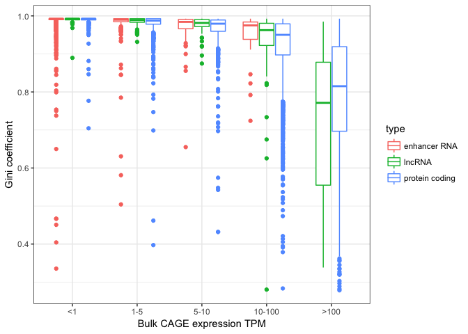<!-- -->

```r
(ggplot(x, aes(cpm, g, colour=type)) 
  + geom_point() 
  +facet_wrap(~type)
  +ylab('Gini coefficient')
  +xlab('Bulk TPM')
    +scale_x_continuous(trans = 'log10',
                        breaks = trans_breaks('log10', function(x) 10^x),
                        labels = trans_format('log10', math_format(10^.x)))
  )
```

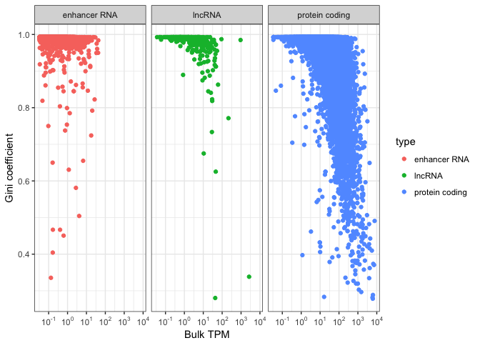<!-- -->


<style type="text/css">
.table {

    width: 60%;

}
</style>
