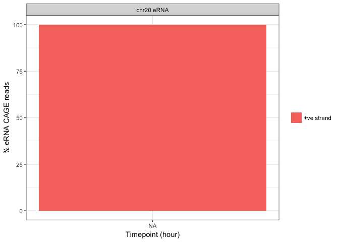

# Enhancer Analysis
Jonathan Moody  

# Load data

```r
library(data.table)
library(ggplot2)
library(VennDiagram)
library(scales)
library(knitr)
ggplot2::theme_set(ggplot2::theme_bw())
#opts_chunk$set(cache=TRUE)
options(width = 120)
opts_chunk$set(tidy.opts=list(width.cutoff=80),tidy=TRUE)
exp <- readRDS('~/Documents/C1_timecourse/GENCODEv25.cage_cluster.coord.mask.q0.gene_sum.Rds')
samples <- fread('/Users/jonathan/Documents/C1_timecourse/samples.tsv', header = T)
sc_keep <- samples[Keep == T, Rownames]
toDrop <- c("CAGE_5_B01", "CAGE_5_C02", "CAGE_5_F09", "CAGE_5_D06", "CAGE_5_D10", "CAGE_5_D11", "CAGE_5_D12", "CAGE_5_E06", "CAGE_5_E05", "CAGE_5_E12", "CAGE_5_E11", "CAGE_5_F11", "CAGE_5_G12", "CAGE_6_B09")
exp <- exp[,union( grep("BULK|gene", colnames(exp)), which(colnames(exp) %in% sc_keep)), with=F]
exp <- exp[,!colnames(exp) %in% toDrop ,with=F]
rm(sc_keep)
rm(toDrop)

geneClass <- exp$geneClass
exp$geneClass <- NULL
geneID <- exp$geneID
exp$geneID <- NULL

counts <- as.matrix(exp)
rownames(counts) <- geneID
rm(exp)
rm(geneID)

bulk_idx <- grep('BULK', colnames(counts))
sc_idx <- grep('CAGE_[4-6]', colnames(counts)) # only use 4-6
sc_idx_456 <- grep('CAGE_[4-6]', colnames(counts))
e_idx <- geneClass == 'enhancer_locus'
pc_idx <- geneClass == 'protein_coding'
lc_idx <- geneClass == 'lincRNA'
#rm(geneClass)

sc_t00 <- colnames(counts) %in% samples[Timepoint=='t00', Rownames]
sc_t06 <- colnames(counts) %in% samples[Timepoint=='t06', Rownames]
sc_t24 <- colnames(counts) %in% samples[Timepoint=='t24', Rownames]
#rm(samples)

calc_cpm <- function (expr_mat)
{
  norm_factor <- colSums(expr_mat)
  return(t(t(expr_mat)/norm_factor) * 10^6)
}
counts[,bulk_idx] <- calc_cpm(counts[,bulk_idx])
#counts <- calc_cpm(counts)
```

# C1 specificity stats
* calculate some statistics

```r
z <- as.data.table(counts[, union(bulk_idx, sc_idx_456)])
z$geneID <- rownames(counts)
z$geneClass <- geneClass
z$sc_cage_libs <- apply(z[, grep("CAGE", colnames(z)), with = F], 1, function(x) {
    sum(x > 0)
})
z$sc_cage_mean <- apply(z[, grep("CAGE", colnames(z)), with = F], 1, function(x) {
    mean(x[x > 0])
})
z$sc_cage_median <- apply(z[, grep("CAGE", colnames(z)), with = F], 1, function(x) {
    median(x[x > 0])
})
z$sc_cage_max <- apply(z[, grep("CAGE", colnames(z)), with = F], 1, function(x) {
    max(x)
})
z$bulk_cage_libs <- apply(z[, grep("BULK", colnames(z)), with = F], 1, function(x) {
    sum(x > 0)
})
z$bulk_cage_mean <- apply(z[, grep("BULK", colnames(z)), with = F], 1, function(x) {
    mean(x[x > 0])
})
z$bulk_cage_median <- apply(z[, grep("BULK", colnames(z)), with = F], 1, function(x) {
    median(x[x > 0])
})
z$bulk_cage_max <- apply(z[, grep("BULK", colnames(z)), with = F], 1, function(x) {
    max(x)
})

gene.stats <- z[, .(geneID, geneClass, sc_cage_libs, sc_cage_mean, sc_cage_median, 
    sc_cage_max, bulk_cage_libs, bulk_cage_mean, bulk_cage_median, bulk_cage_max)]
rm(z)

gencode_overlap <- fread("~/Documents/C1_timecourse/F5_CAGE_anno.GENCODEv25.cage_cluster.coord.enhancer_overlaps.tab", 
    header = F)
setnames(gencode_overlap, c("geneID", "overlaps"))

gene.stats <- merge(gene.stats, gencode_overlap, by = "geneID", all.x = T)

mappability <- fread("~/Documents/C1_timecourse/F5_CAGE_anno.GENCODEv25.cage_cluster.coord.enhancer.mappability")
setnames(mappability, c("geneID", "mapp.size", "mapp.covered", "mapp.sum", "mapp.mean0", 
    "mapp.mean"))
mappability$geneID <- mappability[, tstrsplit(geneID, "@")]$V2
gene.stats <- merge(gene.stats, mappability[, .(geneID, mapp.mean)], by = "geneID", 
    all.x = T)

# meta <- fread('zcat
# <~/Documents/repos/C1_CAGE_Timecourse/gene_models/GENCODEv25/log/F5_CAGE_anno.GENCODEv25.ID_mapping.info.tsv.gz')
# meta <- meta[, .(clusterID, geneID)] meta <- unique(meta) gene.stats <-
# merge(meta, gene.stats)

meta <- fread("zcat < ~/Documents/repos/C1_CAGE_Timecourse/gene_models/GENCODEv25/bed/F5_CAGE_anno.GENCODEv25.cage_cluster.annot.bed.gz")
meta[, `:=`(Id, paste0(V1, ":", V2, "-", V3))]
meta[, `:=`(Id2, paste0(V1, ":", V2, "..", V3, ",", V6))]
meta[, `:=`(c("x", "geneID"), tstrsplit(V4, ".*@"))]

gene.stats$uniq <- "Both"
gene.stats[bulk_cage_libs == 0]$uniq <- "C1 only"
gene.stats[sc_cage_libs == 0]$uniq <- "Bulk only"
gene.stats[is.nan(sc_cage_mean)]$sc_cage_mean <- 0
gene.stats[is.nan(bulk_cage_mean)]$bulk_cage_mean <- 0
gene.stats[is.na(sc_cage_median)]$sc_cage_median <- 0
gene.stats[is.na(bulk_cage_median)]$bulk_cage_median <- 0
gene.stats[is.na(bulk_cage_max)]$bulk_cage_max <- 0
gene.stats[is.na(sc_cage_max)]$sc_cage_max <- 0
```

# CAGE profile plot

```r
library(data.table)
library(ggplot2)
c1 <- fread('zcat < ~/Documents/C1_timecourse/CAGE_456.ctss.gz')
bulk <- fread('~/Documents/C1_timecourse/BULK_t00_1.bed')
bulk[, V4 := tstrsplit(V4, '_')[2] ]

bed <- c('chr','pos','end','lib','score','strand')
setnames(c1, bed)
setnames(bulk, bed)
c1$pos <- c1$pos +1 #1bp closed
bulk$pos <- bulk$pos  +1 #1bp closed
c1$type <- 'C1'
bulk$type <- 'BULK'

df <- rbindlist(list(c1, bulk))

dpi <- meta[grep('^e1', V4)][, c(1:3,16,5:6), with=F]
setnames(dpi, bed) # from gff - 1bp closed
setnames(dpi, 'lib', 'ID')
dpi[, mid:=ceiling((pos+end)/2)]
setkey(dpi, chr, pos, end)
cage.plot <- foverlaps(df, dpi, nomatch = 0)
cage.plot[, readpos:= i.pos-mid]

cage.plot[, pos:=mid-500]
cage.plot[, end:=mid+500]

dpi.keep <- cage.plot[, .(m=max(i.score)), by=.(ID, lib, type)][m>0]
cage.plot <- merge(cage.plot, dpi.keep, by=c('ID','lib','type'), nomatch=0)
cage.plot[, norm.score := 1-((m-i.score)/(m))]

dpi.all <- cage.plot[, length(unique(ID))]
dpi.c1 <- cage.plot[type=='C1', length(unique(ID))]
dpi.bulk <- cage.plot[type=='BULK', length(unique(ID))]
c(dpi.all, dpi.c1, dpi.bulk)
```

```
## [1] 7138 3953 4615
```

```r
z <- cage.plot[, .(score=sum(norm.score), n=length(unique(ID))/dpi.all), by=.(readpos, type, strand=i.strand)]
(ggplot(z, aes(readpos, n, colour=strand)) 
  +stat_smooth()
  #+geom_line()
  +facet_wrap(~type)
  +xlab('Position relative to enhancer midpoint')
  +ylab('Fraction of enhancers')
  )
```

```
## `geom_smooth()` using method = 'loess' and formula 'y ~ x'
```

<!-- -->

```r
meta[Id %in% c('chr20:56293544-56293843','chr10:3929991-3930887','chr17:48105016-48105270')]
```

```
##       V1       V2       V3                   V4   V5 V6       V7       V8        V9 V10 V11 V12                      Id
## 1: chr10  3929991  3930887 e1@ADDG10003929991.E 1549  .  3930438  3930439 77,175,74   1 896   0   chr10:3929991-3930887
## 2: chr17 48105016 48105270 e1@ADDG17048105016.E   47  . 48105142 48105143 77,175,74   1 254   0 chr17:48105016-48105270
## 3: chr20 56293544 56293843 e1@ADDG20056293544.E   48  . 56293692 56293693 77,175,74   1 299   0 chr20:56293544-56293843
##                           Id2 x            geneID
## 1:   chr10:3929991..3930887,.   ADDG10003929991.E
## 2: chr17:48105016..48105270,.   ADDG17048105016.E
## 3: chr20:56293544..56293843,.   ADDG20056293544.E
```

```r
# Example with both strands seen in the same cell
ggplot(cage.plot[type=='C1' & ID=='ADDG13067674730.E'][order(i.score)], aes(readpos, lib)) +geom_raster(aes(fill=i.strand))
```

<!-- -->

```r
# showing strong association with PMEPA1
ggplot(cage.plot[type=='C1' & ID=='ADDG10003929991.E'][order(i.score)], aes(readpos, lib)) +geom_raster(aes(fill=i.strand))
```

<!-- -->

```r
# some association with KLF6 but not as strong as the one above.
ggplot(cage.plot[type=='C1' & ID=='ADDG17048105016.E'][order(i.score)], aes(readpos, lib)) +geom_raster(aes(fill=i.strand))
```

<!-- -->

```r
# no association with PDK2, but the enhancer RNA expression still matches the CAGE data.
ggplot(cage.plot[type=='C1' & ID=='ADDG20056293544.E'][order(i.score)], aes(readpos, lib)) +geom_raster(aes(fill=i.strand))
```

<!-- -->

```r
#cage.plot[, pos.bin :=  cut(readpos, breaks = c(-500,-250,0,250,500), labels=c('a','b','c','d')) ]
z <- cage.plot[ID %in% c('ADDG10003929991.E', 'ADDG17048105016.E', 'ADDG20056293544.E') & type=='C1', 
               .(n=sum(i.score), cells=length(unique(lib))) , by=.(ID, type, strand=i.strand)]
(ggplot(z, aes(ID, cells, fill=strand))
  +geom_bar(stat = 'identity', position='fill'))
```

<!-- -->

```r
z$chr <- 'chr20 eRNA'
z$strand2 <- '-ve strand'
z[strand=='+']$strand2 <- '+ve strand'
z$strand2 <- factor(z$strand2, levels=(c('+ve strand', '-ve strand')))
z$t <- gsub('t','',z$lib)

(ggplot(z[order(strand)][ID=='ADDG20056293544.E'], aes(t, n, fill=strand2))
  +geom_bar(stat = 'identity', position='fill')
  +xlab('Timepoint (hour)')
  +ylab('% eRNA CAGE reads')
  +facet_wrap(~chr)
  +scale_fill_discrete(guide = guide_legend(title = NULL))
  +scale_y_continuous(labels = c(0,25,50,75,100))
  )
```

<!-- -->

```r
ggsave('../manuscript/Fig5/chr20_direction_cage.pdf', width = 4, height = 3, units='in')


z <- cage.plot[ID %in% c('ADDG10003929991.E', 'ADDG17048105016.E', 'ADDG20056293544.E') & type=='BULK', 
               .(n=sum(i.score), cells=length(unique(lib))) , by=.(ID, type, strand=i.strand, lib)]
(ggplot(z, aes(lib, n, fill=strand))
  +geom_bar(stat = 'identity', position='fill')
  +facet_wrap(~ ID)
  )
```

<!-- -->

```r
bi_idx <- cage.plot[type=='C1', .(p=.SD[i.strand=='+' & readpos > 20 & readpos < 300, length(unique(lib))], m=.SD[i.strand=='-' & readpos < -20 & readpos > -300, length(unique(lib))]), by=.(ID)]
#bi_idx <- cage.plot[type=='C1', .(p=.SD[i.strand=='+', length(unique(lib))], m=.SD[i.strand=='-', length(unique(lib))]), by=.(ID)]
bi_id <- bi_idx[p>5 & m>5][order(-p-m)]$ID
z <- cage.plot[type=='C1' & ID %in% bi_id & readpos > -500 & readpos < 500]
#z$lib <- factor(z$lib, levels = z[, .(maxpos=.SD[order(-i.score)][1, readpos]),by=.(lib)][order(-maxpos), lib])
(ggplot(z) +geom_tile(aes(readpos, lib, fill=i.strand, width=5)) 
  +xlim(-300,300)
  +scale_fill_discrete(guide = guide_legend(title = "Strand"))
  +xlab("Position relative to enhancer midpoint")
  +ylab("Library")
  +scale_y_discrete(labels=NULL)
  +facet_wrap(~ID)
    )
```

```
## Warning: Ignoring unknown aesthetics: width
```

```
## Warning: Removed 510 rows containing missing values (geom_tile).
```

<!-- -->

```r
dpis <- fread('~/Documents/C1_timecourse/bi_dpis.txt', header = F, sep='\n')

z <- cage.plot[type=='C1' & ID %in% meta[Id %in% dpis$V1, geneID] & readpos > -500 & readpos < 500]
(ggplot(z) +geom_tile(aes(readpos, lib, fill=i.strand, width=5)) 
  +xlim(-300,300)
  +scale_fill_discrete(guide = guide_legend(title = "Strand"))
  +xlab("Position relative to enhancer midpoint")
  +ylab("Library")
  +scale_y_discrete(labels=NULL)
  +facet_wrap(~ID, scales='free_y')
    )
```

```
## Warning: Ignoring unknown aesthetics: width
```

```
## Warning: Removed 149 rows containing missing values (geom_tile).
```

<!-- -->

```r
z <- cage.plot[type=='C1' & ID=='ADDG13067674730.E' & readpos > -300 & readpos < 300]
z$lib <- factor(z$lib, levels = z[, .(maxpos=.SD[order(-i.score)][1, readpos]),by=.(lib)][order(-maxpos), lib])
(ggplot(z) +geom_tile(aes(readpos, lib, fill=i.strand, width=5)) 
  +xlim(-300,300)
  +scale_fill_discrete(guide = guide_legend(title = "Strand"))
  +xlab("Position relative to enhancer midpoint")
  +ylab("Library")
  +scale_y_discrete(labels=NULL)
    )
```

```
## Warning: Ignoring unknown aesthetics: width
```

<!-- -->

```r
z <- cage.plot[type=='C1' & ID=='ADDG12020975224.E' & readpos > -300 & readpos < 300]
z$lib <- factor(z$lib, levels = z[, .(maxpos=.SD[order(-i.score)][1, readpos]),by=.(lib)][order(-maxpos), lib])
(ggplot(z) +geom_tile(aes(readpos, lib, fill=i.strand, width=5)) 
  +xlim(-300,300)
  +scale_fill_discrete(guide = guide_legend(title = "Strand"))
  +xlab("Position relative to enhancer midpoint")
  +ylab("Cell")
  +scale_y_discrete(labels=NULL)
  +theme_bw()
    )
```

```
## Warning: Ignoring unknown aesthetics: width
```

<!-- -->

```r
ggsave('enh_expand.pdf', path='../manuscript/Fig4/', width = 6, height = 4, units = 'in')

z[i.strand=='-', i.score:= -i.score]
(ggplot(z, aes(readpos, fill=i.strand, weight=i.score))
  +ggtitle('chr12:20975224-20975562')
  +geom_histogram(bins=50)
  +xlim(-300,300)
  +scale_fill_discrete(guide = guide_legend(title = "Strand"))
  +xlab("Position relative to enhancer midpoint")
  +ylab("Reads (pooled)")
  +theme_bw()
    )
```

<!-- -->

```r
ggsave('enh_pooled.pdf', path='../manuscript/Fig4/', width = 6, height = 2, units = 'in')

#id1 <- cage.plot[i.strand=='+', .(n=length(unique(lib))), by=.(ID,type)][n>30 & type=='C1', ID]
#id2 <- cage.plot[i.strand=='-', .(n=length(unique(lib))), by=.(ID,type)][n>30 & type=='C1', ID]
#ggplot(cage.plot[type=='C1' & ID %in% intersect(id1,id2)], aes(readpos, lib)) +geom_raster(aes(fill=i.strand)) + facet_wrap(~ID, scales='free_y')

# specify the ratio for within each method
cage.plot[, dpimax := dpi.bulk]
cage.plot[type=='C1', dpimax:= dpi.c1]
z <- cage.plot[, .(score=sum(i.score), n=length(unique(ID))/dpimax[1]), by=.(readpos, type, strand=i.strand)]
(ggplot(z, aes(readpos, n, colour=strand))
  +stat_smooth()
  #+geom_line()
  +facet_wrap(~type)
  +xlab('Position relative to enhancer midpoint')
  +ylab('Fraction of enhancers')
  )
```

```
## `geom_smooth()` using method = 'loess' and formula 'y ~ x'
```

<!-- -->

```r
# only those with p300 binding
p300 <- fread('~/Documents/C1_timecourse/all_tf/ep300/ReMap2_ep300_allPeaks_hg19.bed', sep = '\t')
p300 <- p300[grep('a549', V4)][, 1:6, with=F]
setnames(p300, bed)
dpi2 <- foverlaps(p300, dpi, nomatch = 0, by.x = 1:3)[,1:7,with=F]
#dpi2 <- dpi[ID %in% filt_id]
setkey(dpi2, chr, pos, end)
cage.plot <- foverlaps(df, dpi2, nomatch = 0)
cage.plot[, readpos:= i.pos-mid]

dpi.all <- cage.plot[, length(unique(ID))]
dpi.c1 <- cage.plot[type=='C1', length(unique(ID))]
#dpi.c1.filt <- cage.plot[type=='C1' & ID %in% filt_id, length(unique(ID))]
dpi.bulk <- cage.plot[type=='BULK', length(unique(ID))]
c(dpi.all, dpi.c1, dpi.bulk)
```

```
## [1] 2853 1247 2498
```

```r
cage.plot[, dpimax := dpi.bulk]
cage.plot[type=='C1', dpimax:= dpi.c1]
z <- cage.plot[, .(score=sum(i.score), ids=length(unique(ID)) ,n=length(unique(ID))/dpimax[1]), by=.(readpos, type, strand=i.strand)]
(ggplot(z, aes(readpos, n, colour=strand)) 
  +stat_smooth()
  #+geom_point()
  +facet_wrap(~type)#, scales='free_y')
  +xlab('Position relative to enhancer midpoint')
  +ylab('Fraction of enhancers')
  +xlim(c(-500,500))
  )
```

```
## `geom_smooth()` using method = 'loess' and formula 'y ~ x'
```

```
## Warning: Removed 228 rows containing non-finite values (stat_smooth).
```

<!-- -->

```r
ggsave('enh_filtered_reads.pdf', path='../manuscript/Fig4/', width = 5, height = 2.5, units = 'in')
```

```
## `geom_smooth()` using method = 'loess' and formula 'y ~ x'
```

```
## Warning: Removed 228 rows containing non-finite values (stat_smooth).
```

# NIH Roadmap epigenome data
* Compare 4 sets of enhancer regions [c1 only, bulk only, both, not detected] for epigenome data from the NIH roadmap.
* E114 refers to the sample "A549 EtOH 0.02pct Lung Carcinoma Cell Line"
* y-axis indicates: 'Fold-enrichment ratio of ChIP-seq or DNase counts relative to expected background counts'

```bash
mkdir epigenome
cd epigenome
wget http://egg2.wustl.edu/roadmap/data/byFileType/signal/consolidated/macs2signal/foldChange/E114-H3K4me1.fc.signal.bigwig
wget http://egg2.wustl.edu/roadmap/data/byFileType/signal/consolidated/macs2signal/foldChange/E114-H3K4me3.fc.signal.bigwig
wget http://egg2.wustl.edu/roadmap/data/byFileType/signal/consolidated/macs2signal/foldChange/E114-H3K27ac.fc.signal.bigwig
wget http://egg2.wustl.edu/roadmap/data/byFileType/signal/consolidated/macs2signal/foldChange/E114-DNase.fc.signal.bigwig

# enhancer bed files were made based on the table above
-bash-4.1$ wc -l enh_*.bed
   2454 enh_both.bed
  12997 enh_bulk.bed
   1480 enh_c1.bed
  48492 enh_none.bed
  65423 total

# From the deeptools package: http://deeptools.readthedocs.io/en/latest/content/list_of_tools.html
computeMatrix scale-regions -S ../data/epigenome/E114-*.bigwig -R enh_*.bed -a 2500 -b 2500 -out epigenome_fc.mat -p 10
plotProfile -m epigenome_fc.mat -out epigenome.png --numPlotsPerRow 2 --startLabel "start" --endLabel "end" --regionsLabel both "bulk only" "C1 only" "not detected" --yMax 20 16 4 6 --samplesLabel DNase H3K27ac H3K4me1 H3K4me3
```
* For DNase activity and H3K27ac level the C1 specific loci are similar to the non detected enhancer loci.
* This siggests they are not active enhancers?
* One caveat is that the roadmap data do not have TGFb stimulation.


# Remake roadmap plots with the data in R
* Remake the A549 plot above, and with this data it allows easy seperation into other groups for plotting

```r
epig <- fread("zcat < ~/Documents/C1_timecourse/epigenome_fc_E114.mat", skip = 1)
```

```
## 
Read 0.0% of 65423 rows
Read 15.3% of 65423 rows
Read 45.9% of 65423 rows
Read 76.4% of 65423 rows
Read 65423 rows and 1206 (of 1206) columns from 0.663 GB file in 00:00:09
```

```r
n <- nrow(epig)
epig[, c(1:3, 5:6)] <- NULL
epig <- melt(epig, id.vars = 1)
epig[, `:=`(bin, rep(1:300, each = n))]
epig[, `:=`(mark, rep(c("DNase", "H3K27ac", "H3K4me1", "H3K4me3"), each = 300 * n))]
setnames(epig, "V4", "geneID")

z <- merge(epig, gene.stats[, .(geneID, sep = uniq)], all.x = T, by = "geneID")
z <- z[, .(mean = mean(value)), by = .(bin, mark, sep)]

(ggplot(z, aes(bin, mean, colour = sep)) + geom_line() + facet_wrap(~mark, scales = "free_y") + 
    scale_x_continuous(labels = c("-3000", "0", "3000"), breaks = c(1, 150, 300)) + 
    xlab("distance from midpoint") + ylab("fold-enrichment") + guides(colour = guide_legend(title = "Detection")))
```

<!-- -->

```r
rm(z)
```

# Epigenome data by detection

```r
#z <- merge(epig, gene.stats[sc_cage_libs > 0, .(geneID, sep=cut(bulk_cage_max, breaks = c(0,1,100)))], all.x = F, by='geneID')
z <- merge(epig, cage.plot[type=='C1', .(geneID=unique(ID))], all.x = F, by='geneID')
z <- z[, .(mean=mean(value)),by=.(bin, mark)]
z[, detection:='C1']
#z2 <- merge(epig, gene.stats[bulk_cage_libs > 0, .(geneID, sep=cut(bulk_cage_max, breaks = c(0,1,100)))], all.x = F, by='geneID')
z2 <- merge(epig, cage.plot[type=='BULK', .(geneID=unique(ID))], all.x = F, by='geneID')
z2 <- z2[,.(mean=mean(value)),by=.(bin, mark)]
z2[, detection:='BULK']

z <- rbindlist(list(z, z2))

(ggplot(z, aes(bin,mean,colour=mark))
  +geom_line(size=1.1)
  +facet_wrap(~detection)
  +scale_x_continuous(labels=c('-500', '0', '500'), breaks=c(125,150,175), limits = c(125,175))
  +xlab('distance from enhancer locus midpoint')
  +ylab('fold-enrichment')
  +guides(colour=guide_legend(title = NULL))
  #+facet_wrap(~mark, ncol=1, scales='free_y')
    )
```

```
## Warning: Removed 996 rows containing missing values (geom_path).
```

<!-- -->

```r
ggsave('enh_p300_epigenome.pdf', path='../manuscript/Fig4/', width = 5.5, height = 2.5, units = 'in')
```

```
## Warning: Removed 996 rows containing missing values (geom_path).
```

```r
rm(z)
```

# DNase heatmap - cage detected loci

```r
epig1 <- epig[geneID %in% cage.plot[type == "C1", unique(ID)]]
epig1.sums <- epig1[, .(n = sum(value)), by = .(geneID, mark)]
epig1.plot <- epig1[mark == "DNase" & geneID %in% epig1.sums[n > 0, geneID]]
epig1.order <- epig1.sums[mark == "DNase" & n > 0][order(n), geneID]
epig1.plot[, `:=`(generank, match(geneID, epig1.order))]
epig1.plot$type <- "C1"

epig2 <- epig[geneID %in% cage.plot[type == "BULK", unique(ID)]]
epig2.sums <- epig2[, .(n = sum(value)), by = .(geneID, mark)]
epig2.plot <- epig2[mark == "DNase" & geneID %in% epig2.sums[n > 0, geneID]]
epig2.order <- epig2.sums[mark == "DNase" & n > 0][order(n), geneID]
epig2.plot[, `:=`(generank, match(geneID, epig2.order))]
epig2.plot$type <- "BULK"

epig.plot <- rbindlist(list(epig1.plot, epig2.plot))

ggplot(epig.plot[bin > 124 & bin < 176], aes(bin, generank)) + facet_wrap(~type, 
    scales = "free_y") + geom_raster(aes(fill = value), interpolate = F) + scale_y_discrete(NULL, 
    labels = NULL) + scale_fill_gradient(low = "white", high = "black", guide_legend(title = "DNase\nSignal")) + 
    scale_x_continuous(labels = c(-500, 0, 500), breaks = c(125, 150, 175)) + xlab("Position relative to enhancer midpoint")
```

<!-- -->

```r
ggsave("enh_p300_dnase.pdf", path = "../manuscript/Fig4/", width = 5, height = 4, 
    units = "in")

# epig <- epig[geneID %in% cage.plot$ID] epig.sums <- epig[, .(n=sum(value)),
# by=.(geneID, mark)] epig.plot <- epig[mark=='DNase' & geneID %in%
# epig.sums[n>0, geneID]] epig.order <- epig.sums[mark=='DNase' & n>0][order(n),
# geneID] epig.plot[, geneID:= factor(geneID, levels=epig.order)] epig.plot[,
# generank:= match(geneID, epig.order)] ggplot(epig.plot, aes(bin, geneID,
# colour=value))+geom_point()+scale_y_discrete(NULL,labels=NULL)
# ggplot(epig.plot[bin > 124 & bin < 176], aes(bin,
# generank))+geom_raster(aes(fill=value))+scale_y_discrete(NULL,labels=NULL)+
# scale_fill_gradient(low = 'white', high = 'black')+scale_x_continuous(labels =
# c(-500, 0, 500), breaks = c(125,150,175)) +xlab('Position relative to enhancer
# midpoint') ggplot(epig.plot[bin > 124 & bin < 176], aes(bin,
# generank))+geom_raster(aes(fill=value), interpolate =
# T)+scale_y_discrete(NULL,labels=NULL)+ scale_fill_gradient(low = 'white', high
# = 'black') +scale_x_continuous(labels = c(-500, 0, 500), breaks =
# c(125,150,175)) +xlab('Position relative to enhancer midpoint')
```

# epigenome single plot - cage detected loci

```r
z <- merge(epig, gene.stats[, .(geneID, sep = uniq)], all.x = T, by = "geneID")
z <- z[, .(mean = mean(value)), by = .(bin, mark, sep)]

(ggplot(z, aes(bin, mean, colour = sep)) + geom_line() + facet_wrap(~mark, scales = "free_y") + 
    scale_x_continuous(labels = c("-3000", "0", "3000"), breaks = c(1, 150, 300)) + 
    xlab("distance from midpoint") + ylab("fold-enrichment") + guides(colour = guide_legend(title = "Detection")))
```

<!-- -->
