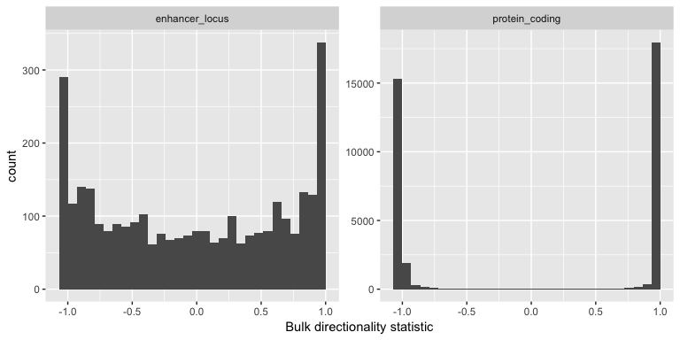
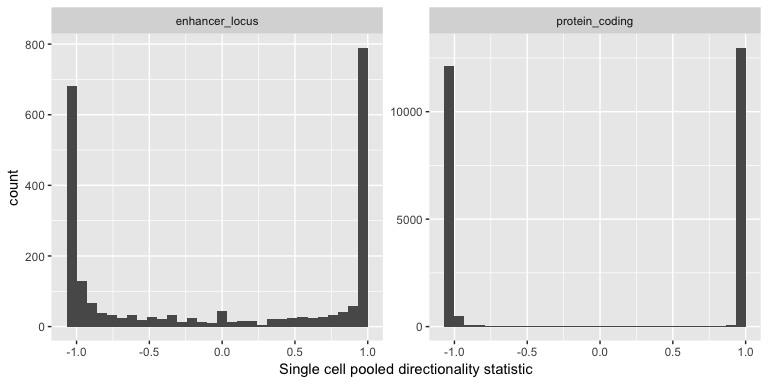
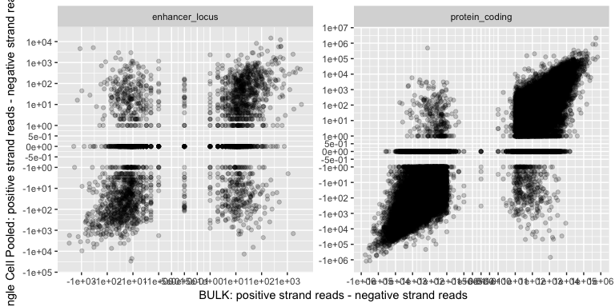
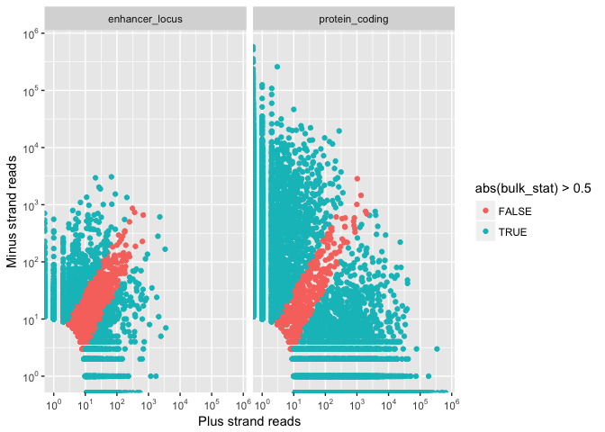
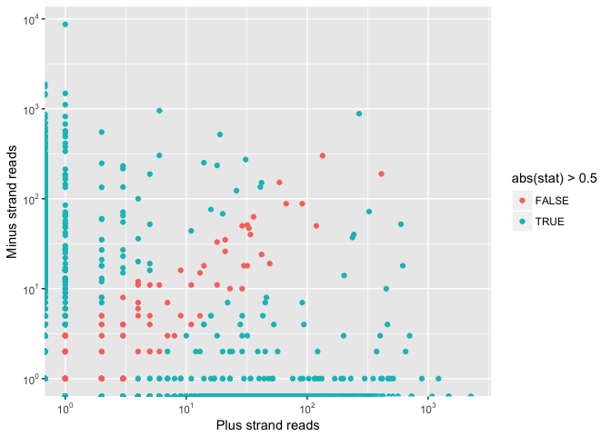
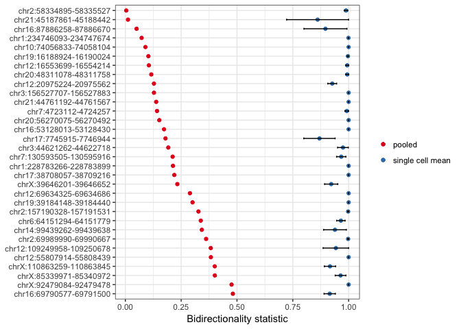
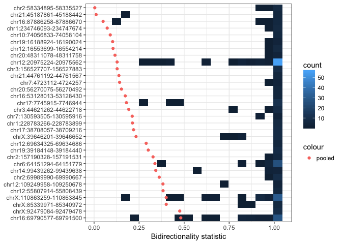

# CAGE strand analysis
Jonathan Moody  

Do we detect bidirectional transcription at enhancer loci in the bulk CAGE data, and in the C1 cage data?

# Data gathering
Rerun data gathering to also save antisense reads at promoter loci
Run on osc-ac2 in /home/jonathan/data/C1_cage/

```r
for file in data/ctss/*.bed
do
bedtools intersect -a annotation/F5_CAGE_anno.GENCODEv25.cage_cluster.coord.mask_ERCC.bed -b $file -wa -wb |  \
  awk '{print $4,$7,$8,$9,$10,$11,$12}' OFS="\t" >>                                                           \
  /home/jonathan/data/C1_cage/results/GENCODEv25.cage_cluster.coord.mask.ctss.intersect.anystrand.tab
done

library(data.table)
ctss <- fread('/home/jonathan/data/C1_cage/results/GENCODEv25.cage_cluster.coord.mask.ctss.intersect.anystrand.tab', sep="\t")
setnames(ctss, c('dpi', 'chr', 'st','end','library','reads','strand'))

# Cast summing reads for each annotation window
x <- dcast.data.table(ctss, dpi+library~strand, value.var = 'reads', fun.aggregate = sum)
setnames(x, c('+','-'), c('p','m'))

write.table(x, '/home/jonathan/data/C1_cage/results/GENCODEv25.cage_cluster.coord.mask.strand_stat_all.tab', sep='\t', row.names = F, col.names = T, quote = F)
saveRDS(x, '/home/jonathan/data/C1_cage/results/GENCODEv25.cage_cluster.coord.mask.strand_stat_all.Rds')

z <- x[, .(p_bulk=.SD[grep('^BULK', library), sum(p)],
                            m_bulk=.SD[grep('^BULK', library), sum(m)],
                            p_sc=.SD[grep('^CAGE', library), sum(p)],
                            m_sc=.SD[grep('^CAGE', library), sum(m)]), by=.(dpi)]


z$bulk_stat <- (z$p_bulk-z$m_bulk)/(z$p_bulk+z$m_bulk)
z$sc_stat <- (z$p_sc-z$m_sc)/(z$p_sc+z$m_sc)

write.table(z, '/home/jonathan/data/C1_cage/results/GENCODEv25.cage_cluster.coord.mask.strand_stat.tab', sep='\t', row.names = F, col.names = T, quote = F)
saveRDS(z, '/home/jonathan/data/C1_cage/results/GENCODEv25.cage_cluster.coord.mask.strand_stat.Rds')
```

# Data loading

```r
library(data.table)
library(ggplot2)
library(scales)
library(knitr)
#opts_chunk$set(fig.path = "./strand_analysis_files/")
ctss <- readRDS('~/Documents/C1_timecourse/GENCODEv25.cage_cluster.coord.mask.strand_stat.Rds')
#saveRDS(ctss, '~/Documents/repos/C1_CAGE_Timecourse/generated/ctss_directionality_pooled.Rds')
meta <- fread('zcat < ~/Documents/repos/C1_CAGE_Timecourse/gene_models/GENCODEv25/log/F5_CAGE_anno.GENCODEv25.cage_cluster.info.tsv.gz')
```

```
## 
Read 88.1% of 249599 rows
Read 249599 rows and 11 (of 11) columns from 0.040 GB file in 00:00:03
```

```r
ctss_uncol <- readRDS('~/Documents/C1_timecourse/GENCODEv25.cage_cluster.coord.mask.strand_stat_all.Rds')
#saveRDS(ctss_uncol, '~/Documents/repos/C1_CAGE_Timecourse/generated/ctss_directionality_all.Rds')
setnames(meta, 'clusterID', 'dpi')

ctss <- merge(ctss, meta, by='dpi')
ctss$trnscptIDStr <- NULL

enh_intergenic <- fread('~/Documents/C1_timecourse/F5_enh_nongc_10kb.bed', sep='\t')[,4,with=F]
setnames(enh_intergenic, 'geneIDStr')

# https://stackoverflow.com/a/14674703
symlog_trans <- function(base = 10, thr = 1, scale = 1){
  trans <- function(x)
    ifelse(abs(x) < thr, x, sign(x) * 
             (thr + scale * suppressWarnings(log(sign(x) * x / thr, base))))

  inv <- function(x)
    ifelse(abs(x) < thr, x, sign(x) * 
             base^((sign(x) * x - thr) / scale) * thr)

  breaks <- function(x){
    sgn <- sign(x[which.max(abs(x))])
    if(all(abs(x) < thr))
      pretty_breaks()(x)
    else if(prod(x) >= 0){
      if(min(abs(x)) < thr)
        sgn * unique(c(pretty_breaks()(c(min(abs(x)), thr)),
                       log_breaks(base)(c(max(abs(x)), thr))))
      else
        sgn * log_breaks(base)(sgn * x)
    } else {
      if(min(abs(x)) < thr)
        unique(c(sgn * log_breaks()(c(max(abs(x)), thr)),
                 pretty_breaks()(c(sgn * thr, x[which.min(abs(x))]))))
      else
        unique(c(-log_breaks(base)(c(thr, -x[1])),
                 pretty_breaks()(c(-thr, thr)),
                 log_breaks(base)(c(thr, x[2]))))
    }
  }
  trans_new(paste("symlog", thr, base, scale, sep = "-"), trans, inv, breaks)
}
```

# Analysis
## Bidirectionality in protein coding dpi comapred with enhancer loci
Bidirectionality statistic:
$$\frac{Plus~strand~reads - minus~strand~reads}{sum(reads)}$$

```r
nrow(meta[type=='enhancer'])
```

```
## [1] 65423
```

```r
nrow(ctss[type=='enhancer' & p_bulk + m_bulk > 0])
```

```
## [1] 12373
```

```r
nrow(ctss[type=='enhancer' & p_bulk + m_bulk >= 10])
```

```
## [1] 3150
```

```r
(ggplot(ctss[geneClassStr %in% c('protein_coding', 'enhancer_locus') & p_bulk + m_bulk >= 10])
 +geom_histogram(aes(bulk_stat))#p_bulk - m_bulk))
 +facet_wrap(~geneClassStr, scales = 'free')
 +xlab('Bulk directionality statistic')
 )
```

```
## `stat_bin()` using `bins = 30`. Pick better value with `binwidth`.
```

<!-- -->

```r
(ggplot(ctss[geneClassStr %in% c('protein_coding', 'enhancer_locus')& p_bulk + m_bulk >= 10])
 +geom_histogram(aes(sc_stat))#p_bulk - m_bulk))
 +facet_wrap(~geneClassStr, scales = 'free')
 +xlab('Single cell pooled directionality statistic')
 )
```

```
## `stat_bin()` using `bins = 30`. Pick better value with `binwidth`.
```

```
## Warning: Removed 11472 rows containing non-finite values (stat_bin).
```

<!-- -->

```r
# Agreement of directionality between pooled single cell and bulk data
(ggplot(ctss[geneClassStr %in% c('protein_coding', 'enhancer_locus')& p_bulk + m_bulk >= 10])
  +geom_point(aes(p_bulk - m_bulk, p_sc - m_sc), alpha=0.2)
  +facet_wrap(~geneClassStr, scales = 'free')
  +xlab('BULK: positive strand reads - negative strand reads')
  +ylab('Single Cell Pooled: positive strand reads - negative strand reads')
  +scale_x_continuous(trans = 'symlog')
  +scale_y_continuous(trans = 'symlog')
)
```

<!-- -->

```r
ctss[geneClassStr %in% c('protein_coding', 'enhancer_locus') & abs(bulk_stat) > 0.5 & abs(sc_stat)>0.5][, table(bulk_plus=bulk_stat >0, sc_plus=sc_stat >0, geneClassStr)]
```

```
## , , geneClassStr = enhancer_locus
## 
##          sc_plus
## bulk_plus FALSE  TRUE
##     FALSE  1314   436
##     TRUE    419  1108
## 
## , , geneClassStr = protein_coding
## 
##          sc_plus
## bulk_plus FALSE  TRUE
##     FALSE 13351   390
##     TRUE    450 13756
```

## Bidirectional loci in bulk data

```r
(ggplot(ctss[geneClassStr %in% c('protein_coding', 'enhancer_locus') &  p_bulk + m_bulk > 10])
  +geom_point(aes(p_bulk, m_bulk, colour=abs(bulk_stat)>0.5))
  +facet_wrap(~geneClassStr)
      +scale_x_continuous(trans = 'log10',
                        breaks = trans_breaks('log10', function(x) 10^x),
                        labels = trans_format('log10', math_format(10^.x)))
    +scale_y_continuous(trans = 'log10',
                        breaks = trans_breaks('log10', function(x) 10^x),
                        labels = trans_format('log10', math_format(10^.x)))
 +xlab('Plus strand reads')
 +ylab('Minus strand reads')
)
```

```
## Warning: Transformation introduced infinite values in continuous x-axis
```

```
## Warning: Transformation introduced infinite values in continuous y-axis
```

<!-- -->

```r
ctss[geneClassStr %in% c('protein_coding', 'enhancer_locus') &  p_bulk + m_bulk > 10][, table(bidirectional=abs(bulk_stat) <= 0.5, geneClassStr)]
```

```
##              geneClassStr
## bidirectional enhancer_locus protein_coding
##         FALSE           1915          36153
##         TRUE            1068            378
```

```r
enh_bi <- ctss[geneClassStr == 'enhancer_locus' &  p_bulk + m_bulk > 10 & abs(bulk_stat) <= 0.5, dpi]
```

## Intergenic bidirectional enhancer loci

```r
# for FISH testing
enh_int <- ctss[dpi %in% enh_bi & geneIDStr %in% enh_intergenic$geneIDStr][,1:7, with=F][order(-(p_bulk+m_bulk))]
#write.table(enh_int, '~/Documents/repos/C1_CAGE_Timecourse/generated/Enhancers_bidirectional_intergenic.tab', col.names=T, row.names = F, quote=F, sep='\t')
```

## Bidirectional loci in C1 CAGE libraries
Are these BULK budirectional loci also detected as bidirectional in single cells?

```r
(ggplot(ctss_uncol[dpi %in% enh_bi & 1:nrow(ctss_uncol) %in% grep('^CAGE', library)])
  +geom_point(aes(p, m, colour=abs(stat) > 0.5))
        +scale_x_continuous(trans = 'log10',
                        breaks = trans_breaks('log10', function(x) 10^x),
                        labels = trans_format('log10', math_format(10^.x)))
    +scale_y_continuous(trans = 'log10',
                        breaks = trans_breaks('log10', function(x) 10^x),
                        labels = trans_format('log10', math_format(10^.x)))
 +xlab('Plus strand reads')
 +ylab('Minus strand reads')
    )
```

```
## Warning: Transformation introduced infinite values in continuous x-axis
```

```
## Warning: Transformation introduced infinite values in continuous y-axis
```

<!-- -->

```r
ctss_uncol[dpi %in% enh_bi & 1:nrow(ctss_uncol) %in% grep('^CAGE', library) & p+m > 9, length(unique(dpi))]
```

```
## [1] 552
```

```r
ctss_uncol[dpi %in% enh_bi & 1:nrow(ctss_uncol) %in% grep('^CAGE', library), table(bidirectional=abs(stat) <= 0.5, '10 reads'=p+m>=10)]
```

```
##              10 reads
## bidirectional FALSE TRUE
##         FALSE  3348 1771
##         TRUE     93   39
```

```r
# n = number of bidirectional single cells with >= 10 reads
ctss_uncol[dpi %in% enh_bi & 1:nrow(ctss_uncol) %in% grep('^CAGE', library),.(n=nrow(.SD[p+m>=10 & abs(stat) <= 0.5])),by=.(dpi)][n>0][order(-n)]
```

```
##                          dpi  n
##  1:  chr13:67674730-67675228 14
##  2:  chr19:14732511-14733275  4
##  3:    chr17:7745915-7746944  3
##  4:     chr3:5054958-5055470  2
##  5:   chr6:30716597-30717062  2
##  6: chr7:130593505-130595916  2
##  7:  chr11:65259930-65260851  1
##  8:  chr11:67138852-67139479  1
##  9:  chr19:35491833-35492367  1
## 10: chr1:224180261-224180516  1
## 11: chr2:218798822-218799459  1
## 12:   chr3:10233695-10234220  1
## 13: chr3:127465577-127465875  1
## 14: chr3:194041526-194041906  1
## 15:   chr4:74464812-74465326  1
## 16:   chr6:64151294-64151779  1
## 17:   chr7:42927750-42928726  1
## 18:   chr8:23203813-23204244  1
```

```r
# single cells with reads at chr13:67674730-67675228, 15% with 10 or more reads are bidirectional
ctss_uncol[dpi=="chr13:67674730-67675228" & 1:nrow(ctss_uncol) %in% grep('^CAGE', library)][, table('10 reads'=p+m >= 10, bidirecitonal=abs(stat) <= 0.5)]
```

```
##         bidirecitonal
## 10 reads FALSE TRUE
##    FALSE    51    3
##    TRUE     78   14
```


```r
filt_exp <- read.table('~/Documents/C1_timecourse/norm_batch_corr_exp.tsv')
filt_exp <- rownames(filt_exp)
ctss_uncol <- ctss_uncol[dpi %in% filt_exp[grep('chr', filt_exp)] & 1:nrow(ctss_uncol) %in% grep('^CAGE_[456]', library) & dpi %in% ctss[type=='enhancer', dpi]]
enh_bi <- ctss[geneClassStr == 'enhancer_locus' & abs(sc_stat) <= 0.5, dpi]
#enh_bi <- ctss[type=='enhancer' & dpi %in% filt_exp & abs(bulk_stat) < 0.9 & abs(sc_stat) < 0.9 & sign(sc_stat) == sign(bulk_stat), dpi]
sum(enh_bi %in% filt_exp)
```

```
## [1] 87
```

```r
se <- function(x) sqrt(var(x)/length(x))
sel_loci_cells <- ctss_uncol[dpi%in%enh_bi][p+m > 10, .(mean=mean(abs(stat)), se=se(abs(stat)), cells=.N) ,by=.(dpi)][cells >= 5]
sel_loci_cells
```

```
##                           dpi      mean           se cells
##  1:   chr10:74056833-74058104 1.0000000 0.0000000000     6
##  2: chr12:109249958-109250678 0.9428571 0.0571428571     5
##  3:   chr12:16553699-16554214 0.9937500 0.0062500000     8
##  4:   chr12:20975224-20975562 0.9264664 0.0198208640    75
##  5:   chr12:55807914-55808439 1.0000000 0.0000000000     6
##  6:   chr12:69634325-69634686 1.0000000 0.0000000000     5
##  7:   chr14:99439262-99439638 0.9387932 0.0509692284     8
##  8:   chr16:53128013-53128430 1.0000000 0.0000000000     5
##  9:   chr16:69790577-69791500 0.9152423 0.0252764747    44
## 10:   chr16:87886258-87886670 0.8961061 0.0963488667     9
## 11:   chr17:38708057-38709216 1.0000000 0.0000000000     8
## 12:     chr17:7745915-7746944 0.8694084 0.0701775543    14
## 13:   chr19:16188924-16190024 0.9968504 0.0031496063     5
## 14:   chr19:39184148-39184440 1.0000000 0.0000000000     8
## 15:  chr1:228783266-228783899 1.0000000 0.0000000000     7
## 16:  chr1:234746093-234747674 0.9991639 0.0008361204     8
## 17:   chr20:48311078-48311758 0.9937500 0.0062500000     5
## 18:   chr20:56270075-56270492 1.0000000 0.0000000000     5
## 19:   chr21:44761192-44761567 1.0000000 0.0000000000     5
## 20:   chr21:45187861-45188442 0.8611111 0.1388888889     6
## 21:  chr2:157190328-157191531 0.9978518 0.0021482277     7
## 22:    chr2:58334895-58335527 0.9883646 0.0078083128     9
## 23:    chr2:69989990-69990667 0.9977612 0.0022388060    10
## 24:  chr3:156527707-156527883 1.0000000 0.0000000000     9
## 25:    chr3:44621262-44622718 0.9746365 0.0240067490    10
## 26:    chr6:64151294-64151779 0.9653031 0.0189399195    35
## 27:  chr7:130593505-130595916 0.9669285 0.0207917028     5
## 28:      chr7:4723112-4724257 0.9918367 0.0081632653     5
## 29:  chrX:110863259-110863845 0.9165577 0.0252589515    50
## 30:    chrX:39646201-39646652 0.9218917 0.0295350112    13
## 31:    chrX:85339971-85340972 0.9639250 0.0240812688     9
## 32:    chrX:92479084-92479478 1.0000000 0.0000000000     9
##                           dpi      mean           se cells
```

```r
df <- merge(sel_loci_cells, ctss[, .(dpi, sc_stat=abs(sc_stat), bulk_stat=abs(bulk_stat))], by='dpi')
#dpi_order <- df[order(mean-sc_stat), dpi]
dpi_order <- df[order(-sc_stat), dpi]
df$dpi <- factor(df$dpi, levels = dpi_order)
setnames(df, c('mean','sc_stat'), c('single cell mean','pooled'))
#df2 <- melt.data.table(df,id.vars = 'dpi')
#(ggplot(df2[!variable%in%c('cells', 'se')], aes(value, dpi, color=variable))
#  +geom_point()
  #+geom_point(aes(sc_stat, dpi))
  #+geom_point(aes(mean, dpi, color='red'))
#  +xlab('Bidirectionality statistic')
#  +ylab(NULL)
#  +guides(colour=guide_legend(title = NULL))
#  +theme_bw()
#  +geom_errorbarh(data = df, mapping = aes(xmax = `single cell mean` + se, xmin = `single cell mean` - se, height = .2))
#    )

(ggplot(df)
  +geom_point(aes(`single cell mean`, dpi, colour='single cell mean'))
  +geom_point(aes(pooled, dpi, colour='pooled'))
  #+geom_point(aes(bulk_stat, dpi, colour='bulk'))
  #+geom_point(aes(sc_stat, dpi))
  #+geom_point(aes(mean, dpi, color='red'))
  +xlab('Bidirectionality statistic')
  +ylab(NULL)
  +guides(colour=guide_legend(title = NULL))
  +theme_bw()
  +geom_errorbarh(data = df, mapping = aes(y=dpi, xmax = `single cell mean` + se, xmin = `single cell mean` - se, height = .2))
  +scale_color_brewer(palette="Set1")
    )
```

<!-- -->

```r
ggsave('sc_direction.pdf', path='../manuscript/Fig4/', width = 6, height = 4.5, units = 'in')
#ggsave('tmp2.pdf', path='~/Downloads/', width = 6, height = 4.5, units = 'in')

# 826 - Andrew's filtering
# 87 - pooled bidirectional 0-0.5
# 2 cells - 78
# 3 cells - 58
# 5 cells - 32
# 10 cells - 8
# 20 cells - 4

df2 <- ctss_uncol[dpi %in% dpi_order & p+m>10]
df2$dpi <- factor(df2$dpi, levels = dpi_order)

(ggplot(df2, aes(abs(stat), dpi))
  +geom_bin2d(bins=20)
  +geom_point(data=df, mapping=aes(pooled, dpi, color='pooled'))
  +xlab('Bidirectionality statistic')
  +ylab(NULL)
  #+guides(colour=guide_legend(title = 'cells'))
  +theme_bw()
  )
```

<!-- -->

```r
ggsave('sc_direction_heatmap.pdf', path='../manuscript/Fig4/', width = 6, height = 4.5, units = 'in')


# balanced
ctss_uncol[p>10 & m>10, .(p=sum(p), m=sum(m), s=median(stat)), by=.(dpi)][abs(s) < 0.3 ]
```

```
##                          dpi    p    m           s
##  1:  chr11:65259930-65260851   91   88  0.01675978
##  2:  chr11:67138852-67139479   34   40 -0.08108108
##  3:  chr13:67674730-67675228 1254 2244 -0.13548387
##  4:  chr15:89532902-89533939   28   33 -0.07956989
##  5:  chr16:69790577-69791500  308  149 -0.24324324
##  6:  chr16:87886258-87886670   31   40 -0.12676056
##  7:    chr17:7745915-7746944   36   63 -0.27272727
##  8: chr1:224180261-224180516   18   33 -0.29411765
##  9:   chr2:86922220-86922584   54   54  0.00000000
## 10:   chr3:27674607-27674970   11   19 -0.26666667
## 11:   chr6:80663174-80663336  371  192  0.18181818
## 12: chrX:110863259-110863845  113   78  0.18324607
```

```r
# neg
ctss_uncol[p>10 & m>10, .(p=sum(p), m=sum(m), s=median(stat)), by=.(dpi)][s < -0.3 ]
```

```
##                         dpi    p    m          s
## 1:  chr11:12188567-12188982   16   76 -0.6521739
## 2:  chr12:20975224-20975562  569 2706 -0.4322034
## 3:  chr19:14732511-14733275  566  917 -0.4743374
## 4:   chr3:14444961-14445761   31  273 -0.7960526
## 5:   chr3:44621262-44622718   17  124 -0.7588652
## 6:   chr3:96336052-96336669 1154 7008 -0.7376023
## 7: chr5:134261311-134262635   57  111 -0.3142857
## 8: chr8:129053712-129054462   47  105 -0.3815789
```

```r
# pos
ctss_uncol[p>10 & m>10, .(p=sum(p), m=sum(m), s=median(stat)), by=.(dpi)][s > 0.3 ]
```

```
##                         dpi    p   m         s
## 1:  chr10:33269452-33269916  596  52 0.8395062
## 2:  chr17:20688064-20688832 1614 362 0.6483304
## 3:  chr18:29542474-29542964   47  11 0.6206897
## 4:  chr19:35491833-35492367  630  33 0.4359393
## 5:  chr19:35494139-35494542  237  37 0.7299270
## 6:   chr2:58334895-58335527  354  11 0.9397260
## 7:     chr3:5054958-5055470  202  14 0.8703704
## 8: chr4:117519495-117520605 1966 352 0.6118812
## 9: chr7:148684338-148684706   76  16 0.6521739
```

### chr13:67674730-67675228
This loci is bidirectional in 14 C1 libraries.


### chr19:14732511-14733275
The second most widely detected as bidirectional locus in 4 cells, but overlaps a pseudogene...

