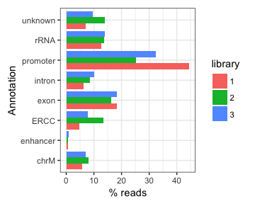
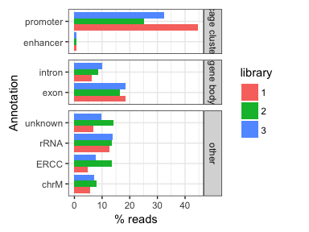

# Reads annotation
Jonathan Moody  

Annotate all of the C1 CAGE 4/5/6 reads with gencode + F5 enhancers (not just the DPIs as in most of the analysis).


```r
library(data.table)
library(ggplot2)
# unstranded merge of all ctss "bedtools merge -d -1 -scores sum"
ctss <- fread('~/Documents/C1_timecourse/cage_456.bed')
```

```
## 
Read 66.8% of 5387826 rows
Read 5387826 rows and 6 (of 6) columns from 0.192 GB file in 00:00:03
```

```r
setnames(ctss, c('chr','pos','end','lib','score','strand'))

exons <- fread('~/Documents/C1_timecourse/CAGE_456_annotation_exons.tab')
setnames(exons, c('ID','gene','gene_type','tr_type'))
exons <- exons[order(tr_type)][!duplicated(ID)]
dpi <- fread('~/Documents/C1_timecourse/CAGE_456_annotation_dpi.tab')
setnames(dpi, 'ID')
introns <- fread('~/Documents/C1_timecourse/CAGE_456_annotation_introns.tab')
setnames(introns, 'ID')
enh <- fread('~/Documents/C1_timecourse/CAGE_456_annotation_enhancers.tab')
setnames(enh, 'ID')

ctss.old <- fread('~/Documents/C1_timecourse/CAGE_456.ctss')
setnames(ctss.old, c('chr', 'pos', 'end', 'score'))
ctss.old[, ID := 1:nrow(ctss.old)]
ctss <- merge(ctss, ctss.old[, .(chr, pos, ID)], by=c('chr', 'pos'))

ctss[, libn := tstrsplit(lib, '_')[2]]
ctss <- ctss[, .(score = sum(score)), by=.(chr, pos, end, strand, libn, ID)]


ctss <- merge(ctss, exons, by='ID', all.x = T)
ctss$dpi <- ctss$ID %in% dpi$ID
ctss$introns <- ctss$ID %in% introns$ID
ctss$enh <- ctss$ID %in% enh$ID

ctss$ercc <- ctss$ID %in% ctss[grep('[chr|U113]', chr, invert = T), ID]

#ercc > rDNA > dpi > mito > enh > exon > intron > unknown

ctss$type1 <- 'unknown'
ctss[introns == T]$type1 <- 'intron'
ctss[!is.na(gene)]$type1 <- 'exon'
ctss[enh == T]$type1 <- 'enhancer'
ctss[ctss$chr == 'chrM']$type1 <- 'chrM'
ctss[dpi]$type1 <- 'promoter'
ctss[ctss$chr == 'U13369.1' ]$type1 <- 'rRNA'
ctss[gene_type == 'rRNA']$type1 <- 'rRNA'
ctss[ercc == T]$type1 <- 'ERCC'

# combine exon small categories
ctss[gene_type == 'polymorphic_pseudogene']$gene_type <- 'pseudogene'
ctss[gene_type == 'sense_overlapping']$gene_type <- 'pseudogene'
ctss[gene_type == 'sense_intronic']$gene_type <- 'pseudogene'
ctss[gene_type == 'processed_transcript']$gene_type <- 'pseudogene'
ctss[gene_type == '3prime_overlapping_ncrna']$gene_type <- 'pseudogene'
ctss[gene_type == 'miRNA']$gene_type <- 'smallRNA'
ctss[gene_type == 'snRNA']$gene_type <- 'smallRNA'
ctss[gene_type == 'snoRNA']$gene_type <- 'smallRNA'
```


```r
df <- ctss[, .(score=sum(score)) , by=.(type=type1, library= as.character(as.numeric(libn) - 3))]
df <- df[, .(pc=score / sum(score), score, type), by=.(library)]
df[,.(pc=mean(pc)) , by=.(type)]
```

```
##        type          pc
## 1:  unknown 0.101763621
## 2:     exon 0.176735627
## 3:   intron 0.083633884
## 4: promoter 0.340588520
## 5: enhancer 0.007120115
## 6:     rRNA 0.133828226
## 7:     chrM 0.069992910
## 8:     ERCC 0.086337099
```

```r
(ggplot(df, aes(type, pc*100, fill=library))
 +geom_bar(stat = 'identity', position='dodge')
  +coord_flip()
  +ylab('% reads')
  +xlab('Annotation')
  +theme(plot.margin = unit(c(0.3,1,0.3,0.3), "cm"))
)
```

<!-- -->

```r
#ggsave('reads_anno_1.pdf', path='../manuscript/Fig1/')

df$group <- 'other'
df[type %in% c('intron', 'exon')]$group <- 'gene body'
df[type %in% c('promoter', 'enhancer')]$group <- 'cage cluster'


(ggplot(df, aes(type, pc*100, fill=library))
 +geom_bar(stat = 'identity', position='dodge')
  +coord_flip()
  +ylab('% reads')
  +xlab('Annotation')
  +theme(plot.margin = unit(c(0.3,1,0.3,0.3), "cm"))
  +facet_grid(group~., scales='free_y', space='free_y')
)
```

<!-- -->

```r
ggsave('reads_anno_2.pdf', path='../manuscript/Fig2/', height = 3, width = 4, units = 'in')
```


```r
df <- ctss[type1 == 'exon', .(score=sum(score)), by=.(type=gene_type, dpi=dpi)]
df$pc <- (df$score/sum(df$score)) * 100
df
(ggplot(df, aes(type, score, fill=dpi))
 +geom_bar(stat = 'identity')
  +coord_flip()
  +xlab('Gene type')
  +ylab('reads')
)
#ggsave('reads_anno_2.pdf', path='../manuscript/Fig1/')
```

