# Spike in analysis
Jonathan Moody  


[This](https://www.nature.com/nmeth/journal/v14/n4/full/nmeth.4220.html) paper from Sarah Teichmann's lab uses the ERCC spikes to derive accuracy / sensitivity measures of various scRNA-seq methods.
Here I derive these measures for the C1 CAGE ERCC libraires 1 and 2, and C1 CAGE runs 4/5/6

# Data loading

```r
library(data.table)
library(ggplot2)
library(scales)
exp_all <- readRDS('~/Documents/C1_timecourse/F5expressionTable.Rds')[-1,]

########
# normalisation - not necessary for comparisons within library?
norm_factor <- colSums(exp_all[,-1])
exp_all[,-1] <- (t(t(exp_all[,-1])/norm_factor) * 10^6)
##########

### Add the actual abundances added
ercc <- fread('../source/cms_095046.txt')
setnames(ercc, c( "resort"
                                 , "Row.names"
                                 , "subgroup"
                                 , "concentration1"
                                 , "concentration2"
                                 , "foldChange"
                                 , "logFoldChange"))

N <- 6.022140857e+23   # molecules per mole
atto <- N * 1e-18 # molecules per attomole
dil <- 1 / 13 * 1.5 / 22.52  # dilution of the mastermix
# Mastermix molarity is in attomoles per microliter.  9 nanoliters
# of the dilluted solution are loaded per chamber.
ercc$mol1 <- ercc[, "concentration1", with=F] * atto * dil * 9 / 1000
ercc$mol2 <- ercc[, "concentration2", with=F] * atto * dil * 9 / 1000

## make 2 column table
ex1 <- ercc[,c("Row.names","mol1",'logFoldChange'),with=F]
ex2 <- ercc[,c("Row.names","mol2",'logFoldChange'),with=F]

# load power analysis paper data for STRT-C1
strt <- fread('~/Documents/C1_timecourse/nmeth.4220-S3.csv')
strt <- strt[protocol == 'STRT-C1' & !is.infinite(accuracy), .(accuracy, molecule_limit)]
strt[, summary(accuracy)]
```

```
##    Min. 1st Qu.  Median    Mean 3rd Qu.    Max. 
##  0.4210  0.6702  0.7423  0.7350  0.8201  0.9108
```

```r
strt[, summary(molecule_limit)]
```

```
##    Min. 1st Qu.  Median    Mean 3rd Qu.    Max. 
##   53.49  101.24  145.63  176.79  208.21  588.44
```

# ERCC libraries
Accuracy defined by the correlation of expected and observed reads for the ERCC spikes.

The distribution of expected and observed values for each ERCC library:

## ERCC1
### Accurary

```r
##### select ERCC expts ercc spikes
exp <- exp_all[grep('^ERCC', exp_all$Row.names), grep('^ERCC_1|Row', colnames(exp_all))]

comp <- melt(exp, id.vars = 'Row.names')
comp <- merge(comp, ex1, by="Row.names", all = TRUE)
comp <- as.data.table(comp)

#m <- lm(log(value) ~ log(mol1), comp[value > 0])
#summary(m)$r.squared

(ggplot(comp[variable=='ERCC_1_A01']) 
  +geom_point(aes(mol1, value, colour=variable)) 
  +guides(colour=FALSE)
    +scale_x_continuous(trans = 'log10',
                        breaks = trans_breaks('log10', function(x) 10^x),
                        labels = trans_format('log10', math_format(10^.x)))
    +scale_y_continuous(trans = 'log10',
                        breaks = trans_breaks('log10', function(x) 10^x),
                        labels = trans_format('log10', math_format(10^.x)))
  +xlab('Expected molecules')
  +ylab('Observed CPM')
  #+stat_smooth(aes(mol1, value), method = 'lm')
)
```

```
## Warning: Transformation introduced infinite values in continuous y-axis
```

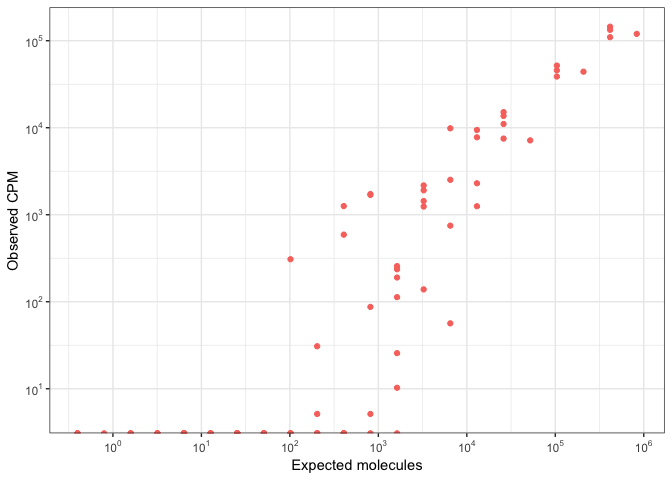<!-- -->

Summary of the per-library correlation scores:

```r
#comp[, .(acc=cor(value, mol1, method = 'spearman')), by=.(variable)][, summary(acc)]
acc.pearson <- comp[value > 0, .(acc=cor(log(value), log(mol1))), by=.(variable)][, acc]
acc.spearman <- comp[value > 0, .(acc=cor(value, mol1, method = 'spearman')), by=.(variable)][, acc]

summary(acc.pearson)
```

```
##    Min. 1st Qu.  Median    Mean 3rd Qu.    Max. 
##  0.7095  0.8237  0.8563  0.8485  0.8767  0.9536
```

```r
hist(acc.pearson)
```

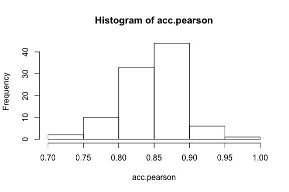<!-- -->

```r
summary(acc.spearman)
```

```
##    Min. 1st Qu.  Median    Mean 3rd Qu.    Max. 
##  0.7763  0.8517  0.8739  0.8739  0.8963  0.9531
```

```r
hist(acc.spearman)
```

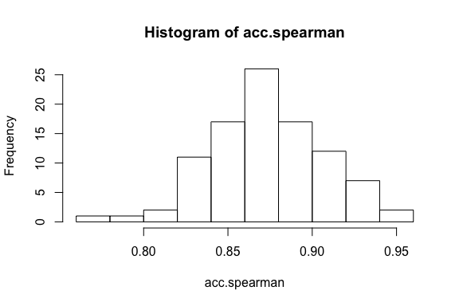<!-- -->

```r
acc.ercc1 <- acc.pearson
```

### Sensitivity
Defined as the input number of molecules where the detection probability reaches 50%

```r
# response variable
comp$detected <- as.numeric(comp$value>=1)
comp$mol1 <- log(comp$mol1)

# example calculation for one sample
df <- comp[variable=='ERCC_1_A01']
m <- glm(detected ~ mol1, data = df, family = binomial)

plot(df$mol1, df$detected, xlab='log ERCC input molecules', 
     ylab='Detection probability', main = 'ERCC_1_A01')
curve(predict(m, data.frame(mol1=x) ,type='response'), add=T)
```

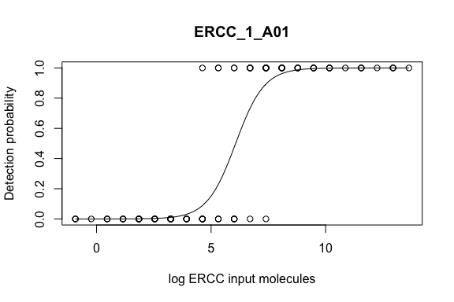<!-- -->

```r
# sensitivity = log ercc molecules for 50% detection
# 'lower molecular-detection limit, for a given sequencing depth'
-m$coefficients[1]/m$coefficients[2]
```

```
## (Intercept) 
##    6.071531
```

```r
exp(-m$coefficients[1]/m$coefficients[2])
```

```
## (Intercept) 
##    433.3438
```

```r
# for all samples
f <- function(df){
  m <- glm(detected ~ mol1, data = df, family = binomial)
  return(-m$coefficients[1]/m$coefficients[2])
}
sensitivity <- comp[, .(sens=f(.SD)),by=.(variable)][, exp(sens)]

summary(sensitivity)
```

```
##    Min. 1st Qu.  Median    Mean 3rd Qu.    Max. 
##   9.682 348.676 438.479 445.099 506.683 876.107
```

```r
hist(sensitivity)
```

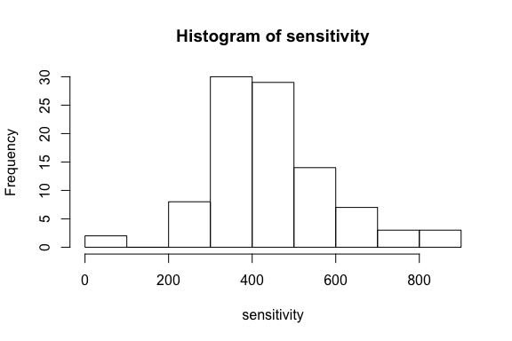<!-- -->

```r
sensitivity.ercc1 <- sensitivity
```

### pooling analysis 1
* Analyse just those wells without cells, pool spikes across those cells
* just get the data here

```r
ercc_pc <- colSums(exp[,-1]) / 1000000 
empty <- names(ercc_pc[ercc_pc > 0.99])
comp <- comp[variable %in% empty]
pool1 <- comp[, .(ercc1=median(value), lfc=logFoldChange[1]), by=.(Row.names)]
```

## ERCC2
### Accuracy

```r
##### select ERCC expts ercc spikes
exp <- exp_all[grep('^ERCC', exp_all$Row.names), grep('^ERCC_2|Row', colnames(exp_all))]

comp <- melt(exp, id.vars = 'Row.names')
comp <- merge(comp, ex2, by="Row.names", all = TRUE)
comp <- as.data.table(comp)

#m <- lm(log(value) ~ log(mol1), comp[value > 0])
#summary(m)$r.squared

(ggplot(comp[variable=='ERCC_2_A01']) 
  +geom_point(aes(mol2, value, colour=variable)) 
  +guides(colour=FALSE)
    +scale_x_continuous(trans = 'log10',
                        breaks = trans_breaks('log10', function(x) 10^x),
                        labels = trans_format('log10', math_format(10^.x)))
    +scale_y_continuous(trans = 'log10',
                        breaks = trans_breaks('log10', function(x) 10^x),
                        labels = trans_format('log10', math_format(10^.x)))
  +xlab('Expected molecules')
  +ylab('Observed CPM')
  #+stat_smooth(aes(mol1, value), method = 'lm')
)
```

```
## Warning: Transformation introduced infinite values in continuous y-axis
```

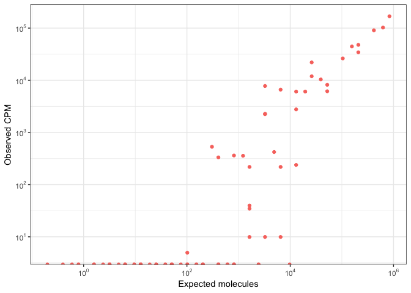<!-- -->

Summary of the per-library correlation scores:

```r
#comp[, .(acc=cor(value, mol1, method = 'spearman')), by=.(variable)][, summary(acc)]
acc.pearson <- comp[value > 0, .(acc=cor(log(value), log(mol2))), by=.(variable)][, acc]
acc.spearman <- comp[value > 0, .(acc=cor(value, mol2, method = 'spearman')), by=.(variable)][, acc]

summary(acc.pearson)
```

```
##    Min. 1st Qu.  Median    Mean 3rd Qu.    Max. 
##  0.6926  0.7634  0.8119  0.8050  0.8383  0.9564
```

```r
hist(acc.pearson)
```

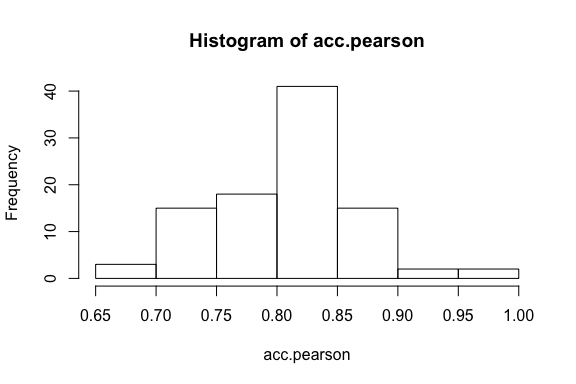<!-- -->

```r
summary(acc.spearman)
```

```
##    Min. 1st Qu.  Median    Mean 3rd Qu.    Max. 
##  0.7100  0.7844  0.8241  0.8201  0.8503  0.9565
```

```r
hist(acc.spearman)
```

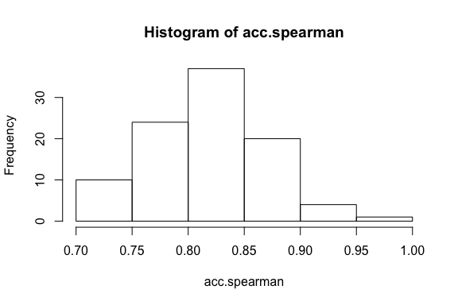<!-- -->

```r
acc.ercc2 <- acc.pearson
```

### Sensitivity
Defined as the input number of molecules where the detection probability reaches 50%

```r
# response variable
comp$detected <- as.numeric(comp$value>=1)
comp$mol2 <- log(comp$mol2)

# example calculation for one sample
df <- comp[variable=='ERCC_2_A01']
m <- glm(detected ~ mol2, data = df, family = binomial)

plot(df$mol2, df$detected, xlab='log ERCC input molecules', 
     ylab='Detection probability', main = 'ERCC_2_A01')
curve(predict(m, data.frame(mol2=x) ,type='response'), add=T)
```

<!-- -->

```r
# sensitivity = log ercc molecules for 50% detection
# 'lower molecular-detection limit, for a given sequencing depth'
-m$coefficients[1]/m$coefficients[2]
```

```
## (Intercept) 
##    6.986457
```

```r
exp(-m$coefficients[1]/m$coefficients[2])
```

```
## (Intercept) 
##    1081.882
```

```r
# for all samples
f <- function(df){
  m <- glm(detected ~ mol2, data = df, family = binomial)
  return(-m$coefficients[1]/m$coefficients[2])
}
sensitivity <- comp[, .(sens=f(.SD)),by=.(variable)][, exp(sens)]
```

```
## Warning: glm.fit: fitted probabilities numerically 0 or 1 occurred

## Warning: glm.fit: fitted probabilities numerically 0 or 1 occurred
```

```r
summary(sensitivity)
```

```
##     Min.  1st Qu.   Median     Mean  3rd Qu.     Max. 
##    7.343  747.300  923.569  947.481 1069.122 2165.357
```

```r
hist(sensitivity)
```

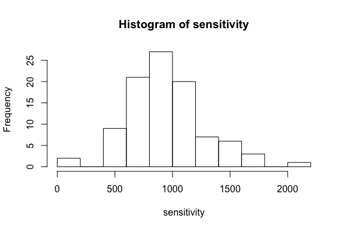<!-- -->

```r
sensitivity.ercc2 <- sensitivity
```

### pooling analysis 2
* Analyse just those wells without cells, pool spikes across those cells
* just get the data here

```r
ercc_pc <- colSums(exp[,-1]) / 1000000 
empty <- names(ercc_pc[ercc_pc > 0.99])
comp <- comp[variable %in% empty]
pool2 <- comp[, .(ercc2=(median(value))), by=.(Row.names)]
```

## Comparison
### Accuracy
The correlation of expected and observed reads

```r
df <- data.frame(acc = c(acc.ercc1, acc.ercc2), library=c(rep('ercc1', length(acc.ercc1)), 
                                                           rep('ercc2', length(acc.ercc2))))
(ggplot(df)
  +geom_density(aes(acc, colour=library))
  +xlab('Accuracy')
  +xlim(0.6, 1)
  )
```

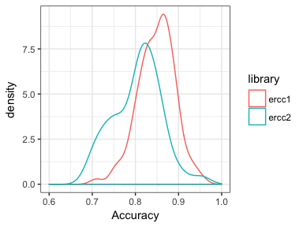<!-- -->

### Sensitivity
The input number of molecules where the detection probability reaches 50%

```r
df <- data.frame(Sensitivity = c(sensitivity.ercc1, sensitivity.ercc2), 
                 library=c(rep('ercc1', length(sensitivity.ercc1)),
                           rep('ercc2', length(sensitivity.ercc2))))
(ggplot(df)
  +geom_density(aes(Sensitivity, colour=library))
  )
```

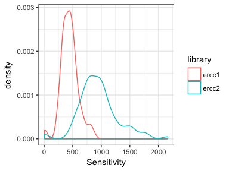<!-- -->

### Pooled data

```r
pool <- merge(pool1, pool2, by='Row.names')
pool[, ratio := log2(ercc1/ercc2)]
pool <- pool[ercc1 > 100 & ercc2 > 100]

m <- summary(lm(pool$ratio ~ pool$lfc))
m <- m$r.squared
m
```

```
## [1] 0.8663238
```

```r
(ggplot(pool)
  +geom_point(aes(lfc, ratio))
  +xlab('log2 (expected fold change)')
  +ylab('log2 (observed fold change)')
  +stat_smooth(mapping = aes(lfc, ratio), formula = y~x, method = 'lm', se = F, colour='red')
  +geom_text(data = data.frame(lfc=-0.5, ratio=2, text=
                                 as.character(as.expression(substitute(R^2==x, list(x=format(m, digits = 2))))))
, mapping = aes(lfc, ratio, label=text), parse = T)
  )
```

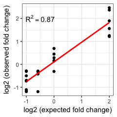<!-- -->

```r
ggsave('ERCC_fc.pdf', path='../manuscript/Fig1/', width = 2.6, height=2.6, units='in')
```

# CAGE 4/5/6 libraries
## ERCC stats
### Accuracy
Accuracy defined by the correlation of expected and observed reads for the ERCC spikes.

The distribution of expected and observed values for each C1 library:

```r
##### select expts 4-6 ercc spikes
exp <- exp_all[grep('^ERCC', exp_all$Row.names), grep('CAGE_[4-6]|Row', colnames(exp_all))]
ercc_pc <- colSums(exp[,-1]) / 1000000 
empty <- names(ercc_pc[ercc_pc > 0.9])
exp[,empty] <- NULL

comp <- melt(exp, id.vars = 'Row.names')
comp <- merge(comp, ex1, by="Row.names", all = TRUE)
comp <- as.data.table(comp)

#m <- lm(log(value) ~ log(mol1), comp[value > 0])
#summary(m)$r.squared

(ggplot(comp) 
  +geom_point(aes(mol1, value, colour=variable)) 
  +guides(colour=FALSE)
    +scale_x_continuous(trans = 'log10',
                        breaks = trans_breaks('log10', function(x) 10^x),
                        labels = trans_format('log10', math_format(10^.x)))
    +scale_y_continuous(trans = 'log10',
                        breaks = trans_breaks('log10', function(x) 10^x),
                        labels = trans_format('log10', math_format(10^.x)))
  +xlab('Expected molecules')
  +ylab('Observed CPM')
  #+stat_smooth(aes(mol1, value), method = 'lm')
)
```

```
## Warning: Transformation introduced infinite values in continuous y-axis
```

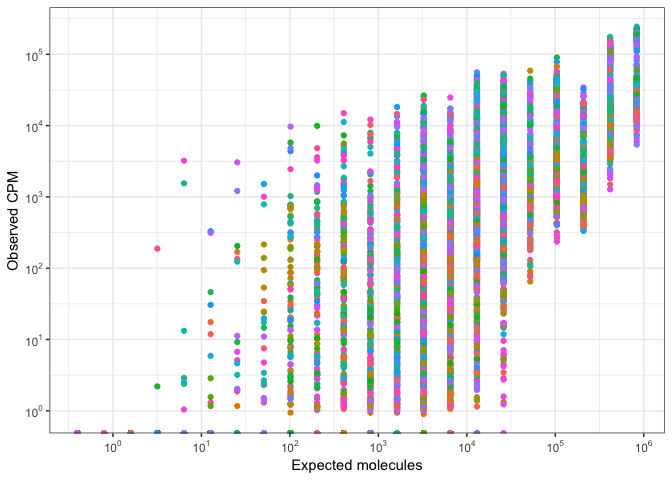<!-- -->

Summary of the per-library correlation scores:

```r
comp <- as.data.table(comp)
#comp[, .(acc=cor(value, mol1, method = 'spearman')), by=.(variable)][, summary(acc)]
acc.pearson <- comp[value > 0, .(acc=cor(log(value), log(mol1))), by=.(variable)][, acc]
acc.spearman <- comp[value > 0, .(acc=cor(value, mol1, method = 'spearman')), by=.(variable)][, acc]

summary(acc.pearson)
```

```
##    Min. 1st Qu.  Median    Mean 3rd Qu.    Max. 
##  0.5903  0.7345  0.7939  0.7820  0.8409  0.9246
```

```r
hist(acc.pearson)
```

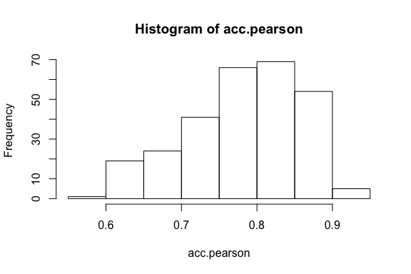<!-- -->

```r
summary(acc.spearman)
```

```
##    Min. 1st Qu.  Median    Mean 3rd Qu.    Max. 
##  0.6158  0.8081  0.8426  0.8334  0.8716  0.9369
```

```r
hist(acc.spearman)
```

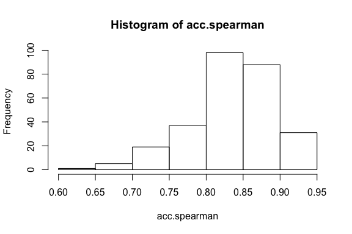<!-- -->

### Sensitivity
Defined as the input number of molecules where the detection probability reaches 50%

```r
# response variable
comp$detected <- as.numeric(comp$value>=1)
#comp$mol1 <- log(comp$mol1)
# need to check this
comp$mol1 <- log(comp$mol1/100) #maybe include this dilution - it reduces the detection limit

# example calculation for one sample
df <- comp[variable=='CAGE_4_A01']
m <- glm(detected ~ mol1, data = df, family = binomial)

plot(df$mol1, df$detected, xlab='log ERCC input molecules', 
     ylab='Detection probability', main = 'CAGE_4_A01')
curve(predict(m, data.frame(mol1=x) ,type='response'), add=T)
```

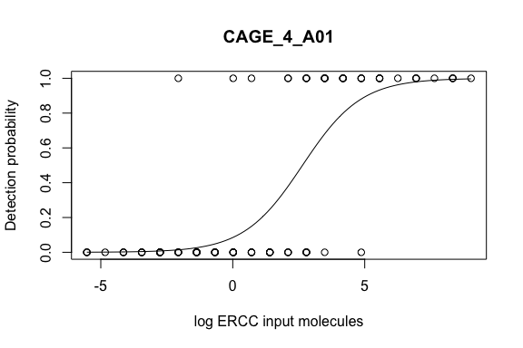<!-- -->

```r
# sensitivity = log ercc molecules for 50% detection
# 'lower molecular-detection limit, for a given sequencing depth'
-m$coefficients[1]/m$coefficients[2]
```

```
## (Intercept) 
##    2.643191
```

```r
exp(-m$coefficients[1]/m$coefficients[2])
```

```
## (Intercept) 
##    14.05799
```

```r
# for all samples
f <- function(df){
  m <- glm(detected ~ mol1, data = df, family = binomial)
  return(-m$coefficients[1]/m$coefficients[2])
}
sensitivity <- comp[, .(sens=f(.SD)),by=.(variable)][, exp(sens)]
```

```
## Warning: glm.fit: fitted probabilities numerically 0 or 1 occurred

## Warning: glm.fit: fitted probabilities numerically 0 or 1 occurred
```

```r
summary(sensitivity)
```

```
##    Min. 1st Qu.  Median    Mean 3rd Qu.    Max. 
##   3.938  18.429  21.839  22.508  25.587  45.415
```

```r
hist(sensitivity)
```

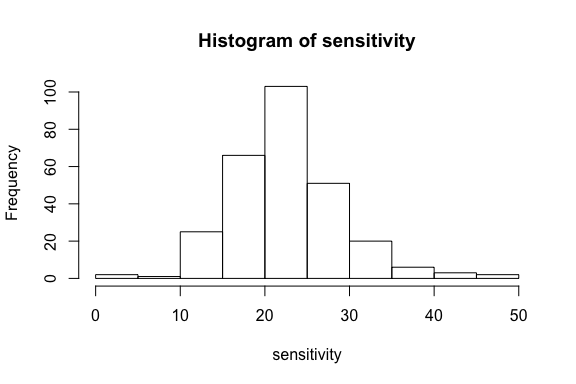<!-- -->


```r
library(ggsignif)
library(sigr)
df <- data.table(accuracy=acc.pearson, sensitivity=sensitivity)
setnames(strt, colnames(df))
df1 <- melt(df)
```

```
## Warning in melt.data.table(df): To be consistent with reshape2's melt, id.vars and measure.vars are
## internally guessed when both are 'NULL'. All non-numeric/integer/logical type columns are conisdered
## id.vars, which in this case are columns []. Consider providing at least one of 'id' or 'measure'
## vars in future.
```

```r
df1[, method := 'C1 CAGE\n(279)']
df2 <- melt(strt)
```

```
## Warning in melt.data.table(strt): To be consistent with reshape2's melt, id.vars and measure.vars
## are internally guessed when both are 'NULL'. All non-numeric/integer/logical type columns are
## conisdered id.vars, which in this case are columns []. Consider providing at least one of 'id' or
## 'measure' vars in future.
```

```r
df2[, method := 'C1 STRT\n(96)']
df <- rbindlist(list(df1, df2))

tt1 <- t.test(df[variable=='accuracy' & method == 'C1 CAGE\n(279)', value], df[variable=='accuracy' & method == 'C1 STRT\n(96)', value])
tt1
```

```
## 
## 	Welch Two Sample t-test
## 
## data:  df[variable == "accuracy" & method == "C1 CAGE\n(279)", value] and df[variable == "accuracy" & method == "C1 STRT\n(96)", value]
## t = 4.0481, df = 127.63, p-value = 8.895e-05
## alternative hypothesis: true difference in means is not equal to 0
## 95 percent confidence interval:
##  0.02401098 0.06992887
## sample estimates:
## mean of x mean of y 
## 0.7819936 0.7350237
```

```r
wrapTTest(tt1)
```

```
## [1] "Welch Two Sample t-test, two.sided: (t=4, df=1.3e+02, p=8.9e-05)."
```

```r
(ggplot(df[variable=='accuracy'], aes(method, value))
  +geom_violin()
  +geom_jitter(width = 0.4, alpha=0.3)
  +ylab('Quantification accuracy')
  +xlab('p < 0.0001')
  +theme(axis.text = element_text(colour='black'))
  +stat_summary(fun.y = median, fun.ymin = median, fun.ymax = median,
                 geom = "crossbar", width = 0.5, color='red')
  +ylim(0.2, 1.05)
  +geom_signif(comparisons = list(c("C1 CAGE\n(279)", "C1 STRT\n(96)")),
               map_signif_level = F, textsize=4, margin_top = 0.12)
  )
```

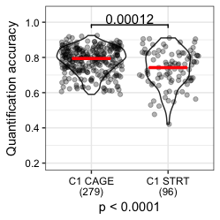<!-- -->

```r
ggsave('ERCC_acc.pdf', path='../manuscript/Fig1/', width = 2.6, height=2.8, units='in')

tt2 <- t.test(df[variable=='sensitivity' & method == 'C1 CAGE\n(279)', value], df[variable=='sensitivity' & method == 'C1 STRT\n(96)', value])
tt2
```

```
## 
## 	Welch Two Sample t-test
## 
## data:  df[variable == "sensitivity" & method == "C1 CAGE\n(279)", value] and df[variable == "sensitivity" & method == "C1 STRT\n(96)", value]
## t = -13.998, df = 94.227, p-value < 2.2e-16
## alternative hypothesis: true difference in means is not equal to 0
## 95 percent confidence interval:
##  -176.1684 -132.4015
## sample estimates:
## mean of x mean of y 
##  22.50753 176.79249
```

```r
wrapTTest(tt2)
```

```
## [1] "Welch Two Sample t-test, two.sided: (t=-14, df=94, p<1e-05)."
```

```r
(ggplot(df[variable=='sensitivity'], aes(method, value))
  +geom_violin()
  +geom_jitter(width = 0.4, alpha=0.3)
  +ylab('Molecular-detection limit')
  +xlab(expression(p < 2 %*% 10^-16))
  +scale_y_continuous(trans = 'log10',
                        breaks = trans_breaks('log10', function(x) 10^x),
                        labels = trans_format('log10', math_format(10^.x)), limits = c(1, 1600))
  +theme(axis.text = element_text(colour='black'))
  +stat_summary(fun.y = median, fun.ymin = median, fun.ymax = median,
                 geom = "crossbar", width = 0.5, color='red')
  +geom_signif(comparisons = list(c("C1 CAGE\n(279)", "C1 STRT\n(96)")),
               map_signif_level = F, textsize=4, margin_top = 0.09)
  )
```

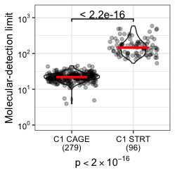<!-- -->

```r
ggsave('ERCC_mol.pdf', path='../manuscript/Fig1/', width = 2.6, height=2.8, units='in')
```
